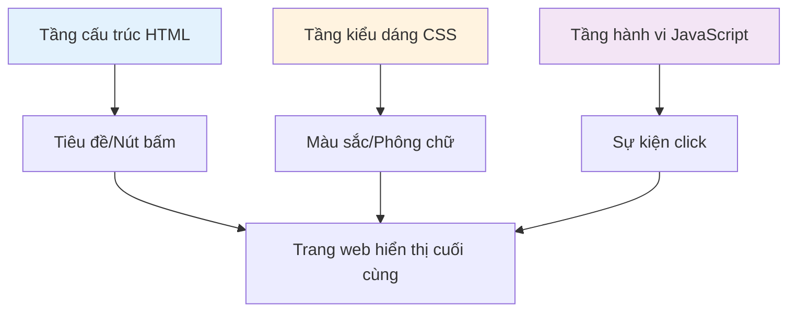
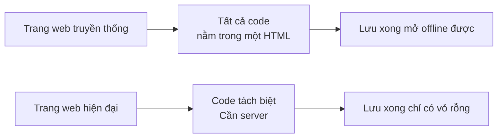
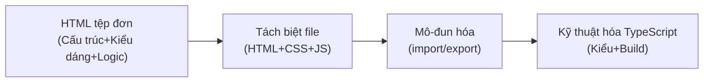

# 1.1 Sự tiến hóa của định dạng code

> **Đọc xong phần này, bạn sẽ thu hoạch được:**
>
> - Hiểu cách HTML, CSS, JavaScript phối hợp hoạt động để xây dựng trang web
> - Hiểu quá trình tiến hóa định dạng code từ tệp đơn đến mô-đun hóa, TypeScript
> - Biết khi nào dùng định dạng đơn giản, khi nào dùng định dạng phức tạp
> - Hiểu tại sao code do AI sinh ra cần môi trường chạy cụ thể

> AI nhắc đến trong lời nói đầu đôi khi đưa ra file `.html`, đôi khi đưa ra file `.ts`, đó là vì định dạng code tiến hóa theo độ phức tạp của dự án.

## Cấu trúc ba tầng của trang web

Trang web giống như một chiếc bánh sandwich, được cấu tạo bởi 3 tầng:



**Một ví dụ hoàn chỉnh**:

```html
<!DOCTYPE html>
<html>
  <head>
    <style>
      /* CSS: Tầng kiểu dáng — Trông như thế nào */
      .box {
        background: #f0f0f0;
        padding: 20px;
      }
      .count {
        font-size: 24px;
      }
    </style>
  </head>
  <body>
    <!-- HTML: Tầng cấu trúc — Có nội dung gì -->
    <div class="box">
      <span class="count">0</span>
      <button>Tăng</button>
    </div>

    <script>
      /* JavaScript: Tầng hành vi — Tương tác ra sao */
      let count = 0;
      document.querySelector("button").addEventListener("click", () => {
        count++;
        document.querySelector(".count").textContent = count;
      });
    </script>
  </body>
</html>
```

Viết cả ba loại code này trong một file `.html`, chính là **định dạng tệp đơn** — nhấp đúp là chạy được, không cần cài đặt bất cứ thứ gì.

## Tại sao trang web đã lưu có cái không mở được?

Có thể bạn đã thử dùng `Ctrl + S` lưu một trang web yêu thích, mở lại thì gặp các tình huống khác nhau:

| Hiện tượng                            | Nguyên nhân                                               |
| ------------------------------------- | --------------------------------------------------------- |
| **Hoàn toàn bình thường**             | Định dạng tệp đơn, toàn bộ code nằm trong một HTML        |
| **Có giao diện nhưng không bấm được** | CSS ở trong máy, JS tải từ server, ngắt mạng là hỏng      |
| **Giao diện trắng trơn**              | CSS và JS đều tải từ server, trong máy chỉ có cái vỏ rỗng |
| **Hoàn toàn không mở được**           | Ứng dụng đơn trang hiện đại, cần server mới chạy được     |

Các trang web hiện đại (như Weibo, Bilibili) dùng framework như React/Next.js để phát triển: code tách biệt ở các file khác nhau, nội dung lấy động qua JS, cái lưu về chỉ là cái vỏ HTML rỗng.



## Bốn giai đoạn của định dạng code



::: details 🎮 Bấm để trải nghiệm: Lịch sử tiến hóa định dạng code
<CodeFormatEvolution />

> 💡 **Bài tập**: Bấm và các giai đoạn khác nhau trên trục thời gian, quan sát xem định dạng code tiến hóa từ ngôn ngữ máy sang JavaScript hiện đại như thế nào.
>
> 🎯 **Khái niệm cốt lõi**: Định dạng code ngày càng gần với ngôn ngữ loài người, nhưng trước khi chạy cần nhiều bước chuyển đổi hơn.
> :::

### Giai đoạn 1: HTML tệp đơn

Tất cả code nằm trong một file `.html`.

**Kịch bản áp dụng**: Demo đơn giản, học khái niệm, nguyên mẫu nhanh

**Hạn chế**: Code vượt quá 200 dòng là rất khó bảo trì

### Giai đoạn 2: Tách biệt file

Cấu trúc (HTML), kiểu dáng (CSS), logic (JS) tách riêng:

```
project/
├── index.html
├── style.css
└── script.js
```

**Kịch bản áp dụng**: Code vượt quá 200 dòng, hoặc nhiều trang chia sẻ kiểu dáng

**Hạn chế**: Quan hệ phụ thuộc file cần quản lý thủ công, không dùng được gói npm

### Giai đoạn 3: Mô-đun hóa

Sử dụng `import`/`export` tổ chức code:

```javascript
// utils.js
export function formatDate(date) {
  return date.toISOString();
}

// app.js
import { formatDate } from "./utils.js";
```

**Kịch bản áp dụng**: Code có logic lặp lại, hoặc cộng tác nhiều người

**Hạn chế**: Trình duyệt cần công cụ build hỗ trợ

### Giai đoạn 4: Kỹ thuật hóa TypeScript

Sử dụng TypeScript + Công cụ build:

```typescript
// utils.ts
export function formatDate(date: Date): string {
  return date.toISOString();
}
```

**Kịch bản áp dụng**: Logic phức tạp, cộng tác nhiều người, dự án bảo trì lâu dài

**Tại sao AI thích dùng TypeScript?**

- Hệ thống kiểu giảm thiểu lỗi
- AI giỏi sinh code an toàn về kiểu hơn
- Tiêu chuẩn của phát triển frontend hiện đại

::: danger TypeScript không thể chạy trực tiếp

Code TypeScript **không thể chạy trực tiếp trên trình duyệt**, bắt buộc phải qua biên dịch:

```
File .ts/.tsx → Trình biên dịch TypeScript → File .js → Trình duyệt thực thi
```

**Khi phát triển**: `pnpm dev` tự động biên dịch
**Khi online**: `pnpm build` đóng gói tối ưu hóa

:::

## Cách chọn định dạng code

| Độ phức tạp dự án                       | Định dạng đề xuất      | Cách chạy      |
| --------------------------------------- | ---------------------- | -------------- |
| Demo đơn giản, script dùng một lần      | HTML tệp đơn           | Mở trực tiếp   |
| Dự án vừa và nhỏ                        | JS mô-đun hóa          | Cần build      |
| Ứng dụng phức tạp, cộng tác nhiều người | TypeScript + Framework | Cần dev server |

**Nguyên tắc**: Dùng được giải pháp đơn giản thì không dùng giải pháp phức tạp, nhưng đừng cố ép dùng giải pháp đơn giản cho dự án phức tạp.

Cho AI biết nhu cầu của bạn, nó sẽ chọn định dạng phù hợp:

```
"Sinh một bộ đếm HTML tệp đơn" → Tệp đơn, nhấp đúp là chạy
"Sinh một ứng dụng quản lý tác vụ" → Dự án TypeScript, cần pnpm dev
```

## Câu hỏi thường gặp

### Q1: TypeScript và JavaScript khác gì nhau?

TypeScript là bản nâng cấp của JavaScript, thêm vào kiểm tra kiểu (type checking).

```typescript
// TypeScript chỉ ra lỗi khi viết code
const count: number = "hello"; // ❌ Trình biên tập báo đỏ

// JavaScript chạy rồi mới báo lỗi
const count = "hello";
count.toFixed(2); // 💥 Crash khi chạy
```

Bạn không cần nhớ cú pháp, chỉ cần biết:

- File `.ts` hoặc `.tsx` cần chạy thông qua `pnpm dev`
- Thấy chú thích kiểu như `: string`, biết đó là TypeScript là được

### Q2: Tại sao không dùng mãi HTML tệp đơn?

Dự án phức tạp dùng tệp đơn không thể bảo trì. Tưởng tượng một file HTML 1000 dòng, sửa kiểu dáng phải tìm thẻ `<style>` ở dòng 500 —— đúng là thảm họa. Mô-đun hóa giúp mỗi file chỉ phụ trách một việc.

### Q3: Code AI sinh ra không chạy được thì làm sao?

Đầu tiên phán đoán loại code:

**HTML tệp đơn**:

```bash
# Nhấp đúp trực tiếp, hoặc
open index.html      # Mac
start index.html     # Windows
```

**Dự án TypeScript**:

```bash
pnpm install   # Cài đặt phụ thuộc
pnpm dev       # Khởi động server phát triển
```

Nếu vẫn báo lỗi, gửi thông tin lỗi cho AI, nó sẽ cho bạn biết nguyên nhân cụ thể.

## Nội dung liên quan

- Xem chi tiết: [1.2 Khái niệm Tech Stack]
- Xem chi tiết: [1.3 Cơ bản về Trình duyệt và Server]
- Tiếp theo: [1.5 Môi trường Node.js và Quản lý gói]
