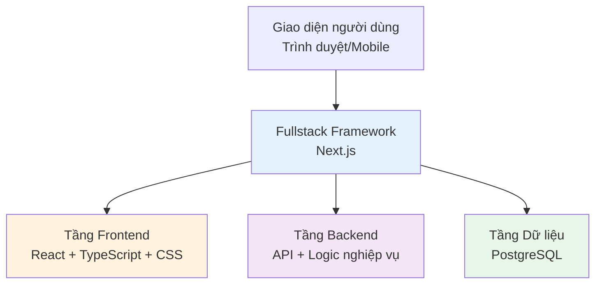

# 1.2 Khái niệm Tech Stack

> **Đọc xong phần này, bạn sẽ thu hoạch được:**
>
> - Hiểu kiến trúc phân tầng của Tech Stack (Frontend, Backend, Database)
> - Hiểu về Tech Stack được sử dụng trong giáo trình này và lý do lựa chọn
> - Nắm được cách nhận biết nhanh Tech Stack của dự án thông qua package.json

> Những thuật ngữ như TypeScript, Next.js được nhắc đến trong lời nói đầu, cấu thành nên Tech Stack của phát triển Web hiện đại.

## Tech Stack là gì

**Tech Stack (Ngăn xếp công nghệ)** là tổ hợp các công nghệ được sử dụng khi phát triển dự án.

Ứng dụng Web hiện đại chia thành 3 tầng:



- **Frontend**: Giao diện người dùng nhìn thấy (HTML, CSS, JavaScript)
- **Backend**: Logic phía máy chủ, xử lý dữ liệu (Node.js, Python)
- **Database**: Lưu trữ dữ liệu (PostgreSQL, MongoDB)

Giáo trình này sử dụng **Next.js Fullstack Framework**——Frontend và Backend cùng trong một dự án, khởi động tất cả chỉ bằng một câu lệnh.

::: details 🏗️ Bấm để trải nghiệm: Kiến trúc phân tầng Tech Stack
<TechStackLayers />

> 💡 **Bài tập**: Bấm vào các tầng để xem nội dung chi tiết, hiểu mối quan hệ giữa Frontend, Backend, Database và Cơ sở hạ tầng.
>
> 🎯 **Khái niệm cốt lõi**: Ứng dụng Web hiện đại được chia thành nhiều tầng, mỗi tầng chịu trách nhiệm khác nhau, giao tiếp với nhau thông qua API.
> :::

## Tech Stack của giáo trình này

| Tầng cấp                | Lựa chọn công nghệ | Tác dụng                            |
| :---------------------- | :----------------- | :---------------------------------- |
| **Framework**           | Next.js            | Frontend Backend hợp nhất           |
| **Ngôn ngữ**            | TypeScript         | An toàn kiểu (Type safety)          |
| **Kiểu dáng**           | Tailwind CSS       | CSS ưu tiên thực dụng               |
| **Thư viện Component**  | shadcn/ui          | Component UI có thể tái sử dụng     |
| **Xác thực người dùng** | better-auth        | Xác thực an toàn kiểu               |
| **Database ORM**        | Drizzle ORM        | Thao tác cơ sở dữ liệu an toàn kiểu |
| **Database**            | PostgreSQL         | Cơ sở dữ liệu quan hệ               |
| **Tích hợp AI**         | Vercel AI SDK      | Tương tác AI dạng luồng (Streaming) |

::: tip Tham khảo "bánh xe" thường dùng

Trên npm có hàng triệu gói code có sẵn, dưới đây là những gói thường dùng:

| Chức năng             | Gói đề xuất             |
| --------------------- | ----------------------- |
| **Xác thực biểu mẫu** | `zod`                   |
| **Quản lý biểu mẫu**  | `react-hook-form`       |
| **Yêu cầu dữ liệu**   | `@tanstack/react-query` |
| **Xử lý thời gian**   | `date-fns` hoặc `dayjs` |
| **HTTP Client**       | `axios` hoặc `ofetch`   |
| **Icon**              | `lucide-react`          |
| **Hàm tiện ích**      | `lodash`                |

AI sẽ dựa vào nhu cầu để chọn gói phù hợp, bạn chỉ cần biết nguyên tắc "không phát minh lại bánh xe".

:::

## Tại sao chọn bộ Tech Stack này

Bộ Tech Stack này được lựa chọn **dành cho phát triển AI Native**, nguyên tắc cốt lõi: Để AI hiệu quả hơn, để bạn tiết kiệm tiền hơn.

**1. Chi phí để AI hiểu thấp**

Next.js Fullstack = Frontend và Backend trong cùng một dự án. Cách truyền thống cần 2 dự án, cấu hình Cross-origin, khởi động 2 dịch vụ; Next.js chỉ cần một lệnh `pnpm dev`. Cấu trúc dự án càng thống nhất, code do AI sinh ra càng ít lỗi.

**2. Chi phí triển khai bằng 0**

| Giải pháp                      | Chi phí       |
| ------------------------------ | ------------- |
| Truyền thống: Thuê máy chủ     | ¥50-200/tháng |
| Giáo trình này: Vercel/EdgeOne | Miễn phí      |

**3. Hệ sinh thái npm: Không phát minh lại bánh xe**

npm là kho code mã nguồn mở lớn nhất thế giới, có hơn 2 triệu gói.

```bash
# Cần xác thực người dùng? Có sẵn
pnpm add next-auth

# Cần xử lý thời gian? Có sẵn
pnpm add dayjs

# Cần xác thực dữ liệu? Có sẵn
pnpm add zod
```

AI sẽ không viết code từ con số 0, mà là lắp ghép những "khối xếp hình" có sẵn này.

**4. PostgreSQL có hosting miễn phí**

| Cơ sở dữ liệu | Nền tảng hosting miễn phí |
| ------------- | ------------------------- |
| PostgreSQL    | Supabase, Neon, Railway   |
| MySQL         | Gần như không có          |

**5. Khi nào cần Fullstack?**

Nếu chỉ là hiển thị tĩnh thuần túy (như trang web công ty), HTML + CSS là đủ. Khi dự án của bạn cần:

- Hệ thống người dùng (Đăng nhập, Đăng ký, Phân quyền)
- Lưu trữ dữ liệu bền vững (Lưu dữ liệu người dùng)
- Logic nghiệp vụ (Thanh toán, Thông báo, Email)

Thì hãy cân nhắc Tech Stack Fullstack.

## Nhận biết nhanh Tech Stack dự án

Khi tiếp nhận dự án mới, xem `package.json` là có thể nhanh chóng hiểu được Tech Stack:

| Tên dependency | Loại kỹ thuật               |
| -------------- | --------------------------- |
| `next`         | Next.js Fullstack Framework |
| `react`        | Thư viện Frontend React     |
| `typescript`   | Hệ thống kiểu TypeScript    |
| `drizzle-orm`  | Drizzle Database ORM        |
| `tailwindcss`  | Kiểu dáng Tailwind CSS      |
| `ai`           | Vercel AI SDK               |

Sau khi biết Tech Stack, bạn sẽ biết:

- Dự án thuộc loại nào
- Cần những môi trường gì
- Gặp vấn đề nên tìm kiếm từ khóa gì

## Câu hỏi thường gặp

### Q1: Tôi có cần hiểu những công nghệ này không?

Biết chúng là gì, giải quyết vấn đề gì là được, không cần phải biết viết. AI sẽ chịu trách nhiệm viết code, bạn chỉ cần:

- Có thể hiểu cấu trúc dự án
- Có thể mô tả chức năng bạn muốn

### Q2: Tại sao dùng TypeScript mà không phải JavaScript?

TypeScript có thể phát hiện lỗi ngay trong giai đoạn phát triển, AI sẽ dùng nó để viết code. Bạn chỉ cần khi thấy đuôi `.ts` thì biết đó là TypeScript là được.

### Q3: Có gì khác với Java/Python dạy ở đại học?

| Dạy học truyền thống     | Lộ trình AI Native             |
| ------------------------ | ------------------------------ |
| Hướng tới xin việc       | Hướng tới làm sản phẩm         |
| Học 6-24 tháng           | Vừa làm dự án vừa học          |
| Trở thành lập trình viên | Dùng công cụ giải quyết vấn đề |

Sự khác biệt căn bản: Đa số giáo trình dạy bạn trở thành lập trình viên, còn giáo trình này dạy bạn dùng sản phẩm để giải quyết vấn đề. Thời đại AI, bạn không cần trở thành lập trình viên —— thứ bạn cần là hiểu công cụ, mô tả nhu cầu, để AI giúp bạn hiện thực hóa.

## Nội dung liên quan

- Xem chi tiết: [1.1 Sự tiến hóa của định dạng code]
- Xem chi tiết: [1.3 Cơ bản về Trình duyệt và Server]
- Tiếp theo: [1.5 Môi trường Node.js và Quản lý gói]
