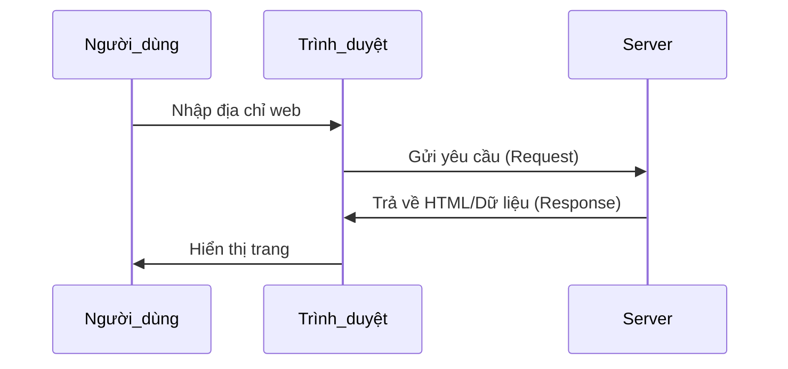
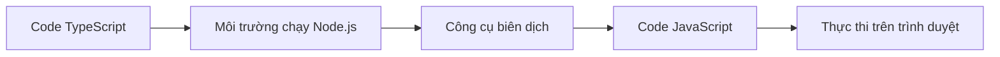

# 1.3 Cơ bản về Trình duyệt và Server

> **Đọc xong phần này, bạn sẽ thu hoạch được:**
>
> - Hiểu trách nhiệm cơ bản của trình duyệt và server cùng cách thức hợp tác
> - Nắm vững sự khác biệt giữa môi trường phát triển (localhost) và môi trường sản xuất (production)
> - Hiểu tại sao TypeScript cần biên dịch cũng như vai trò của Node.js
> - Phân biệt vị trí chạy của code phía client (client-side) và code phía server (server-side)

> "Trình duyệt không hiểu TypeScript" được nhắc đến trong lời nói đầu, là do trách nhiệm của trình duyệt và server khác nhau.

## Khái niệm cơ bản

**Trình duyệt** (Chrome, Firefox, Safari) chạy trên máy tính người dùng, chỉ có thể hiểu HTML, CSS, JavaScript.

**Server** là máy tính từ xa, chạy phần mềm máy chủ Web (như Nginx, Apache), phản hồi yêu cầu của trình duyệt và trả về dữ liệu.

**Client** (Máy khách) = Thiết bị người dùng (Trình duyệt, App điện thoại), **Server** (Máy chủ) = Bên cung cấp dịch vụ (Máy chủ, API).

## Quy trình làm việc của ứng dụng Web

::: details 🌐 Bấm để trải nghiệm: Tương tác giữa Trình duyệt và Server
<BrowserServerFlow />

> 💡 **Bài tập**: Bấm "Phát demo" để xem quy trình yêu cầu - phản hồi hoàn chỉnh, sau đó bấm vào trình duyệt hoặc server để xem khả năng của từng bên.
>
> 🎯 **Khái niệm cốt lõi**: Trình duyệt gửi yêu cầu, server xử lý và trả về dữ liệu, trình duyệt lại render thành trang web.
> :::

## Trình duyệt vs Server

|                    | Trình duyệt (Client)                              | Server (Server-side)                                    |
| ------------------ | ------------------------------------------------- | ------------------------------------------------------- |
| **Trách nhiệm**    | Render trang, thực thi tương tác, yêu cầu dữ liệu | Xử lý nghiệp vụ, truy vấn cơ sở dữ liệu, trả về kết quả |
| **Lưu trữ**        | Cookie, LocalStorage                              | Hệ thống tệp (File system), Cơ sở dữ liệu               |
| **Có thể chạy**    | HTML, CSS, JavaScript                             | Node.js, Python, Go                                     |
| **Không thể chạy** | TypeScript, Ngôn ngữ backend                      | API trình duyệt (DOM, Window...)                        |

## Tại sao cần Node.js

Code TypeScript cần biên dịch mới có thể chạy trên trình duyệt, quá trình biên dịch này cần một môi trường chạy:

**Vai trò của Node.js**:

- Chạy công cụ build trên máy tính của bạn
- Biên dịch TypeScript thành JavaScript
- Đóng gói code (Bundle)
- Khởi động server phát triển (Development Server)

::: tip Phát triển Frontend hiện đại đều cần Node.js

Liên quan đến các trường hợp sau thì bắt buộc phải cài đặt:

- Dự án TypeScript (cần biên dịch)
- Sử dụng gói npm (cần quản lý phụ thuộc)
- Chạy công cụ build (Vite, Webpack, Next.js)
- Phát triển cục bộ (Khởi động dev server)

:::

## Môi trường phát triển vs Môi trường sản xuất

|              | Môi trường phát triển (Localhost)        | Môi trường sản xuất (Công khai)  |
| ------------ | ---------------------------------------- | -------------------------------- |
| **Vị trí**   | Máy tính của bạn                         | Máy chủ từ xa                    |
| **Địa chỉ**  | `localhost:3000`                         | `https://example.com`            |
| **Code**     | Chưa nén, kèm thông tin debug            | Đã nén, làm rối (obfuscated)     |
| **Lỗi**      | Hiển thị ngăn xếp chi tiết (stack trace) | Chỉ hiển thị thông tin cần thiết |
| **Cập nhật** | Hot Reload (Tự động làm mới)             | Cần triển khai lại (Re-deploy)   |

## Sự khác biệt về môi trường chạy

**Server có thể truy cập**: Hệ thống tệp, cơ sở dữ liệu, biến môi trường, tất cả các yêu cầu mạng.

**Trình duyệt chỉ có thể truy cập**: Nội dung trang, thiết bị người dùng (quyền hạn chế), yêu cầu cùng nguồn (same-origin).

::: tip Code chạy ở đâu?

Khi viết code phải rõ ràng code được thực thi ở đâu:

- **Code Frontend**: Chạy trên trình duyệt, người dùng có thể thấy
- **Code Backend**: Chạy trên server, người dùng không thấy
- **API Route**: Next.js đặc biệt, vừa có thể truy cập tài nguyên server, vừa có thể phản hồi yêu cầu frontend

:::

## Nội dung liên quan

- Xem chi tiết: [1.1 Sự tiến hóa của định dạng code]
- Xem chi tiết: [1.2 Khái niệm Tech Stack]
- Tiếp theo: [1.5 Môi trường Node.js và Quản lý gói]
- Xem chi tiết: [Chương 10 Localhost và Truy cập công khai]
