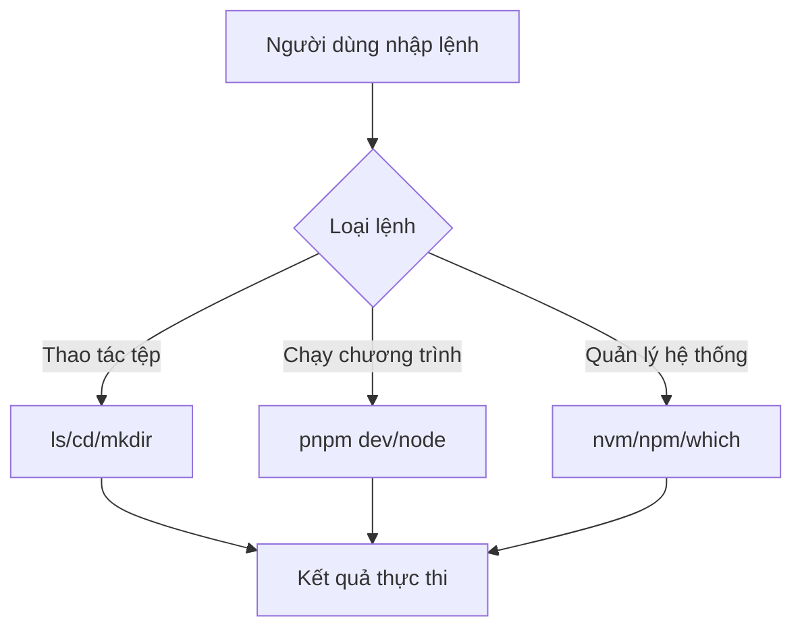
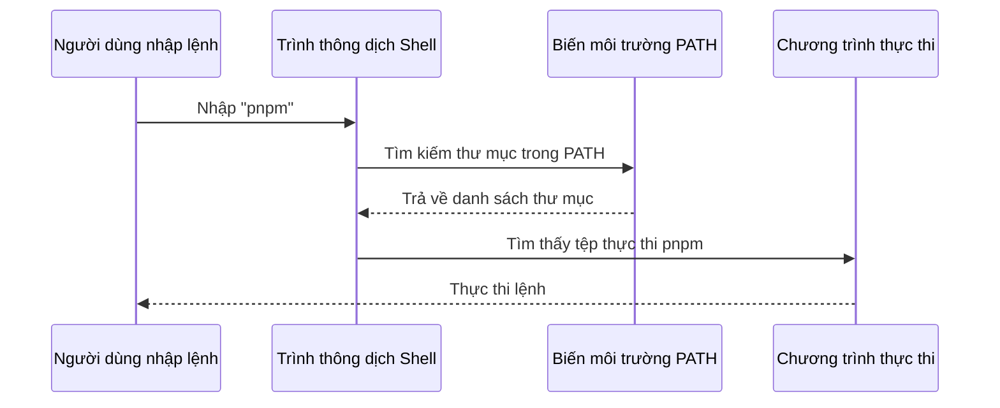

# 1.4 Nhập môn Terminal

> **Đọc xong phần này, bạn sẽ thu hoạch được:**
>
> - Nắm vững các thao tác cơ bản trên terminal (mở, điều hướng tệp, thực thi lệnh)
> - Hiểu sự khác biệt giữa Terminal, Shell và Dòng lệnh (CLI)
> - Nắm vững phím tắt terminal và thao tác sao chép dán
> - Hiểu tác dụng của biến môi trường và PATH
> - Học được quy trình bài bản để kiểm tra lỗi khi lệnh báo lỗi

> Terminal được nhắc đến trong lời nói đầu, là cách thức đối thoại với hệ điều hành thông qua chỉ thị văn bản.

## Kiến thức tiền đề

::: tip Phân biệt Terminal, Shell, Dòng lệnh

Ba khái niệm này thường bị nhầm lẫn, thực ra chúng ở các tầng khác nhau:

- **Terminal (Thiết bị đầu cuối/Giao diện dòng lệnh)**: Là cái **cửa sổ giao diện** bạn nhìn thấy, dùng để nhập lệnh. Trên Windows gọi là PowerShell/CMD, trên Mac gọi là Terminal/iTerm2
- **Shell (Vỏ)**: Là **trình thông dịch lệnh** ẩn sau terminal, đọc đầu vào của bạn và thực thi. Phổ biến là bash, zsh (Mặc định của Mac), PowerShell (Windows)
- **Dòng lệnh (CLI)**: Là **cách thức** thao tác máy tính thông qua chỉ thị văn bản, hiệu quả và chính xác hơn so với giao diện đồ họa

:::

::: tip Tại sao Windows lại khuyến nghị PowerShell?

Windows có hai loại terminal: CMD (kiểu cũ) và PowerShell (hiện đại).

PowerShell có chức năng mạnh mẽ hơn, câu lệnh thống nhất hơn (ví dụ `ls` cũng dùng được trong PowerShell), và là terminal hiện đại được Microsoft chính thức khuyến nghị. **Mọi lệnh Windows trong giáo trình này đều lấy PowerShell làm chuẩn**.

:::

## Khái niệm cốt lõi

Terminal là giao diện làm việc chính của lập trình viên. Hiểu các thao tác cơ bản của terminal:



## Các bước thực chiến

### Mở Terminal

**Mac**:

- Nhấn `Command + Space`, nhập "Terminal"
- Hoặc trong Finder → Ứng dụng → Tiện ích → Terminal

**Windows**:

- Nhấn `Win + R`, nhập `powershell` hoặc `Windows Terminal`
- Hoặc chuột phải vào thư mục → "Mở trong Terminal" (Open in Terminal)

**Terminal tích hợp trong VS Code**: Nhấn menu: Terminal (Cửa sổ lệnh) → New Terminal (Cửa sổ lệnh mới), khuyến nghị mở trực tiếp trong thư mục dự án

### Dấu nhắc lệnh là gì?

Sau khi mở terminal, bạn sẽ thấy một dòng chữ có ký hiệu ở phía trước:

```bash
user@MacBook ~ $     # Dấu nhắc lệnh của Mac/Linux là $
PS C:\Users\user>    # Dấu nhắc lệnh của Windows PowerShell là >
```

Cái này gọi là **dấu nhắc lệnh (prompt)**, **không phải là một phần của câu lệnh**, khi nhập lệnh đừng sao chép cả nó vào.

`$` biểu thị bạn đang dùng bash/zsh Shell, `>` biểu thị bạn đang dùng PowerShell. Các ví dụ lệnh phía sau sẽ lược bỏ những dấu nhắc lệnh này.

### Thao tác Sao chép Dán

**Windows PowerShell**:

- **Dán**: Chuột phải vào cửa sổ (Dán trực tiếp, Ctrl+V có thể không có tác dụng)
- **Sao chép**: Bôi đen văn bản rồi chuột phải

**Mac Terminal**:

- **Sao chép**: `Command + C`
- **Dán**: `Command + V`
- **Dán từ nơi khác**: `Command + Shift + V` (đôi khi cần dùng)

### Thao tác tệp cơ bản

Những lệnh này dùng chung được trên Mac, Linux, Windows PowerShell:

```bash
# Xem thư mục hiện tại
pwd

# Liệt kê tệp tin
ls          # Mac/Linux/PowerShell
dir         # Windows CMD

# Chuyển thư mục
cd folder-name
cd ..         # Quay lại cấp cha
cd ~          # Quay lại thư mục chính của người dùng (Mac/Linux PowerShell)

# Tạo thư mục
mkdir folder-name
```

### Phím tắt Terminal

| Phím tắt   | Tác dụng                                |
| ---------- | --------------------------------------- |
| `Ctrl + C` | Dừng chương trình đang chạy             |
| `Ctrl + L` | Xóa màn hình (tương đương nhập `clear`) |
| `↑ / ↓`    | Duyệt lại các lệnh lịch sử              |
| `Tab`      | Tự động hoàn thành tên tệp hoặc lệnh    |
| `Ctrl + A` | Di chuyển con trỏ về đầu dòng           |
| `Ctrl + E` | Di chuyển con trỏ về cuối dòng          |

::: tip Hai công dụng của Ctrl + C

Trong terminal, `Ctrl + C` có hai tác dụng:

1. **Dừng chương trình đang chạy** (như server phát triển)
2. **Ngắt đầu vào hiện tại** (Nếu bạn đang nhập dở một dòng lệnh và muốn bỏ đi để nhập lại)

:::

### Biến môi trường và PATH

::: tip Biến môi trường là gì

Biến môi trường là thông tin cấu hình mà hệ điều hành lưu trữ, các chương trình có thể lấy cài đặt hệ thống thông qua chúng. Ví dụ `PATH` là một biến môi trường, bảo cho hệ thống biết đi đâu để tìm các chương trình thực thi.

:::

Khi bạn nhập các lệnh như `node`, `pnpm`, hệ thống làm sao tìm thấy chúng?



**Nguyên lý hoạt động của PATH**:

1. Bạn nhập `pnpm`
2. Shell tìm kiếm tệp có tên `pnpm` lần lượt trong các thư mục được liệt kê trong PATH
3. Tìm thấy thì thực thi tệp đó
4. Nếu tìm hết các thư mục mà không thấy, sẽ báo `command not found`

::: tip Không tìm thấy lệnh thì làm sao?

Nếu nhập lệnh mà báo `command not found`, chứng tỏ công cụ chưa được cài hoặc chưa có trong PATH.

Làm theo bài tiếp theo (1.5 Môi trường Node.js và Quản lý gói) để hoàn tất cài đặt, lệnh sẽ sử dụng được bình thường.

:::

### Phần mềm CLI và Tham số lệnh

**Phần mềm CLI là gì?**

Phần mềm CLI (Command Line Interface) không có menu và nút bấm, mọi thứ hoàn thành thông qua nhập lệnh. Có thể bạn sẽ thắc mắc: **Tại sao công cụ phát triển lại thích cách thức thô sơ này?**

Nguyên nhân rất đơn giản: Nhập lệnh nhanh hơn nhiều so với bấm menu, lệnh có thể kèm tham số để kiểm soát hành vi chính xác, hơn nữa có thể viết thành script để tự động thực thi, chiếm ít bộ nhớ hơn. Khi bạn thành thạo rồi, sẽ thấy hiệu suất vượt xa giao diện đồ họa.

**Nhập môn tham số lệnh**

Phía sau lệnh thường đi kèm tham số để sửa đổi hành vi. Tham số có hai định dạng:

- **Tham số ngắn**: Một dấu gạch ngang cộng chữ cái, như `-v` (version), `-h` (help)
- **Tham số dài**: Hai dấu gạch ngang cộng từ vựng, như `--version`, `--help`

```bash
# Xem phiên bản (tham số ngắn)
node -v
pnpm -v

# Xem trợ giúp (tham số dài)
git --help
npm --help
```

Tham số ngắn và dài có hiệu quả như nhau, tham số ngắn nhập nhanh hơn, tham số dài dễ đọc hơn. Đa số lệnh hỗ trợ cả hai hình thức.

## Câu hỏi thường gặp

### Q1: Làm sao để chạy nhiều lệnh cùng lúc?

Dùng `&&` nối các lệnh, chỉ khi lệnh trước thành công mới chạy lệnh sau:

```bash
# Dọn dẹp và cài đặt lại
rm -rf node_modules && pnpm install
```

Dùng `;` (hoặc xuống dòng) nối các lệnh, bất kể lệnh trước thành công hay không đều chạy lệnh sau:

```bash
mkdir new-folder ; cd new-folder    # new-folder là tên thư mục ví dụ
```

### Q2: Terminal hiển thị tiếng Trung bị lỗi font?

Sửa cài đặt mã hóa của terminal.

- **Mac**: Terminal → Tùy chọn (Preferences) → Hồ sơ (Profiles) → Nâng cao (Advanced) → Mã hóa ký tự (Character encoding) → UTF-8
- **Windows**: Thuộc tính PowerShell (Properties) → Font → Chọn font hỗ trợ tiếng Trung (hoặc tiếng Việt/Unicode)

### Q3: Làm sao mở terminal của thư mục hiện tại trong VS Code?

Bấm menu: Terminal (Cửa sổ lệnh) → New Terminal (Cửa sổ lệnh mới)

## Kiểm tra lỗi lệnh

Khi gặp `command not found` hoặc các báo lỗi khác, hãy kiểm tra lần lượt theo thứ tự sau:

::: details 🔧 Bấm để trải nghiệm: Quy trình kiểm tra lỗi lệnh
<TerminalTroubleshoot />

> 💡 **Bài tập**: Làm theo các bước nhập lệnh đúng để kiểm tra vấn đề. Bắt đầu từ kiểm tra chính tả, dần dần xác minh cài đặt công cụ, vị trí thư mục v.v.
>
> 🎯 **Khái niệm cốt lõi**: Khi lệnh báo lỗi, kiểm tra theo thứ tự: Chính tả → Cài đặt → Thư mục → PATH → Khác biệt hệ thống.
> :::

### Danh sách kiểm tra

**1. Kiểm tra chính tả**

```bash
# Lỗi thường gặp
pnpm instal  # Lỗi: thiếu chữ l
l s          # Lỗi: ở giữa có dấu cách

# Cách viết đúng
pnpm install
ls
```

**2. Xác nhận công cụ đã cài đặt**

```bash
# Xem phiên bản (xác nhận có thể thực thi)
node -v
pnpm -v
```

Nếu báo lệnh không tồn tại, cần cài đặt trước.

**3. Xác nhận đang ở đúng thư mục**

```bash
# Xem thư mục hiện tại
pwd

# Kiểm tra xem có package.json không
ls package.json
```

**4. Tải lại terminal**

Vừa cài công cụ hoặc sửa PATH xong, cần khởi động lại terminal:

```bash
# Mac: Tải lại cấu hình
source ~/.zshrc

# Hoặc tắt terminal đi mở lại
```

::: tip Không chắc vấn đề nằm ở đâu?

Gửi trực tiếp thông tin báo lỗi cho AI, nó sẽ nói cho bạn biết nguyên nhân cụ thể và cách giải quyết.

Bạn không cần ghi nhớ tất cả các lỗi, chỉ cần biết thứ tự kiểm tra.

:::

## Nội dung liên quan

- Xem chi tiết: [1.5 Môi trường Node.js và Quản lý gói]
