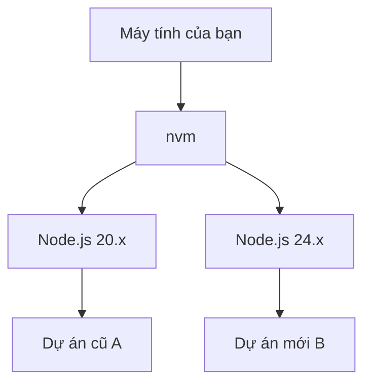

# 1.5 Môi trường Node.js và Quản lý gói

> **Đọc xong phần này, bạn sẽ thu hoạch được:**
>
> - Nắm vững phương pháp sử dụng nvm để cài đặt và quản lý nhiều phiên bản Node.js
> - Học cách cấu hình và sử dụng trình quản lý gói pnpm để quản lý các gói phụ thuộc (dependency)
> - Hiểu tác dụng của các tệp cấu hình cốt lõi như package.json, pnpm-lock.yaml

Phần này sẽ hoàn thành việc xây dựng môi trường Node.js hoàn chỉnh: sử dụng nvm cài đặt Node.js LTS, cấu hình trình quản lý gói pnpm.

::: tip Làm sao để thực thi các lệnh bên dưới?

Các lệnh trong khối code màu xám bên dưới cần được thực thi trong **Terminal**. Nếu bạn chưa quen với terminal, vui lòng đọc trước [1.4 Nhập môn Terminal](./04-terminal-basics_vi.md).

:::

## Khái niệm cơ bản

**Node.js** là môi trường chạy JavaScript, giúp JS có thể chạy trên server. Các công cụ xây dựng frontend hiện đại đều dựa vào nó.

**LTS** (Long Term Support) là phiên bản hỗ trợ dài hạn, ổn định hơn bản Current, được khuyến nghị dùng cho phát triển.

**nvm** (Node Version Manager) cho phép bạn cài đặt và chuyển đổi nhiều phiên bản Node.js trên cùng một máy tính.

**pnpm** là trình quản lý gói, dùng để cài đặt các gói phụ thuộc cho dự án. So với npm, nó nhanh hơn và tiết kiệm dung lượng đĩa hơn.

## Các bước cài đặt

### Người dùng Windows

#### Phương án A: Sử dụng nvm (Khuyến nghị)

**Tải xuống nvm**: https://nvm.uihtm.com/nvm-1.2.2-setup.zip

Sau khi cài đặt xong, **mở cửa sổ PowerShell mới**, thực thi:

::: tip Làm sao để sao chép dán lệnh?

1. Bấm vào **nút sao chép ở góc trên bên phải** khối code
2. Trong PowerShell **nhấp chuột phải** (Ctrl+V có thể không có tác dụng)
3. Nhấn Enter để thực thi

:::

```powershell
nvm install lts; nvm use lts; npm config set registry https://registry.npmmirror.com/; npm install -g pnpm; pnpm setup; pnpm config set registry https://registry.npmmirror.com/; node -v; pnpm -v
```

> Lệnh này cài đặt Node.js 24 LTS → Cấu hình nguồn (mirror) trong nước (nếu cần, ở đây giữ nguyên mirror TQ vì tốc độ thường tốt hơn npm gốc, hoặc bạn có thể bỏ qua bước set registry nếu mạng tốt) → Cài đặt pnpm → Cấu hình nguồn pnpm. Lệnh có thể thực thi lặp lại.

#### Phương án B: Cài đặt Node.js trực tiếp

**Tải xuống Node.js**: https://npmmirror.com/mirrors/node/v24.13.0/node-v24.13.0-x64.msi

Nhấp đúp cài đặt, **mở cửa sổ PowerShell mới** thực thi:

```powershell
npm config set registry https://registry.npmmirror.com/; npm install -g pnpm; pnpm setup; pnpm config set registry https://registry.npmmirror.com/; node -v; pnpm -v
```

### Người dùng Mac / Linux

**Chú ý**: Người dùng Mac trước khi cài nvm bắt buộc phải chạy `xcode-select --install`.

```bash
# Cài đặt một chạm (Tự động nhận diện Shell, tính lũy đẳng, cài xong cần khởi động lại terminal)
export NVM_DIR="$HOME/.nvm" && RC="${ZSH_VERSION:+$HOME/.zshrc}" && [ -z "$RC" ] && RC="$HOME/.bashrc"
[ ! -d "$NVM_DIR" ] && git clone https://gitee.com/mirrors/nvm.git "$NVM_DIR" && cd "$NVM_DIR" && git checkout v0.40.3 && cd - >/dev/null
grep -q "NVM_DIR" "$RC" || printf '\nexport NVM_DIR="$HOME/.nvm"\n[ -s "$NVM_DIR/nvm.sh" ] && . "$NVM_DIR/nvm.sh"\nexport NVM_NODEJS_ORG_MIRROR=https://npmmirror.com/mirrors/node/\nexport PNPM_HOME="$HOME/.local/share/pnpm"\nexport PATH="$PNPM_HOME:$PATH"\n' >> "$RC"
export NVM_NODEJS_ORG_MIRROR=https://npmmirror.com/mirrors/node/ && [ -s "$NVM_DIR/nvm.sh" ] && . "$NVM_DIR/nvm.sh"
nvm install --lts && nvm use --lts && nvm alias default "lts/*"
npm config set registry https://registry.npmmirror.com/ && npm install -g pnpm && pnpm config set registry https://registry.npmmirror.com/
pnpm setup >/dev/null 2>&1 && export PNPM_HOME="$HOME/.local/share/pnpm" && export PATH="$PNPM_HOME:$PATH"
echo "✅ Node: $(node -v) / pnpm: $(pnpm -v)"
```

## Các lệnh pnpm thường dùng

| Lệnh              | Tác dụng                                                               |
| ----------------- | ---------------------------------------------------------------------- |
| `pnpm init`       | Khởi tạo dự án                                                         |
| `pnpm install`    | Cài đặt tất cả phụ thuộc                                               |
| `pnpm add xxx`    | Cài đặt phụ thuộc sản xuất (xxx thay bằng tên gói, ví dụ React)        |
| `pnpm add -D xxx` | Cài đặt phụ thuộc phát triển (xxx thay bằng tên gói, ví dụ TypeScript) |
| `pnpm remove xxx` | Gỡ cài đặt gói                                                         |
| `pnpm dev`        | Chạy script (tương đương pnpm run dev)                                 |

::: tip Phân biệt add và add -D?

- **add xxx**: Phụ thuộc sản xuất, cần thiết khi dự án chạy
- **add -D xxx**: Phụ thuộc phát triển, chỉ cần khi dev

Nếu không chắc, hãy để AI quyết định dùng cái nào.

:::

## Tại sao cần nvm?

Các dự án khác nhau có thể cần phiên bản Node.js khác nhau:



**Khi nào cần chuyển đổi phiên bản**: Bảo trì dự án cũ, kiểm tra tính tương thích. Đa số dự án mới cứ dùng bản LTS mới nhất là được.

## Tại sao chọn pnpm?

| Đặc tính                  | npm   | pnpm                  |
| ------------------------- | ----- | --------------------- |
| Tốc độ                    | Chuẩn | **Nhanh hơn 2-3 lần** |
| Dung lượng đĩa (10 dự án) | ~5GB  | **~1.5GB**            |

pnpm sử dụng **Hard link (liên kết cứng)** để tất cả dự án chia sẻ cùng một bản sao tệp phụ thuộc, thay vì mỗi dự án lại sao chép một bản.

## Các tệp cấu hình cốt lõi

### package.json

Tệp mô tả dự án, ghi lại các gói phụ thuộc và script:

```json
{
  "dependencies": {
    "react": "^18.0.0"
  },
  "devDependencies": {
    "typescript": "^5.0.0"
  }
}
```

### pnpm-lock.yaml

Tệp khóa tự động sinh ra, ghi lại phiên bản chính xác của từng gói phụ thuộc. Đảm bảo phiên bản mọi người cài đặt là **hoàn toàn nhất quán**, tránh vấn đề "máy tôi chạy được còn máy bạn thì không".

**Lưu ý**:

- Tự động sinh ra, **đừng sửa thủ công**
- Bắt buộc phải commit lên Git

### .nvmrc (Tùy chọn)

Chỉ định phiên bản Node.js khuyến nghị cho dự án:

```bash
# Nội dung file .nvmrc
24
```

Đa số dự án không có file này, dùng bản LTS mới nhất là được. Khi có file này, chạy `nvm use` để tự động chuyển đổi.

## Câu hỏi thường gặp

### Q: nvm báo lỗi `command not found`

Cần tải lại cấu hình hoặc khởi động lại terminal:

```bash
source ~/.zshrc   # Nếu dùng zsh
source ~/.bashrc  # Nếu dùng bash
```

### Q: Làm sao xem dự án cần phiên bản Node.js nào?

Xem trường `engines` trong `package.json`, hoặc file `.nvmrc` ở thư mục gốc dự án.

### Q: Dự án npm có thể chuyển sang pnpm không?

Được, hoàn toàn tương thích:

```bash
rm -rf node_modules package-lock.json
pnpm install
```

> **Lệnh này làm gì**: Xóa thư mục dependency và file khóa của npm, sau đó dùng pnpm cài đặt lại.

## Triết lý cốt lõi

**nvm giải quyết xung đột phiên bản, pnpm nâng cao hiệu suất cài đặt**.

- ✅ Đa dự án có thể dùng phiên bản Node.js khác nhau
- ✅ pnpm tái sử dụng dependency, cài đặt nhanh, tiết kiệm dung lượng
- ✅ pnpm chế độ nghiêm ngặt, tránh "dependency ma" (phantom dependencies)

## Nội dung liên quan

- Xem chi tiết: [1.4 Nhập môn Terminal](./04-terminal-basics_vi.md)
- Xem chi tiết: [Trang chủ nvm tiếng Trung](https://nvm.uihtm.com/) (Hoặc trang chủ gốc)
- Trước đó: [1.2 Khái niệm Tech Stack](./02-tech-stack_vi.md)
