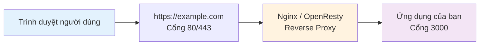

# 1.8 Localhost và Cổng

> **Đọc xong phần này, bạn sẽ thu hoạch được:**
>
> - Hiểu tác dụng của localhost và khái niệm cơ bản về địa chỉ IP
> - Nắm vững ý nghĩa của cổng (port) và các cổng thường gặp
> - Học cách khởi động/dừng server phát triển, xử lý vấn đề bị chiếm dụng cổng

Sau khi tạo xong dự án, bước tiếp theo là khởi động server phát triển để xem ứng dụng của bạn trên trình duyệt.

## Khái niệm cơ bản

### Localhost (Máy chủ cục bộ)

**localhost** là "địa chỉ nội bộ" của máy tính bạn, dùng để kiểm thử phát triển tại chỗ.

| Địa chỉ                 | Tác dụng                                           |
| ----------------------- | -------------------------------------------------- |
| `localhost`             | Tên host cục bộ, tự động phân giải thành 127.0.0.1 |
| `127.0.0.1`             | Địa chỉ IP loopback (vòng lặp) cục bộ              |
| `http://localhost:3000` | Dịch vụ chạy trên cổng 3000 của máy cục bộ         |

Hai cái này tương đương nhau:

```bash
ping localhost      # Hiệu quả giống bên dưới
ping 127.0.0.1
```

::: tip localhost vs Địa chỉ công khai

| Môi trường phát triển      | Môi trường sản xuất         |
| -------------------------- | --------------------------- |
| `localhost:3000`           | `https://example.com`       |
| Chỉ mình bạn truy cập được | Ai cũng truy cập được       |
| Dùng để debug phát triển   | Dùng để vận hành chính thức |

:::

### Cổng (Port)

**Cổng** giống như cửa của một ngôi nhà, một địa chỉ IP có thể có 65535 cổng, mỗi cổng có thể chạy một dịch vụ khác nhau.

Nếu ví địa chỉ IP như **địa chỉ tòa nhà**, thì cổng chính là **số phòng**:

| Cổng | Dịch vụ                    | Ứng dụng                |
| ---- | -------------------------- | ----------------------- |
| 3000 | Next.js Development Server | `http://localhost:3000` |
| 5173 | Vite Development Server    | `http://localhost:5173` |
| 8000 | Python HTTP Server         | `http://localhost:8000` |

**Các cổng phát triển thường gặp**:

| Cổng      | Mục đích                                    |
| --------- | ------------------------------------------- |
| 3000      | Next.js, Express                            |
| 5173      | Vite                                        |
| 8000/8080 | Cổng dự phòng thông dụng                    |
| 80        | HTTP (Môi trường sản xuất, có thể lược bỏ)  |
| 443       | HTTPS (Môi trường sản xuất, có thể lược bỏ) |

**Quy tắc số cổng**:

- **0-1023**: Cổng hệ thống, cần quyền quản trị viên
- **1024-49151**: Cổng đăng ký, các dịch vụ thường dùng sử dụng
- **49152-65535**: Cổng động, sử dụng tạm thời

## Khởi động server phát triển

```bash
# Vào thư mục dự án (sửa my-app thành tên dự án của bạn)
cd my-app

# Cài đặt phụ thuộc (Lần đầu chạy)
pnpm install

# Khởi động server phát triển
pnpm dev
```

::: tip Tại sao phải cài dependency trước?

`pnpm install` sẽ tải về tất cả các gói code (dependency) mà dự án cần, không có bước này dự án không chạy được. Giống như trước khi lắp ráp nội thất cần kiểm tra xem linh kiện đã đủ chưa.

:::

Sau khi khởi động sẽ hiện thông tin tương tự:

```
▲ Next.js 16.1.4
- Local:        http://localhost:3000
- Network:      http://192.168.1.100:3000

✓ Ready in 1.2s
```

Mở trình duyệt truy cập `http://localhost:3000`.

::: tip Khi nào cần chạy pnpm dev?

**Mỗi khi bắt đầu làm việc** đều cần chạy:

- Lần đầu mở dự án
- Sửa code xong muốn xem kết quả (server sẽ tự động làm mới, không cần khởi động lại)
- Sau khi tắt server muốn làm việc tiếp

Server khởi động xong cứ để đó, cho đến khi bạn làm xong việc.

:::

::: tip Địa chỉ Network có tác dụng gì?

Địa chỉ Local chỉ mình bạn truy cập được. Địa chỉ Network cho phép các thiết bị khác trong cùng mạng LAN (như điện thoại) truy cập, dùng để test hiệu quả trên di động.

:::

## Dừng server phát triển

Trong terminal nhấn `Ctrl + C` là có thể dừng.

| Hệ thống              | Thao tác        |
| --------------------- | --------------- |
| Windows / Mac / Linux | Nhấn `Ctrl + C` |

::: warning Server tắt xong trang web sẽ mất hiệu lực

Khi bạn đóng terminal hoặc nhấn `Ctrl+C` dừng server, trang `localhost:3000` sẽ không truy cập được nữa.

**Điều này là bình thường**: Server phát triển chỉ cung cấp dịch vụ khi đang chạy. Lần sau làm việc chỉ cần chạy lại `pnpm dev`.

:::

## Xử lý chiếm dụng cổng

Khi khởi động nếu báo lỗi cổng bị chiếm dụng:

```
Error: listen EADDRINUSE: address already in use :::3000
```

**Nhờ AI giải quyết**: Gửi thông tin báo lỗi cho AI, nó sẽ giúp bạn xử lý.

Bạn cũng có thể đổi cổng thủ công:

```bash
# Next.js: Chỉ định cổng khởi động
pnpm dev -- -p 3001
```

::: tip Tự động xử lý xung đột cổng

Các công cụ hiện đại (như Next.js 14+) sẽ tự động phát hiện chiếm dụng cổng, nếu 3000 bị chiếm, sẽ tự động thử 3001, 3002...

**Nhưng nếu thấy báo lỗi EADDRINUSE**, chứng tỏ tự động phát hiện thất bại, cứ để AI giúp bạn xử lý.

:::

::: tip Lệnh mà AI sử dụng

Nếu bạn muốn biết AI dùng lệnh gì để giải quyết, tham khảo bên dưới:

**Mac / Linux**:

```bash
lsof -ti:3000 | xargs kill -9
```

Một lệnh là xong: tìm tiến trình chiếm dụng cổng 3000 và diệt trực tiếp.

**Windows**:

```powershell
netstat -ano | findstr :3000
```

Xem PID của tiến trình chiếm cổng trước, sau đó:

```powershell
taskkill /PID 12345 /F
```

Thay `12345` bằng PID thực tế.

:::

## Câu hỏi thường gặp

### Q: Tại sao khởi động server xong trình duyệt tự động mở localhost?

Tính năng tiện lợi của công cụ phát triển. Các công cụ như Vercel, Vite sẽ tự động phát hiện server khởi động và mở trình duyệt.

### Q: Sửa code xong trang web không thay đổi?

Server phát triển hỗ trợ **Hot Reload**, lưu file xong sẽ tự động làm mới. Nếu không:

- Kiểm tra server có đang chạy bình thường không
- Thử làm mới trình duyệt thủ công (F5)

### Q: Có thể truy cập localhost trong mạng LAN không?

Không được. `localhost` chỉ truy cập được trên máy cục bộ. Truy cập mạng LAN cần dùng IP mạng LAN của máy bạn:

```bash
# Xem IP máy
ipconfig        # Windows
ifconfig        # Mac/Linux

# Truy cập mạng LAN
http://192.168.1.100:3000
```

### Q: Môi trường sản xuất cũng dùng cổng 3000 à?

Được, nhưng thường không để người dùng truy cập trực tiếp cổng 3000.

**Kiến trúc điển hình của môi trường sản xuất**:



Khi người dùng truy cập `https://example.com`, yêu cầu đến Nginx trước (lắng nghe cổng 80/443), sau đó Nginx chuyển tiếp cho ứng dụng của bạn (cổng 3000).

**Đương nhiên, cũng có thể để người dùng truy cập trực tiếp IP + Cổng**:

```
http://IP_Server_Của_Bạn:3000
```

Nhưng như vậy không đẹp, lại lộ số cổng. Khuyên dùng Nginx làm Reverse Proxy (đảo ngược), người dùng chỉ cần nhớ tên miền.

## Triết lý cốt lõi

**Localhost là nền tảng của phát triển nội bộ**.

- ✅ localhost = 127.0.0.1, đều trỏ về máy tính cục bộ
- ✅ Cổng phân biệt dịch vụ, cùng một máy có thể chạy nhiều dịch vụ
- ✅ Phát triển dùng localhost, sản xuất dùng tên miền
- ✅ Một cổng cùng lúc chỉ có thể có một tiến trình
- ✅ `Ctrl + C` dừng server

## Nội dung liên quan

- Xem chi tiết: [1.4 Nhập môn Terminal](./04-terminal-basics_vi.md)
- Xem chi tiết: [1.7 Tạo dự án](./07-creating-project_vi.md)
- Trước đó: [1.3 Cơ bản về Trình duyệt và Server](./03-browser-server_vi.md)
