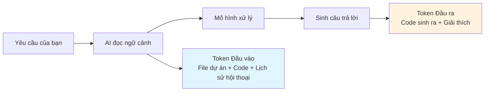

# 2.1 Kinh tế học trong lập trình AI 🔴

> **Đọc xong phần này, bạn sẽ thu hoạch được:**
>
> - Hiểu Token là đơn vị định giá của mô hình AI, nắm vững cơ chế tính phí Token đầu vào/đầu ra
> - Xây dựng ý thức về chi phí, học cách kiểm soát phạm vi ngữ cảnh AI thông qua Prompt (câu nhắc) chính xác để tối ưu chi phí
> - Nắm vững nguyên tắc cốt lõi để tối ưu Prompt: Chỉ định đường dẫn, xác định phạm vi, xóa bỏ lời khách sáo
> - Hiểu mối quan hệ giữa kích thước ngữ cảnh và chi phí, học cách tránh tiêu hao Token không cần thiết

> Lời nói đầu đã nhắc đến "Mô hình quyết định tốc độ và giới hạn năng lực code", cũng như tầm quan trọng của ý thức chi phí trong phát triển AI. **Token chính là tiền**, mỗi lần gọi mô hình đều đang tiêu tốn chi phí thực tế.

> Cài đặt và cấu hình công cụ xem chi tiết tại: [1.6 Mô hình và Công cụ](../01-environment-setup/06-models-and-tools_vi.md)

## Kiến thức tiền đề

::: tip LLM là gì

LLM (Large Language Model, Mô hình ngôn ngữ lớn) là mô hình AI được huấn luyện dựa trên lượng văn bản khổng lồ, có khả năng hiểu và tạo ra ngôn ngữ loài người, code, v.v.

:::

::: tip Token là gì

Token là đơn vị định giá của mô hình AI, cũng là đơn vị cơ bản để mô hình xử lý văn bản.

**Quy đổi**:

- 1 chữ Hán ≈ 1 Token (Tiếng Việt cũng tương tự, khoảng 0.75-1 từ/token tùy tokenizer)
- 1 từ tiếng Anh ≈ 0.75 Token
- 1 dòng code ≈ 5-15 Token

Mô hình tính phí dựa trên số lượng Token đầu vào (Prompt) và đầu ra (Completion).

:::

::: tip Token Đầu vào/Đầu ra là gì

**Token Đầu vào (Input)**: Nội dung bạn gửi cho mô hình (Prompt, code, ngữ cảnh)

**Token Đầu ra (Output)**: Nội dung mô hình sinh ra (Code, giải thích, câu trả lời)

**Tính tiền thế nào**: Số lượng Token cả đầu vào và đầu ra đều tính phí, đầu ra thường đắt hơn đầu vào một chút.

Nhưng là người dùng, bạn không cần nhớ đơn giá cụ thể —— công cụ sẽ hiển thị chi phí mỗi lần gọi, dùng hết thì nạp. Quan trọng là phải hiểu: **Ngữ cảnh càng lớn, chi phí càng cao**.

:::

::: tip Context Window là gì

Context Window (Cửa sổ ngữ cảnh) là giới hạn trên của độ dài ngữ cảnh mà mô hình có thể xử lý, tính bằng Token. GLM-4.7 hỗ trợ ngữ cảnh 200K, đủ để xử lý toàn bộ tệp lớn và hội thoại dài.

**Vượt quá giới hạn sẽ tự động nén**: Khi ngữ cảnh tiếp cận hoặc vượt quá giới hạn, mô hình sẽ tự động nén nội dung hội thoại ban đầu, giữ lại thông tin mới nhất và liên quan nhất. Điều này có thể dẫn đến một số chi tiết lịch sử bị đơn giản hóa hoặc bỏ qua.

:::

## Khái niệm cốt lõi

### Chi phí đến từ đâu



**Hiểu cốt lõi**:

- Một lần gọi rất rẻ, nhưng tích tiểu thành đại cũng là tiền
- **Ngữ cảnh càng lớn = Chi phí càng cao**: Đọc cả dự án vs Chỉ đọc một file, sự khác biệt là hàng chục hàng trăm lần
- Khi debug thường xuyên chú ý: Sửa đi sửa lại vòng lặp sẽ tích lũy Token liên tục

::: tip Làm sao kiểm soát chi phí

Đa số công cụ lập trình AI đều sẽ:

- Hiển thị số Token và chi phí mỗi lần gọi
- Cung cấp gói cước hoặc hạn mức sử dụng
- Nhắc bạn nạp tiền khi hết hạn mức

**Bạn không cần nhớ đơn giá cụ thể**, nhưng cần tạo thói quen tốt (xem phần sau) để giảm thiểu tiêu hao không cần thiết.

:::

## Chiến lược tối ưu chi phí và chất lượng

**Nhận thức then chốt**: Bản thân Prompt thường rất ít, **thứ thực sự tiêu tốn Token là ngữ cảnh mà AI đọc** —— tức là các file dự án, code, lịch sử hội thoại bắt buộc phải tải để AI hiểu nhu cầu của bạn.

Do đó, tối ưu Prompt không phải là "trau chuốt câu từ", mà là **giảm thiểu phạm vi ngữ cảnh AI cần đọc**, đồng thời **kiểm soát độ dài đầu ra**.

**Phạm vi ngữ cảnh vừa ảnh hưởng chi phí, vừa ảnh hưởng chất lượng**: Ngữ cảnh chính xác giúp AI tập trung vào vấn đề, đầu ra chính xác hơn; ngữ cảnh không liên quan sẽ làm phân tán sự chú ý, tăng xác suất lỗi.

### Nguyên tắc tối ưu

| Nguyên tắc             | Giải thích                                                       |
| ---------------------- | ---------------------------------------------------------------- |
| **Chỉ định đường dẫn** | Chỉ định đường dẫn file/thư mục, thu hẹp phạm vi tìm kiếm của AI |
| **Xác định phạm vi**   | "Chức năng đăng nhập có vấn đề" tập trung hơn "Dự án có vấn đề"  |
| **Xóa lời khách sáo**  | Không cần "Làm ơn", "Cảm ơn", "Nếu có thể"                       |
| **Nói thẳng vào việc** | Mô tả nhiệm vụ trực tiếp, không cần rào trước đón sau            |

### So sánh ví dụ

```
❌ Prompt mơ hồ (AI đọc nhiều ngữ cảnh hơn):
"Giúp tôi xem dự án có vấn đề gì không, rồi sửa nó"
→ AI không xác định được bắt đầu từ đâu, có thể đọc lượng lớn file không liên quan

✅ Prompt chính xác (AI tập trung khu vực liên quan):
"Giúp tôi xem chức năng đăng nhập có vấn đề gì, rồi sửa nó"
→ AI tự định vị file liên quan đăng nhập, chỉ đọc ngữ cảnh cần thiết
→ Hoặc trực tiếp hơn: "Sửa lỗi kiểu dữ liệu tại src/auth/login.ts dòng 42: user có thể là null"
```

## Gợi ý thực chiến

### Quan tâm tình hình sử dụng

Công cụ lập trình AI thường hiển thị số Token và chi phí mỗi lần gọi. Bạn cũng có thể xem chi tiết sử dụng trên nền tảng mở của mô hình tương ứng.

**Hết hạn mức thì nạp** —— Giống như cước điện thoại 4G vậy, không cần quá lo lắng, nhưng phải có ý thức tránh lãng phí.

### Danh sách kiểm tra ý thức chi phí

- Chỉ định đường dẫn file/thư mục
- Chỉ rõ phạm vi chức năng
- Xóa bỏ lời khách sáo
- Định kỳ dọn dẹp lịch sử hội thoại

## Câu hỏi thường gặp

### Q1: Token vượt giới hạn thì sao?

Thường sẽ không vượt —— AI sẽ tự động cắt nhỏ để đọc file lớn. Nhưng nếu gặp lỗi vượt giới hạn, chứng tỏ quy mô dự án đã cần kỹ thuật hóa (engineering) rồi:

- Cân nhắc chia tách dự án (monorepo hoặc microservices)
- Dọn dẹp lịch sử hội thoại, mở phiên làm việc mới
- Sử dụng `.gitignore` loại trừ các file không cần AI đọc

### Q2: Tại sao đôi khi mô hình lại bịa đặt (hallucination)?

Đây là vấn đề "ảo giác", mô hình nào cũng có. Cách giải quyết: Cung cấp ngữ cảnh rõ ràng, yêu cầu AI khi không chắc chắn thì nói rõ ra, đợi bạn xác nhận, chứ không được cố tình bịa đặt.

### Q3: GLM-4.7 năng lực có đủ dùng không?

Đủ dùng.

## Triết lý cốt lõi

**Ngữ cảnh quyết định chi phí và chất lượng, trực tiếp quan trọng hơn khách sáo.**

Chỉ định đường dẫn hoặc phạm vi chức năng, để AI chỉ đọc ngữ cảnh cần thiết. Ngữ cảnh chính xác vừa tiết kiệm tiền, vừa giúp đầu ra chính xác hơn.

## Nội dung liên quan

- Trước đó: [1.6 Mô hình và Công cụ](../01-environment-setup/06-models-and-tools_vi.md)
- Xem chi tiết: [2.2 Quy trình làm việc VibeCoding](./02-vibecoding-workflow_vi.md)
