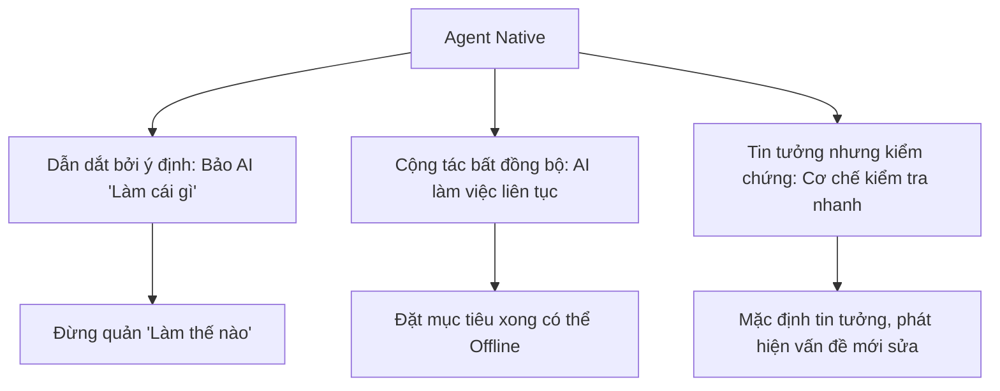
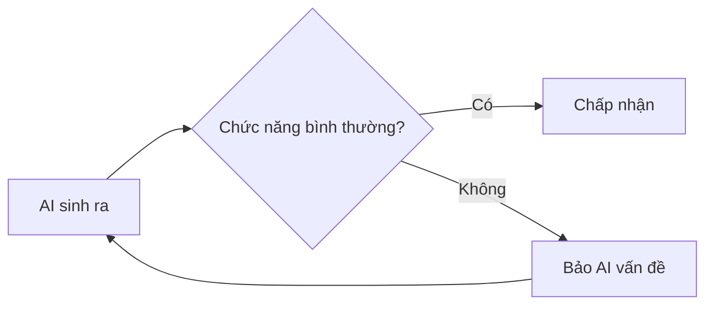
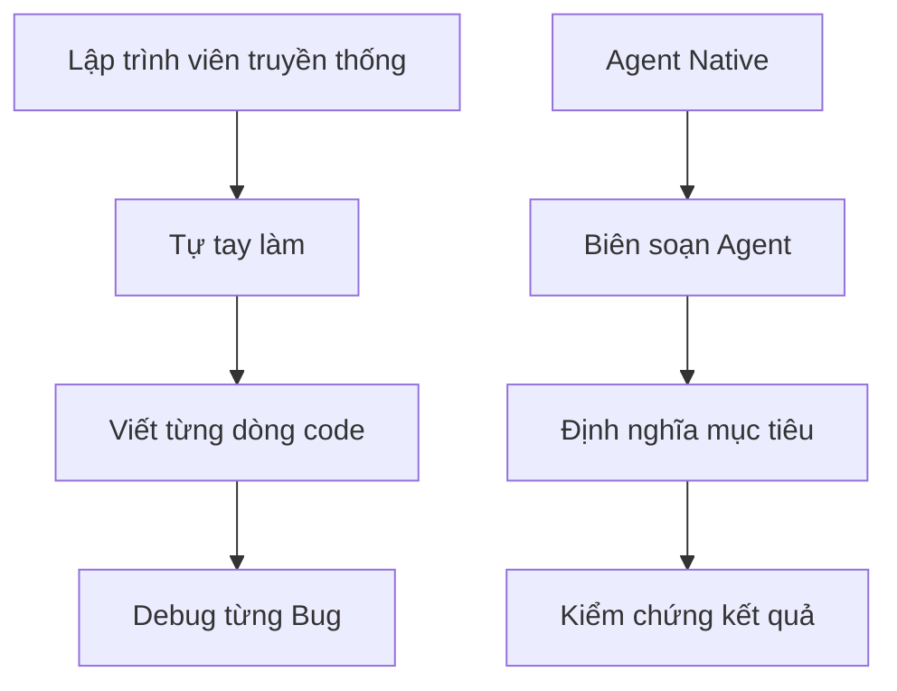
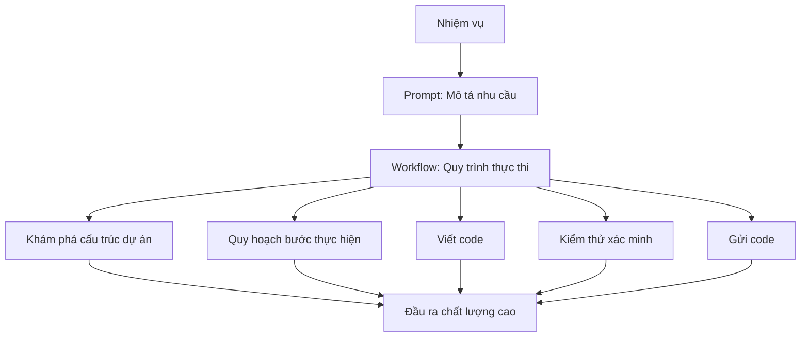
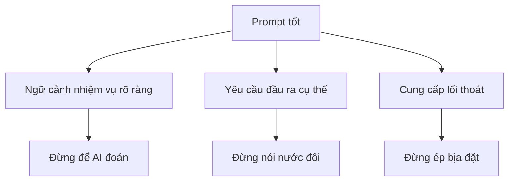
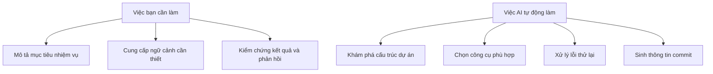
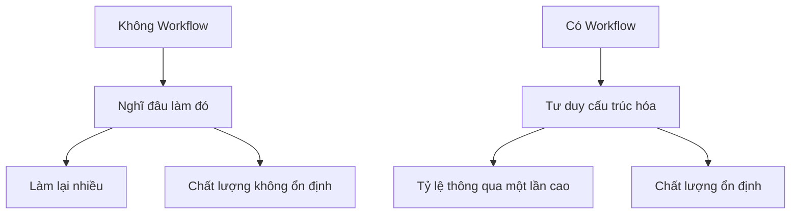

# 2.2 Quy trình làm việc VibeCoding

> **Đọc xong phần này, bạn sẽ thu hoạch được:**
>
> - Nắm vững quy trình làm việc 5 bước tiêu chuẩn của VibeCoding: Khám phá → Quy hoạch → Thực thi → Kiểm chứng → Gửi (Commit)
> - Hiểu tư duy phát triển Agent Native, học cách chuyển từ tư duy "Làm thế nào" sang tư duy hướng sản phẩm "Làm cái gì"
> - Học cách viết Prompt (câu nhắc) chất lượng cao: Mô tả nhiệm vụ trực tiếp, cung cấp ngữ cảnh, đưa ra ràng buộc cụ thể
> - Nắm vững các phương thức tương tác cốt lõi của Claude Code như chế độ quyền hạn, lệnh gạch chéo, tính năng điểm kiểm tra (checkpoint)
> - Hiểu cơ chế cộng tác đa Agent song song, học cách tận dụng năng lực tự động hóa của AI để nâng cao hiệu quả phát triển

> "Workflow (Luồng công cụ)" được nhắc đến trong lời nói đầu chính là cốt lõi của Vibecoding, cũng như quy trình phát triển tiêu chuẩn của VibeCoding.

## Kiến thức tiền đề

::: tip Claude Code là gì

Claude Code là một công cụ dòng lệnh AI, có thể trực tiếp đọc tệp dự án, thực thi lệnh, tự động sửa đổi code và hoàn thành nhiệm vụ.
:::

::: tip Quy trình làm việc là gì

Quy trình làm việc (Workflow) là quy trình tiêu chuẩn hóa để hoàn thành nhiệm vụ. Quy trình làm việc phát triển AI bao gồm các khâu: khám phá, lập kế hoạch, viết code, gửi đi, v.v.
:::

::: tip Prompt (Câu nhắc) là gì

Prompt (Câu nhắc) là chỉ thị văn bản gửi cho AI, mô tả nhiệm vụ bạn mong muốn AI hoàn thành. **Prompt tốt là một phần của quy trình làm việc**.
:::
::: details Bấm để xem Tư duy phát triển Agent Native

**Agent Native** = Tư duy phát triển lấy AI Agent làm trung tâm

Trong phát triển truyền thống, AI là công cụ hỗ trợ (Copilot); trong Agent Native, AI là người thực thi tự chủ (Autopilot).

#### Tư duy truyền thống vs Agent Native

| Khía cạnh             | Phát triển AI hỗ trợ truyền thống | Phát triển Agent Native                          |
| --------------------- | --------------------------------- | ------------------------------------------------ |
| **Vai trò cốt lõi**   | Người viết code, AI giúp đỡ       | AI là chủ đạo, code là chi tiết thực hiện của AI |
| **Cách làm việc**     | AI là Copilot                     | AI là Autopilot                                  |
| **Mô hình tương tác** | Người viết Prompt chỉ huy AI      | AI chủ động đặt câu hỏi, lập kế hoạch, thực thi  |
| **Hình thái đầu ra**  | AI tạo đoạn code, người tích hợp  | AI tự chủ hoàn thành nhiệm vụ trọn vẹn           |
| **Điểm bạn quan tâm** | Viết code thế nào                 | Viết sản phẩm gì                                 |

#### Ba nguyên tắc lớn của Agent Native



**1. Dẫn dắt bởi ý định**

Nói cho AI biết mục tiêu, để nó tự quyết định cách thực hiện:

```bash
❌ Tư duy truyền thống:
"Giúp tôi viết một hàm, nhận tham số mảng, dùng vòng lặp for duyệt qua,
gặp cái nào lớn hơn 10 thì push vào mảng mới..."

✅ Agent Native:
"Lọc các phần tử lớn hơn 10 trong mảng, trả về mảng mới"
```

**2. Cộng tác bất đồng bộ**

AI có thể làm việc khi bạn đang ngủ:

```bash
# Bạn thiết lập mục tiêu, AI tự chủ thực thi
"Hiện thực hóa chức năng bình luận người dùng, bao gồm:
1. Database schema (Model Comment)
2. CRUD API
3. Form bình luận Frontend
4. Hiển thị danh sách bình luận

Làm xong báo tôi, tôi đi làm việc khác đây."
```

**3. Tin tưởng nhưng kiểm chứng**

Đừng kiểm tra code của AI từng dòng một, mà hãy:



**Cách kiểm chứng**:

- Kiểm thử chức năng: Chạy thử xem dùng được không
- Kiểm tra kiểu: `tsc` có báo lỗi không
- Review code: Chỉ xem logic then chốt, không xem chi tiết triển khai

#### Từ Lập trình viên đến Người biên soạn (Orchestrator)

Thời đại Agent Native, vai trò của bạn chuyển đổi:



| Lập trình viên truyền thống | Người biên soạn Agent Native |
| --------------------------- | ---------------------------- |
| Viết code tay               | Mô tả nhu cầu                |
| Sửa từng cái                | Phản hồi vấn đề              |
| Quan tâm cú pháp            | Quan tâm sản phẩm            |
| Là thợ thủ công             | Là chỉ huy                   |

**Ghi nhớ**: Code là chi tiết thực hiện, sản phẩm mới là mục đích. Agent Native giải phóng bạn khỏi "Làm thế nào", để tập trung vào "Làm cái gì".

:::

## Khái niệm cốt lõi

### Triết lý cốt lõi của Vibecoding

```
Vibecoding = Prompt (Câu nhắc) + Workflow (Luồng công cụ)
```

**Prompt bảo AI làm cái gì**
**Workflow quyết định làm như thế nào**



### Nguyên tắc cốt lõi của Prompt

AI là trợ lý lập trình mạnh mẽ, nó hiểu thuật ngữ kỹ thuật, quen thuộc các loại framework, có thể phân tích code nhanh chóng.

**Chìa khóa giao tiếp là: Trực tiếp, cụ thể, có ngữ cảnh.**

❌ **Vòng vo**:

```
"Bạn là một kỹ sư Fullstack thâm niên, tinh thông các loại công nghệ..."
```

→ AI không cần đóng vai, nó biết nó làm được gì

✅ **Nói thẳng vào việc**:

```
"Kiểm tra vấn đề an toàn kiểu dữ liệu của component React này"
```

→ Một câu nói rõ muốn làm gì

❌ **Mô tả mơ hồ**:

```
"Giúp tôi tối ưu code một chút"
```

→ AI không biết tối ưu theo hướng nào

✅ **Nhu cầu cụ thể**:

```
"Tối ưu hiệu suất tải trang đăng nhập:
1. Thêm lazy load ảnh
2. Tải trễ tài nguyên không quan trọng
3. Sử dụng dynamic import của Next.js"
```

→ Mục tiêu tối ưu và cách thực hiện rõ ràng

## Nguyên tắc Prompt

### Đặc điểm của Prompt tốt



### So sánh Prompt: Kém vs Khuyên dùng

| Loại                    | Kém                                                                                             | Khuyên dùng                                                                                                                                           |
| ----------------------- | ----------------------------------------------------------------------------------------------- | ----------------------------------------------------------------------------------------------------------------------------------------------------- |
| **Đóng vai**            | "Bạn là kỹ sư Fullstack 20 năm kinh nghiệm, tinh thông React, Vue, Angular, Node.js, Python..." | Nói thẳng nhiệm vụ: "Hiện thực hóa chức năng đăng nhập người dùng"                                                                                    |
| **Chỉ thị mơ hồ**       | "Giúp tôi tối ưu code một chút"                                                                 | "Tối ưu hiệu suất tải trang đăng nhập: thêm lazy load ảnh, tải trễ tài nguyên không quan trọng"                                                       |
| **Không giới hạn**      | "Viết một hệ thống thương mại điện tử hoàn chỉnh"                                               | "Hiện thực hóa chức năng bình luận người dùng, bao gồm: form bình luận, hiển thị danh sách, lưu trữ dữ liệu"                                          |
| **Ép buộc**             | "Bạn phải đưa ra câu trả lời đúng, không được nói không biết"                                   | "Nếu không chắc chắn, hãy nói rõ 'tôi không chắc', thay vì bịa ra câu trả lời"                                                                        |
| **Nhiệm vụ cụ thể**     | "Giúp tôi viết chức năng đăng nhập"                                                             | "Hiện thực hóa chức năng đăng nhập: username + password, sử dụng Next.js 16 App Router, Drizzle ORM + PostgreSQL, bao gồm xác thực form và xử lý lỗi" |
| **Cung cấp ngữ cảnh**   | "Sửa cái Bug này"                                                                               | "Sửa Bug: File app/login/page.tsx, vấn đề: người dùng đăng nhập xong không chuyển hướng về trang chủ, kỳ vọng: chuyển hướng về /dashboard"            |
| **Chỉ thị phải cụ thể** | "Thêm test"                                                                                     | "Viết test case cho app/login/page.tsx, framework: Playwright, bao phủ các tình huống: sai mật khẩu, tài khoản không tồn tại, lỗi mạng"               |

**Nguyên tắc cốt lõi**:

- Đừng để AI đoán → Cung cấp ngữ cảnh rõ ràng
- Đừng nói nước đôi → Đưa ra yêu cầu cụ thể
- Đừng ép bịa đặt → Cho AI một lối thoát "không chắc chắn"

### Để AI hỏi lại nhiều lần

```
"Tôi muốn phát triển một ứng dụng quản lý tác vụ.
Hãy hỏi lại tôi nhiều lần, cho đến khi bạn hoàn toàn hiểu nhu cầu của tôi.
Đừng đoán, hãy hỏi thẳng."
```

### Mẫu Prompt

#### Mẫu sinh code

```
"Hiện thực hóa [Tên chức năng]

Tech Stack:
- Next.js [Phiên bản]
- TypeScript
- Drizzle ORM
- [Công nghệ khác]

Nhu cầu:
1. [Nhu cầu cụ thể 1]
2. [Nhu cầu cụ thể 2]
3. [Nhu cầu cụ thể 3]

Lưu ý:
- Tuân thủ phong cách code hiện có của dự án
- Không thêm dependency mới trừ khi cần thiết
- Bao gồm xử lý lỗi"
```

#### Mẫu sửa Bug

```
"Sửa Bug

Đường dẫn file: [Đường dẫn đầy đủ]
Thông tin lỗi:
[Log báo lỗi đầy đủ]

Code hiện tại:
[Đoạn code liên quan]

Hành vi kỳ vọng: [Mô tả]
Hành vi thực tế: [Mô tả]

Hãy phân tích nguyên nhân và cung cấp phương án sửa lỗi"
```

## Quy trình làm việc tiêu chuẩn

### Năng lực tự động hóa của AI

Trước khi bắt đầu quy trình làm việc, hãy nhớ: **AI có thể tự động xử lý rất nhiều tác vụ**.

::: info Claude Code vs Các công cụ AI khác

**Sự khác biệt then chốt**:

| Đặc tính               | Claude Code                  | Cursor/Windsurf      | ChatGPT Web          |
| ---------------------- | ---------------------------- | -------------------- | -------------------- |
| **Ngữ cảnh dự án**     | ✅ Tự động đọc toàn bộ dự án | ✅ Tự động đọc       | ❌ Dán thủ công      |
| **Thực thi lệnh**      | ✅ Chạy trực tiếp bash       | ✅ Tích hợp terminal | ❌ Copy vào terminal |
| **Sửa đổi file**       | ✅ Tự động sửa nhiều file    | ✅ Sửa nhiều file    | ⚠️ Copy từng cái     |
| **Quản lý phiên bản**  | ✅ Tự động commit            | ✅ Tích hợp Git      | ❌ Thao tác tay      |
| **Quy trình làm việc** | ✅ Quy trình tiêu chuẩn hóa  | ⚠️ Cần làm thủ công  | ❌ Đối thoại tùy ý   |

**Tại sao Claude Code phù hợp với Vibecoding hơn**:

1. CLI Native: Dòng lệnh là môi trường tự nhiên của lập trình viên
2. Mức độ tự động hóa cao: Giảm thao tác thủ công
3. Quy trình tiêu chuẩn hóa: Khám phá → Quy hoạch → Hiện thực → Kiểm chứng → Gửi
4. Ngữ cảnh hoàn chỉnh: Hiểu toàn bộ cấu trúc dự án
   :::



**Năng lực tự động hóa của AI**:

- ✅ Tự động khám phá cấu trúc dự án (Bạn không cần bảo nó xem file nào)
- ✅ Tự động chọn công cụ phù hợp (Read, Edit, Bash)
- ✅ Tự động xử lý lỗi (Thất bại sẽ thử lại hoặc đổi phương án)
- ✅ Tự động sinh thông tin commit (Dựa trên nội dung sửa đổi)
- ✅ Tự động nhận diện quan hệ phụ thuộc (Biết sửa đổi sẽ ảnh hưởng đến file nào)

**Việc bạn cần làm**:

- Mô tả rõ ràng mục tiêu nhiệm vụ
- Cung cấp ngữ cảnh cần thiết
- Kiểm chứng kết quả và phản hồi

**Không cần làm**:

- ❌ Chỉ định bước cụ thể ("Đọc file A trước, rồi đọc file B")
- ❌ Bảo nó dùng công cụ nào ("Dùng công cụ Read để đọc")
- ❌ Tự tổ hợp lệnh ("Chạy git add rồi git commit")
- ❌ Tự xử lý lỗi ("Nếu thất bại thì thử lại")

### Chế độ quyền hạn (Permission Mode)

::: tip Chế độ quyền hạn là gì

Chế độ quyền hạn kiểm soát xem AI có cần bạn xác nhận trước khi thực hiện thao tác hay không, cân bằng giữa hiệu quả và an toàn.

:::

#### Ba loại chế độ quyền hạn

| Chế độ           | Phím tắt              | Đặc điểm                                                   | Ngữ cảnh áp dụng                   |
| ---------------- | --------------------- | ---------------------------------------------------------- | ---------------------------------- |
| **Default**      | Shift+Tab chuyển vòng | Tự động duyệt thao tác an toàn, hỏi khi thao tác nguy hiểm | Phát triển hàng ngày (Khuyên dùng) |
| **Plan**         | Shift+Tab             | Chỉ cho phép thao tác đọc                                  | Review code, khám phá              |
| **Accept Edits** | Shift+Tab             | Thao tác sửa cần xác nhận, còn lại tự động                 | Ngữ cảnh sửa đổi mức tin tưởng cao |

#### Chế độ Default (Khuyên dùng)

Thao tác chỉ đọc (đọc file, tìm kiếm code, xem trạng thái, liệt kê file) tự động duyệt, thao tác sửa đổi (sửa file, xóa file, chạy lệnh, yêu cầu mạng, Git push) cần xác nhận.

**Tùy chọn cửa sổ quyền hạn**:

- **Yes**: Đồng ý thao tác này
- **Yes, don't ask again for this tool**: Đồng ý lần này, và lần sau thao tác tương tự không hỏi nữa
- **No, and tell AI what to do differently**: Từ chối và bảo AI đổi cách khác

#### Chế độ Plan (Review code)

Chỉ cho phép thao tác chỉ đọc, mọi thao tác sửa đổi đều bị chặn.

**Ngữ cảnh áp dụng**:

- Review code
- Tìm hiểu cấu trúc kho code
- Phân tích mang tính khám phá

#### Chế độ Accept Edits (Sửa hiệu quả)

Thao tác sửa đổi cần xác nhận, các thao tác khác tự động duyệt.

```bash
# Hành vi ví dụ
"Đọc file cấu hình"
"Chạy test"
# AI thực thi trực tiếp (Thao tác phi chỉnh sửa)

"Sửa chữ ký hàm"
"Xóa file này"
# AI sẽ hỏi (Thao tác chỉnh sửa cần xác nhận)
```

**Ngữ cảnh áp dụng**:

- Cần chạy lệnh/test thường xuyên
- Cẩn trọng với việc sửa file
- Quy trình làm việc tự động hóa mức tin tưởng cao

#### Chuyển đổi chế độ

```bash
# Phím tắt
Shift+Tab  # Chuyển đổi vòng giữa 3 chế độ
```

### Lệnh tương tác thường dùng

Trong Claude Code, lệnh bắt đầu bằng `/` gọi là lệnh gạch chéo (slash command), dùng để thực thi nhanh các thao tác cụ thể:

| Lệnh            | Chức năng                           | Ngữ cảnh sử dụng                                  |
| --------------- | ----------------------------------- | ------------------------------------------------- |
| **/clear**      | Xóa ngữ cảnh hội thoại              | Khi bắt đầu nhiệm vụ mới                          |
| **/model**      | Chuyển đổi mô hình AI               | Cần năng lực mạnh hơn thì chuyển sang Opus        |
| **/status**     | Xem hạn mức sử dụng và tính phí     | Kiểm tra hạn mức còn lại                          |
| **/config**     | Mở giao diện cấu hình               | Sửa cài đặt                                       |
| **/resume**     | Khôi phục phiên làm việc gần nhất   | Tiếp tục công việc trước đó sau khi khởi động lại |
| **/rewind**     | Khôi phục về checkpoint trước       | Code sửa sai cần quay lại                         |
| **/agents**     | Quản lý Agent                       | Tạo/Xem Agent tùy chỉnh                           |
| **/init**       | Sinh template CLAUDE.md             | Cấu hình nhanh dự án mới                          |
| **/compact**    | Nén ngữ cảnh hội thoại              | Tinh giản khi ngữ cảnh quá nhiều                  |
| **/export**     | Xuất lịch sử hội thoại              | Chia sẻ hoặc lưu hội thoại                        |
| **/statusline** | Tùy chỉnh hiển thị thanh trạng thái | Ẩn/Hiện thông tin trạng thái                      |
| **/vim**        | Bật gán phím Vim                    | Người dùng quen Vim                               |

**Ngữ cảnh thường dùng**:

```bash
# Xóa ngữ cảnh khi mở nhiệm vụ mới
/clear

# Xem hạn mức còn lại
/status

# Chuyển sang mô hình mạnh hơn
/model opus

# Khôi phục về trạng thái trước đó
/rewind
```

### Lệnh CLI và Tùy chọn khởi động

::: details Lệnh cơ bản (Nên đọc)

| Lệnh                  | Mô tả                              | Ví dụ                                        |
| --------------------- | ---------------------------------- | -------------------------------------------- |
| **claude**            | Khởi động REPL tương tác           | `claude`                                     |
| **claude "query"**    | Khởi động REPL với Prompt ban đầu  | `claude "Giải thích dự án này"`              |
| **claude -p "query"** | Truy vấn rồi thoát (Headless mode) | `claude -p "Kiểm tra lỗi kiểu dữ liệu code"` |
| **claude -c**         | Tiếp tục hội thoại lần trước       | `claude -c`                                  |
| **claude -r "id"**    | Khôi phục phiên chỉ định           | `claude -r "abc123"`                         |
| **claude --continue** | Tải hội thoại gần nhất             | `claude --continue`                          |
| **claude --resume**   | Hiển thị trình chọn phiên          | `claude --resume`                            |

:::

::: details Tùy chọn khởi động thường dùng

| Tùy chọn              | Chức năng                   | Ví dụ                           |
| --------------------- | --------------------------- | ------------------------------- |
| **-p "query"**        | Thực thi truy vấn rồi thoát | `claude -p "Chạy test"`         |
| **--model**           | Chỉ định mô hình            | `claude --model opus`           |
| **--permission-mode** | Thiết lập chế độ quyền hạn  | `claude --permission-mode plan` |
| **--add-dir**         | Thêm thư mục làm việc       | `claude --add-dir ../shared`    |

:::

::: details Phím tắt và Kiểm soát nhập liệu (Nên đọc)

| Phím tắt      | Chức năng                         | Ngữ cảnh                         |
| ------------- | --------------------------------- | -------------------------------- |
| **Ctrl+C**    | Hủy nhập liệu hoặc việc đang sinh | Ngắt tiêu chuẩn                  |
| **Ctrl+D**    | Thoát phiên                       | Tín hiệu EOF                     |
| **Ctrl+L**    | Xóa màn hình terminal             | Giữ lịch sử hội thoại            |
| **Ctrl+R**    | Tìm kiếm ngược lịch sử lệnh       | Tìm lệnh trước đây               |
| **Esc+Esc**   | Quay lui code/hội thoại           | Khôi phục về trạng thái trước    |
| **Tab**       | Chuyển đổi tư duy mở rộng         | Bật/Tắt chế độ suy nghĩ          |
| **Shift+Tab** | Chuyển đổi chế độ quyền hạn       | Chuyển đổi vòng chế độ quyền hạn |

**Phương pháp nhập đa dòng**:
| Phím tắt | Ngữ cảnh |
|--------|--------|
| **\ + Enter** | Áp dụng cho mọi terminal |
| **Option+Enter** (macOS) | Mặc định macOS |
| **Shift+Enter** | Khả dụng sau khi cấu hình |

**Tiền tố lệnh nhanh**:
| Tiền tố | Chức năng | Ví dụ |
|------|------|------|
| **#** | Lối tắt bộ nhớ, thêm vào CLAUDE.md | `# Thêm ngữ cảnh dự án` |
| **/** | Lệnh gạch chéo | `/clear` |
| **!** | Chế độ Bash, chạy lệnh trực tiếp | `! npm test` |
| **@** | Tham chiếu đường dẫn file | `@src/app/page.tsx` |

:::

::: details Nâng cao: Cờ CLI cao cấp

**Danh sách cờ CLI đầy đủ**:

| Cờ                               | Mô tả                                    | Ví dụ                                         |
| -------------------------------- | ---------------------------------------- | --------------------------------------------- |
| `--add-dir`                      | Thêm thư mục làm việc phụ                | `claude --add-dir ../apps`                    |
| `--agents`                       | Định nghĩa Agent dạng JSON               | `claude --agents '{...}'`                     |
| `--allowedTools`                 | Danh sách công cụ cho phép               | `claude --allowedTools "Read,Bash"`           |
| `--disallowedTools`              | Danh sách công cụ bị cấm                 | `claude --disallowedTools "Edit"`             |
| `--system-prompt`                | Thay thế toàn bộ Prompt hệ thống         | `claude --system-prompt "..."`                |
| `--system-prompt-file`           | Tải Prompt hệ thống từ file              | `claude -p --system-prompt-file ./prompt.txt` |
| `--append-system-prompt`         | Nối thêm vào Prompt mặc định             | `claude --append-system-prompt "..."`         |
| `--output-format`                | Định dạng đầu ra (text/json/stream-json) | `claude -p --output-format json`              |
| `--input-format`                 | Định dạng đầu vào (text/stream-json)     | `claude -p --input-format stream-json`        |
| `--verbose`                      | Bật log chi tiết                         | `claude --verbose`                            |
| `--max-turns`                    | Giới hạn số lượt                         | `claude -p --max-turns 3`                     |
| `--dangerously-skip-permissions` | Bỏ qua nhắc quyền hạn                    | `claude --dangerously-skip-permissions`       |

**Phân biệt cờ Prompt hệ thống**:
| Cờ | Hành vi | Chế độ | Ca kíp sử dụng |
|------|------|------|------|
| `--system-prompt` | **Thay thế** toàn bộ mặc định | Tương tác + In | Kiểm soát hoàn toàn hành vi |
| `--system-prompt-file` | **Thay thế** bằng nội dung file | Chỉ in | Tải từ file |
| `--append-system-prompt` | **Nối** vào mặc định | Tương tác + In | Thêm chỉ thị cụ thể |

:::

::: details Nâng cao: Chế độ Vim

Sử dụng `/vim` để bật hoặc cấu hình vĩnh viễn qua `/config`.

**Chuyển đổi chế độ**:
| Lệnh | Thao tác | Từ chế độ |
|------|------|----------|
| `Esc` | Vào chế độ NORMAL | INSERT |
| `i` | Chèn trước con trỏ | NORMAL |
| `a` | Chèn sau con trỏ | NORMAL |
| `o` | Mở dòng ở dưới | NORMAL |

**Điều hướng (Chế độ NORMAL)**:
| Lệnh | Thao tác |
|------|------|
| `h/j/k/l` | Trái/Xuống/Lên/Phải |
| `w` | Từ tiếp theo |
| `b` | Từ trước đó |
| `0/$` | Đầu dòng/Cuối dòng |
| `gg/G` | Đầu/Cuối input |

:::

::: details Nâng cao: Lệnh Bash chạy ngầm

**Cơ chế chạy ngầm**:

- Chạy lệnh bất đồng bộ, trả về ID nhiệm vụ ngay lập tức
- Đầu ra được đệm, có thể truy xuất bằng công cụ BashOutput
- Tự động dọn dẹp khi Claude Code thoát

**Lệnh chạy ngầm thường gặp**:

- Công cụ build (webpack, vite, make)
- Trình quản lý gói (npm, yarn, pnpm)
- Trình chạy test (jest, pytest)
- Server phát triển

**Nhấn Ctrl+B** để chuyển cuộc gọi Bash thông thường sang chạy ngầm.

**Chế độ Bash (Tiền tố !)**:

```bash
! npm test
! git status
! ls -la
```

- Thêm lệnh và đầu ra vào ngữ cảnh hội thoại
- Hiển thị tiến trình thời gian thực
- Hỗ trợ Ctrl+B chạy ngầm

:::

::: details Nâng cao: Định dạng cấu hình Agent

**Cờ `--agents` nhận JSON** (thường không cần dùng tay, lệnh `/agents` sẽ tự xử lý):

```bash
claude --agents '{
  "code-reviewer": {
    "description": "Expert code reviewer",
    "prompt": "You are a senior code reviewer",
    "tools": ["Read", "Grep", "Glob", "Bash"],
    "model": "sonnet"
  }
}'
```

**Trường bắt buộc**:

- `description`: Khi nào gọi (ngôn ngữ tự nhiên)
- `prompt`: Prompt hệ thống

**Trường tùy chọn**:

- `tools`: Mảng công cụ khả dụng
- `model`: Bí danh mô hình (sonnet/opus/haiku)

:::

### Quy trình 5 bước

::: tip Quy trình là gợi ý không phải bắt buộc

Quy trình 5 bước VibeCoding là một **mô hình thực hành được đề xuất**, phù hợp với đa số ngữ cảnh phát triển. Nhưng bạn có thể điều chỉnh linh hoạt theo tình hình thực tế:

- ✅ **Khuyên tuân thủ**: Chức năng phức tạp, dự án lạ, cộng tác nhóm
- 🔄 **Có thể đơn giản hóa**: Sửa đổi đơn giản, dự án quen thuộc, phát triển cá nhân
- ⚡ **Có thể bỏ qua**: Sửa đổi cực nhỏ, sửa lỗi rõ ràng

**Nguyên tắc cốt lõi**: Sau khi hiểu mục đích mỗi bước, hãy áp dụng linh hoạt, đừng thực hiện máy móc.

:::

#### 1. Khám phá cấu trúc dự án

**Mục đích**: Tìm hiểu tổ chức code hiện có, tránh làm lại việc đã có

```bash
# Để AI khám phá dự án
"Khám phá cấu trúc dự án này, cho tôi biết:
1. Tech stack sử dụng
2. Cách tổ chức file
3. Các module chức năng hiện có
4. Tác dụng của các file cấu hình"
```

**Ví dụ đầu ra**:

```
Dự án sử dụng Next.js 16 + TypeScript + Drizzle
- app/: Trang và API
- components/: Component tái sử dụng
- src/db/: Mô hình CSDL
```

#### 2. Quy hoạch bước thực hiện

**Mục đích**: Nghĩ kỹ rồi mới làm, giảm thiểu làm lại

```bash
"Tôi muốn thêm chức năng bình luận người dùng.
Hãy quy hoạch bước thực hiện, bao gồm:
1. Cần tạo những file nào
2. Cần sửa những file hiện có nào
3. Thay đổi schema CSDL
4. Trình tự thực hiện"
```

**Ví dụ đầu ra**:

```
Các bước:
1. Cập nhật Drizzle schema (Thêm model Comment)
2. Chạy npx drizzle-kit push
3. Tạo API route (app/api/comments/route.ts)
4. Tạo component bình luận (components/CommentForm.tsx)
5. Tích hợp vào trang chi tiết
```

#### 3. Viết code

**Mục đích**: Hiện thực hóa chức năng theo kế hoạch

**Năng lực tự động chia nhỏ của AI**:

Nhiệm vụ phức tạp sẽ tự động được chia nhỏ:

```bash
# Bạn chỉ cần nói
"Hiện thực hóa chức năng bình luận người dùng"

# AI sẽ tự động chia thành:
1. Cập nhật Drizzle schema
2. Chạy migrate database
3. Tạo API endpoint
4. Viết component Frontend
5. Tích hợp vào trang
6. Test kiểm chứng
```

Bạn không cần chỉ định thủ công từng bước, AI sẽ:

- Nhận diện quan hệ phụ thuộc nhiệm vụ
- Xác định trình tự thực hiện
- Xử lý xong song các phần độc lập
- Kiểm chứng kết quả từng bước

**Đương nhiên, bạn cũng có thể thực hiện từng bước**:

```bash
"Làm theo bước 1, cập nhật Drizzle schema"
```

```bash
"Làm theo bước 2, sinh và chạy migrate"
```

```bash
"Làm theo bước 3, tạo API bình luận"
```

#### 4. Kiểm thử xác minh

**Mục đích**: Đảm bảo chức năng bình thường

```bash
"Test chức năng bình luận:
1. Xác minh API có thể tạo bình luận bình thường
2. Xác minh bình luận hiển thị chính xác
3. Xác minh xử lý lỗi"
```

#### 5. Gửi code (Commit)

**Mục đích**: Thiết lập bản ghi phiên bản

```bash
"Chức năng bình luận phát triển xong, commit code"
```

::: tip Để AI tự động bảo trì bản ghi Git

AI phát triển rất mạnh mẽ, có thể vì sửa một Bug mà phá hỏng chức năng cũ. Do đó cần bản ghi phiên bản tần suất cao để bảo vệ thành quả.

**Thêm chỉ thị này vào quy tắc dự án hoặc CLAUDE.md**:

> **"Mỗi khi bạn hoàn thành phát triển một chức năng độc lập, hoặc sửa xong một Bug và kiểm chứng thông qua, hãy tự động chạy git commit để gửi code, và sinh một câu commit message tiếng Việt ngắn gọn."**

Từ đó, quy trình phát triển biến thành:

- AI viết xong chức năng đăng nhập -> Tự động lưu
- AI viết xong trang chủ -> Tự động lưu
- AI làm hỏng code -> Quay lui về phiên bản trước bất cứ lúc nào

**Tại sao cần tự động commit**:

- AI có thể vì sửa 1 vấn đề mà phá hỏng 3 chức năng cũ
- Không có kiểm soát phiên bản, sửa sai có thể khiến thành quả trước đó không khôi phục được
- Bạn không cần nhớ mỗi lần commit thủ công, AI tự xử lý

:::

#### 6. Tính năng Checkpoint (Điểm kiểm tra)

**Mục đích**: Tự động theo dõi sửa đổi file, hỗ trợ quay lui nhanh

Claude Code tự động theo dõi sửa đổi file, hỗ trợ quay lui nhanh.

**Tự động tạo**: Tự động tạo checkpoint mỗi lần gửi prompt, không cần lưu thủ công

**Phương pháp quay lui**:
Nhấn `Esc+Esc` hoặc chạy `/rewind`, chọn:

- Chỉ hội thoại: Quay lui tin nhắn người dùng, giữ lại thay đổi code
- Chỉ code: Khôi phục thay đổi file, giữ lại hội thoại
- Code và hội thoại: Khôi phục cả hai

::: details Nâng cao: Nguyên lý làm việc của Checkpoint

**Tự động theo dõi**:

- Mỗi prompt người dùng tạo một checkpoint mới
- Checkpoint tồn tại dai dẳng giữa các phiên làm việc
- Tự động dọn dẹp sau 30 ngày (có thể cấu hình)

**Hạn chế**:

- Thay đổi lệnh Bash (rm, mv, cp) không thể quay lui
- Sửa đổi bên ngoài không thể quay lui
- Checkpoint dùng để khôi phục nhanh, Git dùng cho lịch sử vĩnh viễn

:::

## Hiểu về Agent

### Agent là gì

**Agent** = Bản thân AI

Bản thân AI chính là một **Agent**, công việc của nó là:

- Hiểu ý định và nhu cầu của bạn
- Ra quyết định (dùng công cụ gì, làm gì trước làm gì sau)
- Điều phối các công cụ để hoàn thành nhiệm vụ

Có thể hiểu Agent là một **người thực thi nhiệm vụ**:

- Nhận chỉ thị của bạn (Prompt)
- Gọi các công cụ để hoàn thành nhiệm vụ
- Trả về kết quả thực thi

**Khác biệt với đối thoại AI thông thường**:
| AI đối thoại thường | Agent |
|-------------|--------|
| Chỉ có thể chat | Có thể gọi công cụ |
| Trả lời thụ động | Ra quyết định chủ động |
| Tương tác đơn lượt | Thực thi liên tục |

### Agent tùy chỉnh là gì

**Agent tùy chỉnh** = Agent chuyên dụng bạn tạo ra

Agent tùy chỉnh là "trợ lý chuyên môn" mà Agent chính có thể gọi. Mỗi Agent tùy chỉnh:

- Có mục đích và lĩnh vực chuyên môn cụ thể
- Có cửa sổ ngữ cảnh độc lập (không làm ô nhiễm hội thoại chính)
- Có prompt hệ thống tùy chỉnh (huấn luyện chuyên biệt)
- Có thể giới hạn quyền truy cập công cụ

**Lợi thế khi sử dụng Agent tùy chỉnh**:
| Lợi thế | Giải thích |
|------|------|
| **Giữ gìn ngữ cảnh** | Hội thoại chính giữ ngắn gọn, Agent tùy chỉnh xử lý độc lập nhiệm vụ phức tạp |
| **Phân công chuyên môn** | Tối ưu cho nhiệm vụ cụ thể (như review code, debug) |
| **Xử lý song song** | Nhiều Agent có thể làm việc cùng lúc, nâng cao hiệu suất |
| **Quyền hạn linh hoạt** | Có thể giới hạn Agent chỉ được dùng công cụ nhất định, tăng tính bảo mật |

**Các loại Agent**:

| Loại                     | Giải thích                      | Ví dụ                                 |
| ------------------------ | ------------------------------- | ------------------------------------- |
| **Tích hợp chính thức**  | Hệ thống có sẵn, tự động gọi    | Plan (Dành riêng cho chế độ kế hoạch) |
| **Người dùng tùy chỉnh** | Agent chuyên dụng bạn tạo       | code-reviewer, debugger               |
| **Agent chung**          | Agent chung mà công cụ Task gọi | general-purpose, Explore              |

::: tip Agent tích hợp chính thức: Plan

**Plan Agent** là Agent chuyên dụng có sẵn của Claude Code, dành riêng cho **chế độ kế hoạch (Plan Mode)**:

- **Mô hình**: Sử dụng Sonnet để phân tích mạnh mẽ hơn
- **Công cụ**: Read, Glob, Grep, Bash (Khám phá kho code)
- **Mục đích**: Tìm kiếm file, phân tích cấu trúc code, thu thập ngữ cảnh
- **Tự động gọi**: Tự động sử dụng khi nghiên cứu kho code trong chế độ kế hoạch

**Nguyên lý làm việc**:

```
Bạn: [Ở chế độ Plan] Giúp tôi tái cấu trúc module xác thực
Tôi: Để tôi nghiên cứu cách thực hiện xác thực của bạn trước đã...
[Gọi nội bộ Plan Agent khám phá các file liên quan xác thực]
[Plan Agent tìm kiếm kho code và trả về phát hiện]
Tôi: Dựa trên nghiên cứu, đây là phương án đề xuất của tôi...
```

:::

### Tạo Agent tùy chỉnh

Sử dụng lệnh `/agents` để tạo Agent tùy chỉnh của riêng bạn.

**Bước 0: Nhập `/agents` trong Claude và Enter**

---

**Bước 1: Chọn phương thức tạo (Creation Method)**

Ở đây quyết định "bộ não" của Agent (Prompt hệ thống) được sinh ra thế nào.

| Tùy chọn                 | Ý nghĩa                 | Ngữ cảnh áp dụng                                                                                                   |
| ------------------------ | ----------------------- | ------------------------------------------------------------------------------------------------------------------ |
| **Generate with Claude** | Để Claude giúp bạn sinh | Khuyên dùng 90% trường hợp. Mô tả nhu cầu bằng ngôn ngữ tự nhiên, Claude tự động chuyển thành Prompt chuyên nghiệp |
| **Manual configuration** | Cấu hình thủ công       | Người dùng cao cấp. Đã có Prompt viết sẵn, hoặc cần kiểm soát chính xác từng ký tự                                 |

::: tip Lối tắt: Sửa trực tiếp trong đối thoại

Sau khi tạo Agent, bạn có thể dùng `@Tên_Agent` ngay trong đối thoại để sửa hoặc sử dụng nó:

```bash
# Nói thẳng nhu cầu của bạn cho AI
"@code-reviewer sau này khi kiểm tra code, đặc biệt chú ý vấn đề bảo mật"

@dịch_thuật_agent Dịch đoạn này sang tiếng Anh, nhưng giữ nguyên thuật ngữ kỹ thuật
```

AI sẽ tự động cập nhật cấu hình của Agent, không cần sửa file cấu hình thủ công.

:::

---

::: details Quy trình đầy đủ (Bước 2 đến bước cuối)

**Bước 2: Chọn mô hình tầng dưới (Select Model)**

Quyết định "IQ", tốc độ và chi phí khi Agent chạy.

| Tùy chọn                | Giải thích                                         |
| ----------------------- | -------------------------------------------------- |
| **Sonnet**              | Cân bằng hiệu năng và tốc độ                       |
| **Opus**                | Năng lực mạnh nhất, chi phí cao hơn                |
| **Haiku**               | Tốc độ nhanh nhất, nhiệm vụ đơn giản               |
| **Inherit from parent** | Thừa kế mô hình cha, thay đổi theo đối thoại chính |

---

**Bước 3: Chọn quyền hạn công cụ (Select Tools)**

Quyết định Agent **có thể làm gì** (Chìa khóa của kiểm soát an toàn).

| Tùy chọn            | Quyền hạn         | Ngữ cảnh áp dụng                     |
| ------------------- | ----------------- | ------------------------------------ |
| **All tools**       | Toàn quyền        | Agent cần năng lực đầy đủ            |
| **Read-only tools** | Quyền chỉ đọc     | Review code, phân tích tài liệu      |
| **Edit tools**      | Quyền chỉnh sửa   | Sửa code, tạo file                   |
| **Execution tools** | Quyền thực thi    | Chạy lệnh terminal (Rủi ro cao nhất) |
| **MCP tools**       | Công cụ bên ngoài | Gọi dịch vụ kết nối qua MCP Server   |

---

**Bước 4: Chọn vị trí lưu trữ (Choose Location)**

Quyết định Agent có thể được nhìn thấy và sử dụng **ở đâu**.

| Tùy chọn                         | Ý nghĩa                 | Ngữ cảnh áp dụng                                        |
| -------------------------------- | ----------------------- | ------------------------------------------------------- |
| **Project (.claude/agents/)**    | Riêng tư cấp dự án      | Agent phục vụ riêng cho dự án hiện tại                  |
| **Personal (~/.claude/agents/)** | Toàn cục cấp người dùng | Công cụ chung (dịch, gửi mail...), dùng ở đâu cũng được |

---

**Bước 5: Chọn màu nền (Choose background color)**

Cài đặt trực quan thuần túy, dùng để phân biệt các Agent khác nhau trong terminal. Khuyên dùng phân loại theo chức năng:

- **Đỏ**: Thao tác nguy hiểm (Xóa file)
- **Xanh dương**: Hỗ trợ tra cứu
- **Hồng/Tím**: Viết lách sáng tạo

---

**Bước cuối: Xác nhận và lưu (Confirm and save)**

| Phím             | Thao tác                                              |
| ---------------- | ----------------------------------------------------- |
| `s` hoặc `Enter` | Lưu và tạo                                            |
| `e`              | Lưu xong vào ngay trình chỉnh sửa (tinh chỉnh Prompt) |
| `Esc`            | Hủy tạo                                               |

:::

## Cộng tác đa Agent song song

::: tip Cộng tác đa Agent là gì

Claude Code sẽ **tự động bật đa Agent** để xử lý song song các nhiệm vụ độc lập, mỗi Agent có cửa sổ ngữ cảnh riêng, tập trung hoàn thành công việc cụ thể.

**Hai phương thức**:

1. **Tự động song song**: Tôi nhận diện nhiệm vụ độc lập, tự động tạo Agent chung để xử lý song song
2. **Cộng tác chuyên môn**: Gọi Agent tùy chỉnh bạn đã tạo (như code-reviewer)

:::

### Tự động kích hoạt

Claude Code dựa trên mô tả nhiệm vụ để **chủ động ủy quyền nhiệm vụ**, sử dụng **công cụ Task** tạo Agent chung để xử lý song song:

- Từ khóa trong mô tả nhiệm vụ: **"song song", "đồng thời", "đa Agent"**
- Trường `description` trong cấu hình Agent tùy chỉnh
- Ngữ cảnh hiện tại và công cụ khả dụng

::: tip Công cụ Task

Khi Claude Code nhận diện được nhiệm vụ độc lập, sẽ tự động dùng **công cụ Task** tạo Agent chung để xử lý song song.

**Agent chung vs Agent tùy chỉnh**:
| Loại | Cách gọi | Công dụng |
|------|----------|------|
| **Agent chung** | Công cụ Task tự động tạo | Nhiệm vụ chung (khám phá, tìm kiếm, đọc file) |
| **Agent tùy chỉnh** | Lệnh `/agents` tạo | Lĩnh vực cụ thể (Review code, debug, test) |

**Đặc điểm**:

- Hiệu quả hơn khi xử lý đọc và tìm kiếm lượng lớn file
- Nhiều Agent chung có thể làm việc song song, tăng tốc độ
- Không cần cấu hình trước, Claude tự tạo

:::

### Nhiều Agent song song

| Từ khóa         | Hiệu quả                                 |
| --------------- | ---------------------------------------- |
| **"Song song"** | Thực thi nhiều nhiệm vụ độc lập cùng lúc |
| **"Đồng thời"** | Nhiều Agent cùng làm việc                |
| **"Đa Agent"**  | Chỉ định rõ dùng nhiều Agent cộng tác    |

::: info Giải thích năng lực song song

**Năng lực song song của Claude**:

Trong một phản hồi đơn lẻ, Claude tối đa có thể gọi song song **5-10 công cụ độc lập/Agent con**.

Điều này có nghĩa là nếu bạn có nhiều nhiệm vụ độc lập (ví dụ đồng thời đọc nhiều file, thực thi nhiều tìm kiếm độc lập...), Claude có thể phát đi tất cả yêu cầu trong một tin nhắn, nâng cao hiệu quả đáng kể.

**Ví dụ 1**: Nghiên cứu song song nhiều tài liệu kỹ thuật

```
Nhiệm vụ: Tìm hiểu 3 phương án lưu trữ dữ liệu Prisma, Drizzle, Supabase

Cách tuần tự:
Đọc tài liệu Prisma → Chờ → Đọc tài liệu Drizzle → Chờ → Đọc tài liệu Supabase → Chờ → Tổng kết so sánh

Cách song song:
1 tin nhắn → Đồng thời khởi tạo 3 yêu cầu nghiên cứu tài liệu → Thu thập tất cả thông tin → Tạo báo cáo so sánh
```

**Ví dụ 2**: Viết song song nhiều component liên quan

```
Nhiệm vụ: Phát triển nhiều module chức năng của trang cài đặt người dùng

Cách tuần tự:
Viết upload avatar → Chờ → Viết đổi mật khẩu → Chờ → Viết tùy chọn thông báo → Chờ → Test tích hợp

Cách song song:
1 tin nhắn → Đồng thời khởi động 3 Agent viết riêng 3 module → Thu thập tất cả code → Test tích hợp thống nhất
```

**Thực hành tốt nhất**:

- Đảm bảo giữa các nhiệm vụ không có quan hệ phụ thuộc
- Dùng từ khóa "đồng thời", "song song" trong Prompt
- Để Claude tự nhận diện nhiệm vụ nào có thể song song

:::

### Ví dụ sử dụng

```bash
# Tự động song song - AI tự nhận diện nhiệm vụ độc lập
"Đồng thời làm 3 việc này:
1. Viết Backend API (Xác thực người dùng)
2. Viết Frontend UI (Form đăng nhập)
3. Viết Database schema (Bảng User)"

# Chỉ định dùng đa Agent
"Sử dụng đa Agent phát triển song song các module nhiệm vụ:
- Team Backend làm CRUD API
- Team Frontend làm danh sách nhiệm vụ và form
- Team Database làm Task model"
```

::: details Nâng cao: Khôi phục đối thoại trước đó

**Hai tùy chọn**:

- `--continue`: Tự động tiếp tục đối thoại gần nhất
- `--resume`: Hiển thị trình chọn đối thoại

**Ví dụ sử dụng**:

```bash
# Tiếp tục đối thoại gần nhất
claude --continue

# Tiếp tục với prompt cụ thể
claude --continue -p "Hiển thị tiến độ của chúng ta"

# Hiển thị trình chọn đối thoại
claude --resume

# Tiếp tục ở chế độ không tương tác
claude --continue -p "Chạy lại test"
```

**Nguyên lý làm việc**:

1. Đối thoại tự động lưu cục bộ
2. Khi khôi phục sẽ tải toàn bộ lịch sử tin nhắn
3. Trạng thái công cụ và kết quả được giữ lại
4. Ngữ cảnh được khôi phục nguyên vẹn

:::

::: details Nâng cao: Phiên làm việc song song và Git Worktrees

**Ngữ cảnh sử dụng**: Xử lý nhiều nhiệm vụ cùng lúc, cách ly code hoàn toàn

**Tạo worktree**:

```bash
# Tạo với nhánh mới
git worktree add ../project-feature-a -b feature-a

# Tạo với nhánh hiện có
git worktree add ../project-bugfix bugfix-123
```

**Chạy AI trong mỗi worktree**:

```bash
cd ../project-feature-a
claude
```

**Quản lý worktrees**:

```bash
# Liệt kê tất cả worktrees
git worktree list

# Xóa worktree
git worktree remove ../project-feature-a
```

**Lợi thế**:

- Mỗi thư mục làm việc hoàn toàn cách ly
- Thay đổi không ảnh hưởng lẫn nhau
- Chia sẻ cùng lịch sử Git

:::

::: details Nâng cao: Cách dùng tiện ích kiểu Unix

**Thêm vào quy trình kiểm chứng**:

```json
// package.json
{
  "scripts": {
    "lint:claude": "claude -p 'Bạn là linter. Kiểm tra thay đổi so với main, báo cáo lỗi chính tả. Mỗi dòng một tên file và số dòng, dòng thứ hai mô tả vấn đề. Không trả về văn bản khác.'"
  }
}
```

**Đầu vào đầu ra dạng ống (Pipeline)**:

```bash
# Dữ liệu dạng ống
cat build-error.txt | claude -p 'Giải thích ngắn gọn nguyên nhân gốc rễ của lỗi build' > output.txt

# Kiểm soát định dạng đầu ra
cat data.txt | claude -p 'Tóm tắt dữ liệu' --output-format text > summary.txt
cat code.py | claude -p 'Phân tích bug code' --output-format json > analysis.json
cat log.txt | claude -p 'Phân tích lỗi log' --output-format stream-json
```

**Định dạng đầu ra**:

- `text`: Phản hồi văn bản thuần (mặc định)
- `json`: Mảng JSON của nhật ký đối thoại đầy đủ
- `stream-json`: Luồng đối tượng JSON thời gian thực

:::

### Con người trong vòng lặp (Human in the loop)

AI có thể tự chủ hoàn thành nhiều nhiệm vụ, nhưng các trường hợp sau **khuyên nên giữ sự xem xét của con người**:

| Ngữ cảnh                           | Nguyên nhân                      | Cách làm khuyên dùng                        |
| ---------------------------------- | -------------------------------- | ------------------------------------------- |
| **Triển khai môi trường sản xuất** | Ảnh hưởng tất cả người dùng      | AI sinh phương án, người duyệt rồi thực thi |
| **Thay đổi cấu trúc CSDL**         | Khó rollback, ảnh hưởng dữ liệu  | Review schema trước, rồi mới chạy migrate   |
| **Code liên quan bảo mật**         | Lỗ hổng hậu quả nghiêm trọng     | Review code là bắt buộc                     |
| **Logic thanh toán/tài chính**     | Liên quan an toàn tiền bạc       | Test + Xác minh kép                         |
| **Đường dẫn quan trọng hiệu năng** | Ảnh hưởng trải nghiệm người dùng | Test hiệu năng + So sánh benchmark          |
| **Thay đổi tương thích API**       | Ảnh hưởng tích hợp bên thứ 3     | Quản lý phiên bản + Cơ chế thông báo        |

::: warning Nhắc nhở cho người mới

Nếu bạn là người mới học lập trình, gặp các ngữ cảnh trên mà **không chắc xử lý thế nào**:

1. **Đừng một mình gánh rủi ro**
   - Tìm người có kinh nghiệm trong team giúp review
   - Xác minh ở môi trường test trước
   - Hỏi AI điểm rủi ro và lưu ý

2. **Tin tưởng lũy tiến**
   - Bắt đầu từ nhiệm vụ đơn giản để AI tự hoàn thành
   - Nhiệm vụ phức tạp/rủi ro cao tăng dần sự xem xét của con người
   - Xây dựng checklist đảm bảo các điểm then chốt đều được kiểm tra

3. **Kênh tìm kiếm sự giúp đỡ**
   - Thành viên senior trong team
   - Cộng đồng kỹ thuật (Stack Overflow, GitHub Issues)
   - Để AI giải thích rủi ro: "Làm thế này có rủi ro gì?"

:::

::: details Tín hiệu cần người review

**Cảnh giác khi AI đề xuất**:

- AI nói "Có thể phá hỏng XXX"
- AI đề xuất xóa lượng lớn code
- AI sửa đổi file cấu hình cốt lõi
- AI đề xuất tái cấu trúc module cốt lõi

**Đề xuất thao tác**:

1. Yêu cầu AI giải thích nguyên nhân thay đổi
2. Kiểm tra danh sách file bị ảnh hưởng
3. Cân nhắc test trên nhánh trước
4. Cần thiết thì tìm ý kiến thứ hai

:::

## Tự động hóa Hooks

::: tip Hooks là gì

**Hooks** = Lệnh Shell tự động thực thi tại sự kiện cụ thể

Khi Claude Code kích hoạt sự kiện nào đó (như gọi công cụ, người dùng gửi prompt), có thể tự động thực thi kịch bản lệnh bạn đăng ký.

**Công dụng thường gặp**:

- Tự động format sau khi viết code xong (chạy prettier/eslint)
- Chặn xác nhận trước khi AI muốn xóa file quan trọng
- Tự động chạy test trước khi commit code

:::

::: warning Nhắc nhở an toàn

Hooks sẽ thực thi lệnh Shell với quyền hạn người dùng của bạn, **trước khi cấu hình hãy hiểu nó đang làm gì**.

**Khuyên dùng cho người mới**:

- 🟢 Bắt đầu từ ngữ cảnh đơn giản (như tự động format)
- 🟡 Ngữ cảnh phức tạp tìm người có kinh nghiệm giúp đỡ
- 🔴 Chỉ sử dụng Hooks từ nguồn đáng tin cậy

:::

### Sử dụng Hooks

**Chạy `/hooks` mở giao diện cấu hình tương tác**, đây là cách tạo được khuyên dùng nhất.

**Quy trình cấu hình**:

1. Chọn loại sự kiện Hook:
   - `PreToolUse` - Trước khi gọi công cụ
   - `PostToolUse` - Sau khi gọi công cụ
   - `PostToolUseFailure` - Sau khi công cụ thực thi thất bại
   - `Notification` - Khi gửi thông báo
   - `UserPromptSubmit` - Khi người dùng gửi prompt (Khuyên dùng)

2. Cấu hình hành vi Hook:
   - Chọn điều kiện kích hoạt (matcher)
   - Viết lệnh Shell thực thi
   - Thiết lập thời gian timeout (mặc định 60 giây)

3. Lưu và hiệu lực

::: info Giải thích quan trọng

- **Mỗi sự kiện có thể đăng ký nhiều Hooks**, thực thi song song
- **Sửa đổi ngoài thư mục `/hooks` cần khởi động lại** mới có hiệu lực
- **Thời gian timeout**: 60 giây
- **Quyền hạn**: Thực thi với quyền hạn người dùng đầy đủ của bạn

:::

### Ngữ cảnh thường dùng

| Ngữ cảnh             | Sự kiện          | Thời điểm kích hoạt        | Lệnh thực thi               |
| -------------------- | ---------------- | -------------------------- | --------------------------- |
| Tự động format       | PostToolUse      | Sau khi Write/Edit         | `prettier --write $FILE`    |
| Bảo vệ file nhạy cảm | PreToolUse       | Khi muốn sửa .env          | Chặn và cảnh báo            |
| Chạy test            | UserPromptSubmit | Khi gửi prompt chứa "test" | `npm test`                  |
| Thêm ngữ cảnh        | UserPromptSubmit | Trước mỗi lần gửi prompt   | Tự động tải thông tin dự án |

::: details Nâng cao: Giải thích file cấu hình

**Lưu ý**: Nội dung dưới đây chỉ để tham khảo, **thường không cần sửa file cấu hình thủ công**.

Vị trí cấu hình (Ưu tiên từ cao xuống thấp):

- `.claude/settings.local.json` - Cài đặt dự án cục bộ (không commit)
- `.claude/settings.json` - Cài đặt dự án
- `~/.claude/settings.json` - Cài đặt toàn cục người dùng

**Đối chiếu sự kiện thường dùng**:

| Sự kiện              | Thời điểm kích hoạt       | Công dụng điển hình                            |
| -------------------- | ------------------------- | ---------------------------------------------- |
| `PreToolUse`         | Trước khi gọi công cụ     | Xác thực, sửa đổi đầu vào, kiểm soát quyền hạn |
| `PostToolUse`        | Sau khi gọi công cụ       | Format, thông báo, xác minh kết quả            |
| `PostToolUseFailure` | Sau khi công cụ thất bại  | Xử lý lỗi, thao tác rollback                   |
| `SessionStart`       | Khi bắt đầu phiên         | Tải môi trường, cài dependency                 |
| `SessionEnd`         | Khi kết thúc phiên        | Dọn dẹp, ghi thống kê                          |
| `UserPromptSubmit`   | Khi người dùng gửi prompt | Xác thực prompt, thêm ngữ cảnh                 |

:::

::: details Ví dụ thực tế

#### Tự động format

```json
{
  "hooks": {
    "PostToolUse": [
      {
        "matcher": "Write|Edit",
        "hooks": [
          {
            "type": "command",
            "command": "\"$CLAUDE_PROJECT_DIR\"/.claude/hooks/format-code.sh"
          }
        ]
      }
    ]
  }
}
```

Ngoài thực thi lệnh (`type: "command"`), còn có thể dùng LLM ra quyết định thông minh (`type: "prompt"`).

**Ngữ cảnh áp dụng**: Cần hiểu nội dung rồi mới quyết định có cho qua hay không.

#### Bảo vệ file nhạy cảm

```python
#!/usr/bin/env python3
# .claude/hooks/protect-files.py

import json, sys

data = json.load(sys.stdin)
path = data.get('tool_input', {}).get('file_path', '')

# Chặn ghi vào file nhạy cảm
if any(p in path for p in ['.env', '.key', '.pem']):
    print("Được bảo vệ: Không cho phép ghi vào file nhạy cảm", file=sys.stderr)
    sys.exit(2)
```

:::

::: details Nâng cao: Định dạng Đầu vào Đầu ra Hook

**Đầu vào** (Nhận JSON qua stdin):

```json
{
  "session_id": "ID phiên",
  "cwd": "Thư mục làm việc hiện tại",
  "hook_event_name": "Tên sự kiện",
  "tool_name": "Tên công cụ",
  "tool_input": {...}
}
```

**Phương thức đầu ra**:

- Mã thoát: 0=Thành công, 2=Chặn thao tác
- Đầu ra JSON: Có thể trả về các trường decision, reason...

:::

## Lưu ý an toàn

::: warning Lưu ý an toàn

**Đừng gửi thông tin nhạy cảm cho AI**:

- ❌ Khóa API, mật khẩu
- ❌ Chuỗi kết nối CSDL sản xuất
- ❌ Dữ liệu riêng tư người dùng

**Sử dụng biến môi trường**:

```bash
# File .env (Đừng commit lên Git)
DATABASE_URL="postgresql://..."
OPENAI_API_KEY="sk-..."

# .gitignore
.env
```

**Đừng để AI sửa file cấu hình nhạy cảm**:

- .env ở thư mục gốc dự án
- Khóa SSH
- Cấu hình môi trường sản xuất
  :::

## Triết lý cốt lõi

**Workflow giúp phát triển AI có thể dự đoán, có thể tái hiện**.



**Nhớ kỹ ngũ bộ khúc quy trình làm việc**: Khám phá → Quy hoạch → Thực thi → Kiểm chứng → Gửi (Áp dụng linh hoạt tùy tình hình)

::: tip Ứng dụng linh hoạt

- **Nhiệm vụ phức tạp**: Tuân thủ nghiêm ngặt 5 bước, giảm thiểu làm lại
- **Sửa đổi đơn giản**: Có thể bỏ qua khám phá, thực thi trực tiếp
- **Sửa lỗi khẩn cấp**: Tối thiểu hóa quy trình, giải quyết nhanh chóng

Mấu chốt là có ý thức suy nghĩ xem mỗi bước có cần thiết không, chứ không phải thực hiện máy móc.

:::

## Danh sách tự kiểm tra Prompt

Kiểm tra trước khi gửi Prompt:

- [ ] Mô tả nhiệm vụ rõ ràng cụ thể
- [ ] Đã cung cấp ngữ cảnh cần thiết
- [ ] Làm rõ định dạng đầu ra
- [ ] Đã cho AI lối thoát "không chắc chắn"
- [ ] Bao gồm các điều kiện ràng buộc cần thiết
- [ ] Tránh thiết lập vai trò dài dòng
- [ ] Không chứa thông tin nhạy cảm (API Key, Mật khẩu...)

## Câu hỏi thường gặp

### Q1: Prompt càng dài càng tốt sao?

**A**: Không phải.

Chất lượng của Prompt nằm ở **chính xác**, không phải ở độ dài.

**Prompt ngắn gọn nhưng cụ thể** > **Prompt dài dòng nhưng mơ hồ**

### Q2: AI vẫn bịa đặt câu trả lời thì sao?

**A**: Tăng cường ràng buộc:

```
"Chỉ sử dụng các dependency đã có trong dự án.
Nếu cần chức năng mới, hãy bảo tôi trước.
Đừng bịa ra API không tồn tại."
```

### Q3: Tại sao không để AI viết code trực tiếp luôn?

**A**: Viết trực tiếp dễ phải làm lại.

Khám phá → Quy hoạch → Viết code, quy trình này giúp bạn:

- Tránh phát minh lại bánh xe
- Phát hiện vấn đề tiềm ẩn
- Giữ phong cách code nhất quán

### Q4: Quy trình làm việc có chậm quá không?

**A**: Không.

Nhìn thì nhiều bước, thực tế giảm thời gian làm lại. Hiệu suất tổng thể cao hơn.

**So sánh**:

- Viết trực tiếp: 10 phút, làm lại 30 phút
- Theo quy trình: 15 phút, một lần thông qua

### Q5: Khi nào nên dừng đối thoại?

**A**: Tín hiệu:

- Liên tục 3 vòng không có tiến triển
- AI bắt đầu lặp lại đề xuất giống nhau
- Vấn đề cần thêm thông tin (như xem log môi trường sản xuất)

**Chiến lược**: Chuyển đổi mô hình hoặc đổi tư duy

## Nội dung liên quan

- Xem chi tiết: 2.3 MCP, Plugin và Skills
- Xem chi tiết: 2.4 Cấu hình quy tắc dự án
- Trước đó: 2.1 Kinh tế học trong lập trình AI
- Sau đó: 2.5 Tâm pháp debug hiệu quả
