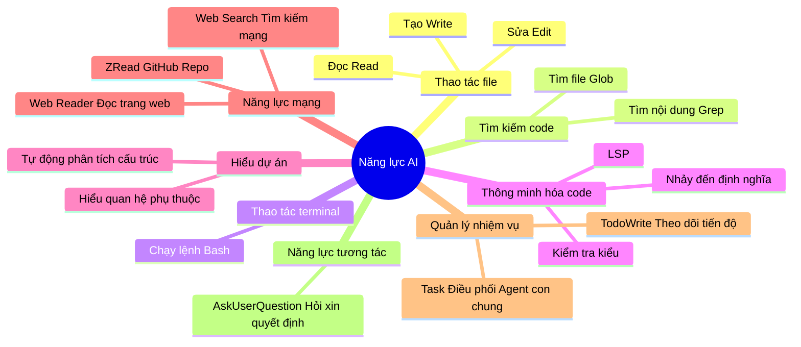
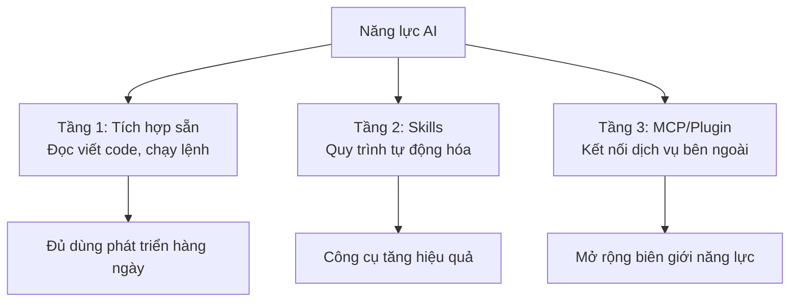

# 2.3 MCP, Plugin và Skills 🟡

> **Đọc xong phần này, bạn sẽ thu hoạch được:**
>
> - Hiểu sự khác biệt và ngữ cảnh sử dụng của ba phương thức mở rộng MCP, Plugin, Skills, học cách lựa chọn theo nhu cầu
> - Nắm vững phương pháp cài đặt từ kho Plugin, tìm hiểu các Plugin thường dùng (typescript-lsp, frontend-design, feature-dev...)
> - Học cấu hình và xác thực danh tính MCP Server, có thể kết nối các dịch vụ bên ngoài như CSDL, API, GitHub...
> - Hiểu nguyên lý hoạt động và điểm cốt yếu khi sáng tạo Skills, có thể tạo gói kỹ năng tái sử dụng
> - Thiết lập ý thức bảo mật, học cách cấu hình giới hạn quyền hạn hợp lý cho MCP và Plugin

> Lời nói đầu đã nhắc đến "Skills định nghĩa chỉ thị chuyên sâu" và "MCP để AI kết nối công cụ bên ngoài". Đa số trường hợp, bạn chỉ cần **cài đặt và sử dụng MCP Server có sẵn**, không cần tự phát triển.

::: tip Đề xuất lộ trình cho người mới

**Nếu bạn là người mới**, đề xuất học theo thứ tự sau:

1. Đầu tiên tìm hiểu năng lực tích hợp sẵn (phần tiếp theo của chương này) → Đủ dùng cho đa số ngữ cảnh
2. Khi cần dịch vụ bên ngoài, ưu tiên cài đặt Plugin (Đơn giản hơn cấu hình MCP)
3. Sau khi quen thuộc mới cấu hình MCP theo nhu cầu
4. Cuối cùng cân nhắc tạo Skills của riêng mình (Nội dung nâng cao)

**Nguyên tắc cốt lõi**: Dùng được cái có sẵn thì không cài mở rộng, dùng được Plugin thì không cấu hình thủ công.

:::

**Điều hướng tài nguyên**:

- Chợ Plugin: [claude-plugins.dev](https://claude-plugins.dev/) - Duyệt và tìm kiếm Plugin
- Chợ Skills: [skillsmp.com](https://skillsmp.com/zh) - Danh mục tìm kiếm 2300+ Skills
- Agent Skills: [agentskills.io](https://agentskills.io/home) - Tiêu chuẩn và chợ Agent Skills
- Kho Plugin chính thức: [GitHub - anthropics/claude-code/plugins](https://github.com/anthropics/claude-code/tree/main/plugins)
- Kho Skills chính thức: [GitHub - anthropics/skills](https://github.com/anthropics/skills)

## Kiến thức tiền đề

::: tip MCP là gì

**MCP** = Kết nối công cụ bên ngoài

MCP (Model Context Protocol) giúp AI có thể kết nối các dịch vụ bên ngoài (CSDL, API, Hệ thống file...). MCP có thể cấu hình độc lập, cũng có thể đóng gói trong Plugin.

:::

::: tip Plugin là gì

**Plugin** = Container mở rộng (Đơn vị phân phối)

Plugin là gói chức năng, có thể chứa Skills, Commands, Agents, Hooks, MCP Servers. Cài đặt một nút qua kho Plugin, đơn giản hơn cấu hình MCP thủ công.

| Nhu cầu                         | Cách làm khuyên dùng                  |
| ------------------------------- | ------------------------------------- |
| Thông minh hóa code (LSP)       | Cài đặt Plugin                        |
| Kết nối dịch vụ bên ngoài       | Cấu hình MCP hoặc cài Plugin chứa MCP |
| Tự động hóa quy trình làm việc  | Tạo hoặc cài đặt Skills               |
| Cài đặt một nút nhiều chức năng | Cài đặt Plugin                        |

**Nguyên tắc cốt lõi**: Dùng được Plugin thì không cấu hình MCP thủ công, dùng được tích hợp sẵn thì không cài mở rộng.

:::

::: tip Skills là gì

**Skills** = Gói kỹ năng tái sử dụng của AI

Skills định nghĩa năng lực cụ thể thông qua file `SKILL.md`, Claude tự động phán đoán có sử dụng hay không dựa trên nội dung yêu cầu.

**Cách gọi**:

- **Skills**: Mô hình gọi —— AI tự động quyết định dựa trên mô tả
- **Lệnh gạch chéo**: Người dùng gọi —— Người dùng nhập lệnh kích hoạt rõ ràng

:::

### Phạm vi năng lực AI bạn phải biết

**AI làm được**:

| AI làm được                             | AI không làm được                                   |
| --------------------------------------- | --------------------------------------------------- |
| Đọc bất kỳ file nào trong dự án của bạn | Truy cập bất kỳ đường dẫn nào trên máy tính của bạn |
| Chạy các lệnh bạn cho phép              | Thực hiện thao tác cần giao diện đồ họa             |
| Hiểu cấu trúc code và logic             | "Nhớ" nội dung hội thoại lần trước                  |
| Kết nối dịch vụ bên ngoài bạn cấu hình  | Vượt qua giới hạn bảo mật hệ thống                  |
| Tự động chọn công cụ phù hợp            | Đoán bạn đang nghĩ gì (nên hãy nói rõ ra)           |

:::tip Nhận thức then chốt
**Bạn chỉ cần bảo AI bạn muốn làm gì, AI sẽ tự động chọn phương pháp phù hợp. Bạn không cần biết AI dùng Read (đọc file), Edit (sửa file), Grep (tìm nội dung), Glob (tìm file) hay Bash (chạy lệnh), thậm chí là Python (chạy script sao chép).**
:::
**Bạn không cần nhớ chi tiết công cụ**

| Không cần nhớ                     | Lý do                                             |
| --------------------------------- | ------------------------------------------------- |
| Tên công cụ (Read, Edit, Grep...) | AI tự chọn                                        |
| Cú pháp cấu hình cụ thể           | Để AI tham khảo tài liệu chính thức sinh giúp bạn |
| Tất cả MCP/Plugin Server khả dụng | Tìm kiếm cài đặt theo nhu cầu                     |

**Bạn chỉ cần dùng ngôn ngữ tự nhiên mô tả rõ ràng việc bạn muốn làm.**

## AI có những năng lực gì

Trước khi cấu hình MCP hoặc Skills, hãy nhớ: **AI đã có rất nhiều năng lực tích hợp sẵn**.

::: details Xem danh sách đầy đủ công cụ tích hợp sẵn



### Bảng công cụ phân loại theo loại hình

**1. Công cụ thao tác file** - Cơ sở để đọc viết code

| Năng lực | Dùng công cụ | Ví dụ                   |
| -------- | ------------ | ----------------------- |
| Đọc file | Read         | "Đọc package.json"      |
| Sửa file | Edit         | "Sửa tên hàm thành xxx" |
| Tạo file | Write        | "Tạo component mới"     |

**2. Công cụ tìm kiếm** - Tìm thứ cần tìm

| Năng lực          | Dùng công cụ | Ví dụ                 |
| ----------------- | ------------ | --------------------- |
| Tìm nội dung code | Grep         | "Tìm tất cả TODO"     |
| Tìm file          | Glob         | "Tìm tất cả file .ts" |

**3. Công cụ terminal** - Thực thi lệnh

| Năng lực  | Dùng công cụ | Ví dụ            |
| --------- | ------------ | ---------------- |
| Chạy lệnh | Bash         | "Chạy pnpm test" |

**4. Thông minh hóa code** - Hỗ trợ thêm qua Plugin

| Năng lực                                          | Dùng Plugin    | Ví dụ                       |
| ------------------------------------------------- | -------------- | --------------------------- |
| TypeScript/JavaScript Check kiểu, nhảy định nghĩa | typescript-lsp | "Hàm này định nghĩa ở đâu?" |
| Python Check kiểu, code completion                | pyright-lsp    | "Kiểu của lớp này là gì?"   |

LSP (Language Server) năng lực **không tích hợp sẵn**, cần cài đặt thêm qua Plugin:

```bash
# Mở giao diện quản lý Plugin
/plugin

# Tìm kiếm typescript-lsp hoặc pyright-lsp và cài đặt
```

Các ngôn ngữ hỗ trợ bao gồm: TypeScript, JavaScript, Python, Rust, Go, C/C++, C#, PHP, Java, Ruby, Swift v.v.

**5. Hiểu dự án** - Tự động phân tích

| Năng lực                           | Dùng công cụ      | Ví dụ                      |
| ---------------------------------- | ----------------- | -------------------------- |
| Phân tích cấu trúc, hiểu phụ thuộc | Tự động phân tích | "Phân tích cấu trúc dự án" |

**6. Năng lực mạng** - Cần cấu hình MCP/Plugin

| Năng lực               | Dùng công cụ   | Cần cấu hình |
| ---------------------- | -------------- | ------------ |
| Đọc nội dung trang web | Web Reader MCP | ✅           |
| Tìm kiếm mạng          | Web Search MCP | ✅           |
| Đọc GitHub Repo        | ZRead MCP      | ✅           |

**AI đọc được**:

- ✅ Link trang web công khai (Qua MCP/Plugin)
- ✅ File GitHub Repo (Qua ZRead MCP)
- ✅ Trang tài liệu (Qua Web Reader MCP)

**AI không đọc được**:

- ❌ Trang cần đăng nhập
- ❌ Đường dẫn file cục bộ (Không phải thư mục dự án)
- ❌ Website bị tường lửa chặn

**7. Quản lý nhiệm vụ** - AI tự dùng, bạn chỉ cần thấy hiệu quả

| Năng lực                                    | Dùng công cụ | Bạn cần biết không                      |
| ------------------------------------------- | ------------ | --------------------------------------- |
| Theo dõi tiến độ nhiệm vụ nhiều bước        | TodoWrite    | ❌ AI tự dùng, bạn thấy tiến độ là được |
| Gọi Agent con chung xử lý nhiệm vụ phức tạp | Task         | ❌ AI tự gọi, bạn không cần biết        |

**8. Năng lực tương tác** - AI tự dùng, bạn chỉ cần trả lời

| Năng lực                  | Dùng công cụ    | Bạn cần biết không                 |
| ------------------------- | --------------- | ---------------------------------- |
| Hỏi bạn để lấy quyết định | AskUserQuestion | ❌ AI tự dùng, bạn chỉ cần trả lời |

### Tiêu chuẩn phán đoán: Tích hợp sẵn đã đủ hay cần mở rộng?

```bash
# ✅ Ngữ cảnh không cần mở rộng (Tích hợp sẵn đã đủ)
"Đọc file và phân tích"      → Dùng công cụ Read
"Chạy lệnh và xử lý kết quả"   → Dùng công cụ Bash
"Hiện thực hóa chức năng nào đó"        → Mô tả trực tiếp nhiệm vụ, AI tự quy hoạch

# ❌ Ngữ cảnh cần mở rộng
"Truy vấn CSDL PostgreSQL"     → Cần MCP/Plugin
"Đọc tài liệu Google Drive"     → Cần MCP/Plugin
"Gọi Slack API gửi tin nhắn"    → Cần MCP/Plugin
```

**Khi nào dùng mở rộng**:

| Nhu cầu                       | Cách dùng                        |
| ----------------------------- | -------------------------------- |
| ✅ Truy vấn CSDL              | MCP/Plugin                       |
| ✅ Tìm kiếm mạng              | MCP/Plugin                       |
| ✅ Đọc API bên ngoài          | MCP/Plugin                       |
| ✅ Lặp lại quy trình phức tạp | Skills                           |
| ❌ Nhiệm vụ một lần           | Dùng ngôn ngữ tự nhiên trực tiếp |

:::

## Plugin: Cách mở rộng đơn giản nhất

::: tip Plugin vs MCP

Plugin là bản mở rộng cài đặt qua chợ Plugin, chức năng tương tự MCP nhưng cài đặt đơn giản hơn:

| Đặc tính             | MCP                      | Plugin                                           |
| -------------------- | ------------------------ | ------------------------------------------------ |
| **Cách cài đặt**     | File cấu hình + Lệnh CLI | Chợ Plugin hoặc lệnh một nút cài đặt             |
| **Cấu hình**         | Sửa JSON thủ công        | Tự động cấu hình                                 |
| **Nguồn**            | Cộng đồng mã nguồn mở    | Chính thức + Bên thứ ba                          |
| **Bao gồm nội dung** | Chỉ MCP Server           | Có thể chứa Commands, Agents, Skills, Hooks, MCP |

**Về chức năng cả hai giống nhau**: Đều giúp AI kết nối dịch vụ bên ngoài. Chọn cách nào tùy thuộc vào sự hỗ trợ công cụ của bạn.

:::

### Cách cài đặt

**Cách 1: Qua giao diện quản lý Plugin (Khuyên dùng)**

```bash
/plugin
# Mở giao diện quản lý, tìm kiếm plugin cần thiết, nhấn Space để chọn, nhấn i để cài
```

**Cách 2: Cài qua lệnh**

```bash
# Ví dụ
/plugin install frontend-design@anthropics
```

**Nếu không tìm thấy Plugin bạn cần, có thể thêm chợ chứa plugin đó**

```bash
# Thêm chợ
/plugin marketplace add your-org/claude-plugins

# Duyệt Plugin khả dụng
/plugin
```

### Đề xuất Plugin thường dùng

::: tip Plugin đề xuất (Newbie nên đọc)

Với người mới, đề xuất bắt đầu từ các Plugin sau:

**Phát triển cơ sở**:

- `typescript-lsp` - TypeScript/JavaScript check kiểu, code completion, nhảy định nghĩa
- `pyright-lsp` - Python check kiểu và thông minh hóa code
- `frontend-design` - Sinh giao diện Frontend chất lượng cao

**Quy trình làm việc**:

- `feature-dev` - Quy trình phát triển chức năng trọn vẹn
- `pr-review-toolkit` - Bộ công cụ review PR
- `commit-commands` - Quy trình Git commit

**Cách cài đặt**:

```bash
# Mở giao diện quản lý Plugin, tìm các tên trên và cài đặt
/plugin
```

:::

::: details Xem danh sách đề xuất Plugin đầy đủ

#### LSP Language Server (Thông minh hóa code)

| Plugin                | Chức năng                                                          |
| --------------------- | ------------------------------------------------------------------ |
| **typescript-lsp**    | TypeScript/JavaScript check kiểu, hoàn thiện code, nhảy định nghĩa |
| **pyright-lsp**       | Python check kiểu và thông minh hóa code                           |
| **rust-analyzer-lsp** | Rust Language Server, phân tích và thông minh hóa                  |
| **gopls-lsp**         | Go Language Server, thông minh hóa code và refactor                |
| **clangd-lsp**        | C/C++ Language Server, thông minh hóa code                         |
| **csharp-lsp**        | C# Language Server, thông minh hóa code                            |
| **php-lsp**           | PHP Language Server (Intelephense), thông minh hóa code            |
| **swift-lsp**         | Swift Language Server (SourceKit-LSP), thông minh hóa code         |
| **jdtls-lsp**         | Java Language Server, thông minh hóa code                          |
| **lua-lsp**           | Lua Language Server, thông minh hóa code                           |

#### Quy trình phát triển

| Plugin                | Chức năng                                                                                                                |
| --------------------- | ------------------------------------------------------------------------------------------------------------------------ |
| **frontend-design**   | Sinh giao diện Frontend chất lượng cao, tránh thẩm mỹ AI chung chung                                                     |
| **feature-dev**       | Quy trình phát triển chức năng trọn vẹn (7 giai đoạn: khám phá, tìm hiểu, làm rõ, thiết kế, hiện thực, review, tổng kết) |
| **pr-review-toolkit** | Bộ công cụ review PR, tập trung chất lượng code, test, xử lý lỗi                                                         |
| **commit-commands**   | Đơn giản hóa quy trình Git, commit, push, tạo PR một nút                                                                 |
| **ralph-wiggum**      | Kỹ thuật vòng lặp phát triển AI kiểu iteractive                                                                          |

#### Chất lượng code và Bảo mật

| Plugin                | Chức năng                                                                                       |
| --------------------- | ----------------------------------------------------------------------------------------------- |
| **code-review**       | Tự động review code, đa agent chuyên môn phân tích song song, lọc báo sai dựa trên điểm tin cậy |
| **security-guidance** | Hook nhắc nhở bảo mật, cảnh báo command injection, XSS, mẫu code không an toàn                  |
| **hookify**           | Tự động tạo Hooks, ngăn chặn hành vi xấu qua phân tích mẫu đối thoại hoặc chỉ thị rõ ràng       |

#### Bộ công cụ phát triển

| Plugin            | Chức năng                                                                                   |
| ----------------- | ------------------------------------------------------------------------------------------- |
| **agent-sdk-dev** | Bộ công cụ phát triển Agent SDK, tạo và xác minh ứng dụng Python/TypeScript Agent SDK       |
| **plugin-dev**    | Bộ công cụ phát triển Plugin, tích hợp Hooks, MCP, cấu trúc Plugin, hướng dẫn phát hành chợ |

#### Phong cách đầu ra

| Plugin                       | Chức năng                                                                                 |
| ---------------------------- | ----------------------------------------------------------------------------------------- |
| **explanatory-output-style** | Phong cách đầu ra giải thích, giải thích chi tiết quá trình suy nghĩ và quyết định của AI |
| **learning-output-style**    | Đầu ra hướng học tập, kết hợp học tương tác và kiến giải giáo dục                         |

#### Ví dụ và Template

| Plugin             | Chức năng                        |
| ------------------ | -------------------------------- |
| **example-plugin** | Template ví dụ phát triển Plugin |

**Cách cài đặt**: Nhập `/plugin` sau đó tìm kiếm và cài đặt plugin cần thiết.

:::

### Sử dụng Plugin

Sau khi cài đặt, Plugin tự động tích hợp vào năng lực của AI, không cần cấu hình thêm:

```bash
# Thiết kế Frontend (Sau khi cài frontend-design)
"Tạo một trang đăng nhập người dùng, yêu cầu phong cách thiết kế hiện đại"

# Phát triển chức năng (Sau khi cài feature-dev)
"Sử dụng quy trình feature-dev phát triển chức năng bình luận người dùng"

# Review code (Sau khi cài pr-review-toolkit)
"Dùng công cụ PR review kiểm tra đoạn code này"
```

### Cấu trúc Plugin

::: details Cấu trúc thư mục Plugin

Plugin là một gói npm chứa các thành phần sau:

```
my-plugin/
├── .claude-plugin/
│   ├── plugin.json          # Meta data của Plugin
│   └── marketplace.json     # Danh sách chợ (tùy chọn)
├── commands/                 # Lệnh gạch chéo tùy chỉnh (tùy chọn)
│   └── hello.md
├── agents/                   # Agent tùy chỉnh (tùy chọn)
│   └── helper.md
├── skills/                   # Kỹ năng Agent (tùy chọn)
│   └── my-skill/
│       └── SKILL.md
├── hooks/                    # Trình xử lý sự kiện (tùy chọn)
│   └── hooks.json
└── .mcp.json                # Cấu hình MCP Server (tùy chọn)
```

**Giải thích thành phần**:

- **plugin.json**: Meta data Plugin (tên, mô tả, phiên bản, tác giả)
- **commands/**: Lệnh gạch chéo tùy chỉnh (File Markdown)
- **agents/**: Định nghĩa Agent con
- **skills/**: Kỹ năng Agent (File SKILL.md)
- **hooks/**: Trình xử lý sự kiện (hooks.json)
- **.mcp.json**: Cấu hình MCP Server

:::

### Quản lý Plugin

::: details Lệnh quản lý

```bash
# Xem các plugin đã cài
/plugin

# Bật plugin đã tắt
/plugin enable plugin-name@marketplace-name

# Tắt mà không gỡ cài đặt
/plugin disable plugin-name@marketplace-name

# Gỡ cài đặt plugin
/plugin uninstall plugin-name@marketplace-name
```

:::

::: details Cộng tác nhóm

Cấu hình Plugin cấp kho chứa (repo) để đảm bảo công cụ của cả team nhất quán.

**Thiết lập Plugin nhóm**:

1. Thêm cấu hình chợ và plugin vào `.claude/settings.json` của kho chứa
2. Thành viên team tin tưởng thư mục kho chứa
3. Tự động cài đặt plugin cho tất cả thành viên team

**Ví dụ cấu hình** (`.claude/settings.json`):

```json
{
  "pluginMarketplaces": [
    {
      "source": "your-org/claude-plugins"
    }
  ],
  "plugins": [
    {
      "name": "formatter",
      "marketplace": "your-org"
    }
  ]
}
```

:::

## MCP: Kết nối dịch vụ bên ngoài

::: warning Đọc kỹ trước khi cài

**Về độ tương thích**: MCP giữa các công cụ CLI khác nhau **không thông dụng**, cách cài đặt có thể khác nhau.

**Về cách cài đặt**:

- **Trong IDE**: Thường có chợ MCP, cài trực tiếp được
- **Công cụ CLI**: Cấu hình thủ công qua file config
- **Công cụ cấu hình một nút**: Như công cụ cấu hình GLM4.7, sẽ tự động cài sẵn một số MCP

**Về xác thực**: Một số MCP cần API Key mới dùng được (như OpenAI, Stripe, GitHub), cần cung cấp khi cấu hình.

:::

::: tip Công cụ cấu hình một nút GLM4.7 mặc định bao gồm MCP

Khi dùng công cụ cấu hình một nút GLM4.7, các MCP sau sẽ tự động được cài đặt:

| MCP                | Chức năng                                        |
| ------------------ | ------------------------------------------------ |
| **Vision MCP**     | Phân tích hình ảnh (screenshot, bản thiết kế...) |
| **Web Search MCP** | Tìm kiếm mạng, lấy thông tin mới nhất            |
| **Web Reader MCP** | Đọc nội dung link web                            |
| **ZRead MCP**      | Đọc file và thư mục GitHub Repo                  |

Đây là các năng lực mạng thường dùng nhất trong phát triển, mở hộp là dùng được ngay.

:::

### Các MCP Server phổ biến

| Phân loại               | MCP                                                                                         | Chức năng                                                                     |
| ----------------------- | ------------------------------------------------------------------------------------------- | ----------------------------------------------------------------------------- |
| **Phát triển Debug**    | [GitHub MCP](https://github.com/github/github-mcp-server)                                   | Thao tác kho code, PR, Issue và quy trình CI                                  |
|                         | [Chrome DevTools MCP](https://github.com/ChromeDevTools/chrome-devtools-mcp)                | Điều khiển trình duyệt debug trang web, phân tích mạng và kiểm tra tự động    |
|                         | [ShadCN MCP](https://www.shadcn.com.cn/docs/mcp)                                            | Sinh component React + Tailwind UI dùng được ngay                             |
|                         | [Semgrep MCP](https://semgrep.dev/docs/mcp)                                                 | Quét bảo mật tĩnh code và check rule                                          |
| **Cơ sở dữ liệu**       | [PostgreSQL MCP](https://github.com/crystaldba/postgres-mcp)                                | Cấu hình truy cập đọc ghi và phân tích hiệu năng                              |
|                         | [Neon MCP](https://neon.com/docs/ai/neon-mcp-server)                                        | Tạo và quản lý CSDL PostgreSQL Serverless theo nhu cầu                        |
|                         | [Supabase MCP](https://supabase.com/docs/guides/getting-started/mcp)                        | Backend tất cả trong một: Xác thực, CSDL, Lưu trữ, Realtime                   |
| **Deploy Hosting**      | [Vercel MCP](https://vercel.com/docs/mcp)                                                   | Tự động deploy ứng dụng Frontend và tạo môi trường preview                    |
|                         | [Cloudflare MCP](https://github.com/cloudflare/mcp-server-cloudflare)                       | Quản lý tài nguyên tính toán biên (Workers, KV, R2)                           |
| **Thiết kế & Media**    | [Figma MCP](https://developers.figma.com/docs/figma-mcp-server/remote-server-installation/) | Đọc và sửa bản thiết kế Figma, hiện thực hóa tự động từ thiết kế đến code     |
|                         | [Replicate MCP](https://mcp.replicate.com/)                                                 | Gọi interface sinh ảnh, tạo ảnh minh họa                                      |
| **Tài liệu & Ngữ cảnh** | [Context7 MCP](https://context7.com/docs/overview)                                          | Chuyển đổi tài liệu chính thức mới nhất thời gian thực thành ngữ cảnh tin cậy |
|                         | [Ref MCP](https://ref.tools/mcp)                                                            | Tương tự Context7, giảm ảo giác AI                                            |
| **Thanh toán**          | [Stripe MCP](https://docs.stripe.com/mcp)                                                   | Tự động hóa tạo thanh toán, đăng ký và Webhook                                |

**Lưu ý**: Một số MCP cần API Key. Vui lòng truy cập [MCP Collection](https://github.com/modelcontextprotocol/servers) để xem thêm MCP Server.

:::
Do MCP Server cập nhật thường xuyên, đề xuất click link trên hoặc tìm kiếm trang chủ để tra cứu cách dùng mới nhất.
:::

### Sử dụng MCP

```bash
# Truy vấn CSDL
"Truy vấn PostgreSQL: Lấy số lượng người dùng đăng ký 7 ngày gần đây"

# Đọc GitHub
"Xem trạng thái kho: 5 PR gần nhất"

# Tìm kiếm mạng
"Tìm kiếm: Tính năng mới của Next.js 16"

# Đọc file
"Đọc /path/to/file.md và tóm tắt nội dung"
```

### Các cách cài đặt khác

::: details Thêm từ cấu hình JSON

Nếu bạn có cấu hình JSON của MCP Server, có thể thêm trực tiếp:

```bash
# Cú pháp cơ bản
claude mcp add-json <name> '<json>'

# Ví dụ: Thêm HTTP Server kèm cấu hình JSON
claude mcp add-json weather-api '{"type":"http","url":"https://api.weather.com/mcp","headers":{"Authorization":"Bearer token"}}'

# Ví dụ: Thêm stdio Server kèm cấu hình JSON
claude mcp add-json local-weather '{"type":"stdio","command":"/path/to/weather-cli","args":["--api-key","abc123"],"env":{"CACHE_DIR":"/tmp"}}'
```

:::

::: details Xem Cài đặt và Cấu hình

### Ba cách cài đặt

#### Tùy chọn 1: Thêm HTTP Server từ xa (Khuyên dùng)

HTTP Server là lựa chọn được khuyến nghị để kết nối MCP Server từ xa. Đây là phương thức truyền tải được hỗ trợ rộng rãi nhất trên các dịch vụ đám tán.

```bash
# Cú pháp cơ bản
claude mcp add --transport http <name> <url>

# Ví dụ thực tế: Kết nối Notion
claude mcp add --transport http notion https://mcp.notion.com/mcp

# Ví dụ kèm Bearer Token
claude mcp add --transport http secure-api https://api.example.com/mcp \
  --header "Authorization: Bearer your-token"
```

#### Tùy chọn 2: Thêm stdio Server cục bộ

Stdio Server chạy dưới dạng tiến trình cục bộ trên máy của bạn. Chúng rất phù hợp cho các công cụ cần truy cập hệ thống trực tiếp hoặc script tùy chỉnh.

```bash
# Cú pháp cơ bản
claude mcp add --transport stdio <name> <command> [args...]

# Ví dụ thực tế: Thêm Airtable Server
claude mcp add --transport stdio airtable --env AIRTABLE_API_KEY=YOUR_KEY \
  -- npx -y airtable-mcp-server
```

##### tip Hiểu tham số "--"

`--` (hai gạch nối) tách biệt các cờ của công cụ CLI và lệnh cùng tham số truyền cho MCP Server. Tất cả nội dung trước `--` là tùy chọn của công cụ (như `--env`, `--scope`), tất cả nội dung sau `--` là lệnh thực tế để chạy MCP Server.

Ví dụ:

- `claude mcp add --transport stdio myserver -- npx server` → Chạy `npx server`
- `claude mcp add --transport stdio myserver --env KEY=value -- python server.py --port 8080` → Chạy `python server.py --port 8080`, môi trường thiết lập `KEY=value`

Điều này giúp ngăn chặn xung đột giữa cờ của công cụ và cờ của server.

##### Người dùng Windows

Trên Windows bản địa (không phải WSL), MCP Server cục bộ dùng `npx` cần `cmd /c` wrapper để đảm bảo thực thi đúng.

```bash
# Điều này tạo command="cmd" mà Windows có thể thực thi
claude mcp add --transport stdio my-server -- cmd /c npx -y @some/package
```

Nếu không có `cmd /c` wrapper, bạn sẽ gặp lỗi "kết nối đã đóng", vì Windows không thể thực thi `npx` trực tiếp.

:::

### Quản lý MCP Server

Nhập trực tiếp `/mcp` sau đó làm theo hướng dẫn.

:::

### Xác thực MCP

::: details Cấu hình xác thực OAuth

Nhiều MCP Server dựa trên đám mây yêu cầu xác thực. Claude Code hỗ trợ OAuth 2.0 để kết nối an toàn.

```bash
# 1. Thêm Server cần xác thực
claude mcp add --transport http sentry https://mcp.sentry.dev/mcp

# 2. Sử dụng lệnh /mcp trong Claude Code
> /mcp

# 3. Làm theo các bước trong trình duyệt để đăng nhập
```

:::

- Token xác thực được lưu trữ an toàn và tự động làm mới
- Sử dụng "Clear Authentication" trong menu `/mcp` để thu hồi quyền truy cập
- Nếu trình duyệt không tự mở, hãy copy URL được cung cấp
- Xác thực OAuth áp dụng cho HTTP Server
  :::

### Mẹo MCP

::: details @ MCP

Bạn có thể dùng @ nhắc đến để tham chiếu tài nguyên MCP, tương tự cách tham chiếu file.

**Định dạng tham chiếu**: `@server:protocol://resource/path`

```bash
# Tham chiếu tài nguyên cụ thể
> "Bạn có thể phân tích @github:issue://123 và đề xuất sửa không?"
> "Vui lòng xem tài liệu API tại @docs:file://api/authentication"

# Tham chiếu nhiều tài nguyên
> "So sánh @postgres:schema://users và @docs:file://database/user-model"
```

- Khi tham chiếu sẽ tự động lấy tài nguyên và đính kèm
- Đường dẫn tài nguyên trong @ nhắc đến hỗ trợ tìm kiếm mờ khi tự động hoàn thành
- Khi Server hỗ trợ, Claude Code sẽ tự động cung cấp công cụ để lệt kê và đọc tài nguyên MCP

:::

::: details Dùng Prompt MCP làm lệnh gạch chéo

MCP Server có thể lộ ra các prompt, các prompt này khả dụng trong Claude Code dưới dạng lệnh gạch chéo.

**Định dạng lệnh**: `/mcp__servername__promptname`

```bash
# Thực thi prompt không tham số
> /mcp__github__list_prs

# Thực thi prompt có tham số
> /mcp__github__pr_review 456
> /mcp__jira__create_issue "Lỗi trong luồng đăng nhập" high
```

:::

- Prompt MCP được phát hiện động từ server đã kết nối
- Tham số được parse theo định nghĩa tham số của prompt
- Kết quả prompt được tiêm trực tiếp vào đối thoại
- Tên Server và tên Prompt được chuẩn hóa (dấu cách thành gạch dưới)
  :::

## Skills: Quy trình làm việc tùy chỉnh

::: tip Skills là gì

**Skills** = Gói kỹ năng tái sử dụng của AI

Skills định nghĩa năng lực cụ thể thông qua file `SKILL.md`, Claude tự động phán đoán có sử dụng hay không dựa trên nội dung yêu cầu.

**Cách gọi**:

- **Skills**: Mô hình gọi —— AI tự động quyết định dựa trên mô tả
- **Lệnh gạch chéo**: Người dùng gọi —— Người dùng nhập lệnh kích hoạt rõ ràng

**Tài nguyên Skills**:

- [skillsmp.com](https://skillsmp.com/zh) - Danh mục tìm kiếm 2300+ Skills (Tiếng Trung)
- [agentskills.io](https://agentskills.io/home) - Tiêu chuẩn và chợ Agent Skills
- [github.com/anthropics/skills](https://github.com/anthropics/skills) - Kho Skills chính thức

**Cho người mới**:

1. Ưu tiên dùng Skills có sẵn trong Plugin hoặc tải về (Mở hộp dùng ngay)
2. Khi cần mới tạo Skills riêng (Nâng cao)
3. Nhớ kỹ: Skills do AI tự động gọi, không cần kích hoạt thủ công

**Khi nào cần Skills**:

- Có quy trình lặp đi lặp lại cần tự động hóa
- Cần chỉ thị đặc biệt để chuẩn hóa hành vi AI
- Team cần chia sẻ quy trình chuẩn

:::

### Cách lấy Skills

**Lấy từ Plugin** (Khuyên dùng cho người mới)

Nhiều Plugin chứa Skills, cài Plugin xong Skills tự động khả dụng:

```bash
# Cài đặt Plugin xong, Skills trong Plugin sẽ tự động tải
/plugin install feature-dev@anthropics
```

**Tự tạo** (Nâng cao)

Có hai cách:

| Cách                     | Ngữ cảnh áp dụng                  |
| ------------------------ | --------------------------------- |
| Định nghĩa qua đối thoại | Nhu cầu một lần, test nhanh       |
| Tạo file SKILL.md        | Sử dụng lâu dài, chia sẻ đa dự án |

### Tạo Skills

::: tip Cấu trúc file SKILL.md

```yaml
---
name: your-skill-name
description: Brief description of what this Skill does and when to use it
---

# Your Skill Name

## Instructions
Provide clear, step-by-step guidance for the AI.

## Examples
Show concrete examples of using this Skill.
```

**Yêu cầu trường**:

- `name`: Phải dùng chữ thường, số và gạch nối (tối đa 64 ký tự)
- `description`: Mô tả ngắn gọn Skill làm gì và khi nào dùng (tối đa 1024 ký tự)

**Điểm cốt yếu khi sáng tạo**:

| Điểm cốt yếu | Giải thích                                                                 |
| ------------ | -------------------------------------------------------------------------- |
| **Ngắn gọn** | Giả định AI đã thông minh, chỉ thêm ngữ cảnh nó chưa có                    |
| **Đặt tên**  | Dùng dạng động danh từ: `testing-code`, `processing-files`                 |
| **Mô tả**    | Ngôi thứ ba, nói rõ chức năng và thời điểm dùng: "Sử dụng khi..."          |
| **Cụ thể**   | Trong mô tả bao gồm chức năng Skill, thời điểm dùng và thuật ngữ then chốt |
| **Độ tự do** | Cao (Mô tả văn bản) → Trung bình (Giả mã) → Thấp (Script chính xác)        |

**Sử dụng allowed-tools giới hạn truy cập công cụ**:

```yaml
---
name: safe-file-reader
description: Read files without making changes. Use when you need read-only file access.
allowed-tools: Read, Grep, Glob
---

# Safe File Reader

This Skill provides read-only file access.

## Instructions
1. Use Read to view file contents
2. Use Grep to search within files
3. Use Glob to find files by pattern
```

:::
**Vị trí lưu Skills**:

```bash
# Skills cá nhân (Dùng cho mọi dự án)
~/.claude/skills/

# Skills dự án (Chỉ dự án hiện tại)
.claude/skills/

# Skills Plugin (Tự động khả dụng khi cài Plugin)
# Thư mục skills/ bên trong gói plugin
```

**Ngữ cảnh sử dụng**:

| Vị trí             | Ngữ cảnh sử dụng                                                                              |
| ------------------ | --------------------------------------------------------------------------------------------- |
| **Skills cá nhân** | Quy trình làm việc và sở thích cá nhân, Skills thử nghiệm, công cụ năng suất cá nhân          |
| **Skills dự án**   | Quy trình và quy ước của team, kiến thức chuyên môn đặc thù dự án, tiện ích và script chia sẻ |
| **Skills Plugin**  | Tự động khả dụng khi cài Plugin, thư mục skills/ trong gói plugin                             |

### Chia sẻ Skills với team ⭐

::: tip Phương pháp đề xuất

**Chia sẻ qua kho dự án** (Đơn giản nhất):

```bash
# Bước 1: Thêm Skill vào dự án
mkdir -p .claude/skills/team-skill
# Tạo file SKILL.md

# Bước 2: Commit lên git
git add .claude/skills/
git commit -m "Add team Skill for code review"
git push

# Bước 3: Thành viên team tự động nhận Skills
git pull
# Skills khả dụng ngay lập tức!
```

**Phân phối qua Plugin** (Phù hợp team lớn):

1. Tạo Plugin chứa Skills trong thư mục `skills/`
2. Thêm Plugin vào chợ của team
3. Thành viên team cài Plugin xong tự động nhận tất cả Skills

:::

**Thực hành tốt nhất**:

| Thực hành tốt nhất       | Giải thích                            |
| ------------------------ | ------------------------------------- |
| **Giữ Skills tập trung** | Một Skill giải quyết một chức năng    |
| **Viết mô tả rõ ràng**   | Giúp AI phát hiện khi nào cần dùng    |
| **Team cùng test**       | Để đồng đội dùng và phản hồi          |
| **Ghi lại phiên bản**    | Thêm lịch sử phiên bản trong SKILL.md |

### Tạo qua đối thoại (Phương án tạm thời)

```bash
# Định nghĩa trong đối thoại
"Tạo một quy trình test: chạy test, tạo coverage, phân tích nguyên nhân thất bại"

# AI sẽ nhớ quy trình này, có hiệu lực trong phiên hiện tại
# Muốn dùng vĩnh viễn, hãy tạo file SKILL.md
```

### Ví dụ Skills thường dùng

| Skill              | Chức năng                | Ngữ cảnh áp dụng             |
| ------------------ | ------------------------ | ---------------------------- |
| **Quy trình test** | Chạy test và phân tích   | Cần test mỗi ngày            |
| **Review code**    | Kiểm tra kiểu và bảo mật | Review trước khi commit      |
| **Sinh tài liệu**  | Sinh tài liệu cho API    | Sau khi phát triển interface |

### Sử dụng Skills hiện có

**Skills có trong Plugin**:

Sau khi cài Plugin, Skills trong Plugin sẽ tự động tải, không cần cấu hình thêm:

```bash
# Cài đặt Plugin
/plugin install feature-dev@anthropics

# AI sẽ tự động nhận diện và sử dụng Skills có trong Plugin
# Không cần thao tác thủ công
```

**Debug Skills**:

```bash
# Kiểm tra Skills đã tải chưa
"Liệt kê tất cả skills khả dụng"

# Test Skill
"Test skill test-runner"
```

## Lưu ý an toàn

::: warning Cấu hình bảo mật MCP

**Database MCP**:

- Sử dụng tài khoản quyền chỉ đọc
- Không dùng quyền ghi trực tiếp trên môi trường production

**File System MCP**:

- Giới hạn đường dẫn truy cập, chỉ mở các thư mục cần thiết
- Không cho phép truy cập thư mục gốc `/`

**GitHub MCP**:

- Sử dụng token có thời hạn
- Sử dụng phạm vi quyền hạn tối thiểu (chỉ đọc hoặc repo cụ thể)
  :::

::: warning Bảo mật Plugin và Skills

**Bảo mật Plugin**:

- Chỉ cài Plugin từ nguồn tin cậy
- Xem source code Plugin và yêu cầu quyền hạn
- Plugin chính thức đáng tin cậy hơn

**Bảo mật Skills**:

- Sử dụng `allowed-tools` giới hạn truy cập công cụ
- Skills chỉ đọc nên giới hạn dùng công cụ chỉ đọc
- Định kỳ rà soát và cập nhật Skills
  :::

## Câu hỏi thường gặp

### Q1: Skills, MCP và Plugin chọn cái nào?

**A**: Xem nhu cầu.

| Nhu cầu                   | Lựa chọn                                 |
| ------------------------- | ---------------------------------------- |
| Tự động hóa quy trình     | Skills                                   |
| Kết nối dịch vụ bên ngoài | MCP hoặc Plugin                          |
| Lệnh nhanh                | Skills                                   |
| Đọc CSDL                  | MCP hoặc Plugin                          |
| Cài đặt một nút           | Plugin (Đơn giản hơn)                    |
| Gói chức năng trọn vẹn    | Plugin (Chứa lệnh + công cụ + quy trình) |

**Gợi ý ưu tiên**: Plugin > MCP > Skills (Từ đơn giản đến phức tạp)

### Q2: Cấu hình MCP/Plugin xong không tác dụng?

**A**: Kiểm tra các điểm sau:

1. **Khởi động lại công cụ**: Sau khi cấu hình cần thoát hẳn và mở lại
2. **Kiểm tra npx**: Đảm bảo Node.js đã cài, `npx` khả dụng
3. **Xem log**: Claude Desktop → Help → Developer → Toggle Logs
4. **Xác minh kết nối**: Chuỗi kết nối CSDL, GitHub token có đúng không

### Q3: Làm sao tìm thêm MCP/Plugin?

**A**: Truy cập tài nguyên chính thức:

- Kho MCP (https://github.com/modelcontextprotocol/servers)
- Sử dụng lệnh `/plugin` duyệt chợ Plugin

### Q4: MCP/Plugin có lộ dữ liệu của tôi không?

**A**:

**MCP/Plugin Server chính thức**:

- Mã nguồn mở, có thể rà soát
- Thường kết nối trực tiếp đến dịch vụ đích (như GitHub API)
- Không qua server bên thứ ba

**MCP/Plugin Server bên thứ ba**:

- Xem source code xác nhận cách xử lý dữ liệu
- Cẩn trọng cấp quyền
- Sử dụng token chỉ đọc

### Q5: AI không dùng Skill của tôi?

**A**: Kiểm tra các điểm sau:

1. **Mô tả có cụ thể không**: Mô tả mơ hồ khiến khó phát hiện
2. **YAML có hợp lệ không**: Chạy check validate xem có lỗi cú pháp không
3. **Skill có đúng chỗ không**: Kiểm tra đường dẫn file
4. **Skills có xung đột không**: Sử dụng thuật ngữ kích hoạt khác nhau giúp AI chọn đúng Skill

## Triết lý cốt lõi

**Các tầng mở rộng năng lực AI**:



**Ghi nhớ**:

1. **Ưu tiên tích hợp sẵn**: Để AI dùng năng lực có sẵn làm trước
2. **Mở rộng theo nhu cầu**: Thấy không đủ dùng mới tính đến MCP/Skill
3. **An toàn là trên hết**: Giới hạn quyền hạn, dùng tài khoản chỉ đọc
4. **Giữ đơn giản**: Đừng cấu hình quá mức

## Nội dung liên quan

- Trước đó: 2.2 Quy trình làm việc VibeCoding
- Xem chi tiết: 2.4 Cấu hình quy tắc dự án
- Mở rộng: [Kho MCP chính thức](https://github.com/modelcontextprotocol/servers)
- Mở rộng: [Tài liệu Plugin chính thức](hhttps://github.com/anthropics/claude-plugins-official)
- Mở rộng: [Tài liệu Agent Skills chính thức](https://code.claude.com/docs/zh-CN/skills)
