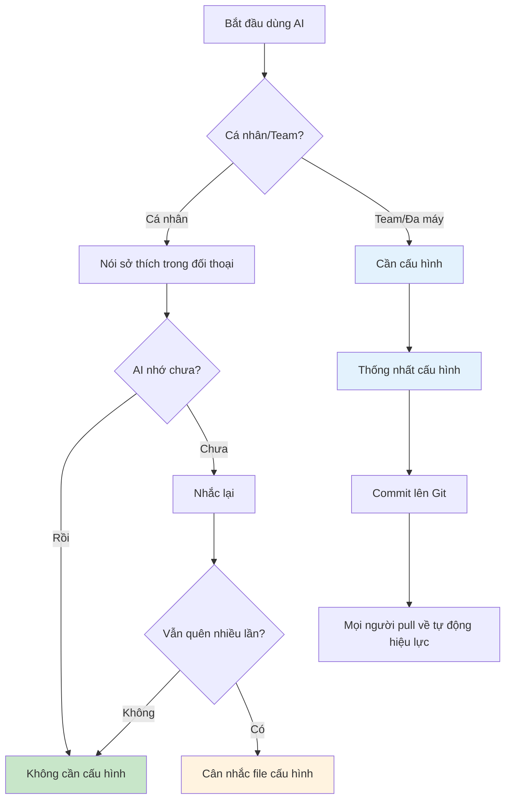
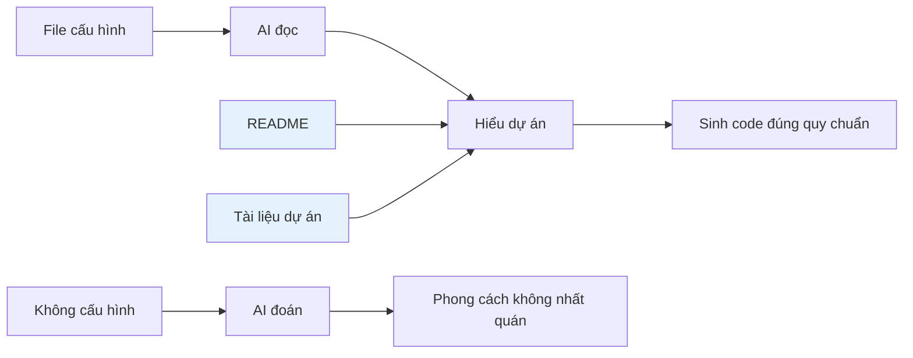
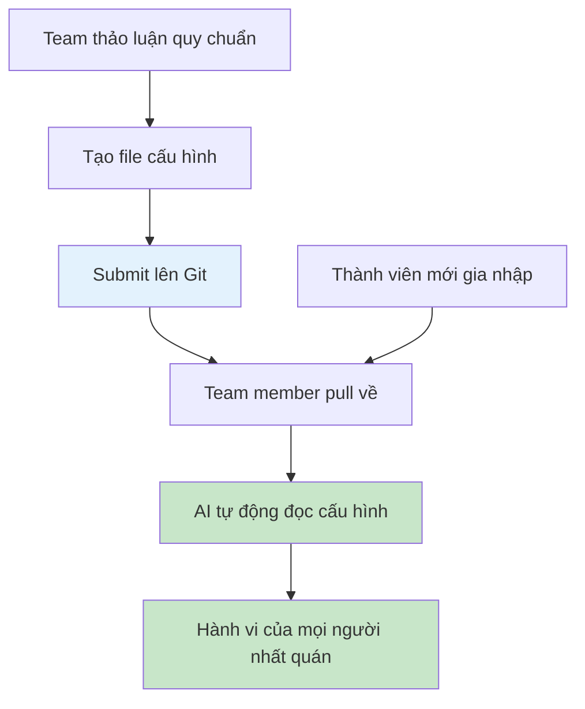
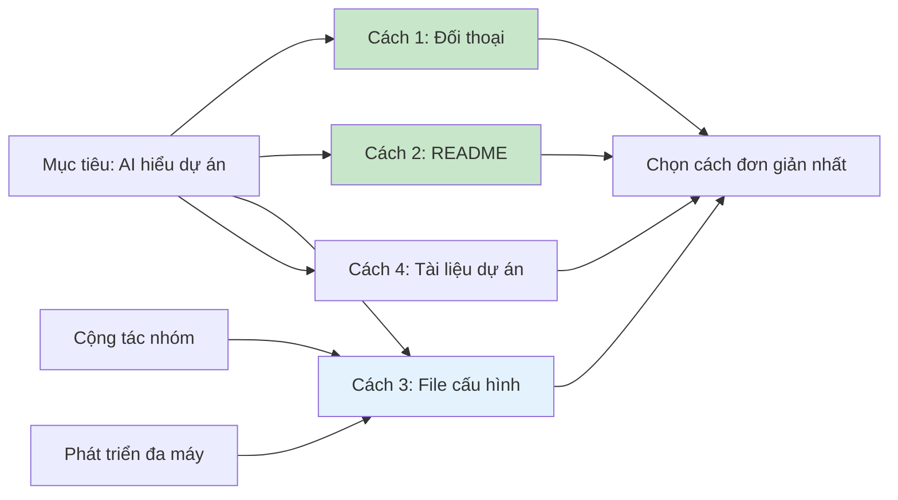

# 2.4 Cấu hình quy tắc dự án 🟡

> **Đọc xong phần này, bạn sẽ thu hoạch được:**
>
> - Hiểu tác dụng và ngữ cảnh sử dụng của file cấu hình dự án
> - Nắm vững phương pháp cấu hình CLAUDE.md và settings.json
> - Học phương án chia sẻ cấu hình cho cộng tác nhóm/phát triển đa máy
> - Hiểu cách xử lý thông tin nhạy cảm trong cấu hình

> **Phần này thường có thể bỏ qua**. Khi phát triển cá nhân, AI có thể hiểu dự án từ đối thoại và tài liệu dự án, không cần cấu hình thêm.
>
> **Cộng tác nhóm/Phát triển đa máy**: Khi cần thống nhất môi trường, quy chuẩn, MCP, Plugin... nội dung phần này rất hữu ích.

::: warning Phát triển cá nhân thường không cần cấu hình

Trước khi hì hục cấu hình file, hãy hiểu rằng:

1. **AI có ký ức**: Những sở thích bạn nói với AI trong đối thoại, nó sẽ nhớ
2. **Tài liệu dự án đã đủ**: README + Tài liệu dự án ở chương 3 thường đủ để AI hiểu dự án
3. **Cấu hình là bổ sung**: Chỉ khi AI liên tục quên quy tắc nào đó, mới cân nhắc viết vào file cấu hình

:::

## Khi nào cần cấu hình



**Ngữ cảnh điển hình cần cấu hình**:

| Ngữ cảnh                               | Cần cấu hình không | Giải pháp                               |
| -------------------------------------- | ------------------ | --------------------------------------- |
| Dự án cá nhân, AI nhớ sở thích của bạn | ❌ Không cần       | Nói trong đối thoại là được             |
| Dự án cá nhân, có README rõ ràng       | ❌ Không cần       | Để AI đọc README trước                  |
| **Cộng tác nhóm/Đa máy**               | ✅ **Cần**         | **Thống nhất cấu hình, commit lên Git** |
| AI liên tục quên quy tắc nào đó        | ✅ Đề xuất         | Viết vào file cấu hình                  |
| Cần thống nhất môi trường MCP/Plugin   | ✅ Cần             | Cấu hình settings.json                  |

::: tip Cộng tác nhóm/Đa máy

Đây là **ngữ cảnh sử dụng quan trọng nhất của phần này**:

- **Đa máy**: Giữ sự nhất quán giữa máy ở nhà và công ty
- **Cộng tác nhóm**: Đảm bảo hành vi AI của mọi thành viên đồng nhất
- **Thống nhất môi trường**: Chia sẻ cấu hình MCP Server, Plugin, Hooks...

:::

## Cách đơn giản hơn: Để AI tự viết

Thay vì hì hục viết cấu hình thủ công, hãy để AI giúp bạn:

**Cách 1: Để AI tham khảo tài liệu chính thức**

```
Hãy dựa trên tài liệu chính thức của Claude Code, tạo file cấu hình hoàn chỉnh cho dự án team tôi.

Dự án của tôi:
- Next.js 16 + TypeScript
- Sử dụng shadcn/ui
- Dùng pnpm package manager
- Team 5 người, cần thống nhất quy chuẩn

Hãy sinh:
1. CLAUDE.md mô tả dự án
2. .claude/settings.json cấu hình quyền hạn
```

**Cách 2: Để AI tham khảo hướng dẫn này**

```
Hãy dựa trên nội dung phần 2.4 của "Cẩm nang điều giáo AI", tạo file cấu hình cho dự án team tôi.

Thông tin dự án:
[Dán mô tả dự án của bạn]

Tình hình team:
- Team Frontend, sử dụng TypeScript + React
- Cần thống nhất phong cách code và MCP Server
```

:::

AI biết cách viết file cấu hình, bạn chỉ cần cung cấp thông tin dự án.

:::

## Bản chất của file cấu hình



**Nguyên tắc cốt lõi**: File cấu hình, README, tài liệu dự án —— về bản chất đều là **cách để AI hiểu dự án**.

| Cách                    | File                      | Tác dụng                 | Sự cần thiết                        |
| ----------------------- | ------------------------- | ------------------------ | ----------------------------------- |
| **Tài liệu dự án**      | README, tài liệu chương 3 | Mô tả dự án hoàn chỉnh   | ✅ Khuyên dùng                      |
| **File cấu hình**       | CLAUDE.md, .cursorrules   | Mô tả quy chuẩn ngắn gọn | ⚠️ Cá nhân không bắt buộc, Team cần |
| **Giao tiếp đối thoại** | Nói trực tiếp với AI      | Thể hiện nhanh sở thích  | ✅ Đơn giản nhất                    |

::: tip Nhận thức then chốt

**File cấu hình dự án** (dù tên là gì) bản chất đều giống nhau:

- Đều là hướng dẫn sử dụng dự án viết cho AI xem
- Nội dung cốt lõi: Tech stack + Quy chuẩn code + Hành vi bị cấm
- Chỉ là công cụ khác nhau dùng tên file khác nhau

| Công cụ     | Tên file       |
| ----------- | -------------- |
| Claude Code | `CLAUDE.md`    |
| Cursor      | `.cursorrules` |
| Qoder/Trae  | `.iderules`    |

:::

## Template CLAUDE.md

Nếu thực sự cần file cấu hình, càng ngắn gọn càng tốt:

```markdown
# Dự án: [Tên dự án]

## Tech Stack

Next.js 16 + TypeScript + Tailwind + shadcn/ui

## Quy chuẩn

- Cấm dùng any, strict mode
- Component đặt tên PascalCase
- Dùng pnpm

## Cấm

- Không cài dependency mới
- Không sửa .env
```

**Cách tạo**:

- Claude Code: Tạo `CLAUDE.md` ở thư mục gốc dự án
- Cursor/Qoder/Trae: Cấu hình file quy tắc trong phần cài đặt IDE

::: details Template đầy đủ

```markdown
# Mô tả dự án

## Tổng quan dự án

[Một câu mô tả dự án làm gì]

## Tech Stack

- **Framework**: Next.js 16 (App Router)
- **Ngôn ngữ**: TypeScript (Strict mode)
- **Database**: Drizzle ORM + PostgreSQL
- **Style**: Tailwind CSS
- **Component**: shadcn/ui

## Quy chuẩn code

- Cấm kiểu `any`
- Component dùng PascalCase, hàm dùng camelCase
- Sử dụng pnpm (đừng dùng npm/yarn)

## Hành vi bị cấm

- ❌ Không cài dependency mới trừ khi được yêu cầu rõ ràng
- ❌ Không sửa file .env
- ❌ Không xóa file test

## Cấu trúc thư mục

app/ # Page và API
components/ # Component
lib/ # Hàm tiện ích
```

:::

## Cấu hình cộng tác nhóm ⭐

::: tip Trọng tâm phần này

Cộng tác nhóm/Phát triển đa máy là ngữ cảnh sử dụng quan trọng nhất của file cấu hình. Bằng cách submit cấu hình lên Git, đảm bảo hành vi AI của mọi thành viên là nhất quán.

:::

### Những cấu hình nào nên commit lên Git

```bash
# ✅ Nên commit
.claude/settings.json      # Cấu hình hệ thống cấp dự án (không chứa thông tin nhạy cảm)
.mcp.json                   # Cấu hình MCP Server (không chứa thông tin nhạy cảm)
CLAUDE.md                  # Mô tả dự án (Claude Code)
.cursorrules               # Quy chuẩn code (Cursor)
.iderules                  # Quy chuẩn code (Qoder/Trae)
.claude/skills/            # Skills của team (xem phần 2.3)

# ❌ Không nên commit
.env                       # Biến môi trường (chứa khóa bí mật)
node_modules/              # Gói phụ thuộc
~/.claude/settings.json    # Cấu hình cấp người dùng (khóa cá nhân)
```

### Xử lý thông tin nhạy cảm

**Phương pháp: Cấu hình phân tầng**

- **Cấu hình cấp dự án** (`.claude/settings.json`): Commit lên Git, không chứa khóa bí mật
- **Cấu hình cấp người dùng** (`~/.claude/settings.json`): Không commit, chứa khóa bí mật cá nhân

::: details Ví dụ cấu hình

**Cấu hình cấp người dùng** (`~/.claude/settings.json`, không commit):

```json
{
  "env": {
    "GITHUB_TOKEN": "ghp_xxx",
    "OPENAI_API_KEY": "sk_xxx"
  }
}
```

**Cấu hình cấp dự án** (`.claude/settings.json`, commit lên Git):

```json
{
  "permissions": {
    "defaultMode": "plan"
  }
}
```

:::

::: tip Nguyên tắc an toàn

- ✅ Cấu hình dự án: Commit lên Git, không chứa khóa
- ✅ Cấu hình người dùng: Không commit, chứa khóa cá nhân
- ❌ Đừng viết bất kỳ khóa bí mật nào vào file cấu hình dự án

:::

## Giải thích chi tiết settings.json

::: details settings.json là gì

settings.json là file cấu hình hệ thống của Claude Code, kiểm soát chế độ quyền hạn, biến môi trường, Hooks, MCP Server...

**Khác biệt với CLAUDE.md**:

- `CLAUDE.md`: Hướng dẫn sử dụng dự án viết cho AI đọc
- `settings.json`: Cấu hình hệ thống kiểm soát hành vi công cụ

**Vị trí file cấu hình**:

| Cấp độ             | Vị trí                        | Phạm vi           | Ưu tiên  |
| ------------------ | ----------------------------- | ----------------- | -------- |
| **Cấp dự án**      | `.claude/settings.json`       | Dự án hiện tại    | Cao      |
| **Cấp người dùng** | `~/.claude/settings.json`     | Tất cả dự án      | Thấp     |
| **Cấp cục bộ**     | `.claude/settings.local.json` | Phát triển cục bộ | Cao nhất |

**Quy tắc ưu tiên**: Cấp cục bộ > Cấp dự án > Cấp người dùng.

:::

::: details Cấu trúc cấu hình

```json
{
  "permissions": {
    "defaultMode": "plan"
  },
  "hooks": {},
  "env": {}
}
```

**Lựa chọn chế độ quyền hạn**:

| Chế độ              | Giải thích                         | Ngữ cảnh áp dụng     |
| ------------------- | ---------------------------------- | -------------------- |
| `plan`              | Chế độ kế hoạch, phân tích chỉ đọc | Review code, học tập |
| `acceptEdits`       | Tự động chấp nhận chỉnh sửa        | Phát triển nhanh     |
| `bypassPermissions` | Bỏ qua kiểm tra quyền              | Tin tưởng tuyệt đối  |

:::

::: details Cấu hình Hooks

Hooks tự động thực thi script tại sự kiện cụ thể, xem chi tiết 2.2 Quy trình làm việc VibeCoding - Tự động hóa Hooks (./02-vibecoding-workflow_vi.md).

**Cấu trúc cơ bản**:

```json
{
  "hooks": {
    "PostToolUse": [
      {
        "matcher": "Write|Edit",
        "hooks": [
          {
            "type": "command",
            "command": "\"$CLAUDE_PROJECT_DIR\"/.claude/hooks/format.sh"
          }
        ]
      }
    ]
  }
}
```

**Sự kiện thường dùng**:

| Sự kiện            | Thời điểm kích hoạt                 | Cần matcher không |
| ------------------ | ----------------------------------- | ----------------- |
| `PreToolUse`       | Trước khi gọi công cụ               | ✅ Cần            |
| `PostToolUse`      | Sau khi gọi công cụ                 | ✅ Cần            |
| `UserPromptSubmit` | Khi người dùng gửi prompt           | ❌ Không cần      |
| `SessionStart`     | Khi bắt đầu phiên                   | ❌ Không cần      |
| `Notification`     | Khi gửi thông báo                   | ❌ Không cần      |
| `Stop`             | Khi Agent chính hoàn thành phản hồi | ❌ Không cần      |

:::

::: details Cấu hình MCP Server

Cấu hình MCP Server giúp AI kết nối dịch vụ bên ngoài.

**Cấu hình cấp dự án** (`.mcp.json`, khuyên dùng):

```json
{
  "mcpServers": {
    "github": {
      "type": "http",
      "url": "https://api.githubcopilot.com/mcp/"
    },
    "postgres": {
      "type": "stdio",
      "command": "npx",
      "args": ["-y", "@modelcontextprotocol/server-postgres"],
      "env": {
        "DATABASE_URL": "${DATABASE_URL}"
      }
    }
  }
}
```

**Cấu hình trong settings.json** (Cách cũ, vẫn hỗ trợ):

```json
{
  "mcpServers": {
    "github": {
      "type": "http",
      "url": "https://api.githubcopilot.com/mcp/"
    }
  }
}
```

**MCP Server thường dùng**:

| MCP              | Chức năng              | Cần cấu hình       |
| ---------------- | ---------------------- | ------------------ |
| **GitHub**       | Thao tác kho code      | GitHub Token       |
| **PostgreSQL**   | Truy vấn CSDL          | Chuỗi kết nối      |
| **Brave Search** | Tìm kiếm mạng          | API Key            |
| **Filesystem**   | Truy cập hệ thống file | Đường dẫn cho phép |

:::

### Template cấu hình Team

::: details Template Frontend Team

```json
// .claude/settings.json
{
  "permissions": {
    "defaultMode": "acceptEdits",
    "disallowedTools": ["Bash(rm -rf:*)", "Bash(write .env:*)"]
  },
  "env": {
    "PACKAGE_MANAGER": "pnpm"
  },
  "hooks": {
    "PostToolUse": [
      {
        "matcher": "Write|Edit",
        "hooks": [
          {
            "type": "command",
            "command": "pnpm format --write \"$CLAUDE_PROJECT_DIR\"/@file_path"
          }
        ]
      }
    ]
  }
}
```

```json
// .mcp.json
{
  "mcpServers": {
    "filesystem": {
      "type": "stdio",
      "command": "npx",
      "args": [
        "-y",
        "@modelcontextprotocol/server-filesystem",
        "$CLAUDE_PROJECT_DIR"
      ]
    }
  }
}
```

:::

::: details Template Backend Team

```json
// .claude/settings.json
{
  "permissions": {
    "defaultMode": "plan",
    "disallowedTools": ["Bash(DROP TABLE:*)", "Bash(DELETE FROM:*)"]
  }
}
```

```json
// .mcp.json
{
  "mcpServers": {
    "postgres": {
      "type": "stdio",
      "command": "npx",
      "args": ["-y", "@modelcontextprotocol/server-postgres"],
      "env": {
        "DATABASE_URL": "${DATABASE_URL}",
        "PG_READONLY": "true"
      }
    }
  }
}
```

:::

## Quy trình công việc cộng tác nhóm



**Thao tác thực tế**:

```bash
# 1. Trưởng nhóm tạo cấu hình
vim CLAUDE.md
vim .claude/settings.json
vim .mcp.json

# 2. Submit lên Git
git add CLAUDE.md .claude/ .mcp.json
git commit -m "docs: Thêm cấu hình team AI"
git push origin main

# 3. Thành viên team pull về
git pull origin main

# 4. AI tự động đọc, không cần thao tác thêm
```

## Triết lý cốt lõi

**Cấu hình là phương tiện, không phải mục đích**



**Ghi nhớ**:

1. **Đối thoại ưu tiên**: Giao tiếp trước, cấu hình sau
2. **Tài liệu làm chủ**: README và tài liệu dự án đầy đủ hơn
3. **Cấu hình bổ trợ**: Chỉ bắt buộc khi cộng tác nhóm
4. **Để AI giúp bạn**: Đưa tài liệu cho AI, để nó tự sinh cấu hình

## Câu hỏi thường gặp

### Q1: CLAUDE.md và .cursorrules có khác nhau không?

**A**: Bản chất giống nhau, chỉ khác tên file.

| Công cụ     | Tên file       |
| ----------- | -------------- |
| Claude Code | `CLAUDE.md`    |
| Cursor      | `.cursorrules` |
| Qoder/Trae  | `.iderules`    |

**Nội dung cốt lõi đều là**: Tech stack + Quy chuẩn code + Hành vi bị cấm

### Q2: Sửa settings.json xong không có tác dụng?

**A**: Kiểm tra các điểm sau:

1. **Định dạng JSON**: Đảm bảo đúng định dạng
2. **Vị trí file**: Xác nhận là cấp dự án hay cấp người dùng
3. **Độ ưu tiên**: Cấp cục bộ sẽ ghi đè cấp dự án

### Q3: Cộng tác nhóm làm sao thống nhất cấu hình?

**A**: Submit lên Git, mọi người pull về tự động có hiệu lực.

```bash
# Submit cấu hình
git add CLAUDE.md .claude/settings.json .mcp.json
git commit -m "docs: Thêm cấu hình team AI"
git push

# Thành viên pull về
git pull
```

### Q4: Xử lý khóa cá nhân thế nào?

**A**: Sử dụng cấu hình phân tầng.

- **Cấp dự án** (`.claude/settings.json`): Submit lên Git, không chứa khóa
- **Cấp người dùng** (`~/.claude/settings.json`): Không submit, chứa khóa cá nhân
- Sử dụng `${VAR_NAME}` tham chiếu biến môi trường

## Nội dung liên quan

- Trước đó: 2.2 Quy trình làm việc VibeCoding chi tiết
- Xem chi tiết: 2.3 MCP, Plugin và Skills
- Xem chi tiết: 10.10 Skills Chia sẻ kiến thức team
- Xem chi tiết: 10.11 Agent Skills Cộng tác team
- Sau đó: Chương 3 PRD Tài liệu lèo lái phát triển
