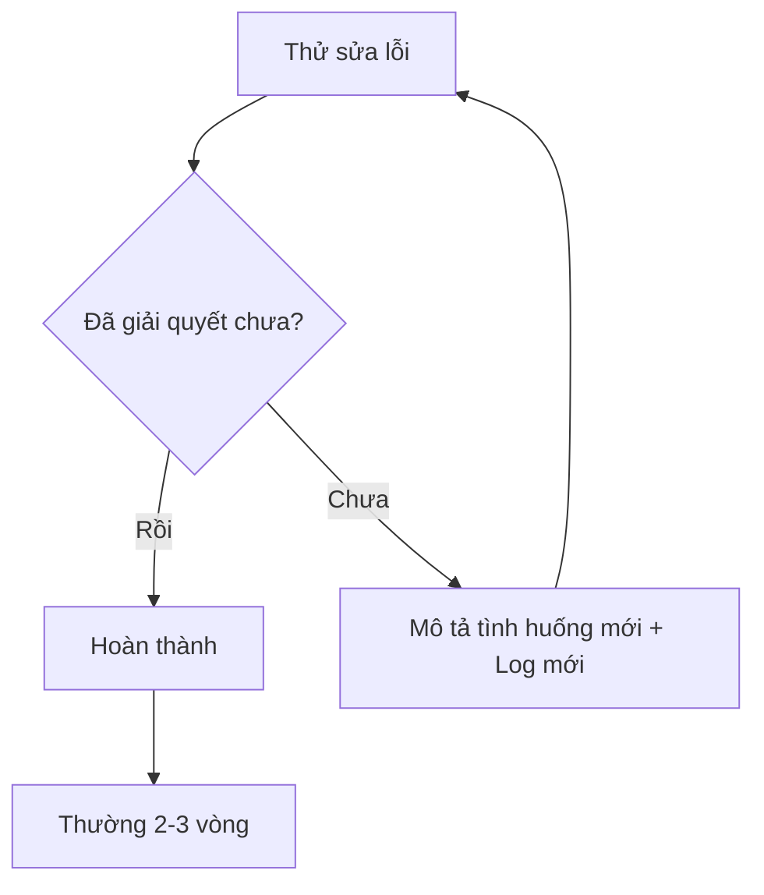
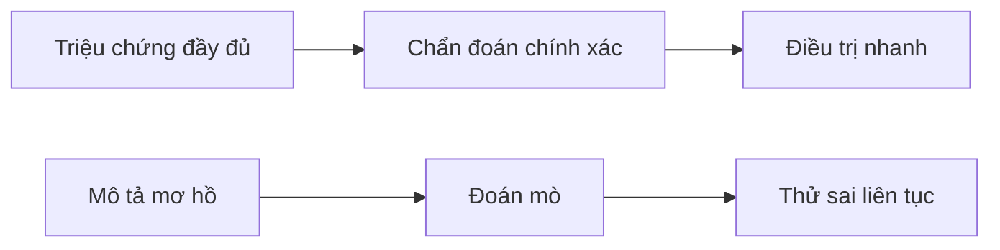

# 2.5 Tâm pháp debug hiệu quả 🟢

> **Đọc xong phần này, bạn sẽ thu hoạch được:**
>
> - Nắm vững công thức giao tiếp debug AI hiệu quả
> - Học cách cung cấp nhật ký lỗi (log) đầy đủ và ngữ cảnh
> - Hiểu mô hình sửa lỗi vòng lặp, lặp lại liên tục cho đến khi vấn đề được giải quyết
> - Biết chiêu cuối "Để AI tự build"

> Lời nói đầu đã nhắc đến "Tâm pháp debug": Cung cấp nhật ký báo lỗi đầy đủ và mô hình sửa lỗi vòng lặp.

## Kiến thức tiền đề

::: tip Debug là gì

Debug (Gỡ lỗi) là quá trình phát hiện và sửa chữa lỗi code.
:::

::: tip Nhật ký lỗi là gì

Nhật ký lỗi (Error Log) là thông tin chi tiết được xuất ra khi chương trình bị crash hoặc gặp ngoại lệ, bao gồm loại lỗi, vị trí, ngăn xếp (stack)...
:::

::: tip Stack là gì

Ngăn xếp (Stack Trace) là chuỗi gọi hàm khi xảy ra lỗi, hiển thị lỗi phát sinh từ dòng nào, hàm nào, được gọi qua các tầng nào. Nó giúp bạn truy vết nguồn gốc lỗi.
:::

---

## Công thức giao tiếp debug: Log đầy đủ + Các bước thao tác + Kết quả kỳ vọng

Khi debug, **nếu bạn không chắc vấn đề ở đâu**, bạn không cần:

- ❌ Phân tích nguyên nhân lỗi
- ❌ Đoán vấn đề có thể xảy ra
- ❌ Thử đủ các phương pháp sửa lỗi

**Bạn chỉ cần**:

- ✅ Cung cấp nhật ký lỗi đầy đủ
- ✅ Nói rõ bạn đã thao tác gì
- ✅ Cho AI biết kết quả bạn kỳ vọng

**AI sẽ tự động**:

- Phân tích loại lỗi và nguyên nhân gốc rễ
- Tìm kiếm vấn đề tương tự và giải pháp
- Thử nhiều phương pháp sửa lỗi
- Xác minh xem sửa lỗi có hiệu quả không

**Mấu chốt**: Cho AI đủ ngữ cảnh, đừng để nó đoán bạn đã làm gì.

**Ví dụ**:

```bash
# ❌ Đừng làm thế này
"Báo lỗi rồi, xem giúp tôi với"
"Code không chạy được"

# ✅ Thế này là đủ
Tôi chạy pnpm dev để khởi động dự án, terminal báo lỗi:

[Nhật ký lỗi đầy đủ]

Kết quả tôi kỳ vọng là: Server phát triển khởi động bình thường, có thể truy cập tại localhost:3000
Giúp tôi phân tích và sửa vấn đề này

# Nếu lần đầu chưa giải quyết được
Đã sửa theo cách của bạn, giờ xuất hiện lỗi mới:

[Nhật ký lỗi mới]

Hãy tiếp tục phân tích
```

**Mô hình sửa lỗi vòng lặp**:



---

## Chiêu cuối: Để AI tự Build

Còn một cách đỡ tốn sức hơn: **Vứt cả dự án cho AI, bảo nó tự chạy một lượt**.

```bash
# Nói trong công cụ AI:
"Hãy giúp tôi chạy pnpm install && pnpm build, nếu gặp lỗi hãy tự sửa, cho đến khi build thành công"
```

**Tại sao hiệu quả**:

- AI nhìn thấy lỗi thực tế trực tiếp, không cần bạn tường thuật lại
- Các vấn đề nhỏ (xung đột phiên bản, thiếu dependency, sai đường dẫn) AI thường tự giải quyết được
- Bạn chỉ cần xem kết quả, đỡ phải giao tiếp qua lại

**Ngữ cảnh áp dụng**:

- Tiếp nhận dự án mới, không biết bắt đầu từ đâu
- Sửa mãi vẫn báo lỗi, càng sửa càng loạn
- CI/CD tạch, mà local không tái hiện được

**Lưu ý**:

- Đảm bảo code đã git commit, AI có sửa hỏng cũng rollback được
- Lần build đầu có thể cần sửa nhiều vòng, kiên nhẫn chờ đợi
- Nếu AI rơi vào vòng lặp chết (sửa đi sửa lại một chỗ), hãy kịp thời ngắt lời

---

## Case thực chiến

### Case 1: Lỗi kiểu dữ liệu (Type error)

**Nhật ký lỗi**:

```
Type error: 'user' is possibly 'undefined'.
  at App (app/page.tsx:15:10)
```

**❌ Mô tả sai**:

```
"Lỗi kiểu rồi, xem giúp tôi"
```

**✅ Mô tả đúng**:

```
TypeScript báo lỗi:

File: app/page.tsx
Dòng: 15
Lỗi: 'user' is possibly 'undefined'

Code:
const user = await getUser();
return <div>{user.name}</div>;  // line 15

Làm sao xử lý tình huống có thể là undefined?
```

**AI phân tích**:

```
user có thể là undefined, cần:
1. Thêm kiểm tra kiểu
2. Cung cấp giá trị mặc định
3. Hoặc sử dụng optional chaining
```

---

### Case 2: Lỗi runtime

**Nhật ký lỗi**:

```
Error: connect ECONNREFUSED 127.0.0.1:5432
    at Connection.<anonymous> (node_modules/pg/lib/client.js:89:17)
    at Socket.emit (events.js:315:13)
```

**❌ Mô tả sai**:

```
"Kết nối cơ sở dữ liệu thất bại"
```

**✅ Mô tả đúng**:

```
Lỗi kết nối cơ sở dữ liệu:

Lỗi: connect ECONNREFUSED 127.0.0.1:5432

Môi trường:
- Môi trường phát triển
- PostgreSQL lẽ ra đang chạy cục bộ
- Trong .env thì DATABASE_URL="postgresql://localhost:5432/mydb"

Nguyên nhân có thể:
1. PostgreSQL chưa bật?
2. Sai port?
3. Cấu hình .env sai?
```

**AI phân tích**:

```
ECONNREFUSED biểu thị dịch vụ chưa chạy.
Kiểm tra:
1. PostgreSQL đã khởi động chưa
2. Port có đúng không (mặc định 5432)
3. Chạy lệnh kiểm tra:
   Mac/Linux: brew services list
   Windows: sc query postgresql-x64-[version]
```

---

### Case 3: Lỗi build

**Nhật ký lỗi**:

```
✘ [ERROR] Could not resolve "./components/Button"

    app/page.tsx:3:24:
      3 │ import { Button } from "./components/Button";
        ╩                         ~~~~~~~~~~~~~~~~~~~~
    This file does not exist.
```

**❌ Mô tả sai**:

```
"Build thất bại rồi"
```

**✅ Mô tả đúng**:

```
Lỗi build:

Could not resolve "./components/Button"

Vị trí file: app/page.tsx:3:24
import { Button } from "./components/Button";

Tình huống thực tế:
- Dự án sử dụng shadcn/ui
- Component Button lẽ ra ở components/ui/button.tsx

Làm sao sửa đường dẫn import?
```

---

## Tra cứu nhanh mẫu lỗi thường gặp

| Loại lỗi         | Thông tin điển hình                      | Hướng giải quyết                                                 |
| ---------------- | ---------------------------------------- | ---------------------------------------------------------------- |
| Lỗi kiểu         | `Type 'X' is not assignable to type 'Y'` | Kiểm tra định nghĩa kiểu, dùng ép kiểu (assertion) hoặc sửa kiểu |
| Lỗi giá trị rỗng | `Cannot read property 'X' of undefined`  | Thêm kiểm tra null, optional chaining, giá trị mặc định          |
| Lỗi import       | `Module not found: Can't resolve 'X'`    | Cài dependency, sửa đường dẫn, kiểm tra export                   |
| Lỗi mạng         | `ECONNREFUSED / ENOTFOUND`               | Kiểm tra trạng thái dịch vụ, URL, kết nối mạng                   |
| Chiếm dụng port  | `Address already in use :3000`           | Tắt tiến trình chiếm port hoặc đổi port                          |
| Lỗi quyền hạn    | `EACCES / Permission denied`             | Kiểm tra quyền file, dùng sudo hoặc đổi quyền                    |
| Lỗi cú pháp      | `Unexpected token / SyntaxError`         | Kiểm tra chính tả cú pháp, chú ý khớp ngoặc và dấu nháy          |

---

## Triết lý cốt lõi

**Debug là quá trình bác sĩ chẩn bệnh**.



**Ghi nhớ**:

1. **Log đầy đủ**: Đừng cắt bớt, thông tin stack rất quan trọng
2. **Các bước thao tác**: Nói rõ bạn làm gì mới kích hoạt lỗi
3. **Kết quả kỳ vọng**: Cho AI biết bạn muốn gì
4. **Sửa lỗi vòng lặp**: Đừng bỏ cuộc, thường 2-3 vòng là xong
5. **Phản hồi kết quả**: Mỗi lần sửa xong hãy báo lại tình hình mới cho AI

**Công thức debug**:

```
Nhật ký lỗi đầy đủ
+ Các bước thao tác (Bạn đã làm gì)
+ Kết quả kỳ vọng (Bạn muốn gì)
= Giải pháp nhanh chóng
```

**Công thức chiêu cuối**:

```
git commit bảo lưu hiện trường
+ Để AI tự chạy build
+ Gặp lỗi để nó tự sửa
+ = Nhàn hạ
```

---

## Nội dung liên quan

- Trước đó: 2.2 VibeCoding Quy trình làm việc chi tiết
