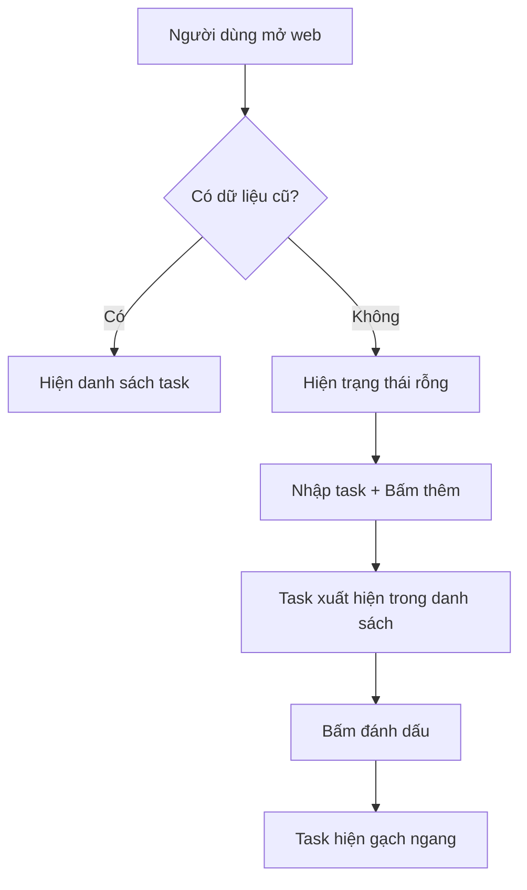

# 3.3 Thực chiến viết PRD 🔴

> **Đọc xong phần này, bạn sẽ thu hoạch được:**
>
> - Hiểu cấu trúc 5 phần của PRD và tác dụng của chúng
> - Nắm vững nguyên tắc lặp lại "một năm chín bản" (bản 1, bản 5, bản 9)
> - Học cách dùng Markdown và Mermaid viết PRD thân thiện với AI
> - Nắm vững phương pháp xử lý trường hợp biên và quản lý phạm vi

> Lời nói đầu đã nhắc đến: PRD là quy chuẩn thực thi của AI, cũng là sự thể hiện năng lực định nghĩa vấn đề.

---

## Giá trị của PRD

Trong phát triển AI, tác dụng của PRD khác với phát triển truyền thống. Truyền thống thì PRD chủ yếu cho team xem; còn trong phát triển AI, PRD quan trọng hơn là để cung cấp ngữ cảnh hoàn chỉnh cho AI, để nó không cần đoán mò ý đồ của bạn.

PRD là "Nguồn sự thật duy nhất" (Single Source of Truth). Khi ý tưởng được mô tả rõ ràng trong PRD, đầu ra của AI sẽ ổn định hơn nhiều, cũng không gặp vấn đề bùng nổ nhu cầu.

Quá trình viết PRD cũng là quá trình rèn luyện năng lực định nghĩa vấn đề. Nhiều người trực tiếp bảo AI "làm cho tôi chức năng này", kết quả sửa đi sửa lại nhiều lần. Nhưng nếu viết rõ mục tiêu, người dùng, bối cảnh nghiệp vụ và logic tương tác trước, AI thường làm đúng ngay lần đầu.

Giá trị của sự rèn luyện này vượt xa một lần phát triển đơn lẻ. Khi bạn buộc phải dùng văn bản mô tả rõ ràng một nhu cầu, bạn sẽ phát hiện nhiều chỗ mơ hồ trước đó. Bạn có thể tưởng mình có tầm nhìn rõ ràng về sản phẩm, nhưng khi thực sự đặt bút, mới nhận ra nhiều chi tiết chưa từng được suy nghĩ nghiêm túc. Viết PRD ép bạn đối diện những khoảng trắng này, hoặc đưa ra quyết định dứt khoát, hoặc thừa nhận cần thêm thông tin. Sự rèn luyện tư duy này sẽ giúp bạn nhạy bén và quyết đoán hơn trong các quyết định sản phẩm sau này.

---

## Cấu trúc 5 phần của PRD

PRD chia làm 5 phần cốt lõi, tương ứng với nguyên tắc lặp lại "một năm chín bản":

| Phần                            | Tương ứng bản thảo | Nội dung cốt lõi                                              |
| ------------------------------- | ------------------ | ------------------------------------------------------------- |
| **Phần 0: Thông tin tài liệu**  | Luôn ghi lại       | Phiên bản, giai đoạn, lịch sử cập nhật                        |
| **Phần 1: Bối cảnh & Mục tiêu** | Bản 1              | Tại sao làm, làm cho ai, giải quyết vấn đề gì                 |
| **Phần 2: Tổng quan giải pháp** | Bản 5              | Quy trình nghiệp vụ, quy trình chức năng, kiến trúc thông tin |
| **Phần 3: Giải pháp chi tiết**  | Bản 9              | Mô tả tương tác, trường hợp biên, nhu cầu phi chức năng       |
| **Phần 4: Kế hoạch lên sóng**   | Bản 9              | Lịch trình, release từng phần (gray release)                  |

**Nguyên tắc "Một Năm Chín bản"**: Bản 1 nghĩ rõ "tại sao", bản 5 nghĩ rõ "là gì", bản 9 nghĩ rõ "làm thế nào". Mỗi bước đều có review và chỉnh sửa, tránh để đến cuối mới phát hiện vấn đề lớn.

Nhịp điệu lặp lại này có cơ sở tâm lý học. Con người khi đối mặt vấn đề phức tạp thường rơi vào "tê liệt phân tích" —— muốn một lần nghĩ thông suốt mọi chi tiết, kết quả không nhích được bước nào. Nguyên tắc "một năm chín bản" thông qua việc ép buộc phân giai đoạn, để bạn ở mỗi giai đoạn chỉ tập trung vào chiều kích cụ thể. Bản 1, bạn không cần lo hiện thực hóa kỹ thuật, chỉ cần xác nhận hướng đi đúng; bản 5, bạn không cần xoắn màu cái nút, chỉ cần xác nhận quy trình hợp lý. Cách tư duy phân tầng này giúp việc xử lý vấn đề phức tạp trở nên quản lý được.

Một lợi ích khác dễ bị bỏ qua là mỗi bản thảo đều là một "điểm kiểm tra có thể quay lui". Nếu bản 5 phát hiện hướng đi có vấn đề, bạn có thể quay về bản 1 xem xét lại; nếu bản 9 phát hiện phương án kỹ thuật không khả thi, bạn có thể quay về bản 5 điều chỉnh quy trình. Sự lặp lại có cấu trúc này giúp lỗi lầm được phát hiện và sửa chữa từ sớm, thay vì tích tụ đến cuối mới bùng nổ.

---

## Phần 0: Thông tin tài liệu

Phần này ghi lại trạng thái phiên bản và lịch sử lặp lại của tài liệu.

### Trạng thái tài liệu

- **Phiên bản hiện tại**: Ví dụ "Bản 5.1" — 5 là lần thảo, 1 là phiên bản vi chỉnh của lần thảo đó
- **Giai đoạn hiện tại**: Review nhu cầu / Đang thiết kế UI / Đang phát triển / Đã lên sóng
- **Các bên liên quan cốt lõi**: Phụ trách sản phẩm, dev, thiết kế, test...

Thông tin phiên bản giúp AI biết đây là "bản nháp" hay "bản chốt". Bản chốt cần chi tiết hơn, bản nháp có thể để TBD (To Be Determined - Chờ xác định).

### Lịch sử cập nhật

Ghi lại quá trình lặp từ 1.1 đến 9.1:

| Số phiên bản | Trạng thái phiên bản | Nội dung cập nhật                                                 |
| ------------ | -------------------- | ----------------------------------------------------------------- |
| 1.1          | Bản review nội bộ    | Sơ bộ trình bày bối cảnh, mục tiêu và giá trị cốt lõi             |
| 5.1          | Bản review dự án     | Bổ sung quy trình nghiệp vụ cốt lõi, lưu đồ chức năng             |
| 9.1          | Bản chốt trước dev   | Hợp nhất thiết kế UI, bổ sung trường hợp biên, phương án tracking |

Lịch sử cập nhật giúp AI biết những gì đã ổn định, những gì có thể còn thay đổi.

---

## Phần 1: Bối cảnh và Mục tiêu nhu cầu

Đây là linh hồn của PRD, tương ứng nội dung cốt lõi của Bản 1.

### Tổng quan dự án

Dùng một hai câu tóm tắt sản phẩm là gì.

| Tổng quan tốt                                      | Tổng quan tồi           |
| -------------------------------------------------- | ----------------------- |
| Một trang web to-do list cực giản dùng cho cá nhân | Một ứng dụng to-do list |

Tổng quan mơ hồ dẫn đến AI làm phiên bản phức tạp. Tổng quan cụ thể giúp thiết lập ranh giới nhanh chóng.

Viết tổng quan là nghệ thuật nén thông tin. Bạn cần trong dung lượng cực ngắn, truyền tải đặc trưng bản chất của sản phẩm. "Một trang web to-do list cực giản dùng cho cá nhân" chứa nhiều thông tin then chốt: "dùng cho cá nhân" nói rõ là công cụ cá nhân chứ không phải cộng tác nhóm; "cực giản" nói rõ tính năng hạn chế, giao diện đơn giản; "trang web" nói rõ hình thái kỹ thuật. Những thông tin này cùng nhau tạo nên một ranh giới rõ ràng, để AI biết cái gì nên làm, cái gì không.

### Vấn đề cốt lõi

Trả lời 3 câu hỏi:

1. **Chân dung người dùng mục tiêu**: Ai dùng? (Đặc điểm cụ thể, không phải "tất cả mọi người")
2. **Ngữ cảnh người dùng**: Dùng khi nào, ở đâu, tình huống nào?
3. **Nỗi đau cốt lõi**: Giải pháp hiện tại có vấn đề gì?

| Sót thông tin      | Hậu quả                                                        |
| ------------------ | -------------------------------------------------------------- |
| Không nói ai dùng  | Có thể làm thành bản phức tạp "ai cũng dùng được"              |
| Không nói ngữ cảnh | Có thể dùng công nghệ không phù hợp (mobile làm thành desktop) |
| Không nói nỗi đau  | Có thể làm tính năng "hoàn hảo" nhưng giải quyết nhu cầu giả   |

### Câu chuyện người dùng (User Story)

Mô tả nhu cầu từ góc nhìn người dùng:

> Là một **[Vai trò]**, tôi muốn **[Hoàn thành nhiệm vụ gì đó]**, để **[Đạt được giá trị gì đó]**

Cách này gần gũi với người dùng hơn là "tôi muốn làm một tính năng". Định dạng User Story bắt buộc tư duy từ góc độ người dùng, thay vì góc độ chức năng.

Giá trị của User Story nằm ở việc nó thiết lập một "khung đồng cảm". Khi bạn viết "Là một giám đốc kinh doanh, tôi muốn tạo báo cáo tuần nhanh chóng, để tiết kiệm thời gian chiều thứ sáu", bạn buộc phải hình dung một con người cụ thể, trong bối cảnh cụ thể, đối mặt với phiền toái cụ thể. Sự hình dung này giúp bạn thoát khỏi góc độ hiện thực hóa kỹ thuật, xuất phát từ hoàn cảnh thực của người dùng để suy nghĩ giải pháp. Nhiều khi, ta tưởng người dùng cần tính năng nào đó, nhưng thực ra họ cần giá trị đằng sau tính năng đó. User Story giúp bạn phát hiện nhu cầu thực sự này.

### Quản lý phạm vi nhu cầu

Làm rõ "làm những gì" và "không làm những gì".

**In-Scope (Trong phạm vi)**: Các điểm chức năng chắc chắn làm

**Out-of-Scope (Ngoài phạm vi)**: Các điểm chức năng chắc chắn **không làm**

Quản lý phạm vi nên hoàn thành ở bước 3.2 Xác nhận nhu cầu với AI. Ở đây chỉ là ghi lại kết quả thảo luận.

| Không viết Out-of-Scope                       | Viết Out-of-Scope      |
| --------------------------------------------- | ---------------------- |
| AI có thể tự động thêm "tính năng thường gặp" | AI biết rõ ranh giới   |
| Phạm vi cứ thế phình to                       | Giữ sản phẩm tập trung |

### Danh sách nhu cầu và độ ưu tiên

Phân rã nhu cầu vĩ mô thành các điểm nhu cầu cụ thể, và đánh dấu độ ưu tiên:

| ID Nhu cầu | Module    | Mô tả                               | Độ ưu tiên | Trạng thái     |
| ---------- | --------- | ----------------------------------- | ---------- | -------------- |
| R001       | Thêm task | Người dùng có thể thêm task chờ làm | Cao        | Đang quy hoạch |
| R002       | Xóa task  | Người dùng có thể xóa task          | Cao        | Đang quy hoạch |
| R003       | Lịch sử   | Xem task lịch sử                    | Thấp       | Cân nhắc V2.0  |

Độ ưu tiên giúp AI biết cái gì là cốt lõi (P0), cái gì có thể lùi lại.

---

## Phần 2: Tổng quan giải pháp

Tương ứng Bản 5, dùng phương thức trực quan hóa hiển thị toàn cảnh sản phẩm.

### Lưu đồ quy trình nghiệp vụ cốt lõi

Dùng Mermaid mô tả quy trình hoàn chỉnh người dùng hoàn thành nhiệm vụ cốt lõi.



| Chỉ có chữ                     | Có lưu đồ                        |
| ------------------------------ | -------------------------------- |
| AI có thể hiểu sai thứ tự bước | AI nhìn cái hiểu ngay quy trình  |
| Có thể gây hiểu lầm            | Trực quan hóa không gây hiểu lầm |

Lưu đồ giúp AI hiểu chính xác logic nghiệp vụ, giảm thiểu hiểu lầm.

Một giá trị khác của lưu đồ là nó phơi bày điểm mù trong tư duy của bạn. Khi cố gắng dùng hình vẽ mô tả một quy trình, những bước "hiển nhiên" sẽ trở nên cụ thể và hữu hình. Bạn có thể phát hiện mình chưa từng nghĩ nghiêm túc "nếu người dùng chưa đăng nhập thì sao", hoặc "khi tải dữ liệu thất bại trang hiển thị thế nào". Lưu đồ bắt buộc bạn cân nhắc từng nhánh rẽ, từng điểm quyết định, sự xem xét có cấu trúc này thường phát hiện được những chi tiết quan trọng bị sót trong mô tả văn bản.

### Kiến trúc thông tin

Liệt kê cấu trúc trang và quan hệ phân cấp của sản phẩm:

- **Trang chủ**
  - Thanh điều hướng
  - Danh sách task
- **Trang cài đặt**
  - Cài đặt giao diện
  - Quản lý dữ liệu

Kiến trúc thông tin giúp AI hiểu sản phẩm có những trang nào, tổ chức ra sao.

---

## Phần 3: Giải pháp chi tiết

Tương ứng Bản 9, là phần chi tiết nhất, là căn cứ trực tiếp để AI viết code.

### Prototype trang và mô tả tương tác

Mô tả quy trình tương tác trọn vẹn của mỗi trang:

1. **Trạng thái khởi tạo**: Trang mới tải xong trông thế nào
2. **Thao tác kích hoạt**: Người dùng làm gì
3. **Trạng thái thành công**: Thành công xong hiển thị gì
4. **Trạng thái thất bại**: Thất bại xong hiển thị gì
5. **Trạng thái rỗng**: Không có dữ liệu hiển thị gì

| Chỉ viết "Người dùng có thể thêm task"     | Viết logic tương tác đầy đủ                                |
| ------------------------------------------ | ---------------------------------------------------------- |
| AI không biết thêm ở đâu, hiển thị thế nào | AI biết vị trí ô nhập, kiểu nút, danh sách cập nhật ra sao |

### Xử lý trường hợp biên

Đây là phần người mới dễ bỏ sót nhất.

Việc bỏ sót trường hợp biên thường không phải do cẩu thả, mà do "thiên kiến đường đi thông thường". Khi tưởng tượng cảnh người dùng dùng sản phẩm, não bộ tự động điền vào quy trình lý tưởng nhất: Người dùng mở app, hoàn thành thao tác, hài lòng rời đi. Nhưng trải nghiệm người dùng thực tế đầy rẫy bất ngờ —— mạng chập chờn, trượt tay bấm nhầm, cuộc gọi bất thình lình. Những tình huống bất thường này không phải "ngoại lệ", mà là một phần bình thường của trải nghiệm người dùng. Một hệ thống chỉ xử lý tình huống bình thường sẽ tỏ ra cực kỳ mong manh trong môi trường thực tế.

| Trường hợp biên                | Không viết thì sao                      |
| ------------------------------ | --------------------------------------- |
| Người dùng bấm nhanh nút 2 lần | Có thể submit trùng lặp                 |
| Khi mạng lỗi                   | Người dùng không biết chuyện gì xảy ra  |
| Khi dữ liệu rỗng               | Có thể hiển thị trắng trơn hoặc báo lỗi |
| Người dùng thoát giữa chừng    | Có thể mất dữ liệu                      |

Xử lý trường hợp biên thường gặp:

- Bấm nhanh nút "Thêm" → Xử lý debounce, trong 0.5s chỉ phản hồi 1 lần
- Request mạng thất bại → Hiện Toast nhắc: "Lỗi mạng, vui lòng thử lại"
- Danh sách task rỗng → Hiện hình minh họa trạng thái rỗng: "Chưa có task nào, thêm cái đi"

### Nhu cầu phi chức năng

| Loại nhu cầu     | Tại sao quan trọng                                                 |
| ---------------- | ------------------------------------------------------------------ |
| Hiệu năng        | Không viết → AI có thể làm rất nặng, load chậm                     |
| Tương thích      | Không viết → Có thể chỉ hỗ trợ Chrome, người dùng Safari khóc thét |
| Tracking dữ liệu | Không viết → Lên sóng xong không biết tình hình sử dụng            |

---

## Phần 4: Kế hoạch lên sóng

Định nghĩa vòng đời của nhu cầu.

### Lịch trình lên sóng

| Giai đoạn        | Ngày                    |
| ---------------- | ----------------------- |
| Review nhu cầu   | YYYY-MM-DD              |
| Thiết kế UI/UX   | YYYY-MM-DD ~ YYYY-MM-DD |
| Giai đoạn Dev    | YYYY-MM-DD ~ YYYY-MM-DD |
| Dự kiến lên sóng | YYYY-MM-DD              |

Lịch trình lên sóng giúp AI biết dòng thời gian dự án, quy hoạch thứ tự phát triển hợp lý.

---

## Markdown và Mermaid

PRD nên viết bằng Markdown, và vẽ lưu đồ bằng Mermaid.

**Lợi thế của Markdown**:

- Định dạng thống nhất, dễ quản lý phiên bản
- AI hiểu Markdown tốt nhất
- Hỗ trợ block code, bảng biểu, danh sách phong phú

**Lợi thế của Mermaid**:

- Văn bản tức biểu đồ, sửa chữa tiện lợi
- AI hiểu chính xác lưu đồ
- Hỗ trợ lưu đồ, biểu đồ tuần tự, biểu đồ trạng thái...

Bảo AI "dùng Mermaid vẽ cái lưu đồ" là được, không cần nhớ cú pháp.

---

## Để AI sinh PRD

Sau khi xác nhận AI hiểu đúng ở bước 3.2, hãy để nó dựa trên template sinh PRD:

> Hãy dựa trên thảo luận của chúng ta, dùng template PRD để sinh tài liệu. Nếu trường nào chúng ta chưa thảo luận, hãy đánh dấu TBD (chờ xác định).

Trách nhiệm sau khi sinh:

1. **Kiểm tra PRD do AI sinh** — Xác nhận mỗi trường đều dựa trên thảo luận, không phải AI đoán
2. **Bổ sung trường TBD** — Với phần "chờ xác định", bổ sung chi tiết hoặc xác nhận "không cần"
3. **Sửa chữa hiểu lầm** — Phát hiện chỗ không khớp với thảo luận, sửa ngay lập tức

---

## PRD Tốt vs PRD Tồi

### PRD Tồi

```markdown
# To-do List

Làm một chức năng to-do list, người dùng có thể thêm task, tick hoàn thành.
```

**Vấn đề**:

- Không nói người dùng là ai → Có thể làm thành bản cho team
- Không nói chức năng cốt lõi → Có thể thêm đống chức năng thừa
- Không nói Out-of-Scope → Có thể thêm đăng nhập, đồng bộ cloud
- Không nói trường hợp biên → Bấm nhanh bị submit trùng
- Không có lưu đồ → AI có thể hiểu sai logic nghiệp vụ

### PRD Tốt

```markdown
# To-do List Cực Giản

## 1.1 Tổng quan dự án

Một trang web to-do list cực giản dùng cho cá nhân, chỉ có chức năng thêm và tick.

## 1.2 Vấn đề cốt lõi

- **Người dùng mục tiêu**: Chính tôi (Dân văn phòng, mỗi ngày xử lý 5-10 task)
- **Ngữ cảnh người dùng**: Sáng mở máy tính, xem nhanh hôm nay làm gì
- **Nỗi đau cốt lõi**: Giấy nhớ dễ mất, Note điện thoại mở ra phiền

## 1.5 Phạm vi nhu cầu

**In-Scope**: Thêm task, xem danh sách, tick hoàn thành, xóa task
**Out-of-Scope**: Đăng ký đăng nhập, đồng bộ cloud, phân loại tag

## 2.1 Quy trình nghiệp vụ cốt lõi

[Lưu đồ Mermaid]

## 3.1 Xử lý trường hợp biên

- Bấm nhanh "Thêm" → Debounce 0.5s
- Danh sách rỗng → Hiện "Chưa có task"
- F5 trang → Dữ liệu không mất (localStorage)
```

---

## Câu hỏi thường gặp

### Q1: PRD cần viết chi tiết đến đâu?

**A**: Bản 1 có thể sơ lược, Bản 5 cần có lưu đồ, Bản 9 cần bao gồm trường hợp biên. Nguyên tắc là: AI đọc xong không cần hỏi lại "nút này đặt đâu", "thất bại thì xử lý thế nào" nữa.

### Q2: Có thể vừa phát triển vừa viết PRD không?

**A**: Không khuyến khích. PRD là sự thể hiện của ý tưởng, viết PRD trước khi dev là để nghĩ cho thông. Vừa làm vừa viết dễ dẫn đến "viết tới viết lui thấy sai sai", chi phí làm lại càng cao.

### Q3: PRD viết xong là không được sửa nữa hả?

**A**: Không phải. PRD nên cập nhật theo sự thay đổi nhu cầu. Mỗi lần thay đổi lớn đều cần cập nhật số phiên bản và lịch sử cập nhật.

### Q4: Dự án nhỏ cũng cần viết PRD à?

**A**: Cần. Dự án nhỏ có thể viết đơn giản, nhưng cấu trúc phải đầy đủ. PRD dự án đơn giản có thể chỉ vài trăm chữ, nhưng vẫn bao gồm 5 phần.

---

## Trọng điểm cốt lõi

- ✅ PRD có 5 phần lớn, tương ứng nguyên tắc lặp lại "một năm chín bản"
- ✅ **Lưu đồ quy trình nghiệp vụ cốt lõi** giúp AI hiểu chính xác logic
- ✅ **Xử lý trường hợp biên** là phần người mới hay sót nhất
- ✅ **Out-of-Scope** ngăn chặn AI tự do phóng tác
- ✅ Kiểm tra PRD do AI sinh, đảm bảo dựa trên thảo luận chứ không đoán mò
- ✅ Để AI đánh dấu TBD cho những chỗ chưa thảo luận, đừng để nó đoán bừa

PRD viết xong rồi, tiếp theo là hiểu xem AI thực thi nó thế nào.

---

## Nội dung liên quan

- Trước đó: [3.2 Xác nhận nhu cầu với AI](./02-discuss-with-ai_vi.md)
- Chi tiết: [3.4 Từ PRD đến Code](./04-coding-agents_vi.md)
