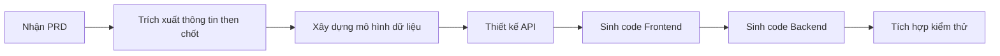
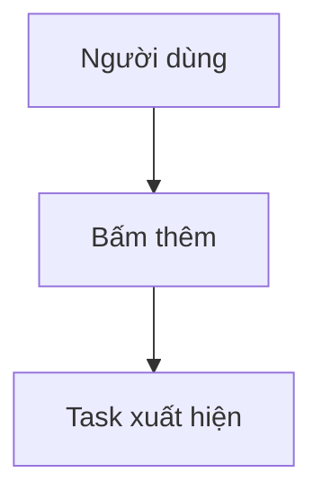

# 3.4 Từ PRD đến Code 🟡

> **Đọc xong phần này, bạn sẽ thu hoạch được:**
>
> - Hiểu cách AI "đọc" và thực thi PRD
> - Nắm vững chi tiết PRD ảnh hưởng thế nào đến chất lượng code sinh ra
> - Học cách dùng trực quan hóa để giảm thiểu hiểu lầm
> - Nắm vững phương pháp làm việc "Giải pháp đi trước"

> Lời nói đầu đã nhắc đến: Hiểu cách AI thực thi PRD, sẽ giúp viết PRD hiệu quả hơn.

---

## Cách AI "đọc" PRD

PRD không phải để cho người xem, mà là cho AI xem. Cách AI "đọc" PRD có sự khác biệt căn bản so với con người.

### Khác biệt giữa Người và AI khi đọc

| Cách người đọc                                                | Cách AI đọc                                |
| ------------------------------------------------------------- | ------------------------------------------ |
| Đọc từ đầu đến cuối một lượt                                  | Phân rã PRD thành các "khối thông tin"     |
| Bỏ qua nội dung lặp lại                                       | Xử lý từng trường một                      |
| Tự "bổ sung não bộ" (brainstorm/fill in gaps) những chỗ mơ hồ | Hiểu đúng theo nghĩa đen                   |
| Chủ động hỏi chỗ chưa rõ                                      | Không hỏi mà xử lý theo cách hiểu mặc định |

**Khác biệt cốt lõi**: AI không biết tự "bổ sung não bộ". Mỗi chữ bạn viết đều ảnh hưởng đến code nó sinh ra. Nếu PRD có sự mơ hồ, AI hoặc là đoán (có thể đoán sai), hoặc là dừng lại hỏi (tăng số vòng đối thoại).

Sự khác biệt này ảnh hưởng sâu sắc đến việc viết PRD. Khi viết tài liệu cho người, bạn có thể dựa vào "thường thức" —— bạn biết người đọc sẽ hiểu "chức năng đăng nhập" thường bao gồm những gì, không cần liệt kê từng ô nhập username, password, nút đăng nhập. Nhưng AI không có "thường thức" này, hoặc nói đúng hơn, "thường thức" của nó đến từ quy luật thống kê trong dữ liệu huấn luyện, có thể không khớp với kỳ vọng của bạn. Với AI, "chức năng đăng nhập" có thể nghĩa là xác thực lưu trữ cục bộ đơn giản, cũng có thể là quy trình đăng nhập bên thứ 3 (OAuth) trọn vẹn. Nếu không chỉ định rõ, AI sẽ chọn ngẫu nhiên một kiểu, và bạn chỉ biết nó "đoán" kiểu nào sau khi nhìn thấy kết quả.

### Quy trình thực thi của AI

Khi đưa PRD cho AI, bên trong AI sẽ trải qua các bước sau:



Quy trình này diễn ra tự động. Chất lượng PRD quyết định trực tiếp độ chính xác của từng bước.

Hiểu quy trình này giúp bạn dự đoán hành vi của AI. Khi biết AI đầu tiên sẽ trích xuất thông tin then chốt, bạn sẽ đặc biệt chú ý sự rõ ràng của phần mở đầu PRD; khi biết nó sẽ xây dựng mô hình dữ liệu, bạn sẽ đảm bảo mô tả liên quan đến dữ liệu đầy đủ và nhất quán. Mỗi bước đều là điểm có thể thất bại, cũng là điểm bạn có thể tối ưu thông qua cải thiện PRD. Nếu code cuối cùng có vấn đề, truy ngược quy trình này giúp bạn định vị vấn đề nằm ở giai đoạn nào —— là hiểu lầm ở giai đoạn trích xuất thông tin, hay sai lệch ở giai đoạn thiết kế mô hình dữ liệu.

---

## Chi tiết PRD ảnh hưởng code thế nào

### Giai đoạn trích xuất thông tin then chốt

AI trích xuất từ PRD:

- Người dùng là ai → Ảnh hưởng phong cách thiết kế UI
- Chức năng cốt lõi → Quyết định cấu trúc code
- Quy trình nghiệp vụ → Quyết định trình tự logic
- Out-of-Scope → Ngăn chặn "tự do phóng tác"

Nếu PRD viết quá mơ hồ, AI sẽ đoán theo "cách làm phổ biến", có thể đoán sai.

### Giai đoạn xây dựng mô hình dữ liệu

AI dựa trên mô tả "dữ liệu" trong PRD để thiết kế cấu trúc dữ liệu:

| Mô tả trong PRD                          | Cấu trúc dữ liệu AI hiểu                |
| ---------------------------------------- | --------------------------------------- |
| "Task có tiêu đề, trạng thái hoàn thành" | `{ title: string, completed: boolean }` |
| "Người dùng có thể thêm nhiều task"      | `tasks: Array<Task>`                    |
| "Dữ liệu cần lưu lại"                    | Cần localStorage hoặc Database          |

Nếu PRD không nói cần lưu dữ liệu gì, AI có thể bỏ sót trường quan trọng, về sau phải cấu trúc lại dữ liệu (refactor).

Thiết kế mô hình dữ liệu là nền tảng của kiến trúc, một khi đã chốt, rất nhiều quyết định sau đó sẽ xoay quanh nó. Nếu AI hiểu lầm ở giai đoạn này, ví dụ thiết kế dữ liệu nên liên kết thành bảng độc lập, hoặc thiếu trường then chốt, sai lầm này sẽ bị khuếch đại ở các giai đoạn sau. Frontend sẽ render dựa trên cấu trúc dữ liệu sai, Backend API sẽ truy vấn dựa trên mô hình sai, luồng dữ liệu toàn hệ thống sẽ bị ảnh hưởng. Sửa sai lầm kiểu này không đơn giản là sửa vài dòng code, thường phải thiết kế lại schema database, sửa API contract, điều chỉnh component Frontend. Chi phí refactor này lớn hơn nhiều so với việc viết thêm vài câu trong PRD để làm rõ nhu cầu dữ liệu.

### Giai đoạn thiết kế logic nghiệp vụ

AI dựa trên lưu đồ và mô tả tương tác trong PRD để viết logic code:

| Mô tả tương tác                                | Logic code AI sinh ra                   |
| ---------------------------------------------- | --------------------------------------- |
| "Bấm nút thêm, task xuất hiện trong danh sách" | Hàm `handleAddTask()`                   |
| "Bấm tick, task hiện gạch ngang"               | `toggleTask()` + CSS style              |
| "Bấm nhanh cần chống rung (debounce)"          | `debounce()` hoặc trạng thái `disabled` |

Nếu PRD không viết trường hợp biên, AI có thể không làm debounce, không xử lý lỗi.

---

## Chất lượng PRD quyết định chất lượng Code

### Ví dụ 1: Không viết Out-of-Scope

**PRD**:

```markdown
# To-do List

Người dùng có thể thêm task, tick hoàn thành.
```

**AI có thể sinh ra**:

- Chức năng đăng nhập
- Đồng bộ Cloud
- Phân loại Tag

Kết quả: Code phức tạp hơn dự kiến rất nhiều.

Sự "làm quá" (over-implementation) này là một trong những vấn đề phổ biến nhất khi phát triển với AI. Dữ liệu huấn luyện của AI chứa lượng lớn ứng dụng cấp doanh nghiệp đầy đủ chức năng, nó học được "một cái to-do list nên có những gì". Khi bạn không nói rõ cái gì không làm, AI sẽ mặc định làm theo phiên bản "đầy đủ" này. Đây không phải lỗi của AI —— nó chỉ đang cố hết sức thỏa mãn nhu cầu của bạn. Vấn đề nằm ở chỗ mô tả nhu cầu của bạn thiếu thông tin biên giới. Giá trị của Out-of-Scope không chỉ là bảo AI không làm gì, mà còn giúp AI hiểu ý đồ thực sự của bạn. Khi bạn nói "không cần đăng ký đăng nhập", AI hiểu đây là công cụ cục bộ; khi bạn nói "không cần đồng bộ cloud", AI hiểu dữ liệu không cần chia sẻ đa thiết bị. Những ràng buộc mang tính phủ định này thực chất đang vẽ ra không gian sáng tạo rõ ràng cho AI.

**PRD sau khi sửa**:

```markdown
# To-do List

## Chức năng cốt lõi

- Thêm task
- Tick hoàn thành

## Out-of-Scope

- Không đăng ký đăng nhập
- Không đồng bộ cloud
- Không phân loại tag
```

### Ví dụ 2: Không viết trường hợp biên

**PRD**:

```markdown
Người dùng bấm nút thêm để thêm task.
```

**Code AI sinh ra**:

```javascript
function addTask() {
  tasks.push(newTask);
}
```

Vấn đề: Bấm nhanh sẽ bị thêm trùng lặp.

**PRD sau khi sửa**:

```markdown
Người dùng bấm nút thêm để thêm task.

Trường hợp biên: Bấm nhanh cần debounce, trong 0.5s chỉ phản hồi 1 lần.
```

**Code AI sinh ra**:

```javascript
function addTask() {
  if (isAdding) return; // Debounce
  isAdding = true;
  tasks.push(newTask);
  setTimeout(() => (isAdding = false), 500);
}
```

---

## Điểm mù khi AI hiểu PRD

AI có một số điểm mù về cách hiểu, khi viết PRD cần lưu ý.

### Điểm mù 1: Giá trị mặc định

| Bạn viết              | Giá trị mặc định AI hiểu                                         |
| --------------------- | ---------------------------------------------------------------- |
| "Hiện danh sách task" | Danh sách hiện tối đa bao nhiêu dòng? AI có thể đoán 10, 50, 100 |
| "Nút bấm xong..."     | Nút có cần disable không? AI có thể không xử lý                  |
| "Lưu dữ liệu"         | Lưu bao lâu? AI có thể đoán "vĩnh viễn"                          |

**Giải pháp**: Viết rõ giá trị mặc định mong muốn.

Vấn đề giá trị mặc định quan trọng vì nó phản ánh sự khác biệt về "thường thức" giữa AI và người. Với người, "hiện danh sách task" mặc định nghĩa là "hiện tất cả", "lưu dữ liệu" mặc định là "lưu vĩnh viễn". Nhưng AI không có giả định mặc định này, hoặc chính xác hơn, giả định mặc định của nó đến từ học thống kê, có thể khác trực giác của bạn. Khi AI đoán "danh sách hiện tối đa bao nhiêu dòng", nó có thể chọn 10 (vì mobile hay làm thế), 50 (vì là số "hợp lý"), hoặc 100 (vì là giới hạn trên "an toàn"). Những lựa chọn này đều "hợp lý", nhưng có thể không phải cái bạn muốn. Viết rõ giá trị mặc định thực chất là truyền tải "thường thức" của bạn cho AI.

### Điểm mù 2: Thay đổi trạng thái

| Bạn viết                      | AI có thể hiểu nhầm                                     |
| ----------------------------- | ------------------------------------------------------- |
| "Task có thể tick hoàn thành" | Tick xong gạch ngang? Hay trôi xuống đáy? Hay biến mất? |
| "Đang tải..."                 | Nút đang tải có disable không? Có hiện vòng quay không? |

**Giải pháp**: Dùng mô tả trạng thái: "Trạng thái đầu → Kích hoạt → Đang tải → Thành công/Thất bại".

### Điểm mù 3: Độ ưu tiên

| Bạn viết                     | AI có thể hiểu nhầm                      |
| ---------------------------- | ---------------------------------------- |
| Liệt kê một đống chức năng   | AI có thể làm tất cả theo thứ tự liệt kê |
| Không nói cái nào quan trọng | AI có thể làm chức năng phụ quá phức tạp |

**Giải pháp**: Dùng P0/P1/P2 đánh dấu độ ưu tiên.

---

## Để AI hiểu PRD tốt hơn

### Mẹo 1: Dùng định dạng cấu trúc hóa

AI hiểu cực tốt cấu trúc Markdown.

Danh sách có cấu trúc:

```markdown
## Chức năng cốt lõi

- Chức năng 1
- Chức năng 2

## Out-of-Scope

- Không xxx
- Không yyy
```

Rõ ràng hơn nhiều so với đoạn văn thuần túy.

### Mẹo 2: Cụ thể thay vì trừu tượng

Đừng nói "giao diện đẹp", hãy nói "nền trắng, nút xanh dương, bo góc không viền".

Đừng nói "phải mượt", hãy nói "bấm xong phản hồi trong 0.5 giây".

Mô tả cụ thể không thể có nhiều cách hiểu.

Tính từ trừu tượng là cái bẫy trong viết PRD. "Đẹp", "Mượt", "Đơn giản" nghe rất chuyên nghiệp, nhưng mỗi người hiểu một kiểu. Bạn nghĩ "đẹp" là tối giản trắng đen, AI có thể hiểu là nền gradient và thẻ bo góc; bạn nghĩ "mượt" là phản hồi 0.5s, AI có thể hiểu là có hiệu ứng chuyển cảnh bay lượn. Sự khác biệt cách hiểu này không gây lỗi code, nhưng làm sản phẩm bị "sai sai". Giá trị của mô tả cụ thể là triệt tiêu không gian diễn giải. Khi bạn nói "nền trắng, nút xanh dương, bo góc không viền", AI có thể dịch chính xác sang code CSS; khi bạn nói "bấm xong phản hồi trong 0.5 giây", AI biết cần tối ưu hiệu năng hoặc thêm trạng thái loading.

### Mẹo 3: Dùng lưu đồ Mermaid

AI có thể "đọc hiểu" lưu đồ Mermaid:



Cái này chính xác hơn mô tả bằng lời.

---

## Giải pháp đi trước, Hiện thực theo sau

Một thực hành hiệu quả là: **Để AI xuất ra phương án kỹ thuật trước, rồi mới viết code**.

> Xin hãy đưa ra phương án thực hiện kỹ thuật cho chức năng này trước, bao gồm cấu trúc dữ liệu, định nghĩa interface, các bước chính. Tôi xác nhận xong bạn hãy viết code.

Lợi ích của việc này:

| Để AI viết code luôn                     | Để AI ra phương án trước                        |
| ---------------------------------------- | ----------------------------------------------- |
| AI "vừa nghĩ vừa viết", dễ đứt gãy logic | AI thông suốt tư duy trước, có điểm neo rõ ràng |
| Hiểu lầm thì sửa lại tốn công            | Phát hiện vấn đề ngay giai đoạn phương án       |
| Chất lượng code không kiểm soát được     | Xác nhận phương án xong mới viết, ổn định hơn   |

Đây là ứng dụng của "Chuỗi tư duy" (Chain of Thought) —— chia nhiệm vụ phức tạp thành 2 bước "nghĩ kỹ rồi làm".

Cách tư duy phân đoạn này đặc biệt quan trọng với nhiệm vụ phức tạp. Khi yêu cầu AI sinh code trực tiếp, nó phải xử lý song song nhiều tầng vấn đề: kiến trúc tổng thể, phân chia module, thiết kế interface, hiện thực cụ thể. Sự đa nhiệm này dễ dẫn đến rối loạn tư duy, bỏ sót chi tiết then chốt. Còn "Giải pháp đi trước" tách biệt các vấn đề này: Giai đoạn 1 chỉ quan tâm "làm gì" và "làm thế nào", không lo cú pháp cụ thể; Giai đoạn 2 chỉ quan tâm "viết thế nào", điền code vào cái khung đã chốt. Sự tách biệt này giảm tải nhận thức cho mỗi giai đoạn, chất lượng tự nhiên tăng lên. Quan trọng hơn, giai đoạn phương án cung cấp một "điểm kiểm tra", giúp bạn phát hiện và sửa chữa sai lầm định hướng trước khi tốn quá nhiều thời gian.

---

## Câu hỏi thường gặp

### Q1: AI không sinh code theo PRD

**A**: Kiểm tra xem đã gửi PRD cho AI chưa, đường dẫn PRD đúng không, có bị cắt bớt không. AI có thể chỉ "nhìn thấy" một phần PRD.

### Q2: Code sinh ra không khớp PRD

**A**: Có thể là sai lệch nhận thức. Dùng template xác nhận ở bài 3.2 để AI xác nhận lại, hoặc dùng phương pháp "Giải pháp đi trước".

### Q3: PRD phải viết chi tiết đến mức nào AI mới hiểu chuẩn?

**A**: Nguyên tắc là: AI đọc xong không cần hỏi lại "nút này đặt đâu", "thất bại thì xử lý thế nào" nữa. Các giai đoạn khác nhau độ chi tiết khác nhau, xem bài 3.3.

### Q4: Có thể để AI vừa viết vừa bổ sung PRD không?

**A**: Không khuyến khích. Dẫn đến PRD và code lệch pha, khó bảo trì. Cách đúng là hoàn thiện PRD trước, rồi mới sinh code.

---

## Trọng điểm cốt lõi

- ✅ AI hiểu PRD đúng theo nghĩa đen, không biết "bổ sung não bộ"
- ✅ Mỗi trường trong PRD đều ảnh hưởng code AI sinh ra
- ✅ Không viết Out-of-Scope → AI có thể "tự do phóng tác"
- ✅ Không viết trường hợp biên → AI có thể không xử lý lỗi
- ✅ AI có điểm mù nhận thức: Giá trị mặc định, thay đổi trạng thái, độ ưu tiên
- ✅ Dùng định dạng cấu trúc, ví dụ cụ thể, lưu đồ Mermaid để AI hiểu chuẩn hơn
- ✅ **Giải pháp đi trước** — Để AI xuất ra phương án kỹ thuật, xác nhận rồi hãy viết code

Chương 3 học xong rồi. Tiếp theo Chương 4: Thường thức phát triển và Tech Stack.

---

## Nội dung liên quan

- Trước đó: [3.3 Thực chiến viết PRD](./03-prd-template-guide_vi.md)
- Chi tiết: [Chương 4: Thường thức phát triển và Tech Stack](../04-dev-fundamentals/index_vi.md)
