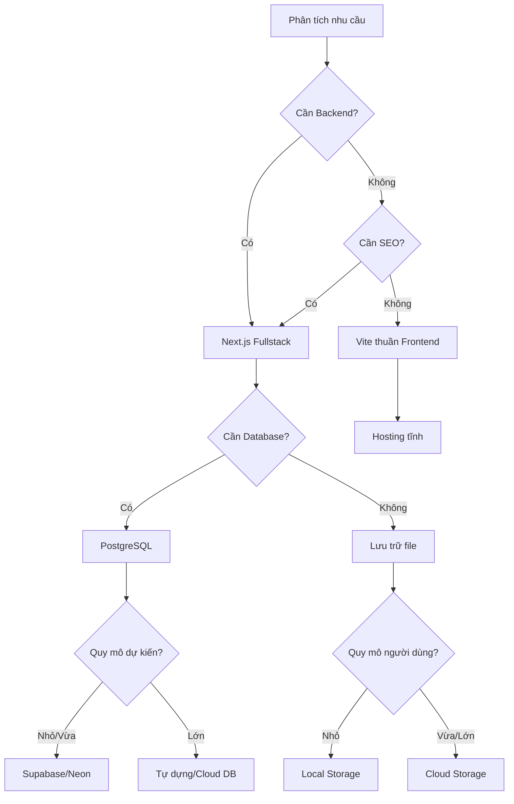

# 4.1 Khung quyết định Tech Stack 🟡

> **Đọc xong phần này, bạn sẽ thu hoạch được:**
>
> - Hiểu nguyên tắc cốt lõi của việc quyết định Tech Stack
> - Nắm vững tư duy lựa chọn "Nhu cầu đi trước"
> - Học cách đánh giá tính khả thi và độ phức tạp của giải pháp kỹ thuật
> - Hiểu các kịch bản áp dụng của các giải pháp kỹ thuật phổ biến

> Sau khi chốt PRD mới tiến hành chọn Tech Stack. Làm rõ "làm cái gì" trước, rồi mới quyết định "dùng cái gì để làm".

---

## Nguyên tắc cốt lõi của quyết định Tech Stack

Quyết định Tech Stack là điểm mấu chốt của phát triển sản phẩm. Chọn công nghệ phù hợp giúp phát triển một vốn bốn lời, chọn sai công nghệ sẽ rước thêm độ phức tạp không đáng có.

Nhiều người khi chọn công nghệ dễ rơi vào bẫy "sùng bái công nghệ" —— chạy theo công nghệ mới nhất, ngầu nhất, mà bỏ qua nhu cầu thực tế. Tư duy này đặc biệt nguy hiểm trong thời đại AI, vì AI hỗ trợ tốt nhất cho các công nghệ chính thống, trưởng thành; công nghệ ít người dùng có thể khiến AI không hiểu code hoặc đưa ra phương án sai.

Nguyên tắc cốt lõi của quyết định Tech Stack là: **Nhu cầu rõ ràng → Đánh giá độ phức tạp → Chọn phương án khả thi tối thiểu**.

Hiểu logic tiến hóa của Tech Stack giúp bạn đưa ra lựa chọn sáng suốt hơn. Sự phát triển của ngôn ngữ lập trình và khung công nghệ thể hiện rõ đặc trưng "phân tầng chồng lớp", mỗi tầng cung cấp khả năng trừu tượng hóa mạnh mẽ hơn tầng trước đó.

### Thế giới ngôn ngữ lập trình

Hãy tưởng tượng bạn bước vào một nhà hàng, thực đơn có hàng chục món khác nhau. Thế giới ngôn ngữ lập trình cũng vậy —— có hàng chục ngôn ngữ để chọn, mỗi loại có đặc sắc và kịch bản áp dụng riêng. Hiểu câu chuyện của chúng sẽ giúp bạn hiểu tại sao một số công nghệ trở thành lựa chọn hàng đầu trong lĩnh vực cụ thể.

**C và C++** là nền đá tảng của thế giới máy tính. Chúng ra đời trong thời đại hệ điều hành cần giao tiếp trực tiếp với phần cứng. Nếu bạn muốn phát triển engine game cần hiệu năng cực hạn, hoặc viết code chạy trên thiết bị nhúng, C/C++ vẫn là lựa chọn tốt nhất. Hệ điều hành Linux, nhân Windows, hầu hết engine game đều xây dựng trên chúng. Nhưng cái giá là hiệu suất phát triển thấp —— bạn phải tự quản lý bộ nhớ, xử lý nhiều chi tiết tầng thấp.

**Java** chiếm vị trí chủ đạo trong thế giới doanh nghiệp. Lời hứa "viết một lần, chạy mọi nơi" (Write Once, Run Anywhere) khiến nó trở thành lựa chọn hàng đầu cho các hệ thống lớn. Hệ thống backend của Alibaba, Amazon, hay nghiệp vụ cốt lõi của ngân hàng đa số chạy trên Java. Nó cung cấp hệ sinh thái trưởng thành và an toàn kiểu dữ liệu nghiêm ngặt, nhưng cũng đồng nghĩa với code dài dòng hơn và chu kỳ phát triển chậm hơn.

**Python** là tình yêu của các nhà khoa học dữ liệu. Cú pháp ngắn gọn thanh thoát của nó giúp các nhà khoa học và nghiên cứu viên nhanh chóng kiểm chứng ý tưởng. Backend của Instagram và YouTube đều có bóng dáng Python, việc huấn luyện mô hình của OpenAI cũng dùng lượng lớn Python. Nhưng năng lực Frontend của Python khá yếu, nếu muốn làm Fullstack, bạn cần học thêm một bộ công nghệ khác.

**Go** do Google phát triển, thiết kế riêng cho kỷ nguyên Cloud Native. Docker và Kubernetes đều viết bằng Go. Mô hình đồng thời (concurrency) của nó thanh thoát, tốc độ biên dịch nhanh, thích hợp xây dựng dịch vụ mạng hiệu năng cao. ByteDance và nhiều công ty khác dùng Go lượng lớn ở Backend.

**Rust** là ngôi sao mới trong lĩnh vực lập trình hệ thống. Nó hứa hẹn cung cấp hiệu năng cấp C++ đồng thời đảm bảo an toàn bộ nhớ. Trình duyệt Firefox, một số component của Discord, hạ tầng của Cloudflare đang dùng Rust. Nhưng đường cong học tập (learning curve) khá dốc, không phù hợp phát triển prototype nhanh.

**JavaScript và TypeScript** thống trị thế giới Web. Ban đầu chỉ là ngôn ngữ kịch bản trong trình duyệt, nhưng với sự xuất hiện của Node.js, nó mở rộng sang phía Server. TypeScript bổ sung hệ thống kiểu (type system) trên nền JavaScript, giúp việc bảo trì dự án lớn dễ dàng hơn. Netflix, Stripe, Vercel đều xây dựng trên hệ sinh thái TypeScript.

### Lựa chọn của chúng ta: Tại sao lại là TypeScript + Next.js?

Đối mặt với quá nhiều lựa chọn, bạn có thể hỏi: Tại sao hướng dẫn này chọn TypeScript + Next.js?

Hãy xuất phát từ nhu cầu thực tế. Giả sử bạn là một lập trình viên độc lập, hoặc ở trong một team nhỏ, mục tiêu là nhanh chóng kiểm chứng ý tưởng sản phẩm. Bạn cần một Tech Stack có thể xử lý cả giao diện Frontend và logic Backend, đường cong học tập không quá dốc, và phải có cộng đồng hỗ trợ phong phú.

C/C++/Rust bị loại đầu tiên. Chúng quá tầng thấp (low-level), bạn phải xử lý quản lý bộ nhớ, tối ưu biên dịch... những thứ này tốn quá nhiều thời gian đối với việc làm sản phẩm nhanh.

Java và Go là ngôn ngữ Backend xuất sắc, nhưng bạn phải học riêng công nghệ Frontend. Điều này đồng nghĩa với 2 bộ chuỗi công cụ (toolchain), 2 tư duy, 2 quy trình deploy. Với team nhỏ, độ phức tạp này là gánh nặng không cần thiết.

Python là lựa chọn hàng đầu cho khoa học dữ liệu, nhưng không chạy được trên trình duyệt. Nếu muốn làm Web App, lại phải học thêm JavaScript để xử lý Frontend, lại quay về vấn đề 2 bộ công nghệ.

PHP và Ruby từng là lựa chọn hot cho Web Dev, nhưng hệ sinh thái đang co lại. Quan trọng hơn, dữ liệu huấn luyện của các mô hình AI cho chúng không phong phú bằng JavaScript, nghĩa là chất lượng code AI sinh ra có thể không ổn định.

Điểm độc đáo của TypeScript là nó thống nhất Frontend và Backend. Bạn dùng cùng một ngôn ngữ viết giao diện và viết API, định nghĩa kiểu dữ liệu có thể chia sẻ ở cả hai đầu. Khi bạn nhờ AI sinh code, nó không cần chuyển đổi giữa các mô hình ngôn ngữ khác nhau, code sinh ra nhất quán và chính xác hơn.

Next.js đơn giản hóa việc phát triển Fullstack hơn nữa. Nó tích hợp React Frontend, API routing, kết nối CSDL, quy trình deploy lại với nhau. Bạn không cần cấu hình công cụ build phức tạp, không cần xử lý vấn đề cross-origin (CORS), thậm chí không cần quản lý server —— Vercel có thể deploy một chạm (one-click deploy).

Đó là lý do chúng ta chọn TypeScript + Next.js. Nó không chỉ là một lựa chọn công nghệ, mà là phương thức sản xuất hiệu quả nhất cho lập trình viên cá nhân trong kỷ nguyên AI.

---

## Lựa chọn Tech Stack trong kỷ nguyên AI

Trong thời đại AI hỗ trợ phát triển (AI-Assisted Development), lựa chọn Tech Stack có thêm chiều kích cân nhắc mới. Hãy tưởng tượng bạn hợp tác với một trợ lý kiến thức uyên bác nhưng thi thoảng nói linh tinh —— độ thân thiện với AI (AI-friendliness) mô tả mức độ quen thuộc của trợ lý này với một công nghệ. Các công nghệ chủ đạo như JavaScript, Python có dữ liệu huấn luyện khổng lồ, AI biết các thực hành tốt nhất (best practices) và bẫy thường gặp của chúng; còn công nghệ ít người dùng hoặc framework mới toanh, AI có thể "bịa" ra các API không tồn tại.

Khi bạn dùng Tech Stack thống nhất, sự hiểu ngữ cảnh của AI sẽ liền mạch hơn. Nếu Frontend React, Backend Python, Database MongoDB, AI phải chuyển đổi giữa 3 mô hình kỹ thuật, rất dễ sinh ra lệch lạc. Còn dùng thống nhất hệ sinh thái TypeScript —— Next.js làm cả Frontend lẫn Backend, PostgreSQL làm Database —— AI có thể làm việc trong một ngữ cảnh liền mạch, code sinh ra nhất quán và chính xác hơn. Định nghĩa kiểu dữ liệu chia sẻ Frontend-Backend, AI sẽ không nhầm tên trường; AI có thể hiểu toàn bộ dự án một lần, sinh code xuyên suốt các component. Những cải thiện tưởng nhỏ này tích tiểu thành đại sẽ nâng cao hiệu suất phát triển đáng kể.

Trước đây, chọn công nghệ thường là trò chơi đánh đổi: Chọn Java nghĩa là ổn định kiểu doanh nghiệp nhưng phát triển chậm; chọn Python là phát triển nhanh nhưng hiệu năng hạn chế; chọn JavaScript là Fullstack thống nhất nhưng thiếu an toàn kiểu dữ liệu. Sự kết hợp TypeScript và Next.js phá vỡ sự đánh đổi này —— nó cung cấp an toàn kiểu cấp doanh nghiệp, hiện thực hóa ngôn ngữ thống nhất Fullstack, thích ứng kỷ nguyên AI, giải phóng sức sản xuất của lập trình viên cá nhân. Đó là lý do hướng dẫn này chọn TypeScript + Next.js làm Tech Stack cốt lõi.

---

## Khung quyết định: 3 câu hỏi

Khi đối mặt với việc chọn công nghệ, trả lời 3 câu hỏi này có thể nhanh chóng thu hẹp phạm vi:

**Câu 1: Dự án này bản chất cần làm gì?**

- Hiển thị nội dung là chính → Web tĩnh hoặc Framework thuần Frontend
- Cần người dùng đăng nhập → Cần năng lực Backend
- Cần lưu trữ bền vững → Cần Database
- Cần năng lực AI → Cần tích hợp AI API

**Câu 2: Quy mô người dùng và lượng truy cập (concurrency) dự kiến bao nhiêu?**

- Cá nhân dùng hoặc quy mô nhỏ → Chọn giải pháp đơn giản
- Dự kiến quy mô vừa → Cần cân nhắc khả năng mở rộng (scalability)
- Dự kiến quy mô lớn → Cần thiết kế kiến trúc

**Câu 3: Nền tảng kỹ thuật của team (hoặc cá nhân) là gì?**

- Quen JavaScript/TypeScript → Chọn Next.js
- Quen Python → Chọn FastAPI/Flask
- Học mới hoàn toàn → Chọn Tech Stack được AI hỗ trợ tốt nhất

---

## Bảng tra cứu giải pháp kỹ thuật phổ biến

### Frontend Framework

| Giải pháp          | Ngữ cảnh áp dụng                       | Ngữ cảnh không áp dụng      |
| ------------------ | -------------------------------------- | --------------------------- |
| **Next.js**        | Cần Backend, SEO, phát triển Fullstack | Chỉ hiển thị tĩnh thuần túy |
| **Vite + React**   | Thuần Frontend, ứng dụng SPA           | Cần SSR/SEO                 |
| **Thuần HTML/CSS** | Trang tĩnh cực giản                    | Ứng dụng tương tác phức tạp |

::: tip Tại sao khuyên dùng Next.js?

- AI hiểu cấu trúc dự án của nó rất sâu, sinh code chính xác
- Hỗ trợ phát triển Fullstack, Frontend-Backend thống nhất công nghệ
- Deploy tiện lợi (Vercel one-click)
- Hệ sinh thái trưởng thành, giải pháp cho các vấn đề phong phú

:::

### Database (Cơ sở dữ liệu)

| Giải pháp      | Ngữ cảnh áp dụng                        | Ngữ cảnh không áp dụng          |
| -------------- | --------------------------------------- | ------------------------------- |
| **PostgreSQL** | Dữ liệu quan hệ, cần transaction        | Lưu trữ Key-Value cực giản      |
| **Supabase**   | Phát triển nhanh, cần Auth/Storage sẵn  | Cần Backend tùy chỉnh hoàn toàn |
| **Neon**       | Kiến trúc Serverless, nhu cầu nhẹ nhàng | Cần chức năng Backend trọn gói  |
| **SQLite**     | Phát triển cục bộ, nhu cầu cực giản     | Nhiều người dùng ghi đồng thời  |

::: tip Tại sao khuyên dùng PostgreSQL?

PostgreSQL là CSDL mã nguồn mở mạnh mẽ nhất:

- Quan hệ + JSONB + pgvector extension
- Vừa xử lý dữ liệu cấu trúc, vừa lưu được dữ liệu bán cấu trúc
- Hỗ trợ tìm kiếm vector, thích hợp cho ứng dụng AI
- AI hiểu nó sâu sắc, sinh code mô hình dữ liệu chính xác

:::

### Giải pháp Deploy (Triển khai)

| Giải pháp              | Ngữ cảnh áp dụng                               | Đặc điểm                                                                   |
| ---------------------- | ---------------------------------------------- | -------------------------------------------------------------------------- |
| **Vercel**             | Dự án Next.js, phân phối toàn cầu              | Deploy không cần cấu hình, tự động CI/CD, hỗ trợ Edge Functions            |
| **EdgeOne Pages**      | Cần node trong nước, Edge Computing            | Tăng tốc toàn cầu Tencent Cloud, hỗ trợ Pages Functions và Node.js runtime |
| **Cloud Server (VPS)** | Kiểm soát hoàn toàn, ứng dụng phức tạp         | Phải tự cấu hình môi trường và vận hành (Ops)                              |
| **Docker**             | Cần nhất quán môi trường, kiến trúc đa dịch vụ | Đóng gói container, đảm bảo môi trường Dev và Prod giống hệt nhau          |

::: tip Vercel vs EdgeOne Pages

**Vercel** là nền tảng deploy "chính chủ" của Next.js, cung cấp:

- Tự động deploy không cấu hình, tích hợp liền mạch với Git repo
- Tăng tốc CDN toàn cầu, tự động phân phối tài nguyên tĩnh
- Hỗ trợ Serverless Functions và Edge Functions
- Hạn mức miễn phí hào phóng, hợp dự án cá nhân và team nhỏ

**EdgeOne Pages** là nền tảng deploy vùng biên của Tencent Cloud:

- Phủ sóng node trong nước (TQ/VN), hợp với ngữ cảnh cần tăng tốc nội địa
- Hỗ trợ Pages Functions (tính toán vùng biên) và Node.js runtime
- Cung cấp KV Storage, hỗ trợ phát triển ứng dụng Fullstack
- Tích hợp sâu với hệ sinh thái Tencent Cloud (SSL, CDN...)

Gợi ý lựa chọn: Người dùng chủ yếu ở trong nước chọn EdgeOne Pages; Cần phân phối toàn cầu hoặc dùng sâu tính năng Next.js thì chọn Vercel.

:::

---

## Tech Stack theo quy mô công ty

Lựa chọn công nghệ thường liên quan đến quy mô công ty và đặc điểm nghiệp vụ:

| Quy mô công ty                        | Tech Stack                                                                      | Lý do lựa chọn                                                                            |
| ------------------------------------- | ------------------------------------------------------------------------------- | ----------------------------------------------------------------------------------------- |
| **Startup** （0-50 người）         | Next.js + PostgreSQL + Vercel                                                   | Tốc độ dev nhanh, thống nhất công nghệ, thân thiện AI, deploy đơn giản                    |
| **Công ty vừa** （50-500 người）   | Java/Go Backend + React Frontend + Cloud DB                                     | Hiệu năng kiểm soát được, nhân sự dồi dào, khả năng bảo trì tốt                           |
| **Công ty lớn** （trên 500 người） | Đa ngôn ngữ song hành: Java (TMĐT), Go (Cloud Native), C++ (nhạy cảm hiệu năng) | Các line nghiệp vụ khác nhau chọn công nghệ phù hợp nhất, team hạ tầng tự build framework |

---

## Bổ sung nguyên lý kỹ thuật (Đọc thêm)

Nếu bạn muốn hiểu sâu hơn nguyên lý đằng sau công nghệ, có thể đọc phần này. Kiến thức này không bắt buộc để làm, nhưng giúp hiểu logic chọn công nghệ.

### Biên dịch (Compiled) vs Thông dịch (Interpreted)

Hiểu cách thực thi của ngôn ngữ giúp chọn công nghệ phù hợp:

| Loại           | Ngôn ngữ tiêu biểu       | Cách thực thi                              | Đặc điểm                           |
| -------------- | ------------------------ | ------------------------------------------ | ---------------------------------- |
| **Biên dịch**  | C, C++, Go, Rust         | Biên dịch thành mã máy trước, rồi chạy     | Tốc độ chạy nhanh, deploy đơn giản |
| **Thông dịch** | Python, Ruby, JavaScript | Trình thông dịch chạy từng dòng            | Hiệu suất dev cao, linh hoạt       |
| **Hỗn hợp**    | Java, C#                 | Biên dịch thành bytecode, chạy trên máy ảo | Cân bằng hiệu năng và đa nền tảng  |

### Máy ảo và Đa nền tảng

Ngôn ngữ hỗn hợp (như Java) cần biên dịch thành mã trung gian trước, rồi chạy trên **Máy ảo (VM)**. Máy ảo như cây cầu —— cùng một mã trung gian có thể chạy trên Windows, Mac hay Linux, miễn là hệ thống đó cài máy ảo tương ứng. Đây là nguyên lý của "Write Once, Run Anywhere".

Tư tưởng này mở rộng sang lĩnh vực deploy. **Docker** áp dụng khái niệm tương tự: Nó đóng gói code ứng dụng, runtime, thư viện phụ thuộc và cấu hình vào một "Container". Dù deploy lên môi trường Dev, Test hay Prod, hành vi của ứng dụng trong container đều nhất quán.

Với Fullstack Dev, giá trị của Docker rất đơn giản: **Nó giải quyết vấn đề "ở máy tôi chạy được mà"**. Khi cộng tác nhóm, không cần lo "cấu hình môi trường của cậu khác tớ". Chỉ cần dùng chung một Docker image, môi trường chạy của mọi người là như nhau.

Trong Web Dev hiện đại, JavaScript/TypeScript dùng một cách linh hoạt: Khi Dev thì dùng sự tiện lợi của thông dịch, khi Deploy thì qua công cụ build (như Webpack, Vite) để tối ưu biên dịch, sinh ra code phù hợp môi trường Production.

### Bài học từ sự tiến hóa công nghệ

Sự tiến hóa phân tầng này không phải quan hệ thay thế đơn giản, mà là sự chồng lớp năng lực. Mỗi tầng công nghệ mới đều xây trên nền tảng tầng trước, giải quyết vấn đề mà tầng trước không giải quyết hiệu quả được. Khi chọn công nghệ, hiểu tư duy phân tầng này giúp bạn phán đoán: Công nghệ mới này là đổi mới thực sự, hay chỉ là "bình cũ rượu mới"? Cái trước mang lại giá trị dài hạn, cái sau thường chỉ tăng chi phí học tập.

Ví dụ, TypeScript không thay thế JavaScript, mà thêm tầng "lưới an toàn" (hệ thống kiểu) lên trên nó; Next.js không thay thế React, mà bổ sung năng lực Server-side Rendering, Routing... lên trên React. Công nghệ mới thực sự có giá trị thường là sự đổi mới đứng trên vai người khổng lồ, chứ không phải đập đi xây lại cái bánh xe.

---

## Quy trình ra quyết định

---

## Câu hỏi thường gặp

### Q1: Giai đoạn PRD có cần chốt hết chi tiết kỹ thuật không?

Không cần. Giai đoạn PRD chốt hướng đi lớn là được: Dùng framework gì (Next.js), Database gì (PostgreSQL), Deploy đâu (Vercel). Việc chọn thư viện cụ thể, thiết kế component có thể điều chỉnh trong lúc dev. Quy hoạch quá kỹ sẽ phí thời gian, vì nhu cầu thực tế lúc dev hay thay đổi.

### Q2: Không chắc chức năng muốn làm có hiện thực hóa được không, làm sao?

Hỏi AI trước. Gửi mô tả chức năng cho AI, hỏi "Chức năng này dùng Next.js làm được không? Đại khái cần kỹ thuật gì?". AI sẽ cho bạn biết tính khả thi và lộ trình kỹ thuật. Nếu AI bảo "cần dùng WebRTC" hay "cần dịch vụ bản đồ bên thứ 3", bạn sẽ biết cần nghiên cứu thêm mấy cái đó.

### Q3: Cần học xong TypeScript rồi mới bắt đầu được không?

Không cần. Bạn có thể vừa làm vừa học. Gặp cú pháp không hiểu thì hỏi AI: "Dòng code này nghĩa là gì?", "Biến này thêm type thế nào?". Dự án thực tế là người thầy tốt nhất —— bạn học để làm ra chức năng, hiệu quả hơn nhiều so với xem hết giáo trình rồi mới động tay. Hướng dẫn này giả định bạn là trang giấy trắng (zero-basis), mọi code đều sẽ có giải thích.

### Q4: Tech Stack này làm App điện thoại được không?

Next.js bản thân là làm web, nhưng web mở được trên trình duyệt điện thoại. Nếu muốn làm App Native (loại tải từ App Store), có vài lựa chọn:

- **Capacitor**: Đóng gói web thành App Native, hỗ trợ iOS và Android, code gần như không cần sửa
- **PWA**: Progressive Web App, Next.js hỗ trợ sẵn, người dùng có thể "cài" web lên màn hình chính điện thoại
- **React Native**: Cần học công nghệ mới, nhưng hiệu năng tốt hơn

Để kiểm chứng MVP, bản Web thường là đủ rồi. Đợi kiểm chứng thành công hẵng tính làm App Native.

---

## Trọng điểm cốt lõi

- ✅ Cốt lõi của chọn Tech Stack là "Nhu cầu đi trước" chứ không phải "Kỹ thuật đi trước"
- ✅ Trả lời 3 câu hỏi để nhanh chóng xác định hướng đi công nghệ
- ✅ Chọn công nghệ chủ đạo, trưởng thành, ổn định, thân thiện với AI
- ✅ Tránh thiết kế thái quá (over-engineering) và chạy theo công nghệ mới nhất
- ✅ Thống nhất Tech Stack giúp nâng cao độ chính xác khi AI hiểu code
- ✅ Hoàn thành chọn Tech Stack ở giai đoạn PRD, tránh phải làm lại

Tech Stack chốt xong rồi, tiếp theo là hiểu quan hệ giữa PRD và tài liệu kỹ thuật.

---

## Nội dung liên quan

- Trước đó: [3.4 Từ PRD đến Code](../03-prd-doc-driven/04-coding-agents_vi.md)
- Chi tiết: [4.2 Quan hệ giữa PRD và Tài liệu kỹ thuật](./02-prd-and-tech-docs_vi.md)
