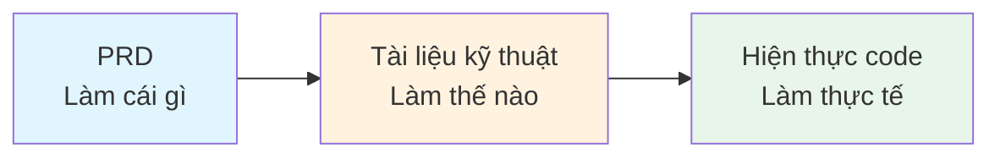
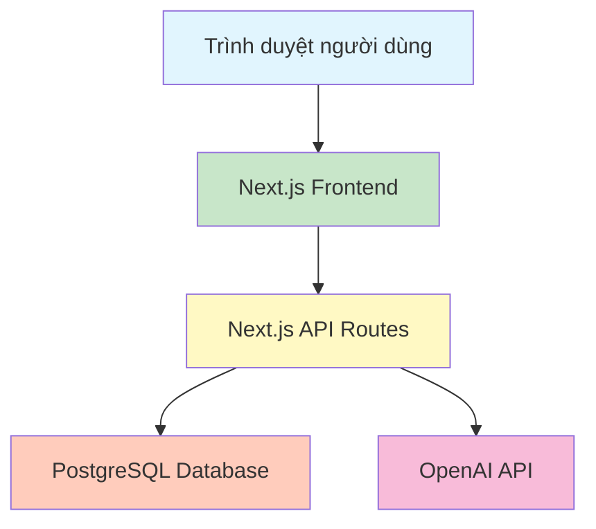
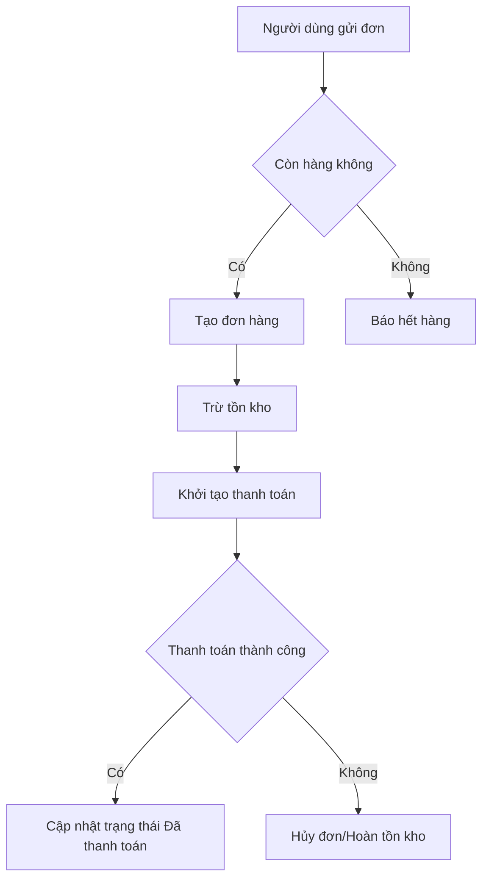

# 4.2 Mối quan hệ giữa PRD và Tài liệu kỹ thuật 🟢

> **Đọc xong phần này, bạn sẽ thu hoạch được:**
>
> - Hiểu sự phân công rõ ràng giữa PRD và tài liệu kỹ thuật
> - Nắm vững 5 thành phần kiến tạo nên tài liệu kỹ thuật
> - Học cách ghi nhận các quyết định kỹ thuật thành tài liệu
> - Hiểu giá trị của tài liệu trong phát triển với AI

> Sau khi PRD lặp đến bản 5, phương án sản phẩm cơ bản đã chốt, ngoài việc chải chuốt logic nghiệp vụ, còn cần ghi lại phương án thực hiện kỹ thuật cụ thể, đó chính là tài liệu kỹ thuật.

---

## Dẫn nhập

PRD trả lời câu hỏi "Làm cái gì", nhưng code sẽ không trực tiếp mọc ra từ PRD. Trước khi bắt tay viết code, bạn cần một bản **tài liệu kỹ thuật** —— nó là cây cầu nối từ PRD đến code, là "bản hướng dẫn sử dụng" để AI hiểu cấu trúc hệ thống của bạn.

Một bản tài liệu kỹ thuật hoàn chỉnh sẽ giúp AI biết:

- Hệ thống có những dữ liệu nào, quan hệ giữa chúng ra sao
- Frontend và Backend giao tiếp qua những giao diện (interface) nào
- Hệ thống cấu thành từ những component nào, quy trình nghiệp vụ chạy thế nào
- Phụ thuộc vào những dịch vụ bên ngoài nào

Không có những ngữ cảnh này, AI chỉ có thể đoán mò, code sinh ra thường không khớp với kỳ vọng.

---

## Phân công giữa PRD và Tài liệu kỹ thuật

Hai bên phân công rõ ràng: PRD trả lời "Làm cái gì" (What), tài liệu kỹ thuật trả lời "Làm thế nào" (How).

### PRD (Tài liệu nhu cầu sản phẩm)

| Nội dung             | Giải thích                                         |
| -------------------- | -------------------------------------------------- |
| Người dùng mục tiêu  | Ai sẽ dùng sản phẩm này                            |
| Chức năng cốt lõi    | Sản phẩm cần hiện thực hóa tính năng gì            |
| Tương tác người dùng | Người dùng thao tác thế nào để hoàn thành nhiệm vụ |
| Trường hợp biên      | Xử lý tình huống bất thường thế nào                |
| Quy trình nghiệp vụ  | Luồng thao tác trọn vẹn của người dùng             |

### Tài liệu kỹ thuật

| Nội dung            | Giải thích                                             |
| ------------------- | ------------------------------------------------------ |
| Mô hình dữ liệu     | Có những bảng nào, trường nào, quan hệ gì              |
| Thiết kế API        | Danh sách interface và phân công trách nhiệm           |
| Kiến trúc/Lưu đồ    | Quan hệ giữa các component hệ thống và luồng nghiệp vụ |
| Tích hợp bên thứ 3  | Dịch vụ bên ngoài và cách kết nối                      |
| Quyết định kỹ thuật | Lý do chọn công nghệ và các đánh đổi then chốt         |

### Quan hệ giữa hai bên



Mỗi thực thể nghiệp vụ trong PRD đều nên tìm thấy sự tương ứng trong mô hình dữ liệu; mỗi điểm chức năng trong PRD đều nên tìm thấy interface tương ứng trong thiết kế API. Quan hệ tương ứng này là tiêu chuẩn để kiểm tra tính toàn vẹn của tài liệu kỹ thuật.

---

## 5 thành phần kiến tạo tài liệu kỹ thuật

Tài liệu kỹ thuật không phải bài điền vào chỗ trống, mà là ghi chép của quá trình tư duy. 5 thành phần dưới đây bao phủ góc nhìn kỹ thuật trọn vẹn từ dữ liệu đến interface, từ kiến trúc đến sự phụ thuộc. Chúng phối hợp với nhau, tạo thành nền tảng ngữ cảnh để AI hiểu hệ thống.

### 1. Mô hình dữ liệu (Data Model)

Mô hình dữ liệu là sự ánh xạ kỹ thuật của các khái niệm nghiệp vụ trong PRD. Nó mô tả hệ thống lưu trữ dữ liệu gì, cấu trúc dữ liệu ra sao, và quan hệ giữa các dữ liệu.

**Tại sao cần:**

- Là ngữ cảnh cơ sở để AI sinh code database
- Là khế ước dữ liệu (contract) để Frontend và Backend kết nối
- Quyết định khả năng mở rộng của hệ thống

**Cần ghi lại:**

- Có những bảng nào (tương ứng thực thể nghiệp vụ trong PRD)
- Trường của mỗi bảng (tương ứng thuộc tính thực thể)
- Quan hệ giữa các bảng (một-nhiều, nhiều-nhiều)

**Ví dụ:**

```markdown
## Mô hình dữ liệu

### Bảng người dùng (users)

- id: Khóa chính
- email: Email (duy nhất)
- name: Tên hiển thị
- created_at: Thời gian tạo

### Bảng bài viết (posts)

- id: Khóa chính
- title: Tiêu đề
- content: Nội dung
- author_id: ID tác giả (Khóa ngoại, liên kết với users)
- created_at: Thời gian tạo

Quan hệ: Một người dùng có thể có nhiều bài viết (Một-Nhiều)
```

::: tip ORM Schema chính là tài liệu

Khi dùng ORM như Drizzle, bản thân file định nghĩa Schema chính là tài liệu mô hình dữ liệu. Nó hiển thị trực quan cấu trúc bảng, kiểu trường và quan hệ bảng, AI cũng có thể hiểu chính xác.

Thiết kế và hiện thực database cụ thể xem chương 8.

:::

### 2. Thiết kế API

Thiết kế API định nghĩa các interface mà hệ thống cung cấp ra bên ngoài, là khế ước cộng tác giữa Frontend và Backend.

**Tại sao cần:**

- Là ranh giới phân công Frontend-Backend
- Là căn cứ để AI sinh code interface
- Định nghĩa API rõ ràng giúp giảm chi phí giao tiếp

**Cần ghi lại:**

- Đường dẫn interface và phương thức HTTP
- Trách nhiệm của interface (làm gì)
- Tham số request và giá trị trả về (mô tả vắn tắt)

**Ví dụ:**

```markdown
## Thiết kế API

### Liên quan bài viết

- GET /api/posts - Lấy danh sách bài viết
- GET /api/posts/:id - Lấy bài viết đơn lẻ
- POST /api/posts - Tạo bài viết (Cần login)
- PATCH /api/posts/:id - Cập nhật bài viết (Cần chính chủ)
- DELETE /api/posts/:id - Xóa bài viết (Cần chính chủ)

### Liên quan bình luận

- GET /api/posts/:id/comments - Lấy bình luận bài viết
- POST /api/posts/:id/comments - Đăng bình luận (Cần login)
```

::: tip Học tiếp

Chi tiết giao thức HTTP, chuẩn RESTful, ý nghĩa mã trạng thái sẽ được giảng giải kỹ trong bài "4.4 Cơ bản về API và HTTP".

:::

### 3. Kiến trúc / Lưu đồ

Sơ đồ kiến trúc hiển thị quan hệ các thành phần hệ thống, lưu đồ hiển thị sự luân chuyển của logic nghiệp vụ.

**Tại sao cần:**

- Để AI nhanh chóng hiểu cấu trúc tổng thể hệ thống
- Giúp thành viên team thiết lập nhận thức chung
- Phát hiện sự thiếu sót hoặc mâu thuẫn trong thiết kế

**Ví dụ sơ đồ kiến trúc:**



**Ví dụ lưu đồ (Quy trình đặt hàng):**



::: tip Học tiếp

Kiến trúc tách biệt Frontend-Backend, nguyên lý hoạt động của Fullstack Framework sẽ được giảng giải kỹ trong bài "4.5 Khái niệm tách biệt Frontend-Backend".

:::

### 4. Tích hợp bên thứ 3

Ghi lại các dịch vụ bên ngoài mà hệ thống phụ thuộc và cách kết nối.

**Tại sao cần:**

- Dịch vụ bên ngoài là sự mở rộng năng lực hệ thống
- Cần ghi lại cấu hình then chốt và giới hạn (như rate limit)
- Tiện cho việc tra soát vấn đề tích hợp

**Cần ghi lại:**

- Dùng những dịch vụ bên ngoài nào
- Dùng để làm gì
- Mục cấu hình then chốt (tên biến môi trường)
- Giới hạn rate limit, timeout...

**Ví dụ:**

```markdown
## Tích hợp bên thứ 3

### OpenAI API

- Mục đích: Chức năng đối thoại AI
- Biến môi trường: OPENAI_API_KEY
- Giới hạn: 60 request/phút

### AMAP (Cao Đức)

- Mục đích: Hiển thị vị trí địa lý
- Biến môi trường: AMAP_KEY
```

::: tip Học tiếp

Các bước cụ thể tích hợp API, xử lý lỗi, thực hành bảo mật sẽ được giảng giải kỹ trong bài "4.7 Thực chiến tích hợp API".

:::

### 5. Ghi chép quyết định kỹ thuật

Ghi lại các lựa chọn công nghệ then chốt và lý do ra quyết định.

**Tại sao cần:**

- Tránh việc sau này lật lại thảo luận cùng một vấn đề
- Giúp thành viên mới hiểu tại sao hệ thống lại thiết kế như thế
- Cung cấp bối cảnh cho việc tái cấu trúc (refactoring) hoặc mở rộng sau này

**Cần ghi lại:**

- Lựa chọn Tech Stack (kết nối với Khung quyết định Tech Stack 4.1)
- Sự đánh đổi then chốt (ví dụ Supabase vs Neon)
- Các phương án đã từ bỏ và lý do

**Ví dụ:**

```markdown
## Quyết định kỹ thuật

### Tech Stack: Next.js + PostgreSQL

- Lý do: Framework Fullstack hiệu suất phát triển cao, AI hiểu Next.js tốt nhất
- Phương án dự phòng: Vite + Express (Bỏ qua vì: Phải bảo trì 2 dự án)

### Database Hosting: Neon

- Lý do: Nhẹ, kiến trúc Serverless, phối hợp tốt với Drizzle
- Phương án dự phòng: Supabase (Bỏ qua vì: Tạm thời chưa cần các tính năng phụ trợ như Auth)
```

---

## Giá trị của tài liệu trong kỷ nguyên AI

Trong thời đại AI hỗ trợ phát triển, giá trị của tài liệu kỹ thuật được phóng đại. Trước đây, tài liệu chủ yếu cho người xem —— giúp thành viên team hiểu hệ thống, hoặc để ghi nhớ cho chính mình. Giờ đây, nó có thêm một độc giả quan trọng: AI.

AI cần ngữ cảnh mới làm việc chính xác được. Khi bạn bảo nó "giúp tôi viết chức năng đăng nhập", nếu không có tài liệu nói rõ bảng user có trường nào, format trả về của API đăng nhập là gì, AI chỉ có thể đoán mò. Đoán mò nghĩa là thử sai, thử sai nghĩa là lãng phí thời gian.

Một bản tài liệu kỹ thuật rõ ràng, tương đương với việc đưa cho AI một cuốn "Hướng dẫn sử dụng hệ thống". Nó biết cấu trúc dữ liệu, sẽ sinh ra code phù hợp kiến trúc; nó biết quy chuẩn API, sẽ viết ra interface Frontend-Backend khớp nhau. Tài liệu càng rõ, AI càng ít phải đoán, hiệu suất phát triển càng cao.

::: tip Tài liệu là ngữ cảnh của AI

Tài liệu kỹ thuật cung cấp ngữ cảnh được cấu trúc hóa, để AI biết "dùng công nghệ gì", "cấu trúc dữ liệu thế nào", "interface định nghĩa ra sao". Không có tài liệu, AI chỉ có thể suy luận ngược từ code, hiệu quả thấp hơn, lỗi nhiều hơn.

:::

---

## Đồng bộ Tài liệu và Code

Viết xong tài liệu kỹ thuật chưa phải là hết việc. Kẻ thù lớn nhất của tài liệu là sự lỗi thời —— quy chuẩn viết hôm nay, tuần sau code thay đổi, tài liệu trở thành "hồ sơ lịch sử". Giữ tài liệu đồng bộ với code là tiền đề để tài liệu kỹ thuật phát huy giá trị.

Bí quyết giữ đồng bộ là **"Thay đổi tức cập nhật"**: Mỗi lần sửa code, hãy tự hỏi sự thay đổi này có ảnh hưởng đến mô tả trong tài liệu không? Nếu có, cập nhật ngay. Thói quen này một khi hình thành, chi phí bảo trì tài liệu thấp hơn nhiều so với việc xử lý vấn đề do tài liệu không nhất quán mang lại.

Hậu quả của việc tài liệu và code lệch pha:

- Thành viên mới hiểu kiến trúc theo tài liệu, nhưng phát hiện cấu trúc code hoàn toàn khác
- AI dựa vào thiết kế API cũ để sinh code, dẫn đến tích hợp thất bại
- Vài tháng sau xem lại dự án, bị chính tài liệu của mình làm cho hoang mang

**Cách làm kiến nghị:**

1. Viết tài liệu trước rồi mới viết code — Tài liệu là quá trình tư duy
2. Thay đổi tức cập nhật — Sửa code xong cập nhật tài liệu ngay
3. Review định kỳ — Kiểm tra xem tài liệu có khớp với code thực tế không

---

## Thực hành tinh gọn: Tài liệu khả thi tối thiểu

Với cá nhân hoặc team nhỏ, không nhất thiết phải câu nệ hình thức, có thể gộp PRD và tài liệu kỹ thuật thành **Tài liệu dự án**. Nhưng cần phân biệt rõ đâu là tư duy tầng sản phẩm, đâu là quyết định tầng kỹ thuật.

**Dù dự án lớn nhỏ, 5 thành phần sau không thể lược bỏ:**

| Thành phần          | Tại sao không thể bỏ                                  |
| ------------------- | ----------------------------------------------------- |
| Mô hình dữ liệu     | AI cần biết lưu dữ liệu gì                            |
| Thiết kế API        | Frontend-Backend cần biết giao tiếp thế nào           |
| Kiến trúc/Lưu đồ    | AI cần hiểu cấu trúc hệ thống và logic nghiệp vụ      |
| Tích hợp bên thứ 3  | AI cần biết sự phụ thuộc bên ngoài và cấu hình        |
| Quyết định kỹ thuật | AI cần hiểu lý do chọn công nghệ, tránh đi lệch hướng |

**Có thể đơn giản hóa:**

- Mức độ chi tiết: Dự án nhỏ có thể dùng bảng thay cho đoạn văn dài
- Hình thức tài liệu: Có thể dùng comment, README thay cho tài liệu độc lập
- Công cụ vẽ: Có thể dùng mô tả văn bản thay cho biểu đồ phức tạp

**Cách tổ chức đơn giản:**

```markdown
# Tài liệu dự án

## 1. Phần Sản phẩm

### 1.1 Bối cảnh nhu cầu

### 1.2 Chức năng cốt lõi

### 1.3 User Story

## 2. Phần Kỹ thuật

### 2.1 Tech Stack

### 2.2 Mô hình dữ liệu

### 2.3 Thiết kế API

### 2.4 Sơ đồ kiến trúc

### 2.5 Tích hợp bên thứ 3

### 2.6 Phương án Deploy
```

---

## Câu hỏi thường gặp

### Q1: Tài liệu cần viết chi tiết đến mức nào?

Lấy tiêu chuẩn "để AI hiểu được" làm thước đo. Mô hình dữ liệu phải rõ bảng và trường, API phải liệt kê interface và trách nhiệm, sơ đồ kiến trúc phải hiển thị quan hệ các thành phần. Chi tiết hiện thực cụ thể (như cú pháp Drizzle, mã trạng thái HTTP) không cần triển khai ở bài 4.2, các chương sau sẽ nói.

### Q2: Có thể để AI sinh tài liệu kỹ thuật không?

Được. Sau khi chốt PRD, hãy bảo AI dựa vào nhu cầu sinh ra khung phương án kỹ thuật, rồi nhân sự review và bổ sung. Phần quyết định kỹ thuật cần bạn đích thân xác nhận, vì liên quan đến sự thấu hiểu nghiệp vụ và sự đánh đổi (trade-off).

### Q3: Code thay đổi, quên cập nhật tài liệu thì sao?

Hãy tập thói quen thay đổi là cập nhật. Hoặc nhờ AI giúp: Bảo nó "Tao sửa mô hình dữ liệu rồi, cập nhật tài liệu kỹ thuật giúp tao".

### Q4: Sơ đồ kiến trúc và lưu đồ có bắt buộc dùng công cụ chuyên nghiệp vẽ không?

Không cần. Dùng mô tả văn bản, hình vẽ ASCII, hoặc cú pháp Mermaid đơn giản đều được. Mấu chốt là diễn đạt rõ cấu trúc hệ thống và quy trình nghiệp vụ.

---

## Trọng điểm cốt lõi

- ✅ PRD trả lời "Làm cái gì", Tài liệu kỹ thuật trả lời "Làm thế nào"
- ✅ 5 thành phần tài liệu kỹ thuật: Mô hình dữ liệu, Thiết kế API, Kiến trúc/Lưu đồ, Tích hợp bên thứ 3, Quyết định kỹ thuật
- ✅ 5 thành phần này không thể bỏ, nhưng có thể đơn giản hóa mức độ chi tiết
- ✅ Giữ tài liệu đồng bộ với code, tránh "bản đồ cũ kỹ"
- ✅ Tài liệu là nguồn ngữ cảnh quan trọng của AI
- ✅ Chi tiết hiện thực cụ thể xem các chương sau

Hiểu tác dụng và thành phần của tài liệu kỹ thuật rồi, tiếp theo là tìm hiểu các cấu kiện cơ bản của lập trình.

---

## Nội dung liên quan

- Trước đó: [3.3 Thực chiến viết PRD](../03-prd-doc-driven/03-prd-template-guide_vi.md)
- Trước đó: [4.1 Khung quyết định Tech Stack](./01-tech-stack-decision_vi.md)
- Chi tiết: [4.3 Cách đọc hiểu code AI sinh ra](./03-programming-basics_vi.md)
- Chi tiết: [4.4 Cơ bản về API và HTTP](./04-api-and-http_vi.md)
- Chi tiết: [4.5 Khái niệm tách biệt Frontend-Backend](./05-frontend-backend-separation_vi.md)
- Chi tiết: [4.6 Định dạng file cấu hình](./06-config-formats_vi.md)
- Chi tiết: [4.7 Thực chiến tích hợp API](./07-api-integration_vi.md)
- Chi tiết: [Chương 8: Dữ liệu bền vững và Cơ sở dữ liệu](../08-data-persistence-database/index_vi.md)
