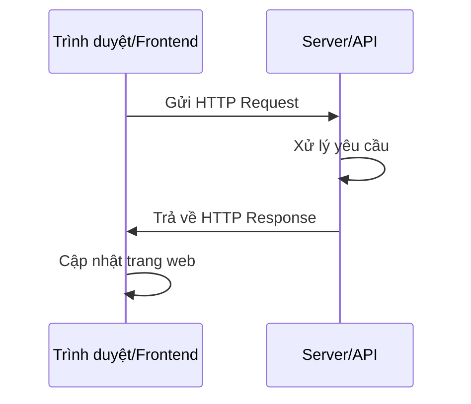
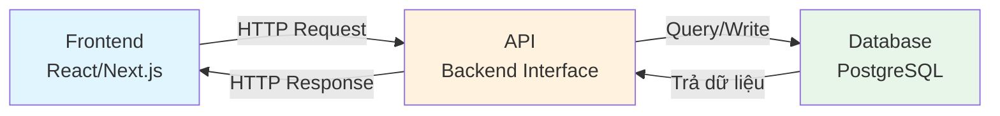

# 4.4 Cơ bản về API và HTTP 🟢

> **Đọc xong phần này, bạn sẽ thu hoạch được:**
>
> - Hiểu khái niệm và tác dụng của API
> - Nắm vững nguyên lý cơ bản của giao thức HTTP
> - Học cách hiểu cấu trúc của HTTP Request và Response
> - Nắm vững ý nghĩa của các mã trạng thái HTTP (Status Code) phổ biến
> - Hiểu quy trình tương tác cơ bản giữa Frontend và Backend

> Giao thức HTTP là "ngôn ngữ" tương tác Frontend-Backend, hiểu nguyên lý hoạt động của nó giúp bạn định vị vấn đề nhanh hơn.

---

## Dẫn nhập

Bài trước bạn đã học cách đọc hiểu logic code cơ bản. Nhưng một ứng dụng hoàn chỉnh không chỉ là code chạy trên máy —— nó cần giao tiếp với server, lấy dữ liệu, gửi thao tác. Sự giao tiếp này được thực hiện thông qua **API** và **giao thức HTTP**.

Hiểu nguyên lý hoạt động của HTTP, giúp bạn mô tả nhu cầu chính xác hơn khi cộng tác với AI, và cũng có năng lực tra soát khi gặp sự cố.

---

## API là gì

**API (Application Programming Interface, Giao diện lập trình ứng dụng)** là quy ước giao tiếp giữa các phần mềm khác nhau.

Trong phát triển Web, API thường chỉ **Web API** hoặc **HTTP API**, tức là giao diện giao tiếp thông qua giao thức HTTP. Frontend gọi API của Backend để lấy dữ liệu hoặc gửi thao tác.

::: tip API giống như Hàm (Function)

Còn nhớ bài trước nói về hàm không? API về bản chất chính là **hàm từ xa (remote function)**.

- **Hàm**: Định nghĩa trong code, nhận tham số, trả về kết quả
- **API**: Định nghĩa trên server, nhận HTTP Request (tham số), trả về HTTP Response (kết quả)

Gọi API cũng giống như gọi hàm:

- Gọi hàm: `calculatePrice(100, 2)` → Trả về `200`
- Gọi API: `GET /api/price?unit=100&quantity=2` → Trả về `{ "total": 200 }`

Sự khác biệt duy nhất: Hàm chạy ở máy cục bộ, API chạy trên server từ xa.
:::

::: tip Ví dụ nhà hàng

Hãy tưởng tượng API như thực đơn nhà hàng:

- Frontend là Khách hàng
- Backend là Nhà bếp
- API là Thực đơn —— cho khách biết có thể gọi món gì, tên món là gì
- HTTP Request là Phục vụ bàn —— mang order của khách vào bếp, và bưng món ăn ra

:::

---

## Quy trình giao tiếp HTTP

Giao tiếp HTTP dựa trên mô hình **Request - Response** (Yêu cầu - Phản hồi). Có thể tưởng tượng HTTP Request như một phong bì thư gửi đi xa: Trên phong bì ghi địa chỉ người nhận (URL), bên trong chứa lời bạn muốn nói (Request Body), và một số nhãn dán mô tả tính chất bức thư (Headers). Server nhận thư xong, mở ra đọc, viết một bức thư hồi âm (Response), rồi gửi lại cho bạn.

Ví dụ này giúp hiểu bản chất của HTTP: Nó là một **giao thức văn bản**, mọi thông tin đều được truyền dưới dạng văn bản con người đọc được. Khi bạn mở bảng Network trong công cụ Developer Tools của trình duyệt, những dòng request bạn thấy thực chất chính là danh sách chi tiết của những "phong bì thư" này.



1. Frontend gửi HTTP Request
2. Server nhận và xử lý yêu cầu
3. Server trả về HTTP Response
4. Frontend dựa vào phản hồi để cập nhật trang web

---

## Cấu thành của HTTP Request

Một HTTP Request hoàn chỉnh bao gồm 4 phần cốt lõi:

### Phương thức (Method)

Bảo cho server biết bạn muốn làm loại việc gì:

| Phương thức   | Tác dụng    | Ví dụ                  |
| ------------- | ----------- | ---------------------- |
| **GET**       | Đọc dữ liệu | Lấy danh sách bài viết |
| **POST**      | Tạo dữ liệu | Gửi form đăng ký       |
| **PUT/PATCH** | Sửa dữ liệu | Cập nhật hồ sơ cá nhân |
| **DELETE**    | Xóa dữ liệu | Xóa một bài viết       |

### URL (Đường dẫn)

Chỉ định địa chỉ tài nguyên cần thao tác:

```
https://api.example.com/users/123
│       │                │      │
│       │                │      └── ID người dùng
│       │                └── Đường dẫn tài nguyên
│       └── Tên miền
└── Giao thức
```

### Headers (Thông tin đầu mục)

Mang theo siêu dữ liệu (metadata), như xác thực danh tính, định dạng dữ liệu:

| Header thường gặp | Giải thích                          |
| ----------------- | ----------------------------------- |
| Authorization     | Token xác thực danh tính            |
| Content-Type      | Định dạng dữ liệu của request body  |
| Accept            | Định dạng dữ liệu mong muốn nhận về |

### Body (Thân nội dung)

Nội dung dữ liệu thực tế gửi đi, thường dùng định dạng JSON:

```json
{
  "title": "Tiêu đề bài viết",
  "content": "Nội dung bài viết"
}
```

---

## Cấu thành của HTTP Response

HTTP Response cũng bao gồm nhiều phần:

### Mã trạng thái (Status Code)

Ba chữ số, biểu thị kết quả xử lý yêu cầu. Thiết kế mã trạng thái tuân theo quy luật đơn giản: Chữ số đầu tiên biểu thị loại phản hồi, hai chữ số sau biểu thị chi tiết. Thiết kế này giúp bạn dù gặp mã lạ cũng đoán được đại khái tình hình dựa vào số đầu.

| Mã trạng thái                 | Ý nghĩa           | Ngữ cảnh thường gặp               |
| ----------------------------- | ----------------- | --------------------------------- |
| **200 OK**                    | Thành công        | Yêu cầu hoàn thành thành công     |
| **201 Created**               | Đã tạo            | POST tạo tài nguyên thành công    |
| **204 No Content**            | Không nội dung    | DELETE xóa thành công             |
| **400 Bad Request**           | Yêu cầu lỗi       | Định dạng tham số sai             |
| **401 Unauthorized**          | Chưa xác thực     | Thiếu token hoặc token vô hiệu    |
| **403 Forbidden**             | Cấm truy cập      | Có token nhưng không đủ quyền     |
| **404 Not Found**             | Không tìm thấy    | Tài nguyên không tồn tại          |
| **429 Too Many Requests**     | Quá nhiều yêu cầu | Bị giới hạn tần suất (rate limit) |
| **500 Internal Server Error** | Lỗi server        | Server nội bộ bị lỗi              |

::: tip Mẹo nhớ nhanh Status Code

- **2xx**: Thành công rồi
- **4xx**: Lỗi tại bạn (Client gửi request sai)
- **5xx**: Lỗi tại server (Backend bị lỗi)

:::

### Headers (Đầu mục phản hồi)

Chứa metadata của phản hồi:

| Header thường gặp | Giải thích                          |
| ----------------- | ----------------------------------- |
| Content-Type      | Định dạng dữ liệu của response body |
| Content-Length    | Độ dài byte của response body       |

### Body (Thân phản hồi)

Nội dung dữ liệu server trả về:

```json
{
  "id": "123",
  "title": "Tiêu đề bài viết",
  "content": "Nội dung bài viết",
  "createdAt": "2025-01-28T10:00:00Z"
}
```

---

## Ví dụ hoàn chỉnh: Sửa nickname người dùng

Dưới đây là ví dụ về một cặp HTTP Request và Response hoàn chỉnh:

**Request:**

```http
PATCH /api/users/123 HTTP/1.1
Host: api.example.com
Authorization: Bearer your_token_here
Content-Type: application/json

{
  "nickname": "Nickname Mới"
}
```

**Response:**

```http
HTTP/1.1 200 OK
Content-Type: application/json

{
  "id": "123",
  "nickname": "Nickname Mới",
  "updatedAt": "2025-01-28T10:00:00Z"
}
```

---

## Tra soát vấn đề thường gặp

Hiểu cấu trúc HTTP giúp định vị vấn đề nhanh chóng:

| Hiện tượng            | Nguyên nhân khả nghi                | Cách kiểm tra                                              |
| --------------------- | ----------------------------------- | ---------------------------------------------------------- |
| 401 Unauthorized      | Token vô hiệu hoặc hết hạn          | Kiểm tra Authorization Header                              |
| 404 Not Found         | Sai đường dẫn URL                   | Kiểm tra path request có đúng không                        |
| Dữ liệu hiển thị lỗi  | Tên trường không khớp               | Kiểm tra format dữ liệu trả về có khớp code Frontend không |
| 429 Too Many Requests | Chạm ngưỡng rate limit              | Giảm tần suất request hoặc thêm logic thử lại (retry)      |
| Lỗi mạng              | Server không phản hồi hoặc rớt mạng | Kiểm tra kết nối mạng và trạng thái server                 |

### Dữ liệu không khớp định dạng

Kể cả khi Status Code là 200 OK, vấn đề định dạng dữ liệu vẫn có thể khiến code lỗi:

- Tên trường không khớp: Backend trả `userName`, Frontend dùng `username`
- Kiểu dữ liệu không khớp: Backend trả chuỗi `"123"`, Frontend cần số `123`
- Cấu trúc không khớp: Backend trả mảng, Frontend cần đối tượng

AI biết cách xử lý chuyển đổi định dạng và ánh xạ trường, gặp loại lỗi này cứ bảo nó "Dữ liệu định dạng không khớp" là được.

Hiểu bản chất văn bản của giao thức HTTP rất có ích cho việc debug. Khi bạn xem một request trong Developer Tools, bạn thấy Headers, Status Code, Response Body, tất cả đều là thành phần của giao thức HTTP. Chúng truyền tải trên mạng dưới dạng văn bản thuần túy, chỉ là được trình duyệt sắp xếp lại cho dễ đọc. Nếu dùng công cụ dòng lệnh như curl, bạn sẽ thấy bộ mặt nguyên thủy của chúng —— những dòng văn bản thuần túy, mỗi dòng cách nhau bởi dấu xuống dòng, Headers và Body cách nhau bởi một dòng trống. Sự minh bạch này có nghĩa là bạn có thể nhìn thấy chính xác từng bit thông tin trao đổi giữa Frontend và Backend, không có hộp đen nào cả.

---

## Định dạng dữ liệu JSON

JSON (JavaScript Object Notation) là định dạng dữ liệu phổ biến nhất cho Web API.

**Đặc điểm của JSON**:

- Dùng ngoặc nhọn `{}` biểu thị đối tượng (Object)
- Dùng ngoặc vuông `[]` biểu thị mảng (Array)
- Dữ liệu tổ chức theo cặp "Key: Value"
- Key bắt buộc phải bao quanh bởi dấu ngoặc kép

**Ví dụ**:

```json
{
  "users": [
    {
      "id": "1",
      "name": "Trương Tam",
      "email": "truong@example.com"
    },
    {
      "id": "2",
      "name": "Lý Tứ",
      "email": "ly@example.com"
    }
  ],
  "total": 2,
  "page": 1
}
```

::: tip JSON là ngôn ngữ chung

JSON là "tiếng phổ thông" giữa các ngôn ngữ lập trình. Python, JavaScript, Java, Go... đều có thể dễ dàng phân tích và tạo file JSON, điều này khiến nó trở thành tiêu chuẩn dữ liệu cho Web API.

:::

---

## Tương tác Frontend-Backend



---

## Câu hỏi thường gặp

### Q1: Có cần nhớ hết HTTP Status Code không?

Không cần. Nhớ mấy cái hay gặp nhất (200, 401, 404, 500) là đủ dùng, còn lại tra Google là ra.

### Q2: GET và POST khác nhau gì?

GET dùng để đọc dữ liệu, tham số thường nằm trên URL; POST dùng để tạo dữ liệu, tham số nằm trong Body. GET có thể được cache, POST thì không.

### Q3: Test API thế nào?

Có thể dùng các công cụ sau:

- Trình duyệt Developer Tools (tab Network)
- Postman hoặc Insomnia (Công cụ test API chuyên dụng)
- Công cụ dòng lệnh curl
- Nhờ AI viết code test

### Q4: HTTPS và HTTP khác nhau gì?

HTTPS là HTTP có mã hóa, dữ liệu truyền đi được mã hóa an toàn hơn. Website hiện đại đều nên dùng HTTPS.

---

## Trọng điểm cốt lõi

- ✅ API là giao diện giao tiếp Frontend-Backend
- ✅ HTTP dựa trên mô hình "Request - Response"
- ✅ HTTP Request gồm: Method, URL, Headers, Body
- ✅ HTTP Response gồm: Status Code, Headers, Body
- ✅ 2xx Thành công, 4xx Lỗi phía khách, 5xx Lỗi phía chủ
- ✅ JSON là định dạng dữ liệu chuẩn của Web API
- ✅ Hiểu cấu trúc HTTP giúp định vị vấn đề nhanh chóng

Hiểu kiến thức cơ bản về giao tiếp HTTP rồi, tiếp theo sẽ tìm hiểu khái niệm tách biệt Frontend-Backend.

---

## Nội dung liên quan

- Trước đó: [1.3 Cơ bản về Trình duyệt và Server](../01-environment-setup/03-browser-server_vi.md)
- Trước đó: [4.3 Cách đọc hiểu code AI sinh ra](./03-programming-basics_vi.md)
- Chi tiết: [4.5 Khái niệm tách biệt Frontend-Backend](./05-frontend-backend-separation_vi.md)
