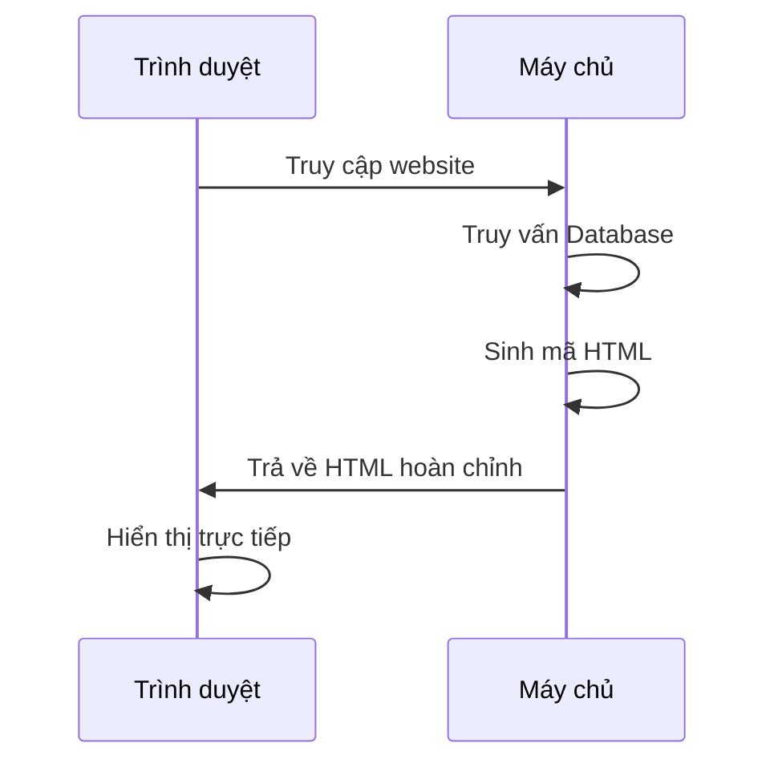
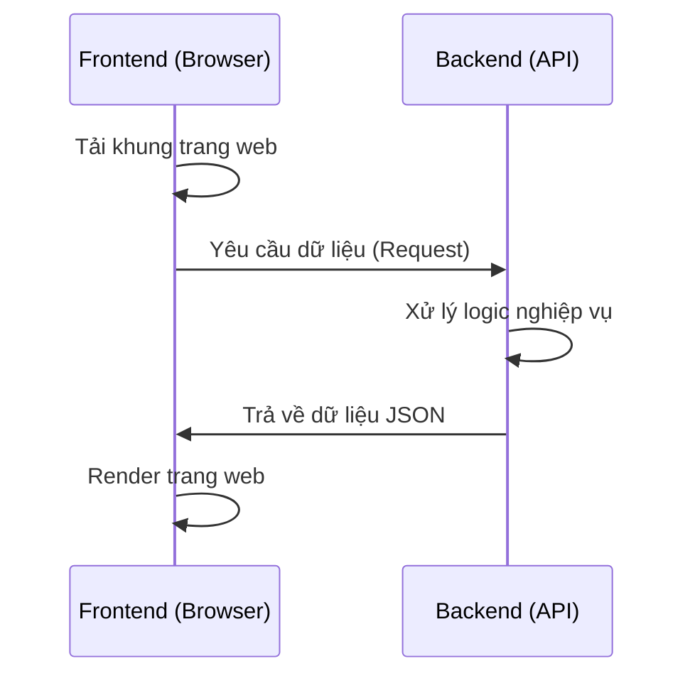
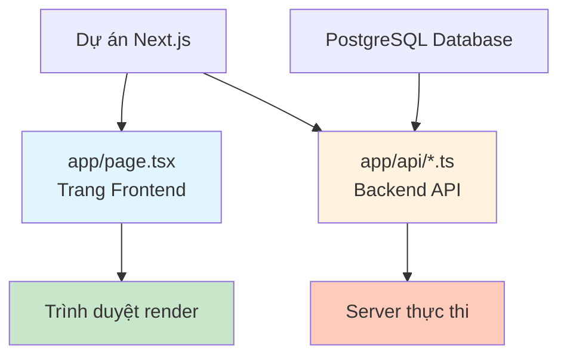
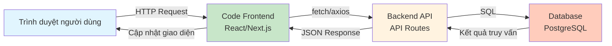

# 4.5 Khái niệm tách biệt Frontend-Backend 🟢

> **Đọc xong phần này, bạn sẽ thu hoạch được:**
>
> - Hiểu phân công trách nhiệm giữa Frontend và Backend
> - Nắm vững mô hình kiến trúc tách biệt Frontend-Backend
> - Hiểu cách các Fullstack Framework đơn giản hóa việc phát triển
> - Hiểu tầm quan trọng của tư duy module hóa

> Frontend phụ trách "hiển thị", Backend phụ trách "xử lý", hai bên giao tiếp thông qua API.

---

## Trách nhiệm của Frontend và Backend

### Frontend (Phía khách - Client side)

Frontend chạy trên trình duyệt của người dùng, chịu trách nhiệm cho mọi thứ người dùng nhìn thấy và thao tác:

| Trách nhiệm          | Giải thích                                          |
| -------------------- | --------------------------------------------------- |
| Render trang         | Chuyển đổi HTML, CSS thành giao diện trực quan      |
| Tương tác người dùng | Phản hồi các thao tác click, nhập liệu...           |
| Hiển thị dữ liệu     | Trình bày dữ liệu Backend trả về cho người dùng xem |
| Thu thập dữ liệu     | Thu thập dữ liệu người dùng nhập và gửi về Backend  |

### Backend (Phía chủ - Server side)

Backend chạy trên máy chủ, chịu trách nhiệm cho các logic nghiệp vụ mà người dùng không nhìn thấy:

| Trách nhiệm        | Giải thích                                     |
| ------------------ | ---------------------------------------------- |
| Logic nghiệp vụ    | Xử lý các quy tắc nghiệp vụ cốt lõi            |
| Lưu trữ dữ liệu    | Tương tác với cơ sở dữ liệu để lưu và truy vấn |
| Xác thực danh tính | Xác minh danh tính và quyền hạn người dùng     |
| Dịch vụ bên ngoài  | Gọi các API của bên thứ 3                      |

Sự phân công này có nguồn gốc lịch sử. Thời kỳ đầu của Web, server trực tiếp sinh ra trang HTML hoàn chỉnh gửi cho trình duyệt, trình duyệt chỉ việc hiển thị. Khi năng lực JavaScript mạnh lên và công nghệ AJAX xuất hiện, trình duyệt bắt đầu đảm nhận nhiều việc render hơn, Backend chuyển sang chuyên cung cấp dữ liệu. Sự tiến hóa này biến Web từ "trang web" thành "ứng dụng web" —— trải nghiệm người dùng tiệm cận phần mềm Native, tương tác mượt mà hơn, chức năng mạnh mẽ hơn. Hiểu quá trình này giúp bạn nắm bắt bản chất của tách biệt Frontend-Backend: Nó không phải là một lựa chọn công nghệ cụ thể, mà là tư duy kiến trúc để mỗi bên chuyên chú vào sở trường của mình.

---

## Mô hình truyền thống vs Tách biệt Frontend-Backend

### Mô hình truyền thống (Server-Side Rendering - SSR Cổ điển)

Thời Web sơ khai, trang web được server sinh ra hoàn chỉnh dưới dạng HTML rồi gửi cho trình duyệt:



Đặc điểm của mô hình này:

- Server sinh HTML hoàn chỉnh
- Trình duyệt chỉ việc hiển thị
- Chuyển trang phải tải lại toàn bộ
- Code Frontend và Backend dính chùm với nhau (Coupling)

### Mô hình tách biệt Frontend-Backend

Ứng dụng Web hiện đại dùng kiến trúc tách biệt:



Đặc điểm của mô hình này:

- Frontend chịu trách nhiệm render trang
- Backend chỉ cung cấp API dữ liệu
- Giao tiếp bằng định dạng JSON
- Frontend và Backend có thể phát triển và deploy độc lập

---

## Lợi thế của tách biệt Frontend-Backend

| Lợi thế                  | Giải thích                                                      |
| ------------------------ | --------------------------------------------------------------- |
| **Trách nhiệm rõ ràng**  | Frontend chuyên tâm hiển thị, Backend chuyên tâm logic          |
| **Phát triển độc lập**   | Frontend và Backend có thể làm song song, không chờ đợi nhau    |
| **Giải phóng công nghệ** | Frontend và Backend có thể dùng Tech Stack khác nhau            |
| **Tái sử dụng mạnh**     | Một bộ API có thể phục vụ cả Web, App Mobile và các client khác |
| **Trải nghiệm tốt hơn**  | Chuyển trang không cần tải lại, tương tác mượt mà               |

---

## Sự trỗi dậy của Fullstack Framework

Cùng với sự phát triển của hệ sinh thái JavaScript, các **Fullstack Framework** như Next.js xuất hiện. Loại framework này cho phép để code Frontend và Backend trong cùng một dự án, viết bằng cùng một ngôn ngữ (TypeScript), nhưng phân công trách nhiệm vẫn không đổi:



Lợi thế của Fullstack Framework:

- **Thống nhất ngôn ngữ**: Cả Frontend và Backend đều dùng TypeScript
- **Chia sẻ kiểu dữ liệu**: Định nghĩa kiểu có thể dùng chung cho cả hai đầu
- **Đơn giản hóa Deploy**: Một dự án chứa cả Frontend lẫn Backend
- **Hiệu suất phát triển**: Giảm bớt việc chuyển đổi ngữ cảnh (Context Switching)

::: tip Năng lực Fullstack của Next.js

Tính năng API Routes của Next.js cho phép bạn viết code Backend ngay trong dự án. Những code này chạy phía server, có thể truy cập database và gọi API bên ngoài một cách an toàn, trong khi code Frontend chạy trên trình duyệt đảm nhận việc hiển thị và tương tác.

:::

---

## Tư duy Module hóa

Dù có dùng Fullstack Framework hay không, bạn vẫn nên giữ tư duy Module hóa: Chia nhỏ chức năng thành các module khác nhau, thay vì nhét tất cả code vào một file.

Giá trị của tư duy Module hóa nằm ở việc giảm độ phức tạp nhận thức. Khi dự án chỉ có vài trăm dòng code, để chung một file cũng không sao. Nhưng khi chức năng tăng lên, lượng code phình to đến hàng ngàn hàng vạn dòng, không có phân chia module rõ ràng thì việc hiểu và bảo trì sẽ cực kỳ khó khăn —— bạn phải tìm kiếm mục tiêu trong biển code hỗn loạn, sửa chỗ này sợ hỏng chỗ kia. Bản chất của Module hóa là chiến lược "Chia để trị": Chia vấn đề lớn thành các vấn đề nhỏ, mỗi vấn đề nhỏ do một module độc lập giải quyết, các module giao tiếp qua giao diện rõ ràng. Điều này không chỉ giúp code dễ hiểu hơn, mà còn giúp AI định vị và xử lý chức năng chính xác hơn.

### Phân chia Module điển hình

```
src/
├── app/              # Next.js App Router
│   ├── page.tsx      # Trang Frontend
│   └── api/          # API Routes
│       ├── auth/     # Liên quan xác thực
│       ├── posts/    # Liên quan bài viết
│       └── users/    # Liên quan người dùng
├── components/       # Component tái sử dụng
├── lib/             # Hàm tiện ích (Utility)
└── db/              # Liên quan Database
```

### Lợi ích của Module hóa

| Lợi ích       | Giải thích                                                         |
| ------------- | ------------------------------------------------------------------ |
| Dễ bảo trì    | Mỗi module trách nhiệm đơn nhất, phạm vi ảnh hưởng khi sửa đổi nhỏ |
| Dễ hiểu       | Cấu trúc thư mục rõ ràng giúp dự án dễ đọc                         |
| Dễ test       | Module nhỏ dễ viết Unit Test hơn                                   |
| Cộng tác team | Nhiều người có thể làm các module khác nhau                        |
| Thân thiện AI | AI có thể định vị code liên quan nhanh hơn                         |

---

## Sơ đồ giao tiếp Frontend-Backend



---

## Client-side và Server-side

Hiểu code chạy ở đâu là chìa khóa để viết tốt ứng dụng Fullstack:

| Vị trí code          | Môi trường thực thi | Truy cập được cái gì                                       |
| -------------------- | ------------------- | ---------------------------------------------------------- |
| **Client-side Code** | Trình duyệt         | DOM trang web, thiết bị người dùng (hạn chế), Cookie       |
| **Server-side Code** | Máy chủ             | Hệ thống file, Database, mọi request mạng, biến môi trường |

**Client-side (Phía khách)**: Trình duyệt của người dùng. Code Frontend chạy ở đây, phụ trách hiển thị và tương tác. Nhưng Client không thể truy cập trực tiếp Database hoặc thông tin nhạy cảm.

**Server-side (Phía chủ)**: Máy chủ từ xa. Code Backend chạy ở đây, có thể truy cập Database an toàn, gọi API bên ngoài, xử lý thông tin nhạy cảm. Người dùng không nhìn thấy code phía Server.

Sự tách biệt này là nền tảng của bảo mật Web —— bạn không thể để mật khẩu Database trong code Client, vì bất kỳ ai cũng có thể xem mã nguồn trang web (View Source).

---

## Khái niệm Render Template

Trong mô hình Server-Side Rendering truyền thống (như Flask, Django), **Template Engine** là kỹ thuật sinh HTML phía server:

```
Server: Template + Dữ liệu → Render → HTML hoàn chỉnh → Gửi cho Browser
```

Template thường bao gồm:

- Cấu trúc HTML tĩnh
- Placeholder (như `{{ username }}`) để điền dữ liệu động
- Logic đơn giản (vòng lặp, điều kiện)

**So sánh React và Template**:

- **Template truyền thống** (như Jinja2): Render phía server, sinh HTML xong gửi đi.
- **React Component**: Render phía client (hoặc server), cập nhật giao diện động bằng JavaScript.

Next.js kết hợp cả hai mô hình:

- **Server Components**: Giống template truyền thống, render ở server, có thể truy cập Database.
- **Client Components**: Giống ứng dụng React, chạy ở browser, phụ trách tương tác.

---

## Phán đoán vị trí code

Khi viết code phải rõ code này chạy ở đâu:

| Vị trí code           | Môi trường | Truy cập được                         |
| --------------------- | ---------- | ------------------------------------- |
| **Code Frontend**     | Browser    | DOM, thiết bị người dùng              |
| **Code Backend**      | Server     | Hệ thống file, Database, Request mạng |
| **API Routes**        | Server     | Tài nguyên server, Database           |
| **Server Components** | Server     | Database, Hệ thống file               |

::: tip Đặc thù của Next.js

Server Components của Next.js render trên server, có thể truy cập Database an toàn. Client Components chạy trên browser, chỉ có thể giao tiếp với Backend qua API.

:::

---

## Câu hỏi thường gặp

### Q1: Fullstack Framework và Tách biệt Frontend-Backend có mâu thuẫn không?

Không. Fullstack Framework là phương thức phát triển, Tách biệt Frontend-Backend là mô hình kiến trúc. Fullstack Framework để code Frontend và Backend chung một dự án, nhưng trách nhiệm của chúng vẫn tách biệt rõ ràng.

### Q2: Khi nào cần tách biệt Frontend-Backend (chia 2 dự án riêng)?

Team đông người cần cộng tác, cần hỗ trợ nhiều loại Client (Web + App), Tech Stack Frontend và Backend quá khác biệt... lúc đó tách riêng dự án sẽ có giá trị hơn. Dự án cá nhân dùng Fullstack Framework hiệu quả hơn.

### Q3: Chia module nhỏ đến mức nào?

Lấy nguyên tắc "Trách nhiệm đơn nhất" (Single Responsibility) làm chuẩn. Một module chịu trách nhiệm cho một lĩnh vực chức năng, ví dụ module `auth` chỉ lo xác thực, `posts` chỉ lo bài viết. Tránh chia quá vụn (mỗi file vài dòng) hoặc quá to (một file chứa tất cả).

### Q4: Làm sao biết code nên viết ở Frontend hay Backend?

Code cần truy cập Database, gọi API bên ngoài, xử lý thông tin nhạy cảm bắt buộc phải ở Backend. Code render UI thuần túy, tương tác người dùng thì ở Frontend. Nếu không chắc, ưu tiên để Backend cho an toàn.

---

## Trọng điểm cốt lõi

- ✅ Frontend lo hiển thị, Backend lo xử lý
- ✅ Tách biệt Frontend-Backend nâng cao hiệu suất phát triển và khả năng tái sử dụng code
- ✅ Fullstack Framework dùng chung ngôn ngữ nhưng vẫn phân chia trách nhiệm
- ✅ Tư duy Module hóa là chìa khóa để bảo trì dự án lâu dài
- ✅ Biết rõ code chạy ở đâu là tiền đề để viết ứng dụng Fullstack tốt

Hiểu về tách biệt Frontend-Backend rồi, tiếp theo sẽ học cách tích hợp API bên ngoài.

---

## Nội dung liên quan

- Trước đó: [1.3 Cơ bản về Trình duyệt và Server](../01-environment-setup/03-browser-server_vi.md)
- Trước đó: [4.4 Cơ bản về API và HTTP](./04-api-and-http_vi.md)
- Chi tiết: [4.6 Định dạng file cấu hình](./06-config-formats_vi.md)
