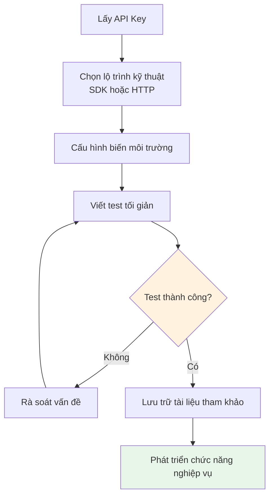

# 4.7 Thực chiến tích hợp API 🟢

> **Đọc xong phần này, bạn sẽ thu hoạch được:**
>
> - Nắm vững quy trình trọn vẹn tích hợp API
> - Hiểu sự khác biệt giữa SDK và HTTP request trực tiếp
> - Học cách quản lý API Key an toàn
> - Nắm vững phương pháp xử lý lỗi thường gặp
> - Hiểu chiến lược xử lý giới hạn tần suất (rate limit) và quá giờ (timeout)

> Tích hợp API bên ngoài là cách mở rộng năng lực ứng dụng phổ biến nhất, như kết nối năng lực AI, dịch vụ bản đồ...

---

## Tổng quan về tích hợp API

Một điều tuyệt vời của phát triển phần mềm hiện đại là: Bạn không cần xây dựng mọi thứ từ con số 0. Bất kể bạn muốn làm gì —— cho AI đối thoại, hiển thị bản đồ, xử lý thanh toán —— đều có các dịch vụ sẵn có sẵn sàng làm những việc nặng nhọc đó cho bạn. Bạn chỉ cần giao tiếp với họ thông qua **API**.

API (Application Programming Interface) là ngôn ngữ giao tiếp giữa các ứng dụng. Trước đây, hai phần mềm muốn "nói chuyện" với nhau cần giao thức phức tạp và phát triển kết nối chuyên biệt. Giờ đây, đa số các dịch vụ đều cung cấp API chuẩn hóa, bạn chỉ cần gửi yêu cầu theo định dạng họ quy ước là sẽ nhận được kết quả mong muốn.

### Tại sao API lại quan trọng thế?

Hãy tưởng tượng bạn muốn làm một ứng dụng du lịch. Bạn cần đánh dấu địa điểm trên bản đồ, hiển thị thời tiết địa phương, xử lý khách hàng thanh toán. Trước khi có API, bạn phải tự xây dựng máy chủ bản đồ, thuê chuyên gia khí tượng, kết nối hệ thống ngân hàng. Còn bây giờ? Gọi Maps API, gọi Weather API, gọi Payment API —— bạn chỉ cần tập trung vào logic nghiệp vụ cốt lõi của mình, phần còn lại cứ giao cho chuyên gia.

Đây không chỉ là vấn đề hiệu suất, mà là vấn đề về khả năng. API cho phép lập trình viên cá nhân cũng có thể tạo ra sản phẩm mà trước đây chỉ công ty lớn mới làm nổi. Bạn có thể lắp ghép dữ liệu và năng lực của các dịch vụ khác nhau như xếp hình để tạo ra những thứ hoàn toàn mới.

### Giao tiếp bất đồng bộ và định dạng dữ liệu

Ứng dụng Web hiện đại sử dụng công nghệ **AJAX** (Asynchronous JavaScript and XML) để trao đổi dữ liệu với server. Sau thao tác của người dùng, JavaScript gửi yêu cầu ngầm (background), server trả về dữ liệu, trang web cập nhật cục bộ mà không cần tải lại toàn trang. Cách thức bất đồng bộ này giúp tương tác mượt mà hơn.

API thường trả về dữ liệu định dạng **JSON** (xem 4.6 Định dạng file cấu hình). JSON là cấu trúc dữ liệu thuần túy, ngôn ngữ lập trình nào cũng phân tích được, Frontend có thể linh hoạt render nó thành bất kỳ giao diện nào.

### Các năng lực API phổ biến

| Năng lực                | API phổ biến          | Bạn làm được gì                   |
| ----------------------- | --------------------- | --------------------------------- |
| **AI Đối thoại**        | OpenAI, Anthropic     | Chatbot, tạo nội dung             |
| **Dịch vụ bản đồ**      | Google Maps, Mapbox   | Đánh dấu vị trí, tìm đường        |
| **Năng lực thanh toán** | Stripe, PayPal        | Thu tiền online, quản lý gói cước |
| **Lưu trữ dữ liệu**     | Cloudflare R2, AWS S3 | Upload file, sao lưu dữ liệu      |
| **Gửi email**           | Resend, SendGrid      | Email thông báo, email Marketing  |
| **Tin nhắn/Thoại**      | Twilio                | Mã xác thực, thông báo thoại      |

Đa số API đều rất thân thiện:

- Cung cấp **hạn mức miễn phí** cho bạn test và dùng thử
- Có **tài liệu lập trình viên** chi tiết và code mẫu
- Cung cấp **SDK chính thức** giúp bạn tích hợp nhanh

---

## 6 bước tích hợp API

### Bước 1: Lấy chứng thực (Credentials)

Giống như bạn cần chứng minh thư để nhận phòng khách sạn, sử dụng API cũng cần chứng minh danh tính. Chứng minh thư này chính là **API Key**.

Quá trình lấy API Key thường rất đơn giản:

1. Tìm đến nền tảng mở (Open Platform) hoặc tài liệu developer chính thức
2. Đăng ký tài khoản developer
3. Tạo ứng dụng hoặc dự án (điền các thông tin cơ bản)
4. Sinh API Key

::: warning An toàn là trên hết

API Key giống như mật khẩu thẻ ngân hàng của bạn —— một khi lộ ra, người khác có thể mạo danh bạn sử dụng dịch vụ, thậm chí tiêu sạch hạn mức của bạn. Vì thế:

- **Không bao giờ** commit lên Git repo
- **Không bao giờ** viết trong code Frontend (người dùng sẽ thấy)
- **Không bao giờ** công bố ở nơi công cộng

:::

### Bước 2: Chọn lộ trình kỹ thuật

Có API Key rồi, bạn cần quyết định gọi API thế nào. Có 2 cách: **SDK** và **HTTP Request trực tiếp**.

| Cách thức        | Ưu điểm                                             | Nhược điểm              | Ngữ cảnh sử dụng               |
| ---------------- | --------------------------------------------------- | ----------------------- | ------------------------------ |
| **SDK**          | Chính chủ đóng gói, kiểu (type) đầy đủ, tài liệu đủ | Cần cài đặt dependency  | Đa số trường hợp               |
| **HTTP Request** | Không dependency, nhẹ                               | Phải tự xử lý giao thức | Gọi đơn giản hoặc không có SDK |

**SDK là gì?**

SDK (Software Development Kit) là "phiên dịch viên" do chính chủ cung cấp. Tưởng tượng: API nói tiếng Anh, code của bạn nói tiếng Việt. SDK là trợ lý giúp bạn dịch thuật thời gian thực.

Khi dùng SDK, bạn dùng ngôn ngữ quen thuộc để gọi hàm, SDK bên trong sẽ lo liệu các chi tiết như HTTP request, JSON serialization, xử lý lỗi... Quan trọng hơn, SDK chính chủ thường đã được test kỹ càng, xử lý tốt các trường hợp biên như timeout, retry, refresh token...

::: tip Tại sao ưu tiên dùng SDK?

SDK chính chủ đi kèm định nghĩa kiểu TypeScript (Type Definition) hoàn chỉnh. Điều này tương đương với việc cung cấp cho AI một tấm "bản đồ code" chi tiết —— nó biết chính xác có những chức năng nào, tham số điền gì, giá trị trả về là gì. Cái này đáng tin cậy hơn nhiều so với việc để AI đoán mò dựa trên tài liệu HTTP trắng trơn.

:::

Với ứng dụng AI, kiến nghị dùng **Vercel AI SDK**:

- Đơn giản hóa cực đại việc phát triển ứng dụng AI
- Xử lý các giao thức truyền dòng (streaming) phức tạp
- Giúp câu trả lời của AI hiện ra từng chữ theo thời gian thực

### Bước 3: Cấu hình biến môi trường

Bạn đã có API Key, giờ cần lưu nó an toàn trong code. Viết trực tiếp Key vào code là điều tối kỵ —— bất kỳ ai thấy code đều có thể lấy mất Key.

Cách làm đúng là dùng **Biến môi trường (Environment Variable)**:

```bash
# File .env
OPENAI_API_KEY=sk-xxx
ANTHROPIC_API_KEY=sk-ant-xxx
```

Biến môi trường giống như "tường lửa" giữa code và khóa bí mật:

- Chương trình tự động đọc cấu hình khi chạy
- File `.env` không được commit lên Git
- Môi trường khác nhau dùng khóa khác nhau

::: tip File .env

Trong dự án Next.js, file `.env.local` dùng để lưu biến môi trường cho phát triển cục bộ (local). Khi deploy lên môi trường Production, chỉ cần cấu hình biến môi trường tương ứng trong phần cài đặt của nền tảng deploy.

:::

### Bước 4: Viết test tối giản

Cấu hình xong SDK và API Key, bạn có thể nóng lòng muốn viết ngay chức năng nghiệp vụ. Nhưng khoan đã —— hãy viết một cái test đơn giản nhất trước.

Tại sao? Vì nếu bạn viết ngay chức năng phức tạp, lỡ có lỗi, bạn sẽ không biết là do cấu hình sai, Key vô hiệu, hay logic code có vấn đề. Còn một cái test tối giản chỉ cần xác minh một việc duy nhất: **Tôi có kết nối được API không?**

Code test này chỉ cần làm một việc: Gọi API một lần, xem có nhận được kết quả không. Nếu thành công, chứng tỏ cấu hình của bạn đúng, có thể tiếp tục phát triển. Nếu thất bại, AI có thể dựa vào thông tin lỗi để giúp bạn định vị vấn đề nhanh chóng.

Cấu hình xong SDK và API Key, **đừng vội viết chức năng nghiệp vụ**, hãy viết test tối giản trước:

```typescript
// Test kết nối API
import OpenAI from "openai";

const openai = new OpenAI();

async function testConnection() {
  const response = await openai.chat.completions.create({
    model: "gpt-4o-mini",
    messages: [{ role: "user", content: "Hello" }],
    max_tokens: 10,
  });

  console.log(response.choices[0].message.content);
}

testConnection();
```

Nếu test thành công, chứng tỏ:

- API Key hợp lệ
- Kết nối mạng bình thường
- Cấu hình SDK chính xác

Nếu test thất bại, AI sẽ dựa vào thông tin lỗi giúp bạn rà soát:

- Key điền sai?
- Mạng không thông?
- Xung đột phiên bản SDK?
- Hết hạn mức (quota)?

### Bước 5: Lưu trữ tài liệu tham khảo

Test thông rồi, cũng đừng vội viết tiếp. Hãy tổng hợp các thông tin quan trọng của API, lưu vào tài liệu.

Tại sao? Vì lần sau khi bạn bảo AI viết chức năng liên quan, nếu ném thẳng tài liệu này cho nó, nó sẽ viết code gọi API cực chuẩn. Nếu không bạn lại phải đi giải thích lại từng tham số, chi tiết.

Nội dung lưu trữ không cần phức tạp, ghi lại mấy cái này là đủ:

```markdown
# Tài liệu tham khảo API

## OpenAI Chat Completions

- Interface: POST https://api.openai.com/v1/chat/completions
- Tài liệu: https://platform.openai.com/docs/api-reference/chat

### Tham số request

- model: Tên model (ví dụ gpt-4o-mini)
- messages: Mảng tin nhắn hội thoại
- max_tokens: Số token tối đa sinh ra

### Ví dụ

\`\`\`typescript
const response = await openai.chat.completions.create({
model: 'gpt-4o-mini',
messages: [{ role: 'user', content: 'Xin chào' }],
});
\`\`\`
```

### Bước 6: Phát triển chức năng nghiệp vụ

Nền móng xong rồi, giờ bắt đầu xây nhà (viết logic nghiệp vụ). Bảo với AI bạn muốn làm chức năng gì, đưa kèm tài liệu API vừa lưu, nó sẽ viết code gọi API chính xác cho bạn.

::: tip Tránh gọi tần suất cao

Đừng gọi API liên tục trong vòng lặp:

- Vừa tốn hạn mức API
- Vừa dễ dính giới hạn tần suất (rate limit)
- Tốc độ phản hồi chậm

Hãy dùng cache hợp lý, dữ liệu giống nhau thì lưu lại dùng lại.

:::

---

## Xử lý lỗi thường gặp

### Giới hạn tần suất (Rate Limit)

Đa số API đều giới hạn tần suất gọi, vượt quá sẽ trả về `429 Too Many Requests`.

**Cách xử lý**:

- Thêm logic thử lại (retry) (đợi một chút rồi thử lại)
- Dùng hàng đợi (queue) để kiểm soát tần suất gửi request
- Phân tích xem có thể tối ưu logic gọi API không

### Xử lý quá giờ (Timeout)

Nếu API mãi không phản hồi, chương trình sẽ bị treo.

**Cách xử lý**:

- Thiết lập thời gian timeout
- Thêm logic hạ cấp (fallback) sau khi timeout
- Hiển thị thông báo lỗi thân thiện

### Xác thực thất bại

API Key hết hạn hoặc vô hiệu sẽ trả về `401 Unauthorized`.

**Cách xử lý**:

- Kiểm tra API Key xem có đúng không
- Xác nhận Key chưa hết hạn
- Kiểm tra xem còn đủ hạn mức gọi (quota) không

---

## Lưu đồ tích hợp API



---

## Thực hành tốt nhất về bảo mật

| Thực hành                      | Giải thích                                |
| ------------------------------ | ----------------------------------------- |
| Dùng biến môi trường           | Không viết API Key cứng vào code          |
| .gitignore loại trừ            | Đảm bảo file .env không bị commit         |
| Backend Proxy                  | Gọi API nhạy cảm thông qua Backend        |
| Nguyên tắc đặc quyền tối thiểu | Chỉ cấp cho API những quyền hạn cần thiết |
| Thay đổi định kỳ               | Định kỳ đổi API Key mới                   |

::: tip Frontend không được gọi trực tiếp API nhạy cảm

Đừng bao giờ gọi trực tiếp các API cần API Key từ code Frontend. API Key sẽ bị lộ cho tất cả mọi người, nguy cơ bị lạm dụng rất cao.

Cách làm đúng: Backend nhận request từ Frontend, Backend dùng API Key gọi API bên ngoài, rồi trả kết quả về cho Frontend.

:::

---

## Rủi ro khi phụ thuộc API

Dùng API ngoài tiện thật, nhưng có một rủi ro lớn bạn cần biết: **Đừng phụ thuộc quá mức vào một API duy nhất**.

**Dịch vụ có thể đóng cửa hoặc tăng giá.** Công ty cung cấp API có thể ngừng dịch vụ bất cứ lúc nào, đổi chính sách giá, hoặc cắt giảm mạnh hạn mức miễn phí. Nếu nghiệp vụ của bạn hoàn toàn dựa trên API đó, một khi nó "hắt hơi sổ mũi", ứng dụng của bạn cũng "cảm lạnh" theo.

**API có thể thay đổi.** Kể cả khi dịch vụ vẫn sống, interface của API cũng có thể thay đổi. Hôm nay trả về `user_name`, mai đổi thành `userName`. Sự thay đổi nhỏ nhặt này cũng đủ làm ứng dụng của bạn sập.

**Chiến lược đối phó:**

- **Dự phòng phương án B**: Nếu được, hãy tìm hiểu xem có API nào tương tự thay thế được không
- **Trừu tượng hóa (Abstraction/Wrapper)**: Đóng gói việc gọi API vào hàm riêng của mình, như vậy lỡ có đổi API thì chỉ cần sửa một chỗ
- **Cache dữ liệu quan trọng**: Đừng mỗi lần đều đi hỏi API, hãy lưu kết quả lại, giảm bớt sự phụ thuộc
- **Giám sát sức khỏe API**: Kiểm tra định kỳ xem API có phản hồi bình thường không

---

## Câu hỏi thường gặp

### Q1: Hết hạn mức API miễn phí thì làm sao?

Đa số nhà cung cấp API đều có gói trả phí. Cân nhắc lượng sử dụng của dự án để chọn gói phù hợp. Nếu chỉ để học tập, có thể xin ưu đãi cho giáo dục hoặc developer.

### Q2: Làm sao test API mà không tốn hạn mức?

Dùng Mock Data hoặc môi trường test (Sandbox). Nhiều nhà cung cấp API có chế độ Sandbox, trả về dữ liệu giả nhưng không tính phí.

### Q3: Xung đột phiên bản SDK thì sao?

Nhờ AI giải quyết. Báo cho nó thông báo lỗi cụ thể và phiên bản dependency, nó sẽ đưa ra tổ hợp phiên bản tương thích hoặc phương án thay thế.

### Q4: Quản lý API Key cho nhiều môi trường (Dev/Prod) thế nào?

Dùng các file biến môi trường khác nhau. Next.js hỗ trợ cấu hình đa môi trường `.env.local` (local), `.env.production` (production).

---

## Trọng điểm cốt lõi

- ✅ Tích hợp API tuân theo 6 bước: Lấy chứng thực → Chọn lộ trình → Cấu hình biến → Test → Lưu tài liệu → Phát triển
- ✅ Ưu tiên dùng SDK chính chủ, định nghĩa kiểu giúp AI chính xác hơn
- ✅ API Key bắt buộc phải lưu trong biến môi trường
- ✅ Viết test tối giản trước, thông rồi mới làm tiếp
- ✅ Chú ý các lỗi thường gặp: rate limit, timeout, xác thực thất bại
- ✅ API nhạy cảm bắt buộc phải gọi qua Backend, không được lộ ở Frontend

Hiểu cách tích hợp API rồi, tiếp theo sẽ học cách viết bản hướng dẫn dự án (README).

---

## Nội dung liên quan

- Trước đó: [4.4 Cơ bản về API và HTTP](./04-api-and-http_vi.md)
- Trước đó: [4.5 Khái niệm tách biệt Frontend-Backend](./05-frontend-backend-separation_vi.md)
- Trước đó: [4.6 Định dạng file cấu hình](./06-config-formats_vi.md)
- Chi tiết: [4.8 Cấu trúc bản hướng dẫn dự án](./08-readme-structure_vi.md)
