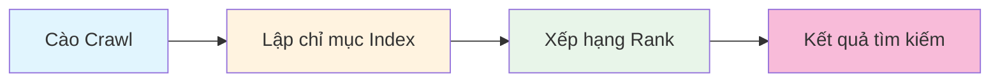

# 15.2 SEO Toàn tập 🔴

> **Đọc xong phần này, bạn sẽ gặt hái được:**
>
> - Hiểu nguyên lý cơ bản của SEO và cách công cụ tìm kiếm hoạt động
> - Nắm vững cấu hình Metadata, Sitemap, Robots.txt
> - Học phương pháp cốt lõi về tối ưu nội dung và SEO kỹ thuật
> - Hiểu về tối ưu tốc độ trang và Core Web Vitals
> - Nắm vững chiến lược tăng tốc index và tối ưu cho các nền tảng khác nhau

> Con bọ (crawler) của công cụ tìm kiếm là "kẻ mù", cần bạn chỉ đường cho nó. Cấu hình và tối ưu SEO chính là cung cấp những biển chỉ dẫn rõ ràng cho con bọ đó.

---

## SEO là gì?

**SEO (Search Engine Optimization - Tối ưu hóa công cụ tìm kiếm)** là phương pháp giúp trang web đạt thứ hạng tốt hơn trong kết quả tìm kiếm.

Công cụ tìm kiếm sử dụng con bọ (Crawler) để phát hiện và lập chỉ mục các trang web. Con bọ nhảy từ trang này sang trang khác theo các đường liên kết, thu thập thông tin và xây dựng chỉ mục.

### Giá trị của SEO

| Giá trị                   | Giải thích                                          |
| ------------------------- | --------------------------------------------------- |
| **Lưu lượng miễn phí**    | Không cần trả tiền quảng cáo cũng có người truy cập |
| **Lợi ích bền vững**      | Hiệu quả SEO tốt có thể duy trì lâu dài             |
| **Người dùng chính xác**  | Người tìm kiếm có nhu cầu rõ ràng                   |
| **Nhận diện thương hiệu** | Thứ hạng cao nâng cao uy tín thương hiệu            |

::: tip SEO là đầu tư dài hạn

SEO không giúp bạn lên top 1 sau một đêm, nhưng kiên trì lâu dài sẽ giúp trang web của bạn leo dần lên trong kết quả tìm kiếm.

:::

---

## Nguyên lý hoạt động của công cụ tìm kiếm

Công cụ tìm kiếm tổ chức thông tin qua 3 bước: Cào (Crawl), Lập chỉ mục (Index), Xếp hạng (Rank).



### 1. Cào (Crawling)

Công cụ tìm kiếm dùng con bọ (bot) để phát hiện và truy cập trang web, lần theo các liên kết để tìm ra trang mới.

### 2. Lập chỉ mục (Indexing)

Các trang do con bọ cào về sẽ được xử lý và lưu vào cơ sở dữ liệu tìm kiếm, xây dựng chỉ mục ngược (inverted index).

### 3. Xếp hạng (Ranking)

Sắp xếp các trang đã được lập chỉ mục dựa trên mức độ liên quan của nội dung, chất lượng trang, độ uy tín của website...

---

## Cấu hình SEO cơ bản

### Cấu hình Metadata

Metadata (siêu dữ liệu) là thông tin báo cho công cụ tìm kiếm biết nội dung trang web là gì. Trong Next.js, cấu hình qua đối tượng `metadata`, bao gồm các trường `title`, `description`, `keywords`, `authors`...

::: tip Nhờ AI giúp bạn cấu hình Metadata

Cần cấu hình metadata cho trang? Bạn có thể nói:

> "Giúp tôi cấu hình metadata cho layout gốc trong app/layout.tsx, thiết lập tiêu đề website, mô tả, thông tin tác giả."

:::

### Sitemap (Sơ đồ trang web)

Sitemap báo cho công cụ tìm kiếm biết website có những trang nào. Trong Next.js, tạo file `app/sitemap.ts`, export hàm mặc định trả về mảng kiểu `MetadataRoute.Sitemap`, bao gồm các trường `url`, `lastModified`, `changeFrequency`, `priority`.

::: tip Nhờ AI giúp bạn sinh Sitemap

Cần sinh Sitemap cho blog? Bạn có thể nói:

> "Giúp tôi tạo sitemap.ts cho dự án Next.js. Lấy danh sách bài viết từ hàm `getAllPosts()` trong `lib/posts.ts`, mỗi bài viết có trường slug và updatedAt. Trang chủ ưu tiên 1, trang bài viết ưu tiên 0.7, cập nhật hàng tuần."

:::

### Robots.txt

Robots.txt báo cho con bọ biết những trang nào được phép cào. Trong Next.js, tạo file `app/robots.ts`, export hàm mặc định trả về kiểu `MetadataRoute.Robots`, bao gồm `rules` (allow/disallow) và vị trí `sitemap`.

::: tip Nhờ AI giúp bạn cấu hình Robots.txt

Cần cấu hình quy tắc cho bọ? Bạn có thể nói:

> "Giúp tôi tạo robots.ts cho dự án Next.js, cho phép tất cả các bọ truy cập thư mục gốc, cấm truy cập thư mục /api/ và /admin/, vị trí Sitemap là https://example.com/sitemap.xml."

:::

---

## Tối ưu nội dung

Nội dung là cốt lõi của SEO.

### Tối ưu tiêu đề

| Nguyên tắc            | Giải thích                           |
| --------------------- | ------------------------------------ |
| **Từ khóa đặt trước** | Đặt từ khóa quan trọng ở đầu tiêu đề |
| **Độ dài vừa phải**   | 50-60 ký tự là tốt nhất              |
| **Tính duy nhất**     | Tiêu đề mỗi trang phải khác nhau     |

Cấu trúc tiêu đề tốt: `Từ khóa chính | Từ khóa phụ | Tên thương hiệu`

### Nguyên tắc E-E-A-T

Google nhấn mạnh E-E-A-T:

- **Experience (Kinh nghiệm)**: Tác giả có kinh nghiệm thực tế
- **Expertise (Chuyên môn)**: Nội dung thể hiện kiến thức chuyên sâu
- **Authoritativeness (Thẩm quyền)**: Độ uy tín của website/tác giả
- **Trustworthiness (Độ tin cậy)**: Mức độ đáng tin của nội dung

---

## SEO Kỹ thuật (Technical SEO)

### Cấu trúc trang

Sử dụng HTML ngữ nghĩa để giúp con bọ hiểu cấu trúc nội dung:

```html
<h1>Tiêu đề chính (Duy nhất mỗi trang)</h1>
<h2>Tiêu đề phụ cấp 1</h2>
<h3>Tiêu đề phụ cấp 2</h3>
<h2>Tiêu đề phụ cấp 1 khác</h2>
```

### Cấu trúc URL

| URL tốt                 | URL tệ                   |
| ----------------------- | ------------------------ |
| `/blog/cach-hoc-nextjs` | `/post?id=123`           |
| `/san-pham/laptop`      | `/products?type=1&cat=2` |

Nguyên tắc tối ưu URL:

- Sử dụng từ khóa mô tả
- Ngắn gọn súc tích
- Dùng gạch nối để phân cách từ
- Viết thường toàn bộ

### Tối ưu hình ảnh

```html

```

---

## Tối ưu tốc độ trang

Tốc độ trang là yếu tố xếp hạng, và cũng ảnh hưởng đến trải nghiệm người dùng.

### Core Web Vitals (Chỉ số thiết yếu về web)

| Chỉ số  | Mức tốt | Giải thích                                                   |
| ------- | ------- | ------------------------------------------------------------ |
| **LCP** | < 2.5s  | Largest Contentful Paint, tốc độ tải nội dung chính          |
| **FID** | < 100ms | First Input Delay, độ trễ tương tác (đang dần thay bằng INP) |
| **CLS** | < 0.1   | Cumulative Layout Shift, độ ổn định bố cục                   |

### Mẹo tối ưu

| Phương pháp                        | Giải thích                                 |
| ---------------------------------- | ------------------------------------------ |
| **Tối ưu ảnh**                     | Sử dụng định dạng WebP, nén dung lượng ảnh |
| **Chia nhỏ code (Code Splitting)** | Tải code theo nhu cầu, giảm tải ban đầu    |
| **Chiến lược Cache**               | Tận dụng cache trình duyệt và CDN          |
| **Nén tài nguyên**                 | Bật nén Gzip/Brotli                        |

---

## Dữ liệu có cấu trúc (Structured Data)

Dữ liệu có cấu trúc (Schema.org) giúp công cụ tìm kiếm hiểu rõ hơn về nội dung.

```html
<script type="application/ld+json">
  {
    "@context": "https://schema.org",
    "@type": "Article",
    "headline": "Tiêu đề bài viết",
    "author": {
      "@type": "Person",
      "name": "Tên tác giả"
    },
    "datePublished": "2025-01-28",
    "description": "Mô tả bài viết"
  }
</script>
```

### Các loại dữ liệu cấu trúc phổ biến

| Loại           | Dùng cho               |
| -------------- | ---------------------- |
| Article        | Bài viết blog, tin tức |
| Product        | Trang sản phẩm         |
| FAQPage        | Câu hỏi thường gặp     |
| BreadcrumbList | Điều hướng breadcrumb  |

---

## Phương pháp tăng tốc Index

| Phương pháp                   | Giải thích                                                       |
| ----------------------------- | ---------------------------------------------------------------- |
| **Gửi Sitemap**               | Gửi lên Google Search Console, Bing Webmaster Tools...           |
| **Chủ động đẩy (Push)**       | Dùng API báo cho công cụ tìm kiếm khi có nội dung mới (IndexNow) |
| **Liên kết ngoài (Backlink)** | Được website đã được index trỏ link về                           |
| **Mạng xã hội**               | Chia sẻ link trên mạng xã hội                                    |

---

## Tối ưu cho các nền tảng khác nhau

### Google SEO

| Đặc điểm                             | Giải thích                                             |
| ------------------------------------ | ------------------------------------------------------ |
| **Coi trọng chất lượng nội dung**    | Nguyên tắc E-E-A-T                                     |
| **Coi trọng trải nghiệm người dùng** | Core Web Vitals                                        |
| **Coi trọng di động**                | Index ưu tiên thiết bị di động (Mobile-first indexing) |
| **Coi trọng HTTPS**                  | Kết nối an toàn là yếu tố xếp hạng                     |

### Cốc Cốc / Tìm kiếm Tiếng Việt

| Đặc điểm                          | Giải thích                   |
| --------------------------------- | ---------------------------- |
| **Coi trọng nội dung tiếng Việt** | Hiểu ngữ cảnh tiếng Việt tốt |
| **Coi trọng máy chủ trong nước**  | Tốc độ truy cập từ Việt Nam  |
| **Coi trọng tên miền .vn**        | Ưu tiên tên miền quốc gia    |

---

## Danh sách kiểm tra SEO (Checklist)

Hoàn thành các mục sau trước khi online:

### Cấu hình cơ bản

- [ ] Mỗi trang có title duy nhất
- [ ] Mỗi trang có description chính xác
- [ ] Tiêu đề và mô tả chứa từ khóa mục tiêu
- [ ] Đã cấu hình thẻ OG
- [ ] Đã sinh Sitemap.xml
- [ ] Đã cấu hình Robots.txt

### Chất lượng nội dung

- [ ] Nội dung gốc, không copy paste
- [ ] Nội dung chuyên sâu, giải quyết vấn đề của người dùng
- [ ] Sử dụng cấu trúc HTML ngữ nghĩa
- [ ] Hình ảnh có mô tả alt

### Tối ưu kỹ thuật

- [ ] URL ngắn gọn, mô tả
- [ ] Tốc độ tải trang tốt
- [ ] Thân thiện với di động
- [ ] Mã hóa HTTPS

---

## Câu hỏi thường gặp

### Q1: SEO bao lâu mới thấy hiệu quả?

Thường cần 3-6 tháng. Website mới cần thời gian để được công cụ tìm kiếm phát hiện và xây dựng lòng tin.

### Q2: Mật độ từ khóa bao nhiêu là vừa?

Không có giá trị tiêu chuẩn. Hãy viết tự nhiên, đừng cố nhồi nhét. Công cụ tìm kiếm hiện đại chú trọng hiểu ngữ nghĩa hơn.

### Q3: Nội dung trùng lặp có ảnh hưởng SEO không?

Có. Công cụ tìm kiếm sẽ hạ thấp xếp hạng của nội dung trùng lặp. Sử dụng thẻ canonical để chỉ định phiên bản chuẩn.

### Q4: Làm thế nào theo dõi hiệu quả SEO?

Sử dụng Google Search Console, Bing Webmaster Tools... để xem tình trạng index, biến động thứ hạng và dữ liệu click.

---

## Trọng tâm phần này

- ✅ SEO hoạt động qua 3 bước: Cào, Lập chỉ mục, Xếp hạng
- ✅ Metadata, Sitemap, Robots.txt là cấu hình nền tảng
- ✅ Chất lượng nội dung (E-E-A-T) là cốt lõi của SEO
- ✅ Tốc độ trang (Core Web Vitals) ảnh hưởng trực tiếp đến thứ hạng
- ✅ Dữ liệu có cấu trúc tăng cường khả năng hiểu của công cụ tìm kiếm
- ✅ Các công cụ tìm kiếm khác nhau có trọng tâm tối ưu khác nhau

Sau khi tối ưu SEO, tiếp theo hãy tìm hiểu triển khai thống kê Umami.

---

## Nội dung liên quan

- Trước đó: [15.1 Open Graph và Chia sẻ mạng xã hội](./01-opengraph-sharing_vi.md)
- Chi tiết: [15.3 Triển khai thống kê Umami](./03-umami_vi.md)
