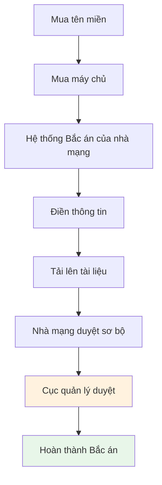

# 15.4 Thực hành tuân thủ pháp lý 🔴

> **Đọc xong phần này, bạn sẽ gặt hái được:**
>
> - Hiểu tầm quan trọng của tuân thủ pháp luật
> - Nắm vững các điểm chính khi viết Chính sách bảo mật
> - Hiểu nội dung cơ bản của Thỏa thuận người dùng
> - Học quy trình đăng ký Cấp phép ICP (Bắc án)

> Tuân thủ pháp luật không phải là tùy chọn, mà là môn bắt buộc. Tuân thủ là nền tảng để vận hành sản phẩm lâu dài.

---

## Tại sao cần tuân thủ pháp lý?

Sản phẩm Internet liên quan đến dữ liệu người dùng và hành vi thương mại, bắt buộc phải tuân thủ luật pháp liên quan.

| Rủi ro                         | Hậu quả                        |
| ------------------------------ | ------------------------------ |
| Vi phạm luật bảo vệ dữ liệu    | Phạt tiền lớn, gỡ bỏ dịch vụ   |
| Thiếu thỏa thuận người dùng    | Rủi ro tranh chấp pháp lý      |
| Website chưa cấp phép (tại TQ) | Bị chặn tại Trung Quốc đại lục |
| Xâm phạm quyền riêng tư        | Mất danh tiếng, mất người dùng |

::: tip Tầm quan trọng của tuân thủ

Đừng đợi bị báo cáo mới nhớ đến việc tuân thủ. Làm tốt công tác tuân thủ trước để tránh rủi ro và chi phí sửa đổi sau này.

:::

---

## Chính sách bảo mật (Privacy Policy)

Chính sách bảo mật giải thích cách thu thập, sử dụng, lưu trữ và bảo vệ dữ liệu người dùng.

### Khi nào cần Chính sách bảo mật?

Thu thập bất kỳ dữ liệu nào sau đây đều cần Chính sách bảo mật:

- Địa chỉ email
- Dữ liệu hành vi người dùng (như thống kê theo dõi)
- Thông tin định danh cá nhân
- Thông tin vị trí
- Cookie và công nghệ tương tự

### Nội dung cốt lõi của Chính sách bảo mật

| Nội dung              | Giải thích                                             |
| --------------------- | ------------------------------------------------------ |
| **Thu thập dữ liệu**  | Giải thích thu thập dữ liệu gì và mục đích             |
| **Sử dụng dữ liệu**   | Giải thích cách sử dụng dữ liệu đã thu thập            |
| **Lưu trữ dữ liệu**   | Giải thích vị trí và thời hạn lưu trữ dữ liệu          |
| **Chia sẻ dữ liệu**   | Giải thích có chia sẻ dữ liệu với bên thứ ba không     |
| **Quyền người dùng**  | Giải thích quyền truy cập, sửa đổi, xóa của người dùng |
| **Chính sách Cookie** | Giải thích tình hình sử dụng Cookie                    |
| **Thông tin liên hệ** | Cung cấp kênh tư vấn vấn đề                            |

### Cấu trúc ví dụ Chính sách bảo mật

```markdown
# Chính sách bảo mật

## 1. Thông tin thu thập

- Thông tin tài khoản (email, tên người dùng)
- Dữ liệu sử dụng (nhật ký truy cập, tình hình sử dụng tính năng)

## 2. Sử dụng thông tin

- Cung cấp và cải thiện dịch vụ
- Gửi thông báo quan trọng
- Phân tích tình hình sử dụng sản phẩm

## 3. Lưu trữ thông tin

- Dữ liệu lưu trữ tại [Quốc gia/Khu vực]
- Thời hạn lưu giữ dữ liệu là [Thời lượng]

## 4. Chia sẻ thông tin

Chúng tôi không bán thông tin cá nhân của bạn.

- Nhà cung cấp dịch vụ: Dùng để lưu trữ và phân tích
- Yêu cầu pháp lý: Phối hợp điều tra pháp lý

## 5. Quyền của bạn

- Truy cập và cập nhật thông tin của bạn
- Xóa tài khoản của bạn
- Rút lại sự đồng ý

## 6. Sử dụng Cookie

- Chúng tôi sử dụng Cookie để cải thiện trải nghiệm người dùng
- Bạn có thể kiểm soát Cookie qua cài đặt trình duyệt

## 7. Quyền riêng tư trẻ em

- Dịch vụ của chúng tôi hướng đến người dùng trên 13 tuổi
- Chúng tôi không cố ý thu thập thông tin trẻ em

## 8. Cập nhật chính sách

- Chúng tôi có thể cập nhật chính sách này
- Thay đổi quan trọng sẽ được thông báo qua email

## 9. Liên hệ với chúng tôi

Nếu có thắc mắc, vui lòng liên hệ: [Email]
```

### Công cụ tạo mẫu Chính sách bảo mật

| Công cụ                  | Link                                        |
| ------------------------ | ------------------------------------------- |
| Privacy Policy Generator | privacypolicygenerator.info                 |
| Termly                   | termly.io/products/privacy-policy-generator |
| FreePrivacyPolicy        | freeprivacypolicy.com                       |

::: tip Yêu cầu GDPR

Nếu phục vụ người dùng Châu Âu, Chính sách bảo mật bắt buộc phải phù hợp với GDPR:

- Cơ sở xử lý dữ liệu rõ ràng
- Quyền dữ liệu của người dùng
- Thông tin liên hệ của Cán bộ bảo vệ dữ liệu (DPO)
- Cơ chế thông báo vi phạm dữ liệu

:::

---

## Thỏa thuận người dùng (Terms of Service)

Thỏa thuận người dùng (Điều khoản dịch vụ) định nghĩa các điều khoản pháp lý khi sử dụng dịch vụ.

### Nội dung cốt lõi của Thỏa thuận người dùng

| Nội dung                   | Giải thích                                      |
| -------------------------- | ----------------------------------------------- |
| **Mô tả dịch vụ**          | Giải thích phạm vi dịch vụ cung cấp             |
| **Trách nhiệm người dùng** | Quy định sử dụng và hành vi bị cấm              |
| **Trách nhiệm nội dung**   | Quy định trách nhiệm nội dung do người dùng tạo |
| **Sở hữu trí tuệ**         | Quy thuộc quyền sở hữu trí tuệ các bên          |
| **Thay đổi dịch vụ**       | Quyền sửa đổi, tạm dừng hoặc chấm dứt dịch vụ   |
| **Tuyên bố miễn trừ**      | Giới hạn trách nhiệm và điều khoản miễn trừ     |
| **Giải quyết tranh chấp**  | Phương thức xử lý tranh chấp và luật áp dụng    |

### Điểm chính ví dụ Thỏa thuận người dùng

```markdown
# Thỏa thuận người dùng

## 1. Giải thích dịch vụ

- Chúng tôi cung cấp [Mô tả dịch vụ]
- Chúng tôi bảo lưu quyền sửa đổi dịch vụ bất cứ lúc nào

## 2. Quy phạm sử dụng

Bạn đồng ý sẽ không:

- Tải lên nội dung bất hợp pháp hoặc có hại
- Mạo danh người khác hoặc tổ chức khác
- Can thiệp hoặc phá hoại vận hành dịch vụ

## 3. Trách nhiệm nội dung

- Bạn chịu trách nhiệm về nội dung bạn đăng tải
- Chúng tôi có quyền xóa nội dung vi phạm
- Chúng tôi không chịu trách nhiệm liên đới đối với nội dung người dùng

## 4. Sở hữu trí tuệ

- Code dịch vụ thuộc về chúng tôi
- Bạn giữ quyền sở hữu nội dung của bạn
- Sử dụng dịch vụ tức là cấp quyền cho chúng tôi hiển thị nội dung của bạn

## 5. Tuyên bố miễn trừ

- Dịch vụ được cung cấp "nguyên trạng", không bảo đảm
- Chúng tôi không chịu trách nhiệm về hậu quả sử dụng

## 6. Chấm dứt dịch vụ

- Chúng tôi có thể tạm dừng hoặc chấm dứt tài khoản của bạn bất cứ lúc nào
- Bạn cũng có thể xóa tài khoản bất cứ lúc nào

## 7. Giải quyết tranh chấp

- Tranh chấp giải quyết qua thương lượng
- Luật áp dụng: [Quốc gia/Khu vực]

Cập nhật lần cuối: [Ngày tháng]
```

---

## Cấp phép ICP (Bắc án - Tại Trung Quốc)

Máy chủ đặt tại Trung Quốc đại lục bắt buộc phải thực hiện Cấp phép ICP (Bắc án).

> **Lưu ý cho người dùng Việt Nam**: Tại Việt Nam, các trang web hoạt động cũng cần tuân thủ quy định của Bộ Thông tin và Truyền thông. Trang web cá nhân thường không yêu cầu giấy phép mạng xã hội hay trang tin tổng hợp, nhưng tên miền .vn cần khai báo thông tin đầy đủ. Nếu máy chủ đặt tại Việt Nam, bạn cần tuân thủ quy định của nhà cung cấp dịch vụ lưu trữ. Nội dung dưới đây chủ yếu nói về quy trình tại Trung Quốc, nơi có yêu cầu "Bắc án" rất nghiêm ngặt.

### Khi nào cần Cấp phép ICP (Bắc án)

| Vị trí máy chủ         | Có cần Bắc án không |
| ---------------------- | ------------------- |
| Trung Quốc đại lục     | Có                  |
| Hồng Kông, Ma Cao (TQ) | Không               |
| Quốc gia/khu vực khác  | Không               |

### Quy trình Bắc án (Tham khảo)



::: tip Lưu ý Bắc án

1. Trong thời gian Bắc án website có thể không truy cập được
2. Thông tin Bắc án phải trung thực chính xác
3. Thay đổi thông tin cần cập nhật kịp thời
4. Số Bắc án cần đặt ở chân trang web
   :::

---

## Danh sách kiểm tra tuân thủ (Checklist)

Hoàn thành các kiểm tra tuân thủ sau trước khi online:

### Quyền riêng tư và Dữ liệu

- [ ] Có trang Chính sách bảo mật hoàn chỉnh
- [ ] Link Chính sách bảo mật ở vị trí dễ thấy dưới chân trang
- [ ] Giải thích loại dữ liệu thu thập và mục đích
- [ ] Cung cấp cơ chế truy cập và xóa dữ liệu
- [ ] Phù hợp với GDPR (nếu phục vụ người dùng Châu Âu)

### Thỏa thuận người dùng

- [ ] Có Thỏa thuận người dùng hoàn chỉnh
- [ ] Người dùng phải đồng ý thỏa thuận trước khi đăng ký
- [ ] Quy định rõ trách nhiệm nội dung
- [ ] Bao gồm tuyên bố miễn trừ trách nhiệm

### Đặc thù khu vực (Trung Quốc/Việt Nam)

- [ ] Hoàn thành thủ tục cấp phép/khai báo theo quy định sở tại
- [ ] Đặt số giấy phép/thông tin liên hệ dưới chân trang
- [ ] Nội dung phù hợp với pháp luật sở tại

### Khác

- [ ] Có trang thông tin liên hệ
- [ ] Giải thích sử dụng Cookie (nếu áp dụng)
- [ ] Giới hạn độ tuổi (nếu áp dụng)
- [ ] Kênh khiếu nại tố cáo

---

## Câu hỏi thường gặp

### Q1: Dự án cá nhân có cần Chính sách bảo mật không?

Nếu bạn thu thập bất kỳ dữ liệu người dùng nào (bao gồm thống kê theo dõi), thì cần Chính sách bảo mật. Website tĩnh thuần túy trưng bày có thể không cần.

### Q2: Có thể sao chép Chính sách bảo mật của người khác không?

Không khuyến khích. Các dịch vụ khác nhau thu thập dữ liệu khác nhau, nên viết dựa trên tình hình thực tế. Có thể dùng công cụ tạo mẫu làm khởi điểm, rồi tùy chỉnh lại.

### Q3: Máy chủ ở nước ngoài có cần Bắc án (ICP) tại Trung Quốc không?

Không cần. Nhưng nếu phục vụ người dùng Trung Quốc đại lục, tốc độ truy cập có thể bị ảnh hưởng.

### Q4: Vi phạm GDPR có hậu quả gì?

Vi phạm nghiêm trọng GDPR có thể đối mặt mức phạt 4% doanh thu toàn cầu năm hoặc 20 triệu Euro (lấy mức cao hơn).

---

## Trọng tâm phần này

- ✅ Tuân thủ pháp luật là nền tảng vận hành sản phẩm lâu dài
- ✅ Chính sách bảo mật giải thích cách thu thập và sử dụng dữ liệu
- ✅ Thỏa thuận người dùng định nghĩa quy phạm sử dụng dịch vụ
- ✅ Máy chủ tại Trung Quốc đại lục bắt buộc phải Bắc án ICP
- ✅ Danh sách kiểm tra tuân thủ đảm bảo không bỏ sót mục quan trọng
- ✅ Làm tốt công tác tuân thủ trước, tránh rủi ro về sau

Chương 15 hoàn thành! Tiếp theo bắt đầu chương 16: Phản hồi người dùng và Lặp lại sản phẩm.

---

## Nội dung liên quan

- Trước đó: [15.3 Triển khai thống kê Umami](./03-umami_vi.md)
- Chi tiết: [Chương 16: Phản hồi người dùng và Lặp lại sản phẩm](../16-user-feedback-iteration/index_vi.md)
