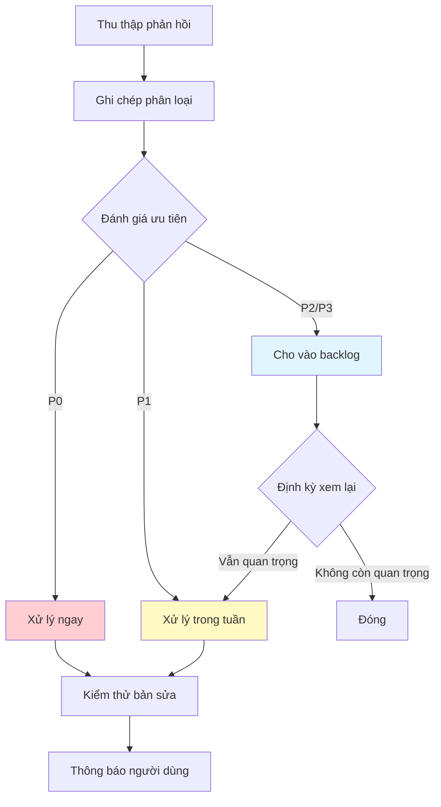

# 16.3 Phân loại và Ưu tiên phản hồi 🟡

> **Đọc xong phần này, bạn sẽ gặt hái được:**
>
> - Nắm vững phương pháp phân loại phản hồi người dùng
> - Học cách đánh giá mức độ ưu tiên của phản hồi
> - Hiểu về mô hình đánh giá RICE
> - Thiết lập quy trình quản lý phản hồi

> Thu thập được một đống phản hồi rồi, làm sao biết cái nào làm trước? Phạm vi ảnh hưởng và mức độ nghiêm trọng là hai khía cạnh then chốt để phán đoán.

---

## Phân loại phản hồi

Phản hồi người dùng đủ loại thượng vàng hạ cám, cần được phân loại sắp xếp.

### Phân loại theo loại hình

| Loại                   | Giải thích                    | Ví dụ                                      |
| ---------------------- | ----------------------------- | ------------------------------------------ |
| **Báo cáo Bug**        | Lỗi chức năng hoặc bất thường | "Nút đăng nhập bấm không ăn"               |
| **Yêu cầu tính năng**  | Mong muốn thêm chức năng mới  | "Có thể thêm tính năng xuất dữ liệu không" |
| **Vấn đề trải nghiệm** | Sử dụng không thuận tiện      | "Tôi không tìm thấy trang cài đặt"         |
| **Vấn đề hiệu năng**   | Tốc độ chậm hoặc giật lag     | "Trang tải lâu quá"                        |
| **Liên quan nội dung** | Câu từ, thiết kế              | "Từ này dùng sai rồi"                      |
| **Khác**               | Không thể phân loại           | "Dùng được đấy"                            |

### Phân loại theo mức độ khẩn cấp

| Mức độ         | Giải thích                        | Thời gian phản hồi   |
| -------------- | --------------------------------- | -------------------- |
| **Khẩn cấp**   | Hệ thống sập, mất dữ liệu         | Ngay lập tức         |
| **Cao**        | Chức năng cốt lõi không dùng được | Trong vòng 24h       |
| **Trung bình** | Ảnh hưởng một bộ phận người dùng  | Trong tuần           |
| **Thấp**       | Vấn đề nhỏ hoặc gợi ý             | Khi nào rảnh thì làm |

### Phân loại theo giá trị người dùng

| Giá trị                  | Giải thích                     |
| ------------------------ | ------------------------------ |
| **Người dùng cốt lõi**   | Dùng thường xuyên hoặc trả phí |
| **Người dùng tích cực**  | Dùng nhiều nhưng chưa trả phí  |
| **Người dùng mới**       | Mới bắt đầu sử dụng            |
| **Người dùng đã rời bỏ** | Đã ngừng sử dụng               |

---

## Khung đánh giá ưu tiên

Dùng hai chiều để phán đoán ưu tiên: Phạm vi ảnh hưởng và Mức độ nghiêm trọng.

### Ma trận Phạm vi ảnh hưởng × Mức độ nghiêm trọng

```
Nghiêm trọng
Cao │ [P0] Sửa khẩn cấp    [P1] Ưu tiên cao
    │ ┌─────────────┬─────────────┐
TB  │ │             │             │
    │ [P2] Ưu tiên TB  [P3] Ưu tiên thấp
Thấp│ │             │             │
    │ └─────────────┴─────────────┘
    └──────────────────────────────
        Nhỏ          Lớn
           Phạm vi ảnh hưởng
```

| Ưu tiên           | Giải thích                                                     | Ví dụ                                    |
| ----------------- | -------------------------------------------------------------- | ---------------------------------------- |
| **P0 Khẩn cấp**   | Ảnh hưởng lượng lớn người dùng, hệ thống không dùng được       | Chức năng đăng nhập hỏng                 |
| **P1 Cao**        | Ảnh hưởng lượng lớn người dùng, chức năng cốt lõi bị ảnh hưởng | Thanh toán thất bại                      |
| **P2 Trung bình** | Ảnh hưởng một bộ phận người dùng, có giải pháp thay thế        | Hiển thị lỗi trên một trình duyệt cụ thể |
| **P3 Thấp**       | Ảnh hưởng nhỏ, không ảnh hưởng sử dụng                         | Màu sắc chưa đẹp                         |

---

## Mô hình chấm điểm RICE

RICE là phương pháp đánh giá ưu tiên toàn diện hơn.

### Các thành phần RICE

| Yếu tố                   | Giải thích                        | Tiêu chuẩn chấm điểm |
| ------------------------ | --------------------------------- | -------------------- |
| **Reach** (Tiếp cận)     | Bao nhiêu người dùng bị ảnh hưởng | Số người dùng/tháng  |
| **Impact** (Tác động)    | Mức độ ảnh hưởng đến người dùng   | 1-3 điểm             |
| **Confidence** (Tin cậy) | Mức độ chắc chắn của đánh giá     | %                    |
| **Effort** (Nỗ lực)      | Thời gian và nguồn lực cần thiết  | Người/tháng          |

### Công thức RICE

```
RICE = (Reach × Impact × Confidence) / Effort
```

### Ví dụ chấm điểm

| Tính năng         | Reach | Impact | Confidence | Effort | RICE |
| ----------------- | ----- | ------ | ---------- | ------ | ---- |
| Tính năng xuất    | 100   | 3      | 80%        | 2      | 120  |
| Chế độ tối        | 500   | 1      | 100%       | 3      | 167  |
| Sửa Bug đăng nhập | 1000  | 3      | 100%       | 1      | 3000 |

Sắp xếp theo điểm RICE: Sửa Bug đăng nhập > Chế độ tối > Tính năng xuất

::: tip Lợi thế của RICE

RICE cân nhắc nhiều khía cạnh, tránh việc ra quyết định chỉ dựa vào trực giác. Nó giúp bạn kết hợp giữa giả định và dữ liệu.

:::

---

## Chấm điểm đơn giản hóa ICE

Nếu RICE quá phức tạp, có thể dùng phiên bản đơn giản hơn là ICE.

### Chấm điểm ICE

| Yếu tố                   | Giải thích                | Điểm |
| ------------------------ | ------------------------- | ---- |
| **Impact** (Tác động)    | Giá trị với người dùng    | 1-10 |
| **Confidence** (Tin cậy) | Mức độ hỗ trợ của dữ liệu | 1-10 |
| **Ease** (Dễ dàng)       | Mức độ dễ thực hiện       | 1-10 |

```
ICE = (Impact + Confidence + Ease) / 3
```

### Ví dụ chấm điểm

| Tính năng      | Impact | Confidence | Ease | ICE |
| -------------- | ------ | ---------- | ---- | --- |
| Tính năng xuất | 8      | 7          | 3    | 6   |
| Chế độ tối     | 5      | 10         | 8    | 7.7 |
| Sửa Bug        | 10     | 10         | 5    | 8.3 |

---

## Quy trình quản lý phản hồi

Thiết lập quy trình xử lý phản hồi có hệ thống.



### Ghi chép phản hồi

Sử dụng công cụ ghi chép và theo dõi phản hồi:

| Công cụ                   | Ngữ cảnh áp dụng            |
| ------------------------- | --------------------------- |
| **Notion/Airtable**       | Danh sách phản hồi đơn giản |
| **GitHub Issues**         | Sản phẩm kỹ thuật           |
| **Công cụ chuyên nghiệp** | Intercom, UserVoice         |
| **Tự xây dựng**           | Hoàn toàn tùy chỉnh         |

### Mẫu ghi chép phản hồi

| Trường       | Giải thích                      |
| ------------ | ------------------------------- |
| ID           | Định danh duy nhất              |
| Loại         | Bug/Feature/Khác                |
| Mô tả        | Mô tả vấn đề                    |
| Người dùng   | Người phản hồi (có thể ẩn danh) |
| Phạm vi      | Số người bị ảnh hưởng           |
| Nghiêm trọng | Cao/Vừa/Thấp                    |
| Điểm RICE    | Điểm ưu tiên                    |
| Trạng thái   | Chờ xử lý/Đang làm/Hoàn thành   |

---

## Cân nhắc ra quyết định

Trong điều kiện nguồn lực hạn chế, cần phải biết đánh đổi.

### Nguyên tắc đánh đổi

| Nguyên tắc               | Giải thích                                  |
| ------------------------ | ------------------------------------------- |
| **Cốt lõi ưu tiên**      | Ưu tiên tính năng cốt lõi hơn tính năng phụ |
| **Sửa lỗi ưu tiên**      | Ưu tiên sửa Bug hơn làm tính năng mới       |
| **Giá trị người dùng**   | Ưu tiên phản hồi của người dùng giá trị cao |
| **Hiệu quả chi phí**     | Ưu tiên việc bỏ ít công sức thu lợi lớn     |
| **Nhất quán chiến lược** | Ưu tiên việc phù hợp định hướng sản phẩm    |

### Học cách nói "Không"

| Tình huống                     | Phản hồi                                                   |
| ------------------------------ | ---------------------------------------------------------- |
| Không phải người dùng mục tiêu | "Điều này không nằm trong kế hoạch hiện tại của chúng tôi" |
| Không phù hợp định hướng       | "Cảm ơn góp ý, nhưng trọng tâm của chúng tôi là..."        |
| Nguồn lực hạn chế              | "Góp ý rất hay, chúng tôi sẽ cân nhắc sau"                 |
| Đã có kế hoạch                 | "Chúng tôi đang phát triển tính năng tương tự"             |

---

## Câu hỏi thường gặp

### Q1: Phản hồi nào trông cũng quan trọng thì sao?

Dùng khung RICE hoặc ICE để chấm điểm khách quan, thay vì dùng trực giác. Dữ liệu sẽ làm rõ thứ tự ưu tiên.

### Q2: Người dùng giục bao giờ xong?

Trả lời trung thực. Đừng hứa, nhưng có thể nói "Chúng tôi đang đánh giá và sẽ cân nhắc trong các phiên bản tới".

### Q3: Bỏ qua phản hồi người dùng có làm mất lòng họ không?

Không hẳn. Quan trọng là phản hồi lại. Ngay cả khi không thực hiện, cũng nên giải thích lý do và cảm ơn góp ý của họ.

### Q4: Làm sao để không bị người dùng dắt mũi?

Giữ vững tầm nhìn sản phẩm. Phản hồi người dùng quan trọng, nhưng bạn là người chịu trách nhiệm sản phẩm, không phải tất cả phản hồi đều phải nghe theo.

---

## Trọng tâm phần này

- ✅ Phản hồi cần được phân loại sắp xếp
- ✅ Ưu tiên = Phạm vi ảnh hưởng × Mức độ nghiêm trọng
- ✅ RICE là phương pháp đánh giá ưu tiên toàn diện
- ✅ Thiết lập quy trình quản lý phản hồi có hệ thống
- ✅ Học cách nói "Không" là bài học bắt buộc của người làm sản phẩm
- ✅ Quyết định dựa trên dữ liệu giảm thiểu tranh cãi

Sau khi xác định ưu tiên, có thể thông qua phỏng vấn người dùng để hiểu sâu hơn vấn đề.

---

## Nội dung liên quan

- Trước đó: [16.2 Các kênh thu thập phản hồi](./02-feedback-channels_vi.md)
- Chi tiết: [16.4 Kỹ thuật phỏng vấn người dùng](./04-user-interviews_vi.md)
