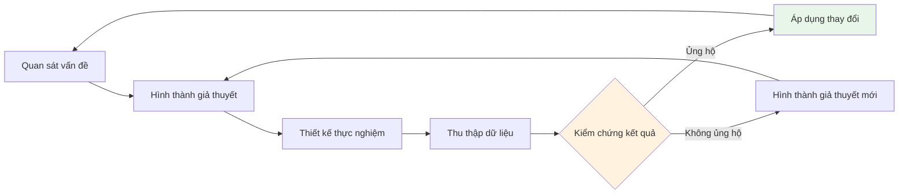
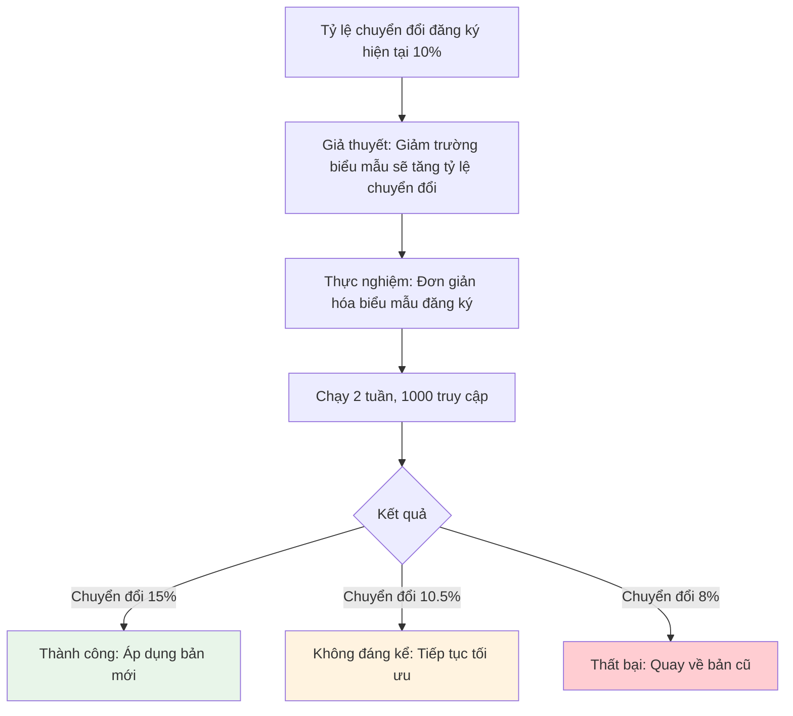

# 16.5 Ra quyết định dựa trên dữ liệu 🟡

> **Đọc xong phần này, bạn sẽ gặt hái được:**
>
> - Hiểu mối quan hệ bổ trợ giữa dữ liệu và phản hồi
> - Nắm vững hệ thống chỉ số dữ liệu cốt lõi
> - Học cách thiết lập giả thuyết và kiểm chứng
> - Hiểu khung ra quyết định dựa trên dữ liệu

> Dữ liệu cho bạn biết "điều gì đã xảy ra", phản hồi người dùng cho biết "tại sao nó xảy ra". Kết hợp cả hai mới có thể đưa ra quyết định tốt hơn.

---

## Sự bổ trợ giữa Dữ liệu và Phản hồi

Phản hồi định tính và dữ liệu định lượng đều có giá trị riêng, kết hợp sử dụng sẽ mang lại hiệu quả tốt nhất.

| Dữ liệu (Định lượng)     | Phản hồi (Định tính)     |
| ------------------------ | ------------------------ |
| Cho biết Cái gì (What)   | Cho biết Tại sao (Why)   |
| Khách quan đo lường được | Chủ quan nhưng sâu sắc   |
| Bao phủ quy mô lớn       | Mẫu nhỏ nhưng chuyên sâu |
| Xu hướng và mô hình      | Bối cảnh và nguyên nhân  |

### Ví dụ về sự bổ trợ

| Dữ liệu hiển thị                | Phản hồi tiết lộ                 | Hành động                 |
| ------------------------------- | -------------------------------- | ------------------------- |
| Tỷ lệ thoát cao ở trang đăng ký | "Biểu mẫu dài quá"               | Đơn giản hóa biểu mẫu     |
| Một tính năng ít được dùng      | "Không tìm thấy lối vào"         | Tối ưu thiết kế lối vào   |
| Tỷ lệ giữ chân thấp trên mobile | "Nút bấm trên điện thoại bé quá" | Tối ưu trải nghiệm mobile |

---

## Hệ thống chỉ số dữ liệu

Xây dựng hệ thống chỉ số dữ liệu hợp lý là nền tảng của việc ra quyết định dựa trên dữ liệu.

### Chỉ số Sao Bắc Đẩu (North Star Metric)

Chỉ số Sao Bắc Đẩu là chỉ số then chốt đo lường giá trị cốt lõi của sản phẩm.

| Loại sản phẩm      | Ví dụ Sao Bắc Đẩu                     |
| ------------------ | ------------------------------------- |
| SaaS               | Người dùng hoạt động hàng tháng (MAU) |
| Thương mại điện tử | Tỷ lệ chuyển đổi đơn hàng             |
| Nền tảng nội dung  | Thời gian tiêu thụ nội dung           |
| Sản phẩm công cụ   | Tỷ lệ sử dụng tính năng               |

::: tip Chỉ số Sao Bắc Đẩu tốt

Một chỉ số Sao Bắc Đẩu tốt nên:

- Phản ánh giá trị cốt lõi của sản phẩm
- Đo lường được
- Có thể hành động
- Là chỉ số dẫn dắt (thay vì chỉ số độ trễ)

:::

### Phân loại chỉ số cốt lõi

| Loại                       | Chỉ số                               | Giải thích                              |
| -------------------------- | ------------------------------------ | --------------------------------------- |
| **Thu hút (Acquisition)**  | Lượt truy cập, lượt đăng ký          | Người dùng đến từ đâu                   |
| **Kích hoạt (Activation)** | Sử dụng tính năng chính lần đầu      | Người dùng có thấy giá trị không        |
| **Giữ chân (Retention)**   | Giữ chân ngày hôm sau/7 ngày/30 ngày | Người dùng có tiếp tục dùng không       |
| **Doanh thu (Revenue)**    | Tỷ lệ trả phí, ARPU                  | Giá trị thương mại                      |
| **Giới thiệu (Referral)**  | NPS, tỷ lệ chia sẻ                   | Người dùng có sẵn lòng giới thiệu không |

### Chỉ số chính vs Chỉ số hư danh (Vanity Metrics)

| Chỉ số chính            | Chỉ số hư danh                |
| ----------------------- | ----------------------------- |
| Tỷ lệ giữ chân          | Tổng số người dùng đăng ký    |
| Tỷ lệ chuyển đổi        | Tổng lượt xem trang           |
| Người dùng hoạt động    | Tổng lượt tải xuống           |
| Tỷ lệ sử dụng tính năng | Số người theo dõi mạng xã hội |

::: tip Tiêu chuẩn phán đoán

Nếu một dữ liệu khiến bạn không biết phải làm gì tiếp theo, đó có thể là chỉ số hư danh. Chỉ số chính sẽ chỉ dẫn hành động.

:::

---

## Phương pháp điều hướng bằng giả thuyết

Cốt lõi của việc dựa trên dữ liệu là thiết lập giả thuyết và kiểm chứng nó.

### Vòng lặp kiểm chứng giả thuyết



### Định dạng phát biểu giả thuyết

Sử dụng định dạng rõ ràng để phát biểu giả thuyết:

```
Nếu [thay đổi X]
Thì [kết quả mong đợi Y]
Bởi vì [lý do Z]
```

### Ví dụ giả thuyết

| Giả thuyết                                                                                                                                | Phương pháp kiểm chứng |
| ----------------------------------------------------------------------------------------------------------------------------------------- | ---------------------- |
| Nếu đơn giản hóa biểu mẫu đăng ký, thì tỷ lệ chuyển đổi đăng ký sẽ tăng 20%, bởi vì người dùng sẵn lòng hoàn thành quy trình ngắn gọn hơn | A/B Testing            |
| Nếu thêm video demo vào trang chủ, thì tỷ lệ kích hoạt sẽ tăng, bởi vì người dùng hiểu giá trị sản phẩm nhanh hơn                         | Thử nghiệm đối chứng   |

---

## Thiết kế thực nghiệm

Thực nghiệm tốt sẽ tạo ra dữ liệu đáng tin cậy.

### Kiểm thử A/B (A/B Testing)

A/B Testing là phương pháp so sánh hiệu quả giữa hai phiên bản.

| Yếu tố                 | Giải thích                           |
| ---------------------- | ------------------------------------ |
| **Nhóm đối chứng**     | Phiên bản hiện tại (A)               |
| **Nhóm thực nghiệm**   | Phiên bản mới (B)                    |
| **Biến đơn nhất**      | Chỉ thay đổi một yếu tố              |
| **Phân bổ ngẫu nhiên** | Người dùng được chia nhóm ngẫu nhiên |
| **Đủ mẫu**             | Đảm bảo ý nghĩa thống kê             |

### Kiểm tra trước thực nghiệm

| Mục kiểm tra              | Giải thích                            |
| ------------------------- | ------------------------------------- |
| **Xác định mục tiêu**     | Muốn cải thiện chỉ số nào             |
| **Đo lường mức nền**      | Mức dữ liệu hiện tại                  |
| **Tính toán cỡ mẫu**      | Cần bao nhiêu người dùng tham gia     |
| **Định nghĩa thành công** | Trường hợp nào thì tính là thành công |

### Ví dụ thực nghiệm



---

## Công cụ phân tích dữ liệu

Chọn công cụ phù hợp để phân tích.

| Loại công cụ               | Ngữ cảnh áp dụng              | Ví dụ                   |
| -------------------------- | ----------------------------- | ----------------------- |
| **Phân tích web**          | Lưu lượng, hành vi người dùng | Umami, Google Analytics |
| **Phân tích sản phẩm**     | Sử dụng tính năng, giữ chân   | Amplitude, Mixpanel     |
| **Truy vấn cơ sở dữ liệu** | Phân tích tùy chỉnh           | SQL, Công cụ BI         |
| **A/B Testing**            | Quản lý thực nghiệm           | Optimizely, Tự xây dựng |

### Ví dụ phân tích đơn giản

```sql
-- Tính tỷ lệ giữ chân ngày hôm sau
SELECT
  DATE(first_visit) as cohort_date,
  COUNT(DISTINCT user_id) as users,
  COUNT(DISTINCT CASE WHEN next_visit = first_visit + INTERVAL '1 day' THEN user_id END) * 100.0 / COUNT(DISTINCT user_id) as retention_rate
FROM user_activities
GROUP BY DATE(first_visit)
ORDER BY cohort_date DESC;
```

---

## Cạm bẫy khi ra quyết định dựa trên dữ liệu

Tránh các sai lầm phân tích thường gặp.

| Cạm bẫy                    | Giải thích                                  | Cách tránh                               |
| -------------------------- | ------------------------------------------- | ---------------------------------------- |
| **Tương quan là Nhân quả** | A và B tương quan không có nghĩa A gây ra B | Thiết kế thực nghiệm kiểm chứng nhân quả |
| **Thiên kiến chọn lọc**    | Chỉ nhìn một phần dữ liệu                   | Đảm bảo tính đại diện của mẫu            |
| **Chủ nghĩa ngắn hạn**     | Chỉ nhìn dữ liệu ngắn hạn                   | Quan tâm xu hướng dài hạn                |
| **Sùng bái dữ liệu**       | Hoàn toàn phụ thuộc dữ liệu                 | Kết hợp trực giác và phản hồi            |
| **Phân tích quá mức**      | Tê liệt vì phân tích                        | Hành động                                |

---

## Phân tích trường hợp: Super Daily

Một trường hợp cải tiến dựa trên giả thuyết.

### Quan sát

Dữ liệu cho thấy tỷ lệ thoát ở trang đăng ký lên tới 70%.

### Giả thuyết

Biểu mẫu đăng ký quá dài, yêu cầu quá nhiều thông tin, khiến người dùng bỏ cuộc giữa chừng.

### Thực nghiệm

1. Đơn giản hóa biểu mẫu đăng ký, chỉ giữ lại email
2. Các thông tin khác thu thập sau khi đăng ký
3. Chạy A/B Testing đối chiếu

### Kết quả

| Phiên bản          | Tỷ lệ chuyển đổi |
| ------------------ | ---------------- |
| Bản cũ (7 trường)  | 30%              |
| Bản mới (1 trường) | 55%              |

### Hành động

Áp dụng phiên bản mới, tỷ lệ chuyển đổi đăng ký tăng 83%.

---

## Câu hỏi thường gặp

### Q1: Dữ liệu ít thì phân tích thế nào?

Khi dữ liệu ít, phản hồi định tính quan trọng hơn. Phản hồi của mỗi người dùng đều có giá trị hơn, phỏng vấn sâu hiệu quả hơn thống kê diện rộng.

### Q2: Dữ liệu và phản hồi mâu thuẫn thì sao?

Ưu tiên tin vào dữ liệu, nhưng dùng phỏng vấn để hiểu nguyên nhân. Dữ liệu có thể tiết lộ những mô hình mà bạn không để ý.

### Q3: Làm sao biết cỡ mẫu đã đủ chưa?

Với A/B Testing, có thể dùng máy tính cỡ mẫu (sample size calculator). Với nghiên cứu định tính, 5-10 cuộc phỏng vấn thường là đủ.

### Q4: Không có team dữ liệu thì làm sao?

Có thể bắt đầu từ các chỉ số đơn giản. Dùng các công cụ có sẵn như Umami, không cần hạ tầng dữ liệu phức tạp cũng có thể bắt đầu hướng dữ liệu.

---

## Trọng tâm phần này

- ✅ Dữ liệu cho biết cái gì (What), phản hồi cho biết tại sao (Why)
- ✅ Xây dựng hệ thống chỉ số cốt lõi, phân biệt chỉ số chính và chỉ số hư danh
- ✅ Hướng giả thuyết: Hình thành giả thuyết → Thiết kế thực nghiệm → Kiểm chứng kết quả
- ✅ A/B Testing là phương pháp hiệu quả để so sánh các phiên bản
- ✅ Tránh các cạm bẫy phân tích như nhầm lẫn tương quan là nhân quả
- ✅ Team nhỏ cũng có thể làm việc dựa trên dữ liệu

Sau khi ra quyết định dựa trên dữ liệu, cần xem xét nhịp độ lặp lại (iteration).

---

## Nội dung liên quan

- Trước đó: [16.4 Kỹ thuật phỏng vấn người dùng](./04-user-interviews_vi.md)
- Trước đó: [15.3 Triển khai thống kê Umami](../15-seo-analytics/03-umami_vi.md)
- Chi tiết: [16.6 Quản lý nhịp độ lặp lại](./06-iteration-pace_vi.md)
