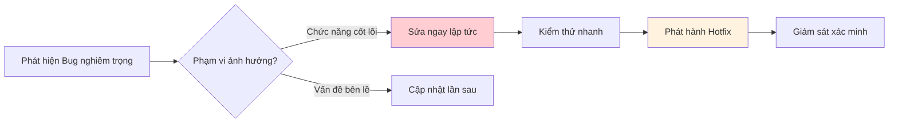
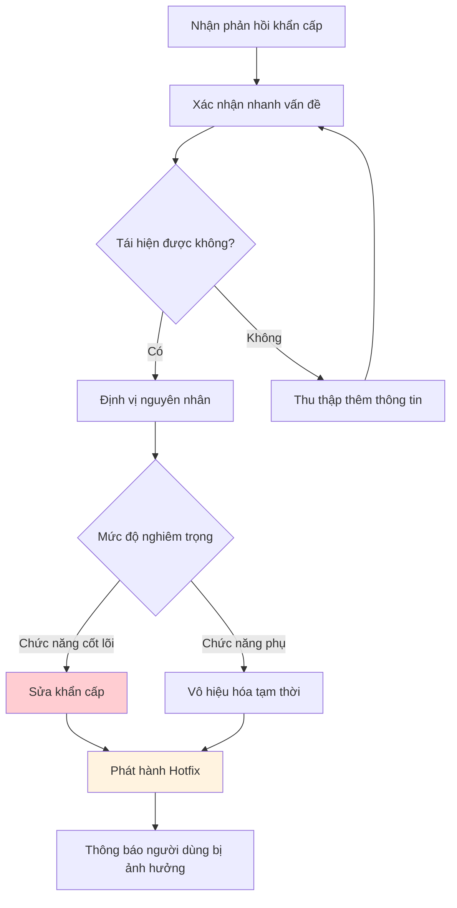

# 16.6 Quản lý nhịp độ lặp lại 🟢

> **Đọc xong phần này, bạn sẽ gặt hái được:**
>
> - Hiểu các loại nhịp độ cập nhật khác nhau
> - Nắm vững chiến lược cập nhật phân tầng
> - Hiểu phương pháp phát hành thử nghiệm (Grey Release/Canary Release)
> - Học cách quản lý giao tiếp với người dùng

> Ban đầu bạn có thể muốn cập nhật mỗi ngày, cảm thấy thế mới tích cực. Nhưng cập nhật quá thường xuyên sẽ làm người dùng mệt mỏi, nhịp độ hợp lý quan trọng hơn.

---

## Vấn đề về nhịp độ cập nhật

Cập nhật quá nhanh hay quá chậm đều có vấn đề.

| Cập nhật quá nhanh      | Cập nhật quá chậm          |
| ----------------------- | -------------------------- |
| Người dùng mệt mỏi      | Bị đối thủ vượt mặt        |
| Dễ sinh ra Bug mới      | Nhu cầu không được đáp ứng |
| Khó duy trì ổn định     | Người dùng mất hứng thú    |
| Tài liệu không theo kịp | Thiếu vòng lặp phản hồi    |

::: tip Tìm điểm cân bằng

Nhịp độ cập nhật tốt là vừa có thể phản ứng nhanh với nhu cầu người dùng, vừa duy trì được sự ổn định của sản phẩm.

:::

---

## Chiến lược cập nhật ba tầng

Chia cập nhật thành các cấp độ khác nhau, mỗi cấp độ có nhịp độ riêng.

### Các cấp độ cập nhật

| Cấp độ                | Nội dung                    | Tần suất       | Rủi ro     |
| --------------------- | --------------------------- | -------------- | ---------- |
| **Hotfix (Sửa nóng)** | Sửa lỗi khẩn cấp            | Bất cứ lúc nào | Thấp       |
| **Cập nhật nhỏ**      | Tính năng nhỏ, tối ưu hóa   | Hàng tuần      | Trung bình |
| **Phiên bản lớn**     | Tính năng mới, tái cấu trúc | Hàng tháng     | Cao        |

### Quy trình Hotfix



---

## Phát hành thử nghiệm (Grey Release/Canary Release)

Tính năng mới mở cho một phần người dùng trước, rồi mở rộng dần.

### Lợi ích của phát hành thử nghiệm

| Lợi ích               | Giải thích                               |
| --------------------- | ---------------------------------------- |
| **Giảm rủi ro**       | Vấn đề chỉ ảnh hưởng một phần người dùng |
| **Thu thập phản hồi** | Kiểm chứng trong môi trường thực tế      |
| **Mở rộng từ từ**     | Ổn định rồi mới phát hành toàn bộ        |

### Chiến lược phát hành thử nghiệm

| Chiến lược                      | Giải thích                 | Ngữ cảnh áp dụng                       |
| ------------------------------- | -------------------------- | -------------------------------------- |
| **Danh sách trắng (Whitelist)** | Chỉ định người dùng cụ thể | Kiểm thử nội bộ, người dùng thân thiết |
| **Tỷ lệ phần trăm**             | Ngẫu nhiên x% người dùng   | Kiểm chứng quy mô lớn                  |
| **Phân nhóm ngẫu nhiên**        | A/B Testing                | So sánh hiệu quả tính năng             |
| **Kích hoạt có điều kiện**      | Đủ điều kiện mới hiện      | Kiểm soát rủi ro                       |

### Triển khai công tắc tính năng (Feature Flag)

```typescript
// Cấu hình công tắc tính năng
const FEATURES = {
  newDashboard: {
    enabled: true,
    rollout: 10, // 10% người dùng
    whitelist: ['user@example.com'], // Danh sách trắng
  },
};

export function isFeatureEnabled(feature: string, user: User): boolean {
  const config = FEATURES[feature];
  if (!config?.enabled) return false;

  // Kiểm tra whitelist
  if (config.whitelist?.includes(user.email)) return true;

  // Tính tỷ lệ phần trăm
  const hash = hashString(user.id);
  return (hash % 100) < config.rollout;
}

// Sử dụng
{isFeatureEnabled('newDashboard', user) && <NewDashboard />}
```

---

## Giao tiếp với người dùng

Cách giao tiếp với người dùng khi có cập nhật là rất quan trọng.

### Kênh giao tiếp

| Kênh                         | Nội dung phù hợp    |
| ---------------------------- | ------------------- |
| **Thông báo trong ứng dụng** | Cập nhật quan trọng |
| **Email thông báo**          | Thay đổi lớn        |
| **Blog/Changelog**           | Giải thích chi tiết |
| **Mạng xã hội**              | Cập nhật nhẹ nhàng  |

### Ví dụ thông báo cập nhật

```markdown
# 🎉 Tính năng mới: Xuất dữ liệu

Chúng tôi đã lắng nghe phản hồi của bạn, giờ đây bạn có thể xuất dữ liệu của mình!

### Cách sử dụng

1. Vào trang Cài đặt
2. Bấm "Xuất dữ liệu"
3. Chọn định dạng (CSV/JSON)

### Tiếp theo

Chúng tôi đang phát triển thêm tùy chọn xuất, hãy đón chờ nhé.

Có góp ý gì không? Hãy phản hồi bất cứ lúc nào!
```

### Quản lý sự thay đổi

| Loại thay đổi          | Chiến lược giao tiếp                 |
| ---------------------- | ------------------------------------ |
| **Thêm tính năng**     | Nhấn mạnh giá trị, hướng dẫn sử dụng |
| **Bỏ tính năng**       | Thông báo trước, giải thích lý do    |
| **Thay đổi giao diện** | Ảnh so sánh, hướng dẫn làm quen      |
| **Sửa lỗi**            | Thông báo đơn giản đã giải quyết     |

---

## Phân cấp tốc độ phản hồi

Phản hồi người dùng cũng cần xử lý phân tầng.

| Ưu tiên        | Thời gian phản hồi | Cách xử lý                             |
| -------------- | ------------------ | -------------------------------------- |
| **Khẩn cấp**   | Trong 4 giờ        | Điều tra ngay, phương án tạm thời      |
| **Cao**        | Trong 24 giờ       | Lên kế hoạch sửa, thông báo người dùng |
| **Trung bình** | Trong tuần         | Đưa vào backlog                        |
| **Thấp**       | Khi có thời gian   | Ghi nhận và đánh giá                   |

### Xử lý vấn đề khẩn cấp



---

## Mô hình nhịp độ lặp lại

Các giai đoạn khác nhau phù hợp với nhịp độ lặp lại khác nhau.

| Giai đoạn                  | Nhịp độ         | Trọng tâm             |
| -------------------------- | --------------- | --------------------- |
| **Giai đoạn đầu**          | Lặp lại nhanh   | Kiểm chứng giả thuyết |
| **Giai đoạn tăng trưởng**  | Nhịp độ ổn định | Mở rộng tính năng     |
| **Giai đoạn trưởng thành** | Tối ưu liên tục | Nâng cao trải nghiệm  |

### Lặp lại nhanh giai đoạn đầu

- Mỗi tuần một phiên bản nhỏ
- Tập trung chức năng cốt lõi
- Kiểm chứng giả thuyết nhanh chóng
- Không tối ưu quá mức

### Nhịp độ ổn định giai đoạn tăng trưởng

- Hai tuần một phiên bản nhỏ
- Mỗi tháng một phiên bản lớn
- Coi trọng cả chất lượng và tốc độ
- Bắt đầu chú trọng tính ổn định

---

## Câu hỏi thường gặp

### Q1: Cập nhật mỗi ngày có phải quá thường xuyên không?

Đối với người dùng thì có thể là quá thường xuyên. Nên gom các thay đổi nhỏ lại, phát hành mỗi tuần một lần.

### Q2: Xử lý cập nhật bắt buộc thế nào?

Đối với vấn đề bảo mật nghiêm trọng hoặc thay đổi kiến trúc:

- Thông báo trước cho người dùng
- Đưa ra lộ trình di chuyển (migration schedule)
- Cung cấp hướng dẫn di chuyển
- Dành khoảng thời gian chuyển tiếp nhất định

### Q3: Người dùng phàn nàn cập nhật quá nhiều thì sao?

Điều này có thể nghĩa là:

- Chức năng chưa đủ ổn định
- Thay đổi quá thường xuyên
- Thiếu giải thích về phiên bản

Điều chỉnh tương ứng: Giảm tần suất, nâng cao chất lượng, cải thiện giao tiếp.

### Q4: Cân bằng tính năng mới và sửa lỗi thế nào?

Gợi ý nguyên tắc 80/20:

- 80% sức lực cho ổn định và sửa lỗi
- 20% sức lực cho phát triển tính năng mới

---

## Trọng tâm phần này

- ✅ Cập nhật quá nhanh hay quá chậm đều có vấn đề
- ✅ Sử dụng chiến lược ba tầng: Hotfix, cập nhật nhỏ, phiên bản lớn
- ✅ Phát hành thử nghiệm (Grey Release) giảm rủi ro tính năng mới
- ✅ Kịp thời thông báo nội dung cập nhật cho người dùng
- ✅ Xử lý phản hồi người dùng theo mức độ ưu tiên
- ✅ Các giai đoạn phát triển khác nhau phù hợp nhịp độ lặp lại khác nhau

Sau khi xác định nhịp độ lặp lại, cần xây dựng văn hóa lặp lại liên tục.

---

## Nội dung liên quan

- Trước đó: [16.5 Ra quyết định dựa trên dữ liệu](./05-data-driven-decisions_vi.md)
- Chi tiết: [16.7 Văn hóa lặp lại liên tục](./07-iteration-culture_vi.md)
