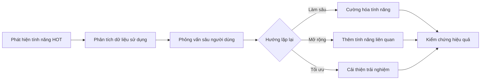
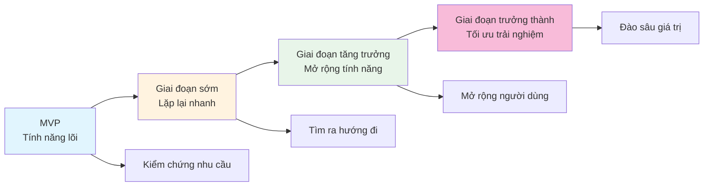

# 16.7 Văn hóa lặp lại liên tục 🟡

> **Đọc xong phần này, bạn sẽ gặt hái được:**
>
> - Hiểu rằng sản phẩm là một quá trình tiến hóa liên tục
> - Nắm vững phương pháp củng cố các tính năng được yêu thích
> - Học cách nhận diện và từ bỏ tính năng không ai dùng
> - Xây dựng tư duy "Luôn luôn là Beta"

> Ngày ra mắt sản phẩm không phải là kết thúc, mà là sự khởi đầu thực sự. Không có sản phẩm nào hoàn hảo ngay từ lần đầu tiên, tất cả đều được lặp lại (iterate) từng bước một.

---

## Tư duy "Luôn luôn là Beta"

Sản phẩm tốt luôn ở trạng thái "đang tiến hành".

### Ý nghĩa của Beta

| Cách hiểu truyền thống | Văn hóa Beta hiện đại  |
| ---------------------- | ---------------------- |
| Phiên bản thử nghiệm   | Cải tiến liên tục      |
| Trạng thái tạm thời    | Tâm thế vĩnh viễn      |
| Không ổn định          | Lặp lại nhanh          |
| Sẽ kết thúc            | Không bao giờ kết thúc |

::: tip Luôn luôn là Beta

"Luôn luôn là Beta" không có nghĩa là sản phẩm chưa hoàn thiện, mà là một tâm thế - luôn tin rằng còn không gian để cải thiện, duy trì sự học hỏi và điều chỉnh.

:::

### Lợi ích

| Lợi ích                           | Giải thích                                |
| --------------------------------- | ----------------------------------------- |
| **Giảm áp lực hoàn hảo**          | Không cần phải hoàn hảo một lần ngay      |
| **Khuyến khích thử nghiệm nhanh** | Chạy bước nhỏ, kiểm chứng nhanh           |
| **Giữ sự khiêm tốn**              | Thừa nhận mình không biết mọi câu trả lời |
| **Học tập liên tục**              | Tiến bộ không ngừng từ phản hồi           |

---

## Củng cố cái được yêu thích

Nguồn lực có hạn, hãy dồn sức vào nơi người dùng thực sự thích.

### Nhận diện tính năng được yêu thích

| Tín hiệu                  | Giải thích                                              |
| ------------------------- | ------------------------------------------------------- |
| **Tỷ lệ sử dụng cao**     | Tần suất sử dụng tính năng cao                          |
| **Phản hồi tích cực**     | Người dùng chủ động nhắc đến                            |
| **Đóng góp vào giữ chân** | Người dùng dùng tính năng này có tỷ lệ giữ chân tốt hơn |
| **Ý định trả phí**        | Người dùng sẵn sàng trả tiền cho nó                     |

### Chiến lược củng cố

| Chiến lược             | Giải thích                             |
| ---------------------- | -------------------------------------- |
| **Làm sâu tính năng**  | Làm cho nó mạnh mẽ hơn, hoàn thiện hơn |
| **Mở rộng liên quan**  | Thêm các tính năng liên quan           |
| **Tối ưu trải nghiệm** | Giúp tính năng dễ dùng hơn             |
| **Quảng bá**           | Để nhiều người dùng biết đến hơn       |

### Ví dụ

---

## Từ bỏ cái không ai dùng

Giữ lại những tính năng không cần thiết sẽ phân tán sự tập trung và làm phức tạp sản phẩm.

### Nhận diện tính năng không ai dùng

| Tín hiệu               | Giải thích                        |
| ---------------------- | --------------------------------- |
| **Tỷ lệ sử dụng thấp** | Rất ít người dùng                 |
| **Không có phản hồi**  | Chưa từng được nhắc đến           |
| **Chi phí hỗ trợ cao** | Lỗi nhiều nhưng giá trị thấp      |
| **Lệch chiến lược**    | Không phù hợp định hướng sản phẩm |

### Chiến lược từ bỏ

| Chiến lược            | Giải thích                              | Ngữ cảnh áp dụng                 |
| --------------------- | --------------------------------------- | -------------------------------- |
| **Loại bỏ trực tiếp** | Xóa tính năng                           | Tỷ lệ sử dụng cực thấp           |
| **Loại bỏ dần dần**   | Ngừng quảng bá, từ từ gỡ bỏ             | Một bộ phận người dùng phụ thuộc |
| **Thay thế**          | Dùng giải pháp tốt hơn để thay thế      | Có lựa chọn thay thế             |
| **Tách ra**           | Biến thành sản phẩm độc lập hoặc plugin | Nhỏ hẹp (niche) nhưng có giá trị |

::: tip Chuẩn bị trước khi loại bỏ

Trước khi loại bỏ tính năng:

1. Phân tích dữ liệu sử dụng, xác nhận thực sự ít người dùng
2. Thông báo trước cho người dùng bị ảnh hưởng
3. Cung cấp giải pháp thay thế hoặc hướng dẫn di chuyển
4. Giám sát phản hồi sau khi loại bỏ

:::

---

## Nguyên tắc chạy bước nhỏ (Small Batches)

Cốt lõi của lặp lại liên tục là chạy bước nhỏ mà nhanh.

### Lợi thế của chạy bước nhỏ

| Lợi thế              | Giải thích                           |
| -------------------- | ------------------------------------ |
| **Giảm rủi ro**      | Mỗi thay đổi nhỏ, dễ định vị vấn đề  |
| **Phản hồi nhanh**   | Biết hướng đi đúng hay sai nhanh hơn |
| **Tâm lý thoải mái** | Không cần "tích đại chiêu"           |
| **Tiến bộ liên tục** | Tích tiểu thành đại                  |

### Cách thực hiện

| Thực tiễn                  | Giải thích                                |
| -------------------------- | ----------------------------------------- |
| **Chia nhỏ nhiệm vụ**      | Tính năng lớn xé nhỏ thành bước nhỏ       |
| **Giới hạn phạm vi**       | Mỗi phiên bản tập trung thiểu số thay đổi |
| **Phát hành thường xuyên** | Định kỳ phát hành phiên bản nhỏ           |
| **Kiểm chứng nhanh**       | Mỗi thay đổi đều kiểm tra hiệu quả        |

---

## Xây dựng văn hóa lặp lại

Nếu là một team, cần xây dựng văn hóa hỗ trợ sự lặp lại.

| Yếu tố văn hóa              | Giải thích                                    |
| --------------------------- | --------------------------------------------- |
| **Chào đón phản hồi**       | Phản hồi là món quà, không phải lời chỉ trích |
| **Cho phép thất bại**       | Thất bại nhanh còn hơn không thử              |
| **Dữ liệu lên tiếng**       | Dùng dữ liệu ra quyết định, giảm tranh cãi    |
| **Học tập liên tục**        | Mỗi lần lặp lại là một cơ hội học tập         |
| **Trung tâm là người dùng** | Luôn lấy giá trị người dùng làm định hướng    |

---

## Góc nhìn dài hạn (Chủ nghĩa dài hạn)

Lặp lại liên tục đòi hỏi chủ nghĩa dài hạn.

| Tư duy ngắn hạn               | Tư duy dài hạn             |
| ----------------------------- | -------------------------- |
| Theo đuổi tạo trend (bùng nổ) | Cải tiến liên tục          |
| Mở rộng nhanh chóng           | Tăng trưởng vững chắc      |
| Làm hài lòng tất cả           | Phục vụ người dùng cốt lõi |
| Thành công qua đêm            | Tích lũy ngày qua ngày     |

### Thực hành chủ nghĩa dài hạn

| Thực tiễn             | Giải thích                               |
| --------------------- | ---------------------------------------- |
| **Tích lũy niềm tin** | Cung cấp dịch vụ ổn định tin cậy lâu dài |
| **Đào sâu giá trị**   | Làm sâu làm kỹ, thay vì dàn trải hời hợt |
| **Duy trì quan hệ**   | Xây dựng quan hệ lâu dài với người dùng  |
| **Đầu tư nền tảng**   | Đầu tư vào cơ sở hạ tầng và chất lượng   |

---

## Ví dụ về sự tiến hóa của sản phẩm

Quá trình tiến hóa của một sản phẩm từ sơ khai đến trưởng thành.

---

## Tổng kết các triết lý cốt lõi của bộ giáo trình

Tư tưởng cốt lõi xuyên suốt toàn bộ giáo trình.

### Năng lực định nghĩa vấn đề

> "Định nghĩa vấn đề rõ ràng quan trọng hơn giải quyết vấn đề nhanh chóng."

### AI hỗ trợ phát triển

> "AI là trợ lý của bạn, không phải sự thay thế. Bạn vẫn cần hiểu vấn đề, thiết kế giải pháp và kiểm chứng kết quả."

### Tư duy sản phẩm

> "Kiểm chứng nhu cầu trước, phát triển tính năng sau. Không phải bạn thấy hữu dụng, mà là người dùng thấy hữu dụng."

### Lặp lại liên tục

> "Sản phẩm online không phải kết thúc, mà là bắt đầu. Thông qua phản hồi, dữ liệu, sự thấu hiểu, liên tục điều chỉnh và cải tiến."

---

## Câu hỏi thường gặp

### Q1: Khi nào thì dừng lặp lại (iterate)?

Sản phẩm không có điểm dừng lặp lại. Nhưng có thể điều chỉnh nhịp độ:

- Giai đoạn đầu: Lặp lại nhanh, kiểm chứng giả thuyết
- Giai đoạn trưởng thành: Nhịp độ ổn định, tối ưu liên tục

### Q2: Làm sao tránh lặp lại quá mức (over-iteration)?

Quan tâm chỉ số cốt lõi. Nếu thay đổi mới không mang lại cải thiện, hãy dừng lại và suy nghĩ lại hướng đi.

### Q3: Người dùng muốn gì cũng làm theo à?

Không. Người dùng đưa yêu cầu, bạn ra quyết định. Thu thập phản hồi, phân tích dữ liệu, phán đoán ưu tiên, rồi mới quyết định làm hay không.

### Q4: Chủ nghĩa dài hạn đối phó với áp lực ngắn hạn thế nào?

Phân biệt cốt lõi và bên lề. Tính năng cốt lõi kiên trì chủ nghĩa dài hạn, tính năng bên lề có thể linh hoạt ứng biến.

---

## Trọng tâm phần này

- ✅ Sản phẩm là quá trình tiến hóa liên tục, luôn luôn là Beta
- ✅ Củng cố tính năng được yêu thích, từ bỏ tính năng không ai dùng
- ✅ Chạy bước nhỏ là cách tốt nhất để lặp lại liên tục
- ✅ Xây dựng văn hóa chào đón phản hồi, cho phép thất bại
- ✅ Chủ nghĩa dài hạn quan trọng hơn thành công ngắn hạn
- ✅ Sản phẩm ra mắt là sự khởi đầu thực sự

---

## Lời kết

Chúc mừng bạn đã hoàn thành việc học tập toàn bộ 16 chương!

Từ xây dựng môi trường đến ra mắt sản phẩm, từ viết PRD đến lặp lại liên tục, bạn đã nắm vững quy trình hoàn chỉnh phát triển sản phẩm với sự hỗ trợ của AI. Bây giờ, hãy đi hiện thực hóa ý tưởng của bạn đi!

Hãy nhớ:

- **Định nghĩa rõ vấn đề**, quan trọng hơn giải quyết nhanh
- **AI là trợ lý**, bạn vẫn cần chèo lái hướng đi
- **Kiểm chứng trước khi phát triển**, tránh làm thứ không ai cần
- **Liên tục lặp lại cải tiến**, sản phẩm ra mắt là sự khởi đầu thực sự

Chúc sản phẩm của bạn thành công! 🚀

---

## Nội dung liên quan

- Trước đó: [16.6 Quản lý nhịp độ lặp lại](./06-iteration-pace_vi.md)
- Ôn tập toàn thư: [Mục lục bản nâng cao](../index_vi.md)
