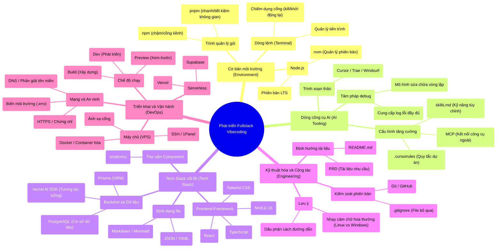

# Phần nâng cao: Từ ý tưởng đến sản phẩm trong 100 giờ

Nếu bạn mở mục lục của cuốn hướng dẫn nâng cao này ra, bạn sẽ thấy đầy rẫy những thuật ngữ kỹ thuật: Thiết lập môi trường, Trình quản lý gói, Cơ sở dữ liệu, Triển khai...

Nó trông rất giống danh sách nội dung của giáo dục lập trình truyền thống. Nhưng tôi muốn nói trước với bạn: **Những thứ này không phải trọng điểm, chúng chỉ là công cụ.**

Trong mười năm qua, giáo dục lập trình dường như đã rơi vào một sai lầm lớn: Vừa vào đã dạy bạn cú pháp, cấu trúc dữ liệu, thuật toán, làm như thể nắm vững những thứ này là làm được sản phẩm. Trông thì có vẻ đúng. Nhưng thực tế, từ "biết viết code" đến "làm được sản phẩm", ở giữa là một vực thẳm khổng lồ.

Phiền phức hơn là, rất nhiều người tưởng rằng làm phần mềm chính là viết code. Nhưng sự thật hoàn toàn ngược lại —— **Code chưa bao giờ là điểm xuất phát của phần mềm, mà là mắt xích cuối cùng của giải pháp.**

Bạn xem, bất kỳ dự án phần mềm nào cũng đều bắt đầu từ một **vấn đề**.

Nó có thể là một vấn đề thương mại: Một nhà hàng mỗi ngày cao điểm khách phải xếp hàng hai tiếng, ông chủ muốn giảm thời gian chờ đợi của khách.

Nó có thể là một vấn đề khoa học: Một phòng thí nghiệm mỗi ngày tạo ra lượng lớn dữ liệu thực nghiệm, nghiên cứu viên muốn tự động phân tích ra xu hướng.

Nó có thể là một vấn đề cá nhân: Bạn muốn ghi lại từng cuốn sách mình đã đọc, sắp xếp lại những điều tâm đắc từ mỗi cuốn sách.

Nó thậm chí có thể là một vấn đề hư cấu: Bạn chỉ là muốn luyện tập một kỹ thuật nào đó, nên tự biên ra một nhu cầu.

Để giải quyết vấn đề này, bạn cần hình thành một **giải pháp** trước.

Phương án này bao gồm nhiều chiều: Cần thiết kế quy trình gì, đặt ra quy tắc gì, phân chia vai trò gì, phối hợp các bên thế nào. Những thứ này mới là cốt lõi của dự án.

Chỉ khi trong phương án có những phần cần tự động hóa, quy mô hóa, hoặc vượt quá giới hạn sức người, bạn mới nghĩ đến: **"Phần này có thể dùng phần mềm để thực hiện"**.

Lúc này, code mới bắt đầu lên sân khấu.

Cho nên, **viết code là việc cần làm ở giai đoạn khá về sau.**

---

## Vực thẳm đang biến mất

Nhưng con lắc của thời đại đã dao động đến vị trí mới.

Trước khi công cụ lập trình AI xuất hiện, chắn ngang giữa "ý tưởng" và "sản phẩm" là một vực thẳm khổng lồ mang tên "năng lực hiện thực hóa".

Bạn có ý tưởng, nhưng bạn không biết viết code. Hoặc bạn biết viết chút chút, nhưng chất lượng code viết ra không đủ cao, chạy không nổi, hoặc chạy được thì đầy lỗi (bug).

Hoặc bạn có tiền thuê người làm, nhưng chi phí giao tiếp cao ngất ngưởng, thứ làm ra luôn thiếu chút gì đó.

Hoặc bạn cắn răng tự làm, tốn mấy tháng trời, cuối cùng phát hiện sản phẩm chẳng phải thứ người dùng cần.

Thế là, ý tưởng dừng lại ở ý tưởng.

Tôi đã gặp quá nhiều người như vậy: Họ có khứu giác thương mại nhạy bén, có kinh nghiệm ngành phong phú, có sự thấu hiểu sâu sắc với nhu cầu người dùng. Nhưng chỉ vì họ không biết viết code, ý tưởng của họ mãi mãi nằm trong cuốn sổ tay, dừng lại ở những câu chuyện trên bàn nhậu, hay trong những đêm trằn trọc.

Vực thẳm này đã ngăn chặn biết bao sản phẩm có thể thay đổi thế giới.

Bây giờ, vực thẳm này đang được lấp phẳng.

Chuyện này giống như lịch sử phát triển của nhiếp ảnh.

Trước đây muốn chụp một bức ảnh ra hồn, bạn cần hiểu cái gì? Khẩu độ, tốc độ màn trập, lấy nét, ISO, cân bằng trắng... Bạn phải hiểu rõ đống nguyên lý phức tạp này, còn phải mua một đống thiết bị đắt tiền. Đa số mọi người chỉ nghĩ đến thôi đã bỏ cuộc.

Bây giờ thì sao? Camera điện thoại tự động xử lý giúp bạn mọi chi tiết kỹ thuật. Bạn chỉ cần quan tâm hai việc: Bạn muốn chụp cái gì, chụp thế nào cho đẹp.

Công cụ lập trình AI cũng vậy.

Chúng giúp bạn xử lý các chi tiết code, bạn chỉ cần quan tâm đến bản thân sản phẩm —— **Bạn muốn giải quyết vấn đề gì, giải quyết như thế nào.**

Điều này không có nghĩa là bạn có thể hoàn toàn mù tịt về kỹ thuật. Bạn vẫn cần hiểu nguyên lý và biên giới của công nghệ, giống như bạn dùng điện thoại chụp ảnh cũng cần biết "ánh sáng tối quá thì ảnh sẽ bị nhòe".

Nhưng bạn không cần phải học thuộc lòng cách viết của từng dòng code, giống như bạn không cần biết thuật toán tầng dưới của camera điện thoại.

**Ngưỡng cửa hạ thấp rồi, nhưng trần nhà vẫn ở đó, thậm chí còn cao hơn.**

Và còn một thay đổi quan trọng hơn đang diễn ra.

Trước đây chúng ta luôn cảm thấy: Phải có mô hình lớn (LLM) trước, rồi mới làm ứng dụng. Các công ty mô hình lớn dò đường phía trước, chúng ta đi theo là được.

Nhưng giờ bạn đi nhìn các ngành nghề mà xem, **những cảnh tượng bùng nổ của AI, lại không nằm ở các công ty mô hình lớn, mà nằm ở những nơi gần với vấn đề thực tế nhất**.

Điều này có ý nghĩa gì với bạn? Nghĩa là bạn không cần đợi công ty AI tung ra tính năng mới gì cả. Bạn chỉ cần hiểu vấn đề bên cạnh mình, rồi dùng công cụ AI hiện có để giải quyết nó. Trong quá trình đó, sự hiểu biết của bạn về AI sẽ tự nhiên sinh trưởng.

---

## Ai là thầy

Còn một thay đổi sâu sắc hơn đang diễn ra ở đây.

Trong lịch sử dài đằng đẵng của nhân loại, kinh nghiệm và trí tuệ luôn tích lũy theo sự gia tăng của tuổi tác —— tiền bối dạy hậu bối, sư phụ truyền đệ tử, đây là quy luật bất biến hàng ngàn năm nay.

Nhưng đằng sau đó có một tiền đề: Thế giới thay đổi đủ chậm, kinh nghiệm quá khứ đủ để ứng đối với thách thức tương lai.

Khi tốc độ đổi mới của công nghệ vượt qua tốc độ tích lũy kinh nghiệm của con người, tiền đề này sụp đổ.

Bạn đã bao giờ thấy cảnh tượng này chưa:

Một người trẻ vừa nhập môn, có thể hiểu cách debug server hơn người thầy tinh thông kỹ thuật của mình; một sinh viên vừa bắt đầu học lập trình, có thể phát hiện giá trị của công cụ AI nhạy bén hơn tiền bối đã nghiên cứu mười năm; một nhân viên vận hành mới vào nghề, có thể dùng công cụ AI để tự động hóa công việc nhanh hơn đồng nghiệp thâm niên.

Đây không phải lỗi của tuổi tác, mà là kết quả tất yếu của gia tốc thời đại.

Khi "kinh nghiệm" chưa kịp lắng đọng thành "trí tuệ", thì kỹ thuật đã lật sang mấy trang mới rồi.

Thế là chúng ta thấy một sự hoán đổi vai trò lặng lẽ diễn ra: Không còn là cha chú đơn phương truyền thụ kiến thức, mà là thế hệ trẻ trở thành người dẫn đường.

Đây không phải sự phủ định với truyền thống. Ngược lại, đây là câu trả lời mới cho vấn đề "Ai là người dò đường phía trước".

Trong thời đại này, người ôm lấy công nghệ mới sớm nhất, tự nhiên sẽ gánh vác trách nhiệm dẫn dắt người khác xuyên qua sương mù.

Điều này không phụ thuộc vào thâm niên, bằng cấp hay chức vụ, chỉ phụ thuộc vào việc bạn có dám bước bước đi đó khi người khác còn đang quan sát hay không.

**Khi thế giới thay đổi quá nhanh, điều nguy hiểm nhất không phải là đi sai đường, mà là đứng yên tại chỗ.**

---

## Một con đường khác

Trong cuốn hướng dẫn nâng cao này, bạn sẽ không thấy con đường truyền thống "học lập trình bắt đầu từ cú pháp".

Ngược lại, bạn sẽ thấy con đường của người thực chiến:

Bắt đầu từ một vấn đề, hình thành một giải pháp, rồi dùng công cụ AI biến giải pháp đó thành sản phẩm.

Tôi dùng cách viết ghi chú phục bàn (review/phản tư), viết ra lời tựa của từng chương —— nó không phải sự chất đống các điểm kiến thức kiểu bách khoa toàn thư, mà là làm rõ những quyết định, những cái hố đã dẫm phải, những sự纠结 (lấn cấn), những sự đánh đổi tại thời điểm đó, để bạn nắm được con đường có thể đi thông và理念 (lý niệm) cốt lõi trước.

Đây không phải cuốn sách giáo khoa dạy bạn "làm thế nào", mà là cuốn ghi chú nói cho bạn biết "tôi đã đi qua như thế nào".

---

### Một người chính là một đội quân

Để bạn hiểu sự độc đáo của con đường chúng ta sắp học, cần thiết phải nhìn xem quy trình phát triển phần mềm hiện đại truyền thống là như thế nào.

**Tại các công ty Internet lớn, một tính năng trông có vẻ đơn giản khi online, đằng sau là cả một bộ quy trình hoàn chỉnh và phức tạp:**

Đầu tiên là **Giai đoạn nhu cầu**: Product Manager (PM) viết tài liệu nhu cầu, tổ chức họp review nhu cầu, PM, Dev, Tester cùng ngồi trong phòng họp thảo luận nửa ngày.

Sau đó là **Giai đoạn thiết kế kỹ thuật**: Backend và Frontend lần lượt viết phương án kỹ thuật, rồi lại tổ chức họp review kỹ thuật, thậm chí Dev của các team thượng nguồn hạ nguồn cũng phải tham gia.

Tiếp theo là **Giai đoạn phát triển**: Coding, Unit Test, tự test Interface, liên thông Frontend-Backend (Integration). Mỗi người đối diện với màn hình của mình gõ code, rồi lại tụ vào nhau để khớp API.

Rồi đến **Giai đoạn kiểm thử**: Dev tự test xong thì "submit test" giao cho team QA, QA tiến hành test thủ công và test tự động, phát hiện Bug thì trả lại cho Dev sửa. Đi đi lại lại, mấy ngày trôi qua.

Tiếp nữa là **Giai đoạn Online**: Merge code, xác minh trên môi trường Pre-production, phát hành Gray (Canary release) —— cho 5% người dùng dùng thử trước, rồi 10%, 50%, cuối cùng 100% toàn bộ. Mỗi bước đều cẩn thận từng li từng tí, sợ xảy ra vấn đề gì.

Cuối cùng là **Giai đoạn Iteration (Lặp)**: Lấy 2 tuần làm một chu kỳ lặp, liên tục quy hoạch và bàn giao tính năng mới. Toàn bộ quy trình như một cỗ máy tinh vi, vận hành tuần hoàn.

Lợi ích của bộ quy trình này là gì? Quy chuẩn, có thể kiểm soát, rủi ro thấp.

Nhưng vấn đề cũng rất rõ ràng: Chậm, nặng nề, ngưỡng cửa cao.

Một tính năng từ lúc đề xuất đến lúc online, thường cần vài tuần thậm chí vài tháng. Hơn nữa mỗi mắt xích đều cần người chuyên trách —— PM, Backend Dev, Frontend Dev, Tester...

Đối với cá nhân hoặc team nhỏ, bộ quy trình này gần như không thể sao chép. Bạn lấy đâu ra nhiều người thế? Lấy đâu ra nhiều thời gian thế?

---

**Còn trong thời đại AI, bộ quy trình này bị nén lại và tái cấu trúc:**

**Giai đoạn nhu cầu**: Bạn chính là Product Manager, viết PRD để AI hiểu. Bạn không cần nắm vững thuật ngữ sản phẩm chuyên nghiệp, bạn chỉ cần nói rõ việc bạn muốn làm.

**Giai đoạn thiết kế kỹ thuật**: AI giúp bạn sinh phương án kỹ thuật, bạn chỉ cần xét duyệt và điều chỉnh. Giống như có một kiến trúc sư giàu kinh nghiệm ngồi cạnh bạn, bất cứ lúc nào cũng có thể đưa ra gợi ý cho bạn.

**Giai đoạn phát triển**: AI giúp bạn viết code, bạn chỉ cần mô tả nhu cầu, kiểm tra kết quả. Bạn không cần học thuộc lòng cách dùng của từng API, không cần nhớ chi tiết của từng Framework.

**Giai đoạn kiểm thử**: AI giúp bạn viết test case, thực thi tự động. Bạn không còn cần tốn lượng lớn thời gian viết code test lặp lại, cũng không lo bỏ sót trường hợp biên nào.

**Giai đoạn Online**: Một nút bấm deploy lên nền tảng đám mây, tự động hoàn thành build và phát hành. Bạn không cần tự cấu hình server, không cần tự dựng dây chuyền CI/CD.

**Giai đoạn Iteration**: Dựa vào dữ liệu và phản hồi điều chỉnh nhanh chóng, lặp theo đơn vị ngày thậm chí giờ. Bạn muốn sửa một tính năng, vài phút là thấy hiệu quả.

Bạn xem, từ vài tuần xuống vài phút, từ chục người xuống một người. Đây không phải nói quá, mà là thực tế đang diễn ra.

Chú ý, điều này không có nghĩa là quy trình biến mất.

Mà là rất nhiều khâu đã được AI tự động hóa, hoặc nói cách khác một người có thể kiêm nhiệm nhiều vai trò.

Bạn không cần viết từng dòng code, nhưng bạn vẫn cần hiểu mỗi khâu đang làm gì, tại sao làm vậy, xảy ra vấn đề thì rà soát thế nào.

**Đây chính là điều cuốn hướng dẫn này dạy bạn: Không phải thay thế quy trình, mà là nắm vững cốt lõi của quy trình, dùng AI nâng cao hiệu suất.**

---

### 100 Giờ đi hết toàn trình

Phần này lấy "Hướng dẫn tránh hố từ con số 0 đến khi Online" làm chủ đạo, đưa bạn dùng một quy trình bàn giao sản phẩm trọn vẹn để xâu chuỗi việc phát triển Fullstack:

**Bước 1: Tuyển chọn kỹ thuật và Chuẩn bị môi trường** (Chương 1-2)

Dựng sân khấu trước, rồi mới hát tuồng. Chọn Tech Stack phù hợp, cấu hình môi trường phát triển, nắm vững phương pháp cơ bản cộng tác với AI. Không có những nền tảng này, ý tưởng phía sau có hay đến mấy cũng không tiếp đất được.

**Bước 2: Định nghĩa vấn đề và Thiết kế phương án** (Chương 3)

Viết PRD, xác định rõ cần giải quyết vấn đề gì, giải quyết thế nào. Bước này nhiều người hay bỏ qua, cảm thấy trực tiếp bắt tay vào viết code sướng hơn. Nhưng tin tôi đi, nghĩ rõ vấn đề, về sau sẽ tiết kiệm được vô số thời gian.

Có thể bạn để ý thấy: **Quy trình dự án thực tế là "nghĩ rõ vấn đề trước, rồi mới chọn kỹ thuật", nhưng thứ tự hướng dẫn lại ngược lại.**

Đây là cố ý. Trong PRD sẽ xuất hiện các thuật ngữ kỹ thuật như Next.js, Prisma, Database, nếu bạn đến những cái này là gì còn không biết, thì tài liệu sẽ không đọc nổi. Cho nên để bạn dựng môi trường lên trước, dùng công cụ cho thuận tay, có cảm giác cơ bản về kỹ thuật đã, rồi mới học cách viết PRD quy chuẩn.

**Bước 3: Hiện thực hóa sản phẩm** (Chương 4-8)

Thiết kế UI/UX để sản phẩm đẹp, dễ dùng; lưu trữ dữ liệu để thông tin bền vững; cơ chế bảo mật bảo vệ quyền riêng tư người dùng; kiểm thử tự động đảm bảo chất lượng. Mỗi bước đều có công cụ và phương pháp cụ thể.

**Bước 4: Phát hành và Lặp (Iteration)** (Chương 9-16)

Từ Localhost đến Public, để thế giới nhìn thấy sản phẩm của bạn; từ cá nhân đến team, học cách cộng tác và chia sẻ; từ Online đến cải tiến liên tục, để sản phẩm tiến hóa trong phản hồi.

Ở điểm cuối của con đường này, chờ đợi bạn không phải là "trở thành lập trình viên", mà là "trở thành một người có thể dùng sản phẩm để giải quyết vấn đề". **Code là phương tiện, không phải mục đích** —— mục tiêu của bạn là giải quyết vấn đề, tạo ra giá trị, mà code chỉ là một trong những công cụ giúp bạn thực hiện mục tiêu này.

---

## Dừng lại nghĩ, chi bằng chạy đi làm

Trong thời đại đầy rẫy sự bất định và gia tốc này, suy nghĩ thái quá thường là kẻ thù của hành động.

Bạn có từng trải qua chuyện như này chưa:

Bạn muốn làm một sản phẩm, nhưng luôn cảm thấy sự chuẩn bị của mình chưa đủ. Bạn muốn học một kỹ thuật, nhưng luôn cảm thấy phải xem hết tất cả hướng dẫn trước đã. Bạn muốn giải quyết một vấn đề, nhưng luôn cảm thấy có thể có phương án tốt hơn.

Thế là bạn dậm chân tại chỗ, nhìn người khác đã chạy xa rồi.

Đừng đợi đến khi ý tưởng hoàn mỹ không tì vết mới bắt đầu làm sản phẩm, đừng đợi nhìn rõ điểm kết thúc mới bắt đầu xuất phát.

Bởi vì trong thế giới thực, chẳng bao giờ có sự khởi đầu hoàn hảo nào cả.

Những sản phẩm thành công mà bạn ngưỡng mộ, rất nhiều đều bắt đầu từ cái MVP sơ sài. Những người khởi nghiệp mà bạn khâm phục, rất nhiều đều liên tục điều chỉnh phương hướng trong lúc mày mò.

**Ở thời đại này, nghĩ, đều là vấn đề; làm, mới là đáp án.**

---

## Bạn cần làm gì

Nói đến đây, có thể bạn sẽ hỏi: Nếu AI làm được nhiều việc thế, vậy tôi còn cần làm gì?

Đây là một câu hỏi hay.

AI quả thực đã thay thế chúng ta. Nhưng phần nó thay thế, chính xác lại là những phần chúng ta vốn dĩ không muốn làm, làm không nổi, thậm chí căn bản không nên để người làm.

Những công việc rườm rà, lặp lại, rủi ro cao, khô khan, AI lấy đi rồi.

Còn thứ nó để lại cho chúng ta, hay nói là thứ nó ép chúng ta phải đi làm, là đi khai phá những khả năng mới, là đi làm những việc chỉ có con người mới làm tốt được.

Nghĩ rõ mối quan hệ này, bạn sẽ biết nên chung sống với AI thế nào:

**Giao sự vụn vặt lặp lại cho AI, giữ sự phán đoán sáng tạo cho mình.**

**Giao việc cực nhọc cho AI, giữ phẩm vị (gu) và tư duy cho mình.**

**Giao việc thực thi máy móc cho AI, giữ linh cảm và ý tưởng cho mình.**

AI có thể giúp bạn sinh code, nhưng nó không thể giúp bạn quyết định làm sản phẩm gì.

AI có thể giúp bạn viết test case, nhưng nó không giúp bạn hiểu nhu cầu thực sự của người dùng.

AI có thể giúp bạn tối ưu hiệu năng, nhưng nó không giúp bạn phát hiện ra vấn đề đáng giải quyết đó.

**Những công việc cần sự phán đoán, phẩm vị, kết nối, sáng tạo, vĩnh viễn là lãnh địa của con người.**

---

## Trước khi bắt đầu

Vì thế, tư thế đúng đắn để sử dụng cuốn hướng dẫn này là:

Đừng coi nó là sách giáo khoa, gặm từ đầu đến đuôi.

Hãy coi nó là một tấm bản đồ, một người dẫn đường, một người bạn có thể cầu cứu bất cứ lúc nào.

Khi bạn gặp vấn đề cụ thể, lật chương tương ứng ra, xem xem tôi đã đi qua như thế nào. Khi bạn rơi vào bối rối, đọc những lời tựa đó, xem xem hành trình tâm lý lúc đó. Khi bạn không biết bước tiếp theo nên làm gì, đối chiếu với tổng quan chương, tìm một hướng rồi động đậy trước đã.

**Học tập không phải là học thuộc lòng, mà là mô phỏng.**

**Trưởng thành không phải là chờ đợi, mà là hành động.**

Sau 100 giờ, bạn sẽ ngạc nhiên với những gì mình làm được.

Không, có thể chẳng cần đến 100 giờ.

**Cứ từ từ, sẽ rất nhanh.**

Đây không phải điểm kết thúc, mà là điểm khởi đầu.

Cuốn hướng dẫn này không phải để bạn đọc xong trở thành kỹ sư Fullstack, mà là để trong quá trình đọc, bạn bắt đầu làm một người có thể giải quyết vấn đề.

**Đừng bị nỗi sợ "có thể sai" dọa dẫm, mà hãy được tầm nhìn "có thể thành" thúc đẩy.** Điều bạn cần làm, là nhìn thấy sản phẩm có thể giải quyết vấn đề đó, rồi lên đường hiện thực hóa nó.

Chúng ta hãy cùng nhau, tiến hóa.

Eyre

Ngày 1 tháng 1 năm 2026

::: tip Bản nâng cao cũ

Nếu bạn muốn đọc nội dung phiên bản cũ thiên về bản đồ tri thức/trưng bày kiến thức: Truy cập [Bản nâng cao (Cũ)](/Advanced-old/).
:::

::: info Giải thích tiến độ hướng dẫn
Một phần nội dung chính/hình ảnh của các chương đang chờ bổ sung, nội dung có thể điều chỉnh theo sự lặp lại (iteration). Giống như viết code vậy —— dựng khung trước, rồi mới mài giũa chi tiết. Kính mời mong đợi bản chính thức phát hành, cảm ơn sự kiên nhẫn của bạn!
:::

---

## Tổng quan các chương

| Chương | Chủ đề                                                                                       | Trạng thái               |
| ------ | -------------------------------------------------------------------------------------------- | ------------------------ |
| 1      | [Thiết lập môi trường, hình thái code và trình quản lý gói](/Advanced/01-environment-setup/) | ✅ Lời tựa đã có thể đọc |
| 2      | [Hướng dẫn tinh chỉnh AI](/Advanced/02-ai-tuning-guide/)                                     | ✅ Lời tựa đã có thể đọc |
| 3      | [Phát triển dựa trên PRD và tài liệu](/Advanced/03-prd-doc-driven/)                          | ✅ Lời tựa đã có thể đọc |
| 4      | [Kiến thức chung về phát triển và Tech Stack](/Advanced/04-dev-fundamentals/)                | ✅ Lời tựa đã có thể đọc |
| 5      | [3 trạng thái vận hành của code và nguyên lý build](/Advanced/05-build-and-runtime-modes/)   | ✅ Lời tựa đã có thể đọc |
| 6      | [Giao diện (UI) và Tương tác (UX)](/Advanced/06-ui-ux/)                                      | ✅ Lời tựa đã có thể đọc |
| 7      | [Biến môi trường và cơ chế bảo mật](/Advanced/07-env-vars-security/)                         | ✅ Lời tựa đã có thể đọc |
| 8      | [Dữ liệu bền vững và cơ sở dữ liệu](/Advanced/08-data-persistence-database/)                 | ✅ Lời tựa đã có thể đọc |
| 9      | [Quy trình kiểm thử chức năng và kịch bản tự động hóa](/Advanced/09-testing-automation/)     | ✅ Lời tựa đã có thể đọc |
| 10     | [Localhost và truy cập công khai](/Advanced/10-localhost-public-access/)                     | ✅ Lời tựa đã có thể đọc |
| 11     | [Kiểm soát phiên bản Git và cộng tác đa nền tảng](/Advanced/11-git-collaboration/)           | ✅ Lời tựa đã có thể đọc |
| 12     | [Triển khai Serverless và tự động hóa CI/CD](/Advanced/12-serverless-deploy-cicd/)           | ✅ Lời tựa đã có thể đọc |
| 13     | [Nguyên lý phân giải tên miền và truy nhập mạng](/Advanced/13-domain-dns/)                   | ✅ Lời tựa đã có thể đọc |
| 14     | [Vận hành máy chủ cloud và triển khai dự án](/Advanced/14-vps-ops-deploy/)                   | ✅ Lời tựa đã có thể đọc |
| 15     | [SEO, Chia sẻ và Thống kê dữ liệu](/Advanced/15-seo-analytics/)                              | ✅ Lời tựa đã có thể đọc |
| 16     | [Phản hồi người dùng và Lặp lại sản phẩm](/Advanced/16-user-feedback-iteration/)             | ✅ Lời tựa đã có thể đọc |

---

## Tổng quan kiến thức

---

::: info Giải thích tiến độ hướng dẫn
Một phần nội dung chính/hình ảnh của các chương đang chờ bổ sung, nội dung có thể điều chỉnh theo sự lặp lại (iteration). Giống như viết code vậy —— dựng khung trước, rồi mới mài giũa chi tiết. Chúng tôi sẽ liên tục nâng cao chất lượng, cảm ơn sự kiên nhẫn của bạn!
:::
