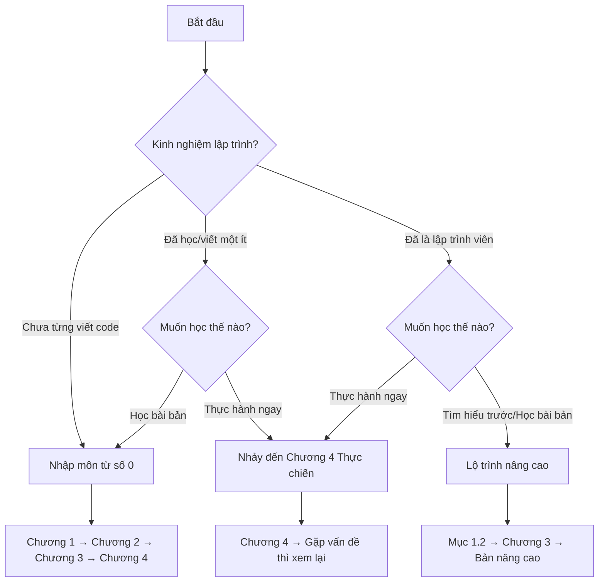

# Tìm vị trí của bạn

## Hướng dẫn này dành cho ai

  

    
Người mới bắt đầu (Zero Experience)

    
Chưa từng tiếp xúc với lập trình, nhìn thấy code là đau đầu? Thời thế đã thay đổi. AI giúp bạn xử lý các phần phức tạp, bạn chỉ cần mô tả rõ ràng điều mình muốn. Giống như nói với thợ sửa nhà "Tôi muốn một phòng khách sáng sủa", bạn không cần tự mình xây tường hay đi dây điện.

  

  

    
Sinh viên khối Xã hội/Kinh tế

    
Bạn có thể nghĩ "lập trình là việc của khối Tự nhiên". Nhưng cốt lõi của Vibe Coding là sự diễn đạt, là nói rõ ý tưởng - đây chính là thế mạnh của bạn. Trong kỷ nguyên lập trình AI, lợi thế của sinh viên khối Xã hội lớn hơn bạn tưởng rất nhiều.

  

  

    
Sinh viên khối Kỹ thuật/Tự nhiên

    
Đã biết viết code, tại sao vẫn phải học? Vì bạn đang chuyển từ "người sản xuất code" sang "người chỉ huy code". Kỹ năng cốt lõi đang dịch chuyển: từ "viết được ra code" sang "nói cho rõ + phán đoán đúng sai".

  

  

    
Người đi làm

    
Muốn có một tool nhỏ, nhưng bộ phận kỹ thuật hẹn 3 tháng nữa? Giờ bạn có thể tự tay làm - nhanh chóng làm prototype xác minh ý tưởng, dùng ngôn ngữ tự nhiên để phân tích dữ liệu, viết script tự động hóa để tạm biệt những công việc lặp lại.

  

  

    
Doanh nhân / Founder

    
Sợ nhất là tốn 3 tháng phát triển, kết quả không ai dùng. Vibe Coding có thể giúp bạn tạo ra prototype chạy được chỉ trong vài giờ, test phản ứng thị trường nhanh chóng, thử sai với chi phí thấp.

  

## Sau khi học xong bạn sẽ nhận được

  

    
Một sản phẩm tự tay làm ra

    
Trang web hoặc tool nhỏ có thể chạy được, có thể chia sẻ cho người khác xem

  

  

    
Kỹ năng cơ bản khi cộng tác với AI

    
Diễn đạt ý tưởng, chia nhỏ task, hướng dẫn AI fix lỗi

  

  

    
Khai mở tư duy sản phẩm (Product Mindset)

    
Khái niệm MVP, cân nhắc tính năng, viết requirement mà AI có thể hiểu

  

  

    
Sự tự tin để tiếp tục khám phá

    
Có khả năng độc lập hoàn thành dự án tiếp theo

  

## Lộ trình học tập

Hướng dẫn này là phiên bản cơ bản của toàn bộ hệ thống:

Sau khi hoàn thành có thể vào phiên bản nâng cao, học tech stack chuyên nghiệp và quy trình phát triển sản phẩm hoàn chỉnh.

## Bắt đầu từ đâu

| Background        | Lộ trình gợi ý                    | Thời gian dự kiến |
| ----------------- | --------------------------------- | ----------------- |
| Zero Experience   | Đọc theo thứ tự Chương 1→2→3→4    | 4-8 giờ           |
| Xã hội/Kinh tế    | Trọng tâm Chương 3, 4             | 3-5 giờ           |
| Kỹ thuật/Tự nhiên | Mục 1.2 → Chương 3 → Bản nâng cao | 2-4 giờ           |
| Người đi làm      | Chương 2 → Chương 4               | 3-4 giờ           |

Chưa chắc chắn? Bắt đầu từ Chương 1, thấy quá cơ bản thì nhảy qua.

---

[Vào Chương 1: Tỉnh thức →](/Basic/01-awakening/)
