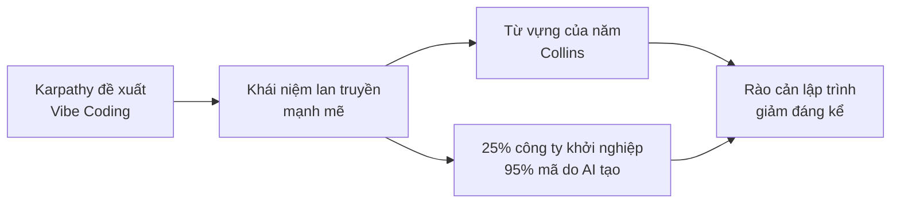

# 1.1.1 Năm 2025, điều gì đã xảy ra với thế giới lập trình

## Cuộc cách mạng được châm ngòi bởi một dòng tweet

Vào tháng 2 năm 2025, cựu Giám đốc AI của Tesla, đồng sáng lập OpenAI Andrej Karpathy đã đăng một dòng tweet trên mạng xã hội.

Ông nói:

> "Có một cách lập trình mới mà tôi gọi là 'vibe coding' (lập trình theo cảm hứng). Bạn hoàn toàn hòa mình vào những rung cảm (vibes), đón nhận sự thay đổi theo cấp số nhân và thậm chí quên rằng mã đang tồn tại."

Lý do dòng tweet này gây ra cuộc thảo luận rộng rãi là——**chúng ta đang bước vào một thời đại mà không cần 'viết' mã cũng có thể 'làm' phần mềm**.

## "Vibe Coding" trở thành từ khóa của năm

Tháng 11 năm 2025, từ điển Collins tuyên bố: **"Vibe Coding"** được bầu chọn là từ vựng của năm.

Định nghĩa chính thức của từ này giải thích rằng:

> Một cách để tạo mã máy tính bằng cách sử dụng trí tuệ nhân tạo thông qua mô tả bằng ngôn ngữ tự nhiên.

Nói cách khác, bạn không cần học bất kỳ ngôn ngữ lập trình nào, chỉ cần dùng ngôn ngữ tự nhiên nói với AI "Tôi muốn một cái XX", nó sẽ giúp bạn làm ra cái đó.

## Dữ liệu không biết nói dối

Dưới đây là các dữ liệu liên quan:

::: info Phát hiện đáng kinh ngạc của Y Combinator
Tháng 3 năm 2025, Garry Tan, CEO của Y Combinator, vườn ươm khởi nghiệp nổi tiếng nhất thế giới, tiết lộ:

**Trong lứa công ty khởi nghiệp mới nhất, 25% công ty báo cáo rằng——95% mã của họ được tạo bởi AI.**

Đây không phải là những dự án nghiệp dư làm cho vui, mà là những công ty khởi nghiệp thực sự đang gọi vốn và đang tăng trưởng.
:::

Điều đáng ngạc nhiên hơn là, quy mô đội ngũ của những công ty này thường dưới 10 người, nhưng lại có thể làm ra những sản phẩm mà trước đây cần hàng chục người mới hoàn thành được.

## Thêm dữ liệu chứng minh

Thêm dữ liệu ngành:

| Chỉ số                                                    | Dữ liệu                 |
| --------------------------------------------------------- | ----------------------- |
| Các nhà phát triển Mỹ sử dụng công cụ lập trình AI        | 92%                     |
| Tỷ lệ mã do AI tạo ra trên toàn cầu                       | 41%                     |
| Tỷ lệ người dùng Vibe Coding không phải là nhà phát triển | 63%                     |
| Tốc độ phát triển tăng sau khi sử dụng AI                 | Cao nhất 55%            |
| Dự báo quy mô thị trường (Năm 2032)                       | Từ 4,9 tỷ → 30,1 tỷ USD |

_Nguồn dữ liệu: Thống kê Second Talent 2025, Báo cáo khảo sát Bubble_

Hãy chú ý đến con số **63%** đó——hơn một nửa người dùng Vibe Coding hoàn toàn không phải là lập trình viên. Họ là nhà thiết kế, quản lý sản phẩm, doanh nhân, thậm chí là sinh viên các ngành xã hội.

## Điều này có ý nghĩa gì?

Hãy xâu chuỗi những sự kiện này lại:

**Lập trình đang chuyển từ "kỹ năng chuyên môn" thành "công cụ phổ quát".**

::: tip Nhận định cốt lõi
Giống như Excel cho phép mọi người xử lý dữ liệu, Word cho phép mọi người trình bày văn bản, các công cụ lập trình AI đang cho phép mọi người tạo ra phần mềm.
:::

## Tóm tắt

Năm 2025 là năm khởi đầu của Vibe Coding. Karpathy đưa ra khái niệm, từ điển Collins đưa vào từ vựng của năm, dữ liệu của Y Combinator xác nhận tác động thực tế của xu hướng này. Tiếp theo, chúng ta sẽ xem cuộc cách mạng này thay đổi vai trò của nhà phát triển như thế nào.
