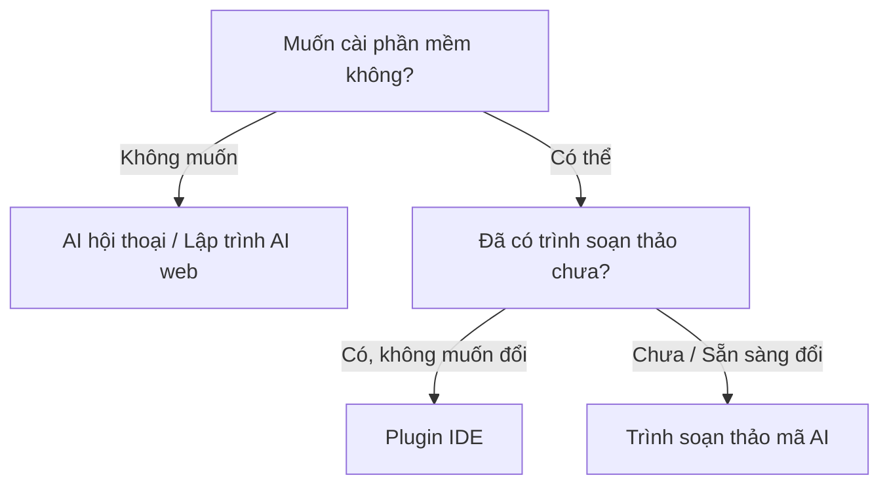

# 1.3.3 Chọn lựa theo tình huống của bạn

Công cụ nhiều như vậy, rốt cuộc chọn cái nào?

Đừng lo lắng. Phần này giúp bạn nhanh chóng định vị——dựa vào tình huống hiện tại của bạn, đưa ra cho bạn lời khuyên trực tiếp nhất.

## Định vị nhanh: Bạn thuộc tình huống nào?

### Tình huống A: Hoàn toàn chưa có nền tảng, muốn trải nghiệm trước

**Trạng thái của bạn**: Chưa bao giờ viết code, thậm chí hơi sợ kỹ thuật. Chỉ là tò mò muốn thử xem.

**Loại công cụ đề xuất**:

| Loại hình                    | Loại công cụ                      |
| ---------------------------- | --------------------------------- |
| Trò chuyện trải nghiệm trước | AI hội thoại (như Claude, Doubao) |
| Xem trực tiếp thành phẩm     | Lập trình AI trên nền tảng web    |

**Hai cách nhập môn**:

1. **Trò chuyện thử trước**: Mở bất kỳ một AI hội thoại nào, nhập "Giúp tôi viết một trang web hiển thị thời gian hiện tại"——AI sẽ đưa code cho bạn.

2. **Xem trực tiếp thành phẩm**: Mở công cụ lập trình AI trên nền tảng web, nhập câu tương tự, trực tiếp nhìn thấy trang web chạy được.

**Hành động bước đầu tiên**: Tham khảo [1.3.1](./1.3.1-tool-overview_vi.md) chọn một công cụ, nhập "Giúp tôi làm một trang web hiển thị thời gian hiện tại", 1-2 phút sau là có thể thấy kết quả.

### Tình huống B: Muốn nhanh chóng làm ra sản phẩm, kiểm chứng ý tưởng

**Trạng thái của bạn**: Có một ý tưởng nhỏ (ví dụ làm một công cụ nhỏ, trang web đơn giản), muốn nhanh chóng thấy thành quả.

**Loại công cụ đề xuất**: Lập trình AI trên nền tảng web

Từ mô tả đến khi lên mạng (online), có thể chỉ cần 10-30 phút. Dự án tạo ra có thể chia sẻ trực tiếp liên kết cho người khác.

Công cụ cụ thể tham khảo [1.3.1 Lập trình AI trên nền tảng web](./1.3.1-tool-overview_vi.md#lập-trình-ai-trên-nền-tảng-web-giải-pháp-một-cửa-không-cần-cài-đặt).

### Tình huống C: Đã dùng VS Code, muốn học sâu về lập trình AI

**Trạng thái của bạn**: Có chút nền tảng lập trình (dù chỉ là xem qua hướng dẫn), muốn học nghiêm túc về phát triển có AI hỗ trợ.

**Loại công cụ đề xuất**: Trình soạn thảo mã AI

**Tại sao chọn loại công cụ này**:

- Dựa trên VS Code, giao diện quen thuộc
- Có thể hiểu ngữ cảnh toàn bộ dự án
- Có năng lực Agent, có thể tự động xử lý nhiệm vụ đa tệp tin

::: info Agent là gì?
Năng lực cốt lõi của lập trình AI năm 2025: AI không chỉ hoàn thành code, mà còn có thể tự lên kế hoạch nhiệm vụ, đọc nhiều tệp tin, thực thi lệnh——như có một trợ lý giúp bạn làm việc, chứ không chỉ là đưa ra gợi ý.
:::

Tham khảo bảng so sánh [1.3.1 Trình soạn thảo mã AI](./1.3.1-tool-overview_vi.md#trình-soạn-thảo-mã-ai-công-cụ-chuyên-nghiệp-cài-đặt-độc-lập), lựa chọn theo sở thích của bạn.

### Tình huống D: Chỉ muốn làm giao diện đẹp

**Trạng thái của bạn**: Cần làm một số component trang web, landing page, giao diện UI đẹp mắt.

**Loại công cụ đề xuất**: Lập trình AI trên nền tảng web (Chuyên về UI như v0.dev)

**Phù hợp với ngữ cảnh**:

- Làm trang landing page sản phẩm
- Component trong Design System
- Nguyên mẫu cần bàn giao cho đội phát triển

### Tình huống E: Đã là nhà phát triển, theo đuổi hiệu suất

**Trạng thái của bạn**: Đã biết viết code, muốn để AI giúp bạn nâng cao hiệu suất.

**Loại công cụ đề xuất**:

| Ngữ cảnh             | Loại công cụ                   |
| -------------------- | ------------------------------ |
| Phát triển hàng ngày | Trình soạn thảo mã AI          |
| Nguyên mẫu nhanh     | Lập trình AI trên nền tảng web |
| Hiệu suất terminal   | Công cụ dòng lệnh              |

**Gợi ý kết hợp**: Sử dụng phối hợp nhiều loại, lấy sở trường của từng loại.

### Tình huống F: Đã có trình soạn thảo, chỉ muốn thêm plugin AI

**Trạng thái của bạn**: Quen dùng VS Code hoặc JetBrains, không muốn đổi trình soạn thảo, chỉ muốn thêm một trợ lý AI.

**Loại công cụ đề xuất**: Plugin/Tiện ích mở rộng IDE

**Phù hợp với ngữ cảnh**:

- Đã có môi trường phát triển hoàn thiện
- Đội ngũ thống nhất sử dụng một IDE nào đó
- Không muốn học công cụ mới, chỉ muốn thêm năng lực AI

Công cụ cụ thể tham khảo [1.3.1 Plugin/Tiện ích mở rộng IDE](./1.3.1-tool-overview_vi.md#plugin-tiện-ích-mở-rộng-ide-thêm-ai-cho-trình-soạn-thảo-hiện-có).

## Cây quyết định lựa chọn công cụ

Nếu bạn vẫn không chắc chắn, hãy đi theo quy trình này:

## Những lầm tưởng phổ biến khi lựa chọn

### Lầm tưởng 1: "Phải chọn công cụ tốt nhất"

**Sự thật**: Không có "tốt nhất", chỉ có "phù hợp".

Công cụ chỉ là phương tiện. Trang web bạn làm bằng Bolt.new, và làm bằng Cursor, người dùng hoàn toàn không nhận ra sự khác biệt.

### Lầm tưởng 2: "Miễn phí chắc chắn không dùng tốt"

**Sự thật**: Hạn mức miễn phí năm 2025 đã rất hào phóng rồi.

- Claude.ai bản miễn phí đủ để trải nghiệm
- Windsurf bản miễn phí đủ cho học tập hàng ngày
- Bolt.new hạn mức miễn phí có thể làm tốt mấy dự án nhỏ

Dùng cái miễn phí trước, thật sự không đủ hãy trả phí.

### Lầm tưởng 3: "Phải học hết tất cả công cụ"

**Sự thật**: Chọn một cái, dùng quen rồi hãy đổi.

Năng lực cốt lõi của công cụ là thông suốt với nhau (năm năng lực lớn đã nói ở phần trước). Sau khi dùng quen một cái, đổi sang cái khác chỉ cần làm quen giao diện, không cần học lại từ đầu.

## Tóm tắt phần này

| Tình huống của bạn                   | Loại đề xuất                    |
| ------------------------------------ | ------------------------------- |
| Không muốn cài phần mềm              | AI hội thoại / Lập trình AI web |
| Muốn cài phần mềm                    | Trình soạn thảo mã AI           |
| Đã có trình soạn thảo không muốn đổi | Plugin IDE                      |
| Theo đuổi hiệu suất terminal         | Công cụ dòng lệnh               |

Công cụ cụ thể vui lòng tham khảo [1.3.1 Bức tranh toàn cảnh công cụ](./1.3.1-tool-overview_vi.md).

> **Lời khuyên quan trọng nhất**: Đừng đắn đo quá lâu. Chọn một loại, đến 1.3.1 chọn một công cụ, mở ra thử ngay bây giờ.

> Phần tiếp theo, chúng ta hãy nói về "chiến lược công cụ" của hướng dẫn này——tại sao chúng tôi không ràng buộc vào một công cụ cụ thể, và điều này có ý nghĩa gì với bạn.
