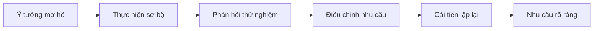

# 1.4.1 Vibe Coding là gì

## Đặc điểm cốt lõi

**Vibe Coding = Biến nhu cầu mơ hồ thành sản phẩm thực tế từng bước thông qua đối thoại lặp lại.**

Mấu chốt không phải độ dài câu nhắc (prompt), mà là **mức độ rõ ràng của nhu cầu**. Vibe Coding phù hợp với các dự án có nhu cầu mơ hồ, cần sự khám phá.

## Quy trình phát triển tương tác

Vibe Coding không phải là đưa ra nhu cầu hoàn chỉnh một lần, mà là hoàn thiện từng bước qua nhiều vòng đối thoại:



### Trường hợp đối thoại thực tế

**Vòng 1 - Nhu cầu ban đầu**

```
Bạn: Tôi muốn làm một công cụ nhỏ ghi lại việc uống nước
AI: Tôi giúp bạn làm một trang web check-in uống nước đơn giản nhé...
```

**Vòng 2 - Dựa trên phản hồi bản đầu**

```
Bạn: Không tệ, nhưng tôi muốn thêm chức năng nhắc nhở, 3 giờ chiều mỗi ngày nhắc nhở
AI: Được thôi, thêm chức năng nhắc nhở định giờ...
```

**Vòng 3 - Hoàn thiện chi tiết**

```
Bạn: Nhắc nhở phải tùy chỉnh được thời gian, còn phải hiển thị tiến độ tuần này nữa
AI: Thêm cài đặt thời gian và thống kê tiến độ...
```

**Vòng 4 - Mở rộng chức năng**

```
Bạn: Làm thêm báo cáo tuần nữa, thống kê xu hướng lượng nước uống mỗi ngày
AI: Thêm trực quan hóa dữ liệu và tạo báo cáo tuần...
```

**Vòng 5 - Điều chỉnh cuối cùng**

```
Bạn: Giao diện đơn giản hóa một chút, chỉ giữ lại chức năng cốt lõi
AI: Tối ưu hóa bố cục giao diện, làm nổi bật chức năng cốt lõi...
```

## Bốn yếu tố cốt lõi

### 1. Khám phá nhu cầu

Khi ý tưởng chưa rõ ràng, Vibe Coding giúp bạn thử sai nhanh chóng. Dành vài phút làm ra phiên bản cơ bản, sau đó dựa vào trải nghiệm thực tế để điều chỉnh hướng đi.

### 2. Tích lũy đối thoại

Mỗi lần đối thoại đều được xây dựng trên cơ sở của những lần trước, AI sẽ ghi nhớ các chi tiết thực hiện trước đó. Bản thân lịch sử đối thoại chính là tài liệu dự án.

### 3. Tối ưu hóa lặp lại

Sau khi nhìn thấy hiệu quả thực tế mới có thể xác định nhu cầu thực sự. Vibe Coding hỗ trợ vòng lặp "tạo sinh - phản hồi - điều chỉnh" nhanh chóng.

### 4. Quản lý Context

Cùng với việc đối thoại đi sâu, AI sẽ tích lũy thông tin ngữ cảnh (context) của dự án. Các quyết định quan trọng và nhu cầu trọng yếu sẽ được lắng đọng tự nhiên trong cuộc đối thoại.

## Sự khác biệt với Spec Coding

**Khác biệt then chốt**: Sự chắc chắn của nhu cầu, chứ không phải độ dài mô tả.

- Vibe Coding: Nhu cầu mơ hồ, làm rõ thông qua đối thoại
- Spec Coding: Nhu cầu rõ ràng, thực hiện theo quy chuẩn

Trên thực tế, đối thoại của Vibe Coding có thể dài hơn tài liệu Spec, nhưng trọng điểm là **làm rõ động** chứ không phải **mô tả tĩnh**.

## Ngữ cảnh áp dụng

- **Kiểm chứng ý tưởng sản phẩm**: Nhanh chóng làm ra nguyên mẫu (prototype) để kiểm tra phản ứng người dùng
- **Phát triển công cụ cá nhân**: Công cụ nhỏ đáp ứng nhu cầu cụ thể của bản thân
- **Thử nghiệm học tập**: Học các khái niệm lập trình thông qua dự án thực tế
- **Dự án sáng tạo**: Nhu cầu không rõ ràng, cần khám phá đổi mới

## Mẹo sử dụng

### Bắt đầu đối thoại

- Mô tả chức năng cốt lõi, đừng quá chú trọng chi tiết
- Chấp nhận sự không hoàn hảo của phiên bản đầu tiên
- Tập trung quan tâm xem logic cốt lõi có đúng không

### Quá trình lặp lại

- Mỗi lần chỉ điều chỉnh 1-2 điểm chức năng
- Dùng ví dụ cụ thể để giải thích vấn đề
- Giữ lại các ghi chép quyết định quan trọng

### Duy trì Context

- Định kỳ tóm tắt các chức năng đã hoàn thành
- Xác định rõ trọng tâm điều chỉnh hiện tại
- Khi cần thiết hãy bắt đầu lại cuộc đối thoại để tránh hỗn loạn

Giá trị cốt lõi của Vibe Coding nằm ở **ngoại hóa quá trình tư duy**, thông qua đối thoại với AI để từng bước làm rõ nhu cầu, cuối cùng có được sản phẩm thực sự mong muốn.

Phần sau chúng ta tìm hiểu [Spec Coding](./1.4.2-what-is-spec-Coding_vi.md), xem cách phát triển khi nhu cầu đã rõ ràng.
