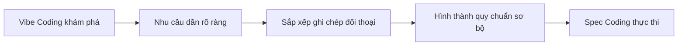

# 1.4.2 Spec Coding là gì

## Khái niệm cốt lõi của Spec Coding

**Spec Coding = Khi nhu cầu rõ ràng, viết quy chuẩn trước rồi để AI thực hiện theo quy chuẩn.**

Khi nhu cầu dự án tương đối rõ ràng, hoặc cần hợp tác nhóm, Spec Coding cung cấp cách thức phát triển ổn định hơn. Nó không phải là mặt đối lập của Vibe Coding, mà là sự tiến hóa tự nhiên của nó.

## Nhận biết ngữ cảnh áp dụng

Khi Vibe Coding đang tiến hành mà gặp các tình huống sau, nên chuyển sang Spec Coding:

- **Ranh giới ký ức**: AI bắt đầu quên nhu cầu ban đầu, xuất hiện xung đột chức năng
- **Nhu cầu cộng tác**: Cần nhiều người tham gia hoặc giải thích trạng thái dự án cho người khác
- **Độ phức tạp gia tăng**: Quy mô dự án vượt quá khả năng chịu tải của đối thoại
- **Yêu cầu chất lượng**: Cần đảm bảo tính nhất quán và khả năng bảo trì của chức năng

Đây đều là những tín hiệu rõ ràng cho thấy độ phức tạp của nhu cầu đã vượt quá khả năng chịu tải của đối thoại.

## Lộ trình tiến hóa từ Vibe sang Spec

Spec Coding thường tiến hóa tự nhiên từ Vibe Coding:



**Quy trình tiến hóa bốn giai đoạn**:

1. **Giai đoạn khám phá Vibe**: Thông qua đối thoại nhanh chóng kiểm chứng ý tưởng, chế tạo nguyên mẫu cơ bản
2. **Giai đoạn sắp xếp nhu cầu**: Xem lại ghi chép đối thoại, chắt lọc nhu cầu cốt lõi thực sự
3. **Giai đoạn hình thành quy chuẩn**: Chuyển nhu cầu đã tóm tắt thành tài liệu có cấu trúc
4. **Giai đoạn thực thi quy chuẩn**: Tiến hành phát triển lặp lại quy chuẩn hơn theo tài liệu

## Hệ thống tài liệu cốt lõi

### Tài liệu nhu cầu (requirements.md)

**Chức năng cốt lõi**:

```
## Chức năng cốt lõi
- Đăng ký đăng nhập người dùng
- Quản lý ghi chép thu chi
- Báo cáo thống kê hàng tháng
- Nhập xuất dữ liệu

## Không làm
- Chức năng xã hội
- Đồng bộ đám mây
- Hỗ trợ đa tiền tệ
```

### Tài liệu thiết kế (design.md)

**Kiến trúc kỹ thuật**:

```
## Lựa chọn kỹ thuật
- Frontend: React + TypeScript
- Backend: Node.js + Express
- Database: SQLite

## Cấu trúc trang
- Trang đăng nhập
- Giao diện chính (danh sách ghi chép)
- Trang thống kê
- Trang cài đặt
```

### Danh sách nhiệm vụ (tasks.md)

**Kế hoạch phát triển**:

```
## Đợt chức năng đầu tiên
- Chức năng ghi chép cơ bản
- Biểu đồ thống kê đơn giản
- Lưu trữ dữ liệu lâu dài (Data persistence)

## Đợt chức năng thứ hai
- Nhập xuất dữ liệu
- Chức năng thống kê nâng cao
- Tối ưu hóa UI
```

## Ưu thế cốt lõi của Spec Coding

### 1. Khả năng truy xuất

Tất cả chức năng và quyết định thiết kế đều có tài liệu ghi lại, thuận tiện cho việc truy xuất và điều chỉnh.

### 2. Thân thiện với cộng tác

Tài liệu quy chuẩn hóa giúp thành viên trong nhóm có thể nhanh chóng hiểu dự án, thực hiện cộng tác hiệu quả.

### 3. Kiểm soát chất lượng

Quy chuẩn rõ ràng đảm bảo tính nhất quán và khả năng bảo trì của việc phát triển chức năng.

### 4. Duy trì ngữ cảnh

Nhu cầu được văn bản hóa giúp tránh việc AI quên thông tin quan trọng trong các cuộc đối thoại dài.

## Chiến lược thực thi thực tế

### Kiểm soát mức độ chi tiết của tài liệu

- **Giai đoạn khởi đầu**: Giữ tài liệu ngắn gọn, ghi lại nhu cầu cốt lõi là được
- **Dự án phức tạp**: Từng bước hoàn thiện chi tiết, nhưng tránh tư liệu hóa quá mức
- **Dự án nhóm**: Cần quy chuẩn chi tiết hơn, đảm bảo tính nhất quán trong cộng tác

### Mô hình phối hợp với Vibe Coding

**Chiến lược phát triển hỗn hợp**:

- Khám phá chức năng mới: Sử dụng Vibe Coding kiểm chứng nhanh
- Sau khi chức năng ổn định: Sắp xếp thành tài liệu quy chuẩn
- Điều chỉnh lớn: Quay lại Vibe Coding khám phá, sau khi hoàn thành thì cập nhật quy chuẩn

### Kỹ năng bảo trì tài liệu

- **Đồng bộ định kỳ**: Sau khi hoàn thành một module chức năng thì cập nhật tài liệu tương ứng
- **Quản lý phiên bản**: Ghi lại lịch sử phiên bản khi có thay đổi quyết định quan trọng
- **Đánh dấu trọng điểm**: Làm nổi bật các ràng buộc quan trọng và quyết định kỹ thuật

Thông qua quản lý tài liệu hệ thống hóa này, Spec Coding có thể hỗ trợ hiệu quả nhu cầu phát triển của các dự án vừa và lớn, đồng thời duy trì ưu thế hiệu suất cao của lập trình AI.
