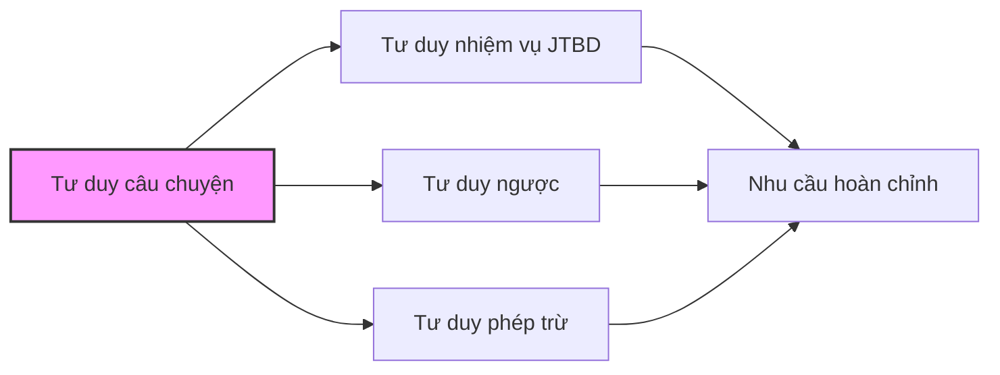

# 2.4 Tư duy câu chuyện: Coi người dùng là nhân vật chính của câu chuyện

Trong các chương trước, chúng ta đã học cách suy nghĩ về nhu cầu bằng "góc nhìn nhiệm vụ", nhận biết rủi ro bằng "tư duy ngược", và tập trung vào cốt lõi bằng "tư duy phép trừ".

Bây giờ, chúng ta sẽ học một phương pháp làm cho các công cụ này trở nên mạnh mẽ hơn: **Coi người dùng là nhân vật chính của câu chuyện**.

## Sau bài học này, bạn sẽ nắm được

- Hiểu tại sao "kể chuyện" lại hiệu quả hơn "liệt kê tính năng"
- Biết cách dùng "phương pháp xây dựng 3D" để tạo ra chân dung người dùng sống động
- Nắm vững công cụ trực quan hóa "bản đồ hành trình người dùng"
- Có được bộ mẫu "Prompt hóa câu chuyện" có thể sao chép và dùng ngay

## Insight cốt lõi của bài học

> "Nếu bạn muốn mọi người ghi nhớ điều gì đó, hãy biến nó thành một câu chuyện."
> —— Tim Brown, CEO công ty thiết kế IDEO

Nghiên cứu của Đại học Stanford chỉ ra rằng: Khi thông tin được trình bày dưới dạng câu chuyện, tỷ lệ lưu giữ trong trí nhớ của mọi người cao gấp 22 lần so với dữ liệu thuần tú.

Điều này có ý nghĩa gì?

- Khi bạn nói với AI "làm một danh sách việc cần làm", AI chỉ có thể đoán bạn muốn gì
- Khi bạn kể "tôi là một nhân viên văn phòng phải xử lý 10 việc mỗi ngày, luôn sợ bỏ sót việc quan trọng", AI có thể hiểu chính xác nhu cầu của bạn

**Câu chuyện không phải là kỹ thuật tu từ, mà là phương thức giao tiếp hiệu quả nhất.**

## Mối quan hệ giữa tư duy câu chuyện và các công cụ khác

Bạn có thể sẽ hỏi: Tư duy câu chuyện khác gì với các công cụ đã học trước đó?

Nói đơn giản:

| Công cụ tư duy        | Trả lời câu hỏi cốt lõi                        |
| :-------------------- | :--------------------------------------------- |
| Tư duy nhiệm vụ       | Người dùng muốn hoàn thành nhiệm vụ gì?        |
| Tư duy ngược          | Điều gì sẽ dẫn đến thất bại?                   |
| Tư duy phép trừ       | Tính năng nào có thể không làm?                |
| **Tư duy câu chuyện** | **Người dùng là ai? Họ đã trải qua những gì?** |

Tư duy câu chuyện là "đế" của các công cụ khác. Khi bạn thực sự hiểu người dùng là ai, đã trải qua những gì, thì nhiệm vụ, rủi ro, và mức độ ưu tiên đều sẽ trở nên rõ ràng hơn.

## Đây không chỉ là chuyện "làm sản phẩm"

Giống như các chương trước, tư duy câu chuyện áp dụng cho bất cứ việc gì bạn muốn làm cùng AI:

| Việc bạn muốn làm         | Vấn đề tư duy câu chuyện giúp bạn giải quyết                                              |
| :------------------------ | :---------------------------------------------------------------------------------------- |
| Làm một công cụ nhỏ       | Giúp bạn chuyển từ "tôi muốn tính năng gì" sang "người dùng của tôi đã trải qua những gì" |
| Báo cáo phân tích dữ liệu | Giúp bạn hiểu "sếp đang nghĩ gì khi xem báo cáo này"                                      |
| Script tự động hóa        | Giúp bạn nhìn rõ "bối cảnh trọn vẹn đằng sau công việc lặp lại này"                       |
| Làm công cụ cho người nhà | Giúp bạn đứng ở "góc nhìn của cha mẹ 60 tuổi" để suy nghĩ vấn đề                          |

Bất kể mục tiêu của bạn là gì, tư duy câu chuyện đều có thể giúp bạn hiểu sâu sắc hơn về việc "làm cho ai".

## Cấu trúc bài học

Tiếp theo, chúng ta sẽ đi qua các nội dung sau để giúp bạn nắm vững tư duy câu chuyện:

1.  **Sản phẩm là câu chuyện**: Hiểu cấu trúc cơ bản của câu chuyện, học cách mô tả nhu cầu bằng góc nhìn câu chuyện
2.  **Chân dung người dùng 3D**: Vượt qua "tuổi tác nghề nghiệp", xây dựng hình tượng người dùng có da có thịt
3.  **Bản đồ hành trình người dùng**: Trực quan hóa câu chuyện, tìm ra nỗi đau quan trọng nhất
4.  **Prompt hóa câu chuyện**: Dùng tư duy câu chuyện để viết ra chỉ lệnh AI chính xác hơn
5.  **Bài tập thực hành**: Áp dụng tư duy câu chuyện cho dự án của riêng bạn
6.  **Điểm cốt lõi**: Mang về những nguyên tắc có thể ứng dụng ngay lập tức

Sẵn sàng chưa? Hãy bắt đầu từ "thế nào là một câu chuyện hay".
