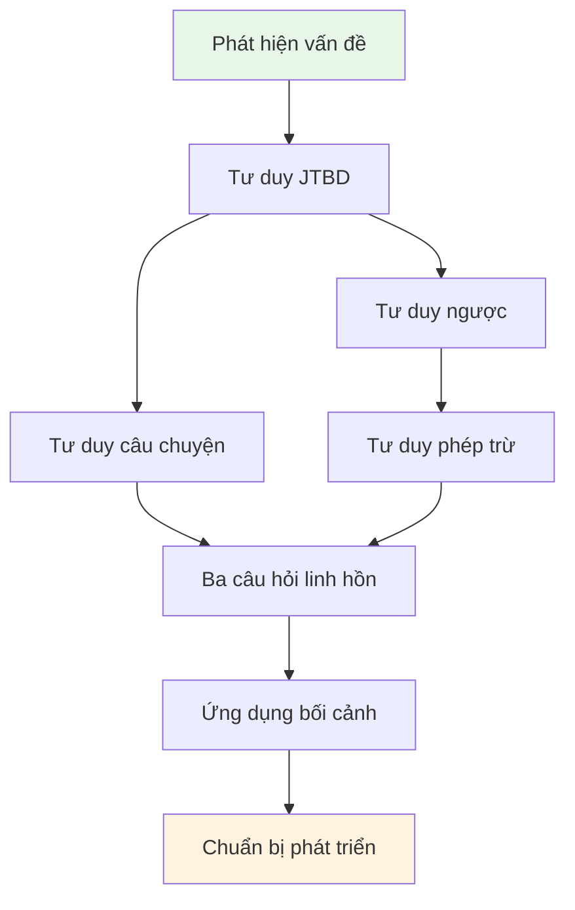

# 2.8 Tổng kết chương: Hộp công cụ tư duy của giám đốc sản phẩm

Sau khi học xong phần này, bạn sẽ nắm được:

- Mối quan hệ hiệp đồng giữa bảy mô hình tư duy
- Quy trình tư duy hoàn chỉnh từ "có ý tưởng" đến "chuẩn bị phát triển"
- Một khung quyết định khởi động dự án có thể sử dụng lặp lại

## Bảy mô hình lớn không phải là công cụ cô lập

Trong các chương trước, bạn đã học bảy mô hình tư duy. Nhưng chúng không phải là bảy công cụ độc lập, mà là một **chuỗi tư duy hoàn chỉnh**.

| Giai đoạn                | Mô hình sử dụng     | Câu hỏi cốt lõi                         |
| :----------------------- | :------------------ | :-------------------------------------- |
| **Giai đoạn phát hiện**  | Phát hiện vấn đề    | Vấn đề gì đáng giải quyết?              |
| **Giai đoạn định nghĩa** | Tư duy JTBD         | Người dùng muốn hoàn thành nhiệm vụ gì? |
| **Giai đoạn né tránh**   | Tư duy ngược        | Điều gì sẽ dẫn đến thất bại?            |
| **Giai đoạn tập trung**  | Tư duy phép trừ     | Phiên bản đầu chỉ làm gì?               |
| **Giai đoạn thấu hiểu**  | Tư duy câu chuyện   | Người dùng đã trải qua những gì?        |
| **Giai đoạn xác minh**   | Ba câu hỏi linh hồn | Tôi đã nghĩ kỹ chưa?                    |
| **Giai đoạn thích ứng**  | Ứng dụng bối cảnh   | Bối cảnh này có yêu cầu gì đặc biệt?    |

## Thứ tự sử dụng của mô hình tư duy

### Bước 1: Bắt đầu từ vấn đề, không phải từ tính năng

Điểm xuất phát của nhiều người là "tôi muốn làm một cái xxx". Nhưng điểm xuất phát đúng đắn là "tôi đã phát hiện một vấn đề".

**Phát hiện vấn đề** giúp bạn nhận diện vấn đề đáng giải quyết. **Tư duy JTBD** giúp bạn hiểu nhiệm vụ người dùng thực sự muốn hoàn thành, chứ không phải danh sách tính năng trong tưởng tượng của bạn.

### Bước 2: Nghĩ về thất bại trước, rồi mới nghĩ về thành công

Sau khi có định nghĩa nhiệm vụ rõ ràng, đừng vội quy hoạch tính năng.

**Tư duy ngược** khiến bạn liệt kê trước "điều gì sẽ dẫn đến thất bại". Những yếu tố thất bại này sẽ chỉ đến một vấn đề chung: Muốn làm quá nhiều.

**Tư duy phép trừ** giúp bạn chặt bỏ những tính năng không cần thiết, tập trung vào phiên bản nhỏ nhất có thể xác minh giả thiết cốt lõi.

### Bước 3: Hiểu người dùng, xác minh ý tưởng

Sau khi xác định phạm vi tính năng, bạn cần xác nhận mình thực sự hiểu người dùng.

**Tư duy câu chuyện** để bạn coi người dùng là nhân vật chính của câu chuyện, hiểu hoàn cảnh và cảm xúc của họ.

**Ba câu hỏi linh hồn** là bước tự kiểm tra cuối cùng: Người dùng là ai? Nỗi đau ở đâu? Tại sao chọn bạn?

### Bước 4: Điều chỉnh theo bối cảnh

Bối cảnh khác nhau có trọng tâm khác nhau.

**Ứng dụng bối cảnh** giúp bạn thích ứng mô hình tư duy chung vào bối cảnh cụ thể: phân tích dữ liệu, script tự động hóa, công cụ cá nhân, công cụ làm cho người nhà.

## Case study xuyên suốt: Từ "muốn làm danh sách việc cần làm" đến "sẵn sàng phát triển"

Hãy dùng dự án danh sách việc cần làm của Tiểu Lý, diễn giải trọn vẹn cách sử dụng xâu chuỗi bảy mô hình.

### Step 1: Phát hiện vấn đề

Tiểu Lý là người mới đi làm. Cậu phát hiện mình thường xuyên bỏ sót việc quan trọng, bị sếp phê bình mấy lần.

Cậu dùng "Nhật ký phiền não" ghi chép một tuần:

| Ngày    | Khoảnh khắc phiền não         | Tần suất      | Mức độ đau khổ |
| :------ | :---------------------------- | :------------ | :------------- |
| Thứ Hai | Quên trả lời email khách hàng | 2-3 lần/tuần  | 8 điểm         |
| Thứ Tư  | Nhớ nhầm giờ họp              | 1-2 lần/tháng | 6 điểm         |
| Thứ Sáu | Quên viết báo cáo tuần        | 1 lần/tuần    | 7 điểm         |

Dùng phương pháp chấm điểm 5 chiều đánh giá vấn đề "bỏ sót nhiệm vụ":

- Tính lặp lại: 5 điểm (gần như ngày nào cũng có)
- Tính quy tắc: 4 điểm (có thể dùng danh sách giải quyết)
- Tính khả kiểm: 5 điểm (tự dùng là xác minh được)
- Tính nhạy cảm: 5 điểm (không liên quan quyền riêng tư và tiền bạc)
- Tính chịu lỗi: 4 điểm (sai có thể điều chỉnh)

**Tổng điểm: 23 điểm, thích hợp dùng Vibe Coding giải quyết.**

### Step 2: Tư duy JTBD

Tiểu Lý tự hỏi: Nhiệm vụ tôi thực sự muốn hoàn thành là gì?

Dùng mẫu JTBD mô tả:

> Khi tôi bắt đầu làm việc mỗi ngày, tôi muốn ghi nhanh những việc cần làm hôm nay, như vậy tôi sẽ không bỏ sót nhiệm vụ quan trọng, có thể yên tâm đầu tư vào công việc.

Ba tầng bậc của nhiệm vụ:

- **Nhiệm vụ chức năng**: Ghi chép và xem các việc cần làm
- **Nhiệm vụ cảm xúc**: Giảm bớt lo âu, cảm thấy yên tâm
- **Nhiệm vụ xã hội**: Tỏ ra đáng tin cậy trước mặt sếp và đồng nghiệp

### Step 3: Tư duy ngược

Tiểu Lý làm một phân tích Pre-mortem: Giả sử ba tháng sau dự án thất bại, nguyên nhân có thể là gì?

| Nguyên nhân thất bại                | Khả năng   | Mức độ nghiêm trọng | Biện pháp phòng ngừa                                     |
| :---------------------------------- | :--------- | :------------------ | :------------------------------------------------------- |
| Tính năng quá nhiều, làm không xong | Cao        | Cao                 | Phiên bản đầu chỉ làm 3 tính năng cốt lõi                |
| Dùng còn phiền hơn giấy nhớ         | Trung bình | Cao                 | Thêm nhiệm vụ phải hoàn thành trong 3 giây               |
| Làm xong chính mình cũng không dùng | Trung bình | Cao                 | Dùng danh sách giấy một tuần để xác minh thói quen trước |
| Cần mở máy tính mới dùng được       | Thấp       | Trung bình          | Làm bản web trước, điện thoại cũng truy cập được         |

### Step 4: Tư duy phép trừ

Dựa trên phân tích Pre-mortem, Tiểu Lý xác định rõ phạm vi MVP:

**Giả thiết cốt lõi**: Một danh sách việc cần làm mỗi ngày cực giản, dùng tốt hơn giấy nhớ và ghi chú điện thoại.

**Tiêu chuẩn xác minh**: Bản thân sử dụng liên tục 7 ngày, ngày nào cũng dùng nó ghi và hoàn thành nhiệm vụ.

**Tính năng P0** (bắt buộc có):

1.  Thêm nhiệm vụ
2.  Hoàn thành nhiệm vụ (đánh dấu)
3.  Xem nhiệm vụ hôm nay

**Danh sách không làm**:

- Không làm phân loại thẻ
- Không làm hạn chót
- Không làm thông báo nhắc nhở
- Không làm thống kê lịch sử

### Step 5: Tư duy câu chuyện

Tiểu Lý dùng chân dung ba chiều mô tả chính mình (với tư cách người dùng):

| Chiều                 | Nội dung                                                                                            |
| :-------------------- | :-------------------------------------------------------------------------------------------------- |
| **Thuộc tính bề mặt** | 25 tuổi, người mới đi làm, mỗi ngày xử lý 10-15 việc lớn nhỏ                                        |
| **Thói quen hành vi** | Sáng đến công ty việc đầu tiên là xem email, dùng ghi chú điện thoại ghi việc nhưng thường quên xem |
| **Động cơ sâu xa**    | Sợ sót nhiệm vụ bị sếp phê bình, muốn trở thành một người đáng tin cậy                              |

Điểm chạm then chốt của hành trình người dùng:

- Sáng đến công ty, mở máy tính
- Đột nhiên nhớ ra một việc, cần ghi lại nhanh
- Trước khi tan làm, kiểm tra xem việc hôm nay đã xong hết chưa

### Step 6: Ba câu hỏi linh hồn

Tự kiểm tra lần cuối:

| Câu hỏi           | Trả lời                                                                                                                   | Trạng thái |
| :---------------- | :------------------------------------------------------------------------------------------------------------------------ | :--------- |
| Người dùng là ai? | Chính tôi —— một người mới đi làm sợ sót nhiệm vụ                                                                         | 🟢 Rõ ràng |
| Nỗi đau ở đâu?    | Thường xuyên quên việc, bị phê bình, cảm thấy lo âu                                                                       | 🟢 Rõ ràng |
| Tại sao chọn tôi? | Công cụ hiện có hoặc quá phức tạp, hoặc dễ quên xem; tôi muốn làm một công cụ cực giản mở ra là thấy việc cần làm hôm nay | 🟢 Rõ ràng |

**Ba đèn xanh, có thể bắt đầu phát triển rồi.**

## Bảng tra cứu lựa chọn mô hình

Không biết nên dùng mô hình nào? Tham khảo bảng này:

| Sự bối rối của bạn                               | Mô hình khuyên dùng | Câu hỏi cốt lõi                                                      |
| :----------------------------------------------- | :------------------ | :------------------------------------------------------------------- |
| Không biết làm dự án gì                          | Phát hiện vấn đề    | Cuộc sống của tôi có phiền não gì lặp đi lặp lại?                    |
| Muốn làm quá nhiều tính năng                     | Tư duy phép trừ     | Giả thiết bắt buộc phải xác minh ở phiên bản đầu là gì?              |
| Không chắc người dùng có cần không               | Tư duy JTBD         | Người dùng muốn hoàn thành nhiệm vụ gì? Hiện tại giải quyết thế nào? |
| Lo làm ra không ai dùng                          | Tư duy ngược        | Trường hợp nào sẽ thất bại? Làm sao tránh?                           |
| Không biết người dùng trông thế nào              | Tư duy câu chuyện   | Người dùng sử dụng trong bối cảnh nào, mang theo cảm xúc gì?         |
| Không biết đã sẵn sàng chưa                      | Ba câu hỏi linh hồn | Người dùng là ai? Nỗi đau ở đâu? Tại sao chọn tôi?                   |
| Bối cảnh đặc biệt, không biết điều chỉnh thế nào | Ứng dụng bối cảnh   | Ràng buộc cốt lõi của bối cảnh này là gì?                            |

## Trọng điểm bài học

✓ **Bảy mô hình là một chuỗi tư duy**: Phát hiện vấn đề → JTBD → Ngược → Phép trừ → Câu chuyện → Ba câu hỏi linh hồn → Ứng dụng bối cảnh, mỗi khâu giải quyết vấn đề khác nhau.

✓ **Không cần lần nào cũng đi hết quy trình**: Dự án đơn giản có thể bỏ qua một phần các bước, nhưng ba câu hỏi linh hồn là kiểm tra giới hạn cuối cùng.

✓ **Giá trị của mô hình nằm ở việc sử dụng tích hợp**: Dùng cô lập bất kỳ mô hình nào cũng không đủ, xâu chuỗi lại mới hình thành tư duy hoàn chỉnh.

Tiếp theo, chúng ta sẽ cung cấp một danh sách kiểm tra trước khi phát triển có thể sử dụng trực tiếp, giúp bạn phán đoán nhanh xem đã sẵn sàng bắt đầu phát triển chưa.
