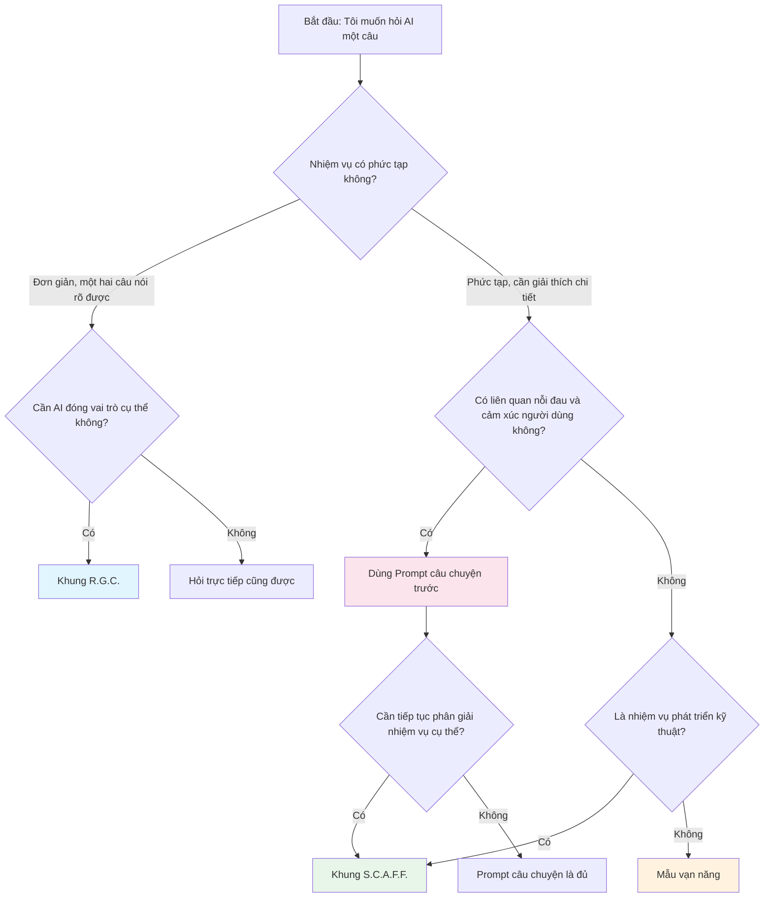

# 3.2.5 Hướng dẫn lựa chọn khung tư duy (Framework)

## Sau bài học này, bạn sẽ nắm được

- Lựa chọn nhanh khung phù hợp dựa trên loại nhiệm vụ
- Hiểu mối quan hệ giữa các khung
- Nhận được một danh sách kiểm tra nhanh trước khi đặt câu hỏi
- Biết khi nào nên chuyển từ khung này sang khung khác

## Bảng tra cứu khung nhanh

| Bối cảnh                                   | Khung đề xuất                | Lý do                                               |
| :----------------------------------------- | :--------------------------- | :-------------------------------------------------- |
| Cần diễn đạt nỗi đau và cảm xúc người dùng | Prompt câu chuyện (Chương 2) | Cộng hưởng cảm xúc mạnh hơn, AI hiểu được "tại sao" |
| Nhiệm vụ phát triển kỹ thuật phức tạp      | S.C.A.F.F.                   | Cấu trúc hoàn chỉnh, ràng buộc rõ ràng              |
| Hỏi đáp nhanh đơn giản                     | R.G.C.                       | Tinh gọn hiệu quả, giảm bớt việc nhập liệu          |
| Không chắc dùng khung nào                  | Mẫu vạn năng                 | Độ bao phủ rộng, khó sai sót                        |
| Review code, refactor code                 | R.G.C.                       | Bản thân code đã cung cấp ngữ cảnh                  |
| Mô tả nhu cầu, thiết kế sản phẩm           | Câu chuyện + S.C.A.F.F.      | Kể chuyện trước, rồi chia nhỏ nhiệm vụ              |
| Phân tích dữ liệu, tạo báo cáo             | Mẫu vạn năng                 | Loại nhiệm vụ đa dạng, tính phổ quát mạnh           |
| Học khái niệm, tìm lời giải thích          | R.G.C.                       | Đơn giản trực tiếp                                  |

## Sơ đồ quy trình ra quyết định



**Quyết định phiên bản đơn giản**:

1.  **Nhiệm vụ đơn giản** → R.G.C.
2.  **Nhiệm vụ phức tạp + Phát triển kỹ thuật** → S.C.A.F.F.
3.  **Nhiệm vụ phức tạp + Phi kỹ thuật** → Mẫu vạn năng
4.  **Cần diễn đạt câu chuyện người dùng** → Prompt câu chuyện
5.  **Không chắc chắn** → Mẫu vạn năng

## Sơ đồ quan hệ các khung

Bốn loại khung này không thay thế lẫn nhau, mà bổ sung cho nhau:

```
┌─────────────────────────────────────────────────────────┐
│                     Mẫu vạn năng                          │
│        (Phổ quát nhất, bao phủ rộng, gì cũng dùng được)     │
│  ┌─────────────────────┐  ┌─────────────────────┐      │
│  │    S.C.A.F.F.       │  │   Prompt câu chuyện  │      │
│  │ (Chuyên cho kỹ thuật) │  │ (Chuyên cho cảm xúc)  │      │
│  │                     │  │                     │      │
│  │  ┌─────────────┐    │  │                     │      │
│  │  │   R.G.C.    │    │  │                     │      │
│  │  │ (Bản tinh gọn) │    │  │                     │      │
│  │  └─────────────┘    │  │                     │      │
│  └─────────────────────┘  └─────────────────────┘      │
└─────────────────────────────────────────────────────────┘
```

- **R.G.C.** là bản tinh gọn của **S.C.A.F.F.**
- **S.C.A.F.F.** và **Prompt câu chuyện** có quan hệ ngang hàng, mỗi cái có trọng tâm riêng
- **Mẫu vạn năng** là tập hợp lớn nhất, bối cảnh nào cũng dùng được

## Danh sách kiểm tra trước khi hỏi

Trước khi nhấn nút gửi, lướt nhanh qua một lượt:

### Kiểm tra cơ bản (Bắt buộc)

- [ ] **Nhiệm vụ có rõ ràng không**: AI có hiểu bạn muốn nó làm gì không?
- [ ] **Bối cảnh có đủ không**: AI có đủ thông tin để đưa ra phán đoán đúng không?
- [ ] **Ràng buộc có xác định không**: AI có biết cái gì không được làm không?

### Kiểm tra nâng cao (Đề xuất)

- [ ] **Vai trò có chỉ định không**: AI nên trả lời với tư cách gì?
- [ ] **Định dạng có nói rõ không**: Bạn kỳ vọng hình thức đầu ra thế nào?
- [ ] **Ví dụ có cần thiết không**: Cho một ví dụ có giúp rõ ràng hơn không?

### Kiểm tra phản tư (Tùy chọn)

- [ ] **Có nói quá nhiều không**: Có phải yêu cầu quá nhiều thứ một lúc không?
- [ ] **Có nói quá ít không**: Có bỏ sót thông tin quan trọng nào không?
- [ ] **Ranh giới có rõ ràng không**: AI có thể sẽ "tự biên tự diễn" không?

## Tín hiệu chuyển đổi khung

Khi bạn dùng một khung nào đó để hỏi, nhưng đầu ra của AI không lý tưởng, đây có thể là vấn đề do chọn khung hoặc điền nội dung:

| Vấn đề đầu ra của AI                 | Nguyên nhân có thể               | Hướng điều chỉnh                |
| :----------------------------------- | :------------------------------- | :------------------------------ |
| Phương án kỹ thuật không khớp dự án  | Thiếu bối cảnh dự án             | Bổ sung Situation               |
| Phạm vi chức năng không khớp kỳ vọng | Mô tả nhiệm vụ không rõ          | Viết lại Challenge/Goal         |
| Độ phức tạp code không phù hợp       | Không nói rõ trình độ người dùng | Thêm Audience                   |
| Định dạng đầu ra lộn xộn             | Không chỉ định định dạng         | Thêm Format                     |
| AI "tự biên tự diễn" quá nhiều       | Ràng buộc chưa đủ                | Bổ sung Constraints/Foundations |
| Trả lời quá kỹ thuật khô khan        | Vấn đề thiết lập vai trò         | Điều chỉnh Role                 |
| Không hiểu nỗi đau cốt lõi           | Thiếu bối cảnh câu chuyện        | Chuyển sang Prompt câu chuyện   |

## Lời khuyên thực chiến

### Cho người mới bắt đầu

Khi mới bắt đầu, đề xuất **điền nghiêm ngặt theo khung**, dù cảm thấy một số mục là "thừa thãi".

Lý do:

1.  Khung giúp bạn kiểm tra xem có bỏ sót thông tin quan trọng không
2.  Xây dựng thói quen tư duy cấu trúc hóa
3.  Khi đầu ra không lý tưởng, có khung để đối chiếu rà soát

### Cho người dùng có kinh nghiệm

Sau khi thành thạo, có thể **linh hoạt đơn giản hóa** tùy theo nhiệm vụ:

- Nhiệm vụ đơn giản: R.G.C. hoặc thậm chí hỏi trực tiếp
- Nhiệm vụ phức tạp: Khung đầy đủ
- Nhiệm vụ lặp lại: Tinh chỉnh dựa trên Prompt trước đó

**Nguyên tắc cốt lõi**: Khung là công cụ, không phải quy tắc. Hãy để nó giúp bạn, chứ không phải trói buộc bạn.

## Ôn tập chương này

Chúc mừng bạn đã hoàn thành phần học về "Khung Prompt cấu trúc hóa". Bây giờ bạn đã nắm vững:

| Công cụ           | Công dụng                   | Yếu tố cốt lõi                                                    |
| :---------------- | :-------------------------- | :---------------------------------------------------------------- |
| S.C.A.F.F.        | Nhiệm vụ kỹ thuật phức tạp  | Situation, Challenge, Audience, Format, Foundations               |
| R.G.C.            | Hỏi đáp nhanh đơn giản      | Role, Goal, Constraints                                           |
| Mẫu vạn năng      | Bối cảnh chung              | Vai trò, Bối cảnh, Nhiệm vụ, Yêu cầu, Ràng buộc, Định dạng, Ví dụ |
| Prompt câu chuyện | Diễn đạt nỗi đau người dùng | Thân phận, Hiện trạng, Nỗi đau, Kỳ vọng                           |

## Dự báo bước tiếp theo

Khung cấu trúc hóa giải quyết vấn đề "tổ chức thông tin thế nào". Nhưng đôi khi, chỉ có cấu trúc là chưa đủ —— bạn cần một số **kỹ thuật đặc biệt** để suy luận của AI sâu sắc hơn, đầu ra chính xác hơn.

Bài tiếp theo "3.3 Kỹ thuật Prompt nâng cao", chúng ta sẽ học:

- **Zero-shot**: Nghệ thuật hỏi trực tiếp
- **Few-shot**: Dùng ví dụ dạy AI
- **Chain of Thought**: Để AI "nghĩ một chút" rồi mới trả lời
- **Tree of Thoughts**: Khám phá nhiều hướng suy luận
- **Self-Critique**: Để AI tự kiểm tra

Các kỹ thuật này có thể **kết hợp sử dụng** với khung cấu trúc hóa, nâng cao hơn nữa chất lượng đầu ra của AI.

Sẵn sàng chưa? Hãy cùng bước vào bài tiếp theo.
