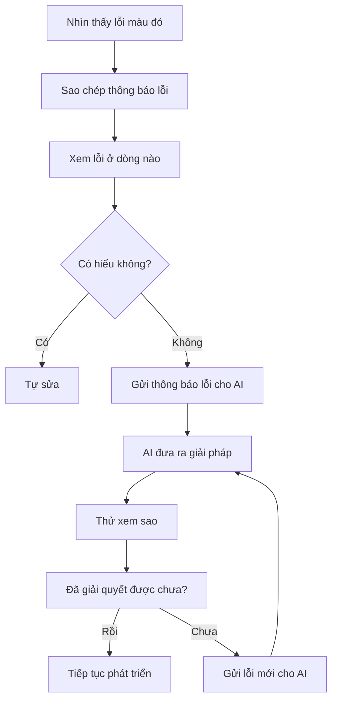

# B.1 Lỗi JavaScript

Gặp lỗi đừng hoảng! Phần này liệt kê các lỗi JavaScript thường gặp nhất, cùng với cách giải quyết tương ứng. Khi gặp vấn đề, cứ tra bảng này là được.

## Lỗi undefined

**Thông báo lỗi**:

```
Uncaught TypeError: Cannot read properties of undefined (reading 'xxx')
```

**Giải thích dân dã**: Bạn đang cố dùng một thứ "không tồn tại". Giống như bạn hỏi "số điện thoại của Tiểu Minh", nhưng người tên Tiểu Minh không tồn tại.

**Nguyên nhân thường gặp**:
| Nguyên nhân | Code ví dụ | Cách sửa |
|------|----------|----------|
| Biến chưa được gán giá trị | `let user; console.log(user.name)` | Kiểm tra xem biến có giá trị hay chưa |
| Truy cập ngoài mảng | `arr[10]` nhưng mảng chỉ có 3 phần tử | Kiểm tra độ dài mảng |
| Sai chính tả tên thuộc tính | `user.nmae` (đúng ra là `name`) | Kiểm tra chính tả tên thuộc tính |
| Hàm không có giá trị trả về | `function get() {}` sau đó dùng giá trị trả về | Đảm bảo hàm có `return` |

**Prompt sửa nhanh**:

```markdown
Code của tôi bị lỗi: Cannot read properties of undefined (reading 'xxx')

Lỗi xuất hiện ở dòng này: [Dán dòng code bị lỗi vào]

Hãy giúp tôi phân tích nguyên nhân và sửa chữa.
```

## Lỗi null

**Thông báo lỗi**:

```
Uncaught TypeError: Cannot read properties of null (reading 'xxx')
```

**Giải thích dân dã**: Bạn đang cố dùng một thứ "chắc chắn là rỗng". Giống như một cái hộp rỗng, nhưng bạn lại muốn lấy đồ từ bên trong ra.

**Nguyên nhân thường gặp**:
| Nguyên nhân | Code ví dụ | Cách sửa |
|------|----------|----------|
| Không tìm thấy phần tử DOM | `document.getElementById('btn')` trả về null | Kiểm tra ID có đúng không, hoặc phần tử có tồn tại không |
| API trả về null | Backend trả về `null` | Thêm phán đoán giá trị rỗng |
| LocalStorage không có dữ liệu | `JSON.parse(localStorage.getItem('data'))` | Thêm giá trị mặc định: `|| []` |

**Prompt sửa nhanh**:

```markdown
Code của tôi bị lỗi: Cannot read properties of null

Tôi muốn lấy phần tử có ID là [xxx] trên trang, nhưng nó trả về null.

Hãy giúp tôi kiểm tra nguyên nhân có thể là gì.
```

## TypeError

**Thông báo lỗi**:

```
Uncaught TypeError: xxx is not a function
```

**Giải thích dân dã**: Bạn lấy một thứ không phải là hàm ra để dùng như hàm. Giống như bạn bảo hòn đá "hát cho tôi nghe một bài".

**Nguyên nhân thường gặp**:
| Nguyên nhân | Code ví dụ | Cách sửa |
|------|----------|----------|
| Tên biến đè lên tên hàm | Định nghĩa `let alert = 'hi'`, sau đó `alert('hello')` | Tránh dùng tên hàm có sẵn để đặt tên biến |
| Sai chính tả tên phương thức | `arr.pushs(1)` (đúng ra là `push`) | Kiểm tra chính tả tên phương thức |
| Gọi phương thức không tồn tại | Gọi phương thức chuỗi trên số | Kiểm tra kiểu dữ liệu |

## ReferenceError

**Thông báo lỗi**:

```
Uncaught ReferenceError: xxx is not defined
```

**Giải thích dân dã**: Bạn dùng một biến chưa từng được định nghĩa. Giống như bạn nói "đưa cho tôi cái xxx", nhưng trong phòng hoàn toàn không có cái đó.

**Nguyên nhân thường gặp**:
| Nguyên nhân | Code ví dụ | Cách sửa |
|------|----------|----------|
| Sai chính tả tên biến | `consle.log` (đúng ra là `console`) | Kiểm tra chính tả |
| Vấn đề phạm vi biến (scope) | Truy cập biến trong hàm từ bên ngoài hàm | Hiểu về scope, hoặc định nghĩa biến ra bên ngoài |
| Quên import thư viện | Dùng jQuery nhưng chưa import | Đảm bảo dependencies đã được tải |

## SyntaxError

**Thông báo lỗi**:

```
Uncaught SyntaxError: Unexpected token 'xxx'
```

**Giải thích dân dã**: "Ngữ pháp" code viết sai. Giống như tiếng Việt thiếu dấu chấm câu, đọc không thông.

**Nguyên nhân thường gặp**:
| Nguyên nhân | Code ví dụ | Cách sửa |
|------|----------|----------|
| Thiếu dấu ngoặc | `if (x > 1 {` | Bù dấu ngoặc còn thiếu |
| Thừa dấu phẩy | `[1, 2, 3,]` (một số trường hợp) | Xóa dấu phẩy thừa |
| Dấu nháy không khớp | `'hello"` | Dùng cặp dấu nháy giống nhau |
| Lỗi định dạng JSON | `{name: 'test'}` đúng ra là `{"name": "test"}` | Key của JSON phải dùng dấu nháy kép |

::: tip Đặc điểm của lỗi ngữ pháp
Lỗi ngữ pháp thường báo lỗi trước khi code chạy, và trình duyệt sẽ bảo bạn biết là ở dòng nào. Nhìn kỹ dòng đó và dòng bên trên nó, vấn đề thường nằm quanh đó.
:::

## Quy trình chung để kiểm tra lỗi



Ghi nhớ: **Báo lỗi không đáng sợ, cứ copy paste cho AI là được**.
