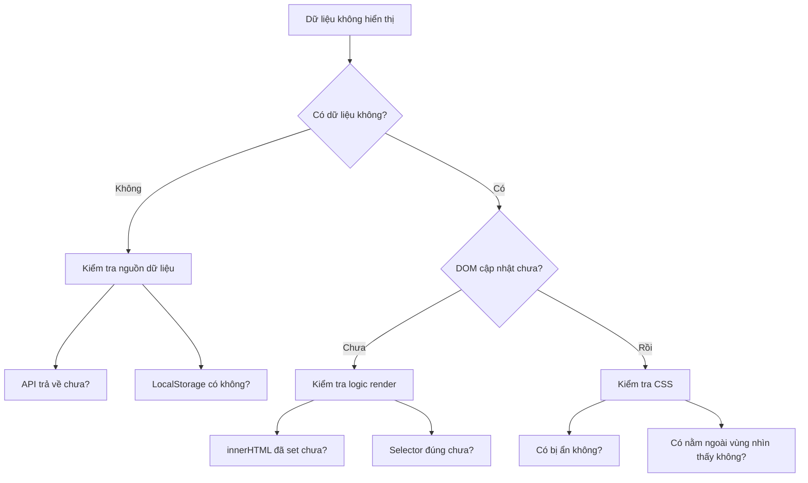

# B.3 Vấn đề Tương tác

Trang hiển thị được, nhưng ấn nút, nhập liệu không có phản ứng? Một này giúp bạn giải quyết các vấn đề tương tác thường gặp nhất.

## Nút bấm không phản ứng

**Hiện tượng**: Ấn vào nút, chẳng có chuyện gì xảy ra cả.

**Danh sách kiểm tra**:

| Mục kiểm tra            | Cách kiểm tra                                                  | Cách giải quyết                                |
| ----------------------- | -------------------------------------------------------------- | ---------------------------------------------- |
| Sự kiện chưa được gán   | Kiểm tra `onclick` trong HTML hoặc `addEventListener` trong JS | Đảm bảo hàm xử lý sự kiện được gán đúng        |
| Viết sai tên hàm        | Kiểm tra tên hàm trong `onclick="xxx()"`                       | Đảm bảo khớp với tên hàm định nghĩa trong JS   |
| File JS chưa được tải   | Xem console có lỗi 404 không                                   | Kiểm tra đường dẫn thẻ `<script>`              |
| JS có lỗi ngữ pháp      | Xem console có lỗi màu đỏ không                                | Sửa lỗi ngữ pháp, code phía sau mới chạy được  |
| Bị phần tử khác che mất | Kiểm tra bên trên nút có phần tử trong suốt không              | Điều chỉnh `z-index` hoặc xóa phần tử che chắn |

**Prompt sửa nhanh**:

```markdown
Nút bấm của tôi không có phản ứng gì khi click.

Code HTML của nút:
[Dán code nút]

Code hàm JS:
[Dán code JS tương ứng]

Thông báo lỗi Console (nếu có):
[Dán thông báo lỗi]

Hãy giúp tôi kiểm tra nguyên nhân.
```

## Gửi biểu mẫu thất bại

**Hiện tượng**: Điền xong biểu mẫu ấn gửi, trang tải lại nhưng dữ liệu không được xử lý.

**Nguyên nhân thường gặp và cách giải quyết**:

### Vấn đề trang tải lại (Refresh)

```javascript
// Vấn đề: Sau khi gửi form trang bị tải lại
// Giải quyết: Ngăn chặn hành vi mặc định
form.addEventListener("submit", function (e) {
  e.preventDefault(); // Ngăn chặn hành vi gửi form mặc định
  // Xử lý dữ liệu ở đây
});
```

### Không lấy được giá trị đầu vào

```javascript
// Vấn đề: Giá trị lấy được là rỗng
// Kiểm tra 1: Selector có đúng không
const input = document.getElementById("username"); // ID phải khớp

// Kiểm tra 2: Cách lấy giá trị
const value = input.value; // Chú ý là .value chứ không phải .innerText

// Kiểm tra 3: Thời điểm lấy có đúng không (phải lấy sau khi người dùng nhập)
```

### Vấn đề định dạng dữ liệu

```javascript
// Vấn đề: Số bị coi là chuỗi
const age = document.getElementById("age").value; // "25" (Chuỗi)
const ageNumber = parseInt(age); // 25 (Số)

// Hoặc dùng Number()
const ageNumber2 = Number(age);
```

## Dữ liệu không hiển thị

**Hiện tượng**: Dữ liệu đã lưu, nhưng trên trang không nhìn thấy.

**Các bước kiểm tra**:



**Code sửa thường gặp**:

```javascript
// Kiểm tra dữ liệu có tồn tại không
const data = localStorage.getItem("quotes");
console.log("Dữ liệu đã lưu:", data); // Dùng console.log để kiểm tra

// Đảm bảo phân tích đúng
const quotes = JSON.parse(data) || [];
console.log("Mảng sau khi parse:", quotes);

// Đảm bảo render vào đúng vị trí
const container = document.getElementById("list");
if (container) {
  container.innerHTML = quotes.map((q) => `<p>${q}</p>`).join("");
} else {
  console.log("Không tìm thấy phần tử container!");
}
```

## Dữ liệu đã lưu nhưng tải lại trang thì mất

**Hiện tượng**: Thao tác dữ liệu thành công, nhưng tải lại trang thì dữ liệu biến mất.

**Danh sách kiểm tra**:

| Nguyên nhân có thể       | Cách kiểm tra                               | Cách giải quyết                                |
| ------------------------ | ------------------------------------------- | ---------------------------------------------- |
| Chưa lưu trữ bền vững    | Kiểm tra có dùng LocalStorage không         | Khi dữ liệu thay đổi phải lưu vào LocalStorage |
| Sai thời điểm lưu        | Kiểm tra code lưu có được thực thi không    | Lưu ngay sau khi dữ liệu thay đổi              |
| Sai thời điểm tải        | Kiểm tra khi tải trang có đọc dữ liệu không | Đọc từ LocalStorage khi trang tải xong         |
| Vấn đề định dạng lưu trữ | Kiểm tra định dạng dữ liệu lưu              | Dùng JSON.stringify để lưu, JSON.parse để lấy  |

**Ví dụ lưu/lấy hoàn chỉnh**:

```javascript
// Lưu dữ liệu
function saveQuotes(quotes) {
  localStorage.setItem("quotes", JSON.stringify(quotes));
}

// Đọc dữ liệu
function loadQuotes() {
  const data = localStorage.getItem("quotes");
  return data ? JSON.parse(data) : [];
}

// Đọc khi trang tải xong
document.addEventListener("DOMContentLoaded", function () {
  const quotes = loadQuotes();
  renderQuotes(quotes);
});

// Lưu khi thêm dữ liệu mới
function addQuote(newQuote) {
  const quotes = loadQuotes();
  quotes.push(newQuote);
  saveQuotes(quotes); // Đừng quên lưu!
  renderQuotes(quotes);
}
```

## Khẩu quyết chung để kiểm tra lỗi tương tác

> **Xem Console** → **Thêm console.log** → **Kiểm tra thời điểm** → **Hỏi AI**

1. **Xem Console**: Có lỗi đỏ không?
2. **Thêm console.log**: Code chạy đến bước nào rồi? Dữ liệu là gì?
3. **Kiểm tra thời điểm**: Code có đang chạy đúng thời gian không?
4. **Hỏi AI**: Mô tả rõ code liên quan và hiện tượng
