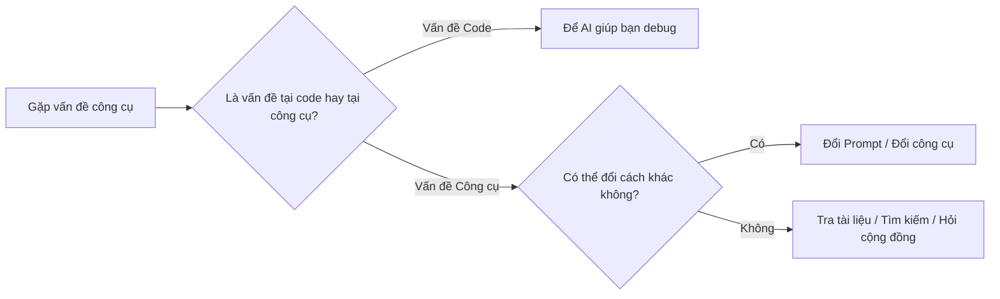

# B.4 Vấn đề về Công cụ

Phần này giải quyết các vấn đề bạn có thể gặp phải khi sử dụng các công cụ lập trình AI.

## AI không hiểu nhu cầu của tôi

**Hiện tượng**: Code AI đưa hoàn toàn không phải thứ bạn muốn.

**Nguyên nhân có thể và cách giải quyết**:

| Nguyên nhân               | Cách giải quyết                                                         |
| ------------------------- | ----------------------------------------------------------------------- |
| Mô tả quá mơ hồ           | Tăng thêm chi tiết cụ thể, ví dụ kích thước, màu sắc, vị trí            |
| Nhu cầu quá phức tạp      | Chia nhỏ thành nhiều nhu cầu con, làm từng bước một                     |
| Thiếu ngữ cảnh            | Nói cho AI biết cấu trúc code hiện có, tech stack đang dùng             |
| Thuật ngữ không chính xác | Đổi cách diễn đạt, hoặc dùng ảnh chụp màn hình/trang web ví dụ để mô tả |

**So sánh ví dụ**:

```markdown
❌ Mô tả không tốt:
Làm một trang đẹp đẹp

✅ Mô tả tốt:
Làm một trang trưng bày sản phẩm.

- Phần đầu là tiêu đề lớn "Sổ chi tiêu thông minh", chữ trắng, nền xanh
- Bên dưới là 3 thẻ giới thiệu tính năng, sắp xếp ngang
- Mỗi thẻ có biểu tượng, tiêu đề, và một câu mô tả
- Dưới cùng có nút "Tải xuống ngay"
- Phong cách tổng thể tối giản hiện đại
```

## Code AI tạo ra không chạy được

**Hiện tượng**: Sau khi copy code của AI, trang báo lỗi hoặc trắng trơn.

**Danh sách kiểm tra**:

| Mục kiểm tra                           | Cách giải quyết                                     |
| -------------------------------------- | --------------------------------------------------- |
| Code không hoàn chỉnh                  | Bảo AI "Hãy đưa ra code hoàn chỉnh"                 |
| Thiếu thư viện phụ thuộc               | Hỏi xem cần import thư viện hay framework nào không |
| Code cần chạy trong môi trường đặc thù | Xác nhận xem là code trình duyệt hay code Node.js   |
| Cấu trúc file sai                      | Bảo AI giải thích code nên đặt ở file nào           |
| Copy paste bị lỗi                      | Kiểm tra xem có copy thiếu gì không                 |

**Prompt sửa nhanh**:

```markdown
Code bạn đưa chạy bị lỗi.

Thông báo lỗi:
[Dán thông báo lỗi]

Hãy giúp tôi sửa, và đưa ra code hoàn chỉnh có thể chạy được.
```

## Triển khai thất bại

**Hiện tượng**: Chạy ở máy mình thì được, nhưng đưa lên Vercel/Netlify thì không mở được.

**Nguyên nhân thường gặp và cách giải quyết**:

| Loại lỗi            | Nguyên nhân có thể            | Cách giải quyết                                                 |
| ------------------- | ----------------------------- | --------------------------------------------------------------- |
| Build failed        | Code có lỗi ngữ pháp          | Xem log triển khai (deploy log), sửa lỗi                        |
| 404 Not Found       | Vấn đề đường dẫn file         | Kiểm tra tên file viết hoa viết thường, đường dẫn có đúng không |
| Trang trắng trơn    | JS báo lỗi                    | Mở console trình duyệt xem lỗi                                  |
| Mất style           | Vấn đề đường dẫn CSS          | Dùng đường dẫn tương đối, đảm bảo file đã được upload           |
| API không hoạt động | Chưa cấu hình biến môi trường | Cấu hình biến môi trường trên nền tảng triển khai               |

**Danh sách kiểm tra trước khi triển khai**:

- [ ] Tất cả file đều đã được lưu
- [ ] Chạy thử nghiệm ở máy mình bình thường
- [ ] Tên file không dùng tiếng Việt có dấu và ký tự đặc biệt
- [ ] Đường dẫn dùng đường dẫn tương đối (`./` hoặc `../`)
- [ ] File đầu vào là `index.html`

## AI lặp đi lặp lại một đáp án sai

**Hiện tượng**: Hỏi đi hỏi lại, AI vẫn cứ đưa ra cùng một đoạn code (sai).

**Chiến lược giải quyết**:

### Chiến lược 1: Đổi cách hỏi

```markdown
Trước đó: Hãy giúp tôi thực hiện một cái slider ảnh

Sau đó: Hãy dùng JavaScript thuần thực hiện một component xoay vòng ảnh, yêu cầu:

- Tự động chuyển sang ảnh tiếp theo mỗi 3 giây
- Bên dưới có chấm tròn chỉ thị ảnh hiện tại
- Bấm vào chấm tròn có thể nhảy đến ảnh tương ứng
```

### Chiến lược 2: Loại trừ rõ ràng

```markdown
Hãy giúp tôi thực hiện xxx, nhưng đừng dùng [phương án thất bại trước đó].
```

### Chiến lược 3: Cung cấp thêm thông tin

```markdown
Tôi làm theo bạn nói rồi, nhưng vẫn báo lỗi. Tình hình cụ thể:

- Code của tôi: [Dán vào]
- Thông báo lỗi: [Dán vào]
- Các bước thao tác của tôi: [Mô tả]
```

### Chiến lược 4: Đổi công cụ AI khác

Các công cụ AI khác nhau có thể có "điểm mù kiến thức" khác nhau. Nếu công cụ này cứ mãi không được, thử đổi cái khác xem sao.

## Vấn đề mạng / Đăng nhập

| Vấn đề                  | Cách giải quyết                                 |
| ----------------------- | ----------------------------------------------- |
| Trang tải chậm          | Kiểm tra mạng, thử dùng VPN                     |
| Không đăng nhập được    | Xóa cache trình duyệt, đăng nhập lại            |
| Chat không phản hồi     | Tải lại trang, hoặc đợi vài phút                |
| Tin nhắn không gửi được | Kiểm tra xem có vượt quá giới hạn sử dụng không |

## Tư duy chung giải quyết vấn đề công cụ



Ghi nhớ: **Công cụ là để phục vụ bạn, không phải để làm khó bạn.** Đổi tư thế khác thử lại xem!
