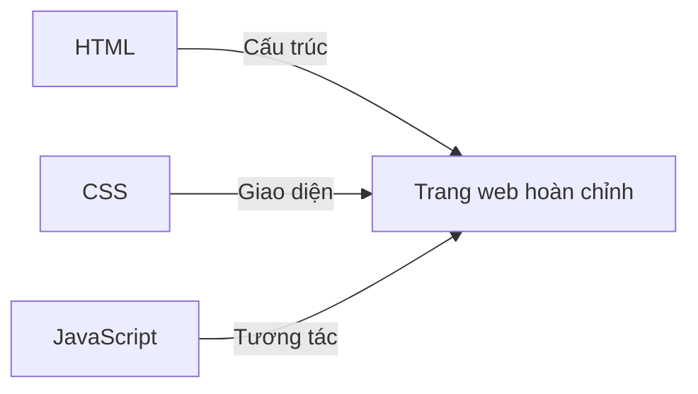

# C.3 Liên quan đến Kỹ thuật

Đây là các thuật ngữ kỹ thuật bạn sẽ gặp khi làm trang web / ứng dụng.

## HTML

**Viết tắt của**: HyperText Markup Language (Ngôn ngữ đánh dấu siêu văn bản)

**Giải thích một câu**: Định nghĩa trang web "có nội dung gì".

**Ví dụ tương tự**: Giống như cấu trúc của ngôi nhà — đâu là phòng khách, đâu là phòng ngủ, đâu là nhà bếp.

**Trông như thế nào**:

```html
<h1>Đây là tiêu đề</h1>
<p>Đây là một đoạn văn</p>
<button>Đây là nút bấm</button>
```

## CSS

**Viết tắt của**: Cascading Style Sheets (Bảng kiểu xếp tầng)

**Giải thích một câu**: Định nghĩa trang web "trông như thế nào".

**Ví dụ tương tự**: Giống như trang trí nội thất — tường màu gì, ghế sofa to cỡ nào, đèn đặt ở đâu.

**Trông như thế nào**:

```css
h1 {
  color: blue; /* Màu chữ */
  font-size: 24px; /* Cỡ chữ */
}
```

## JavaScript

**Viết tắt**: JS

**Giải thích một câu**: Để trang web "có thể chuyển động", có tương tác.

**Ví dụ tương tự**: Giống như đồ điện và công tắc trong nhà — bấm công tắc đèn sẽ sáng, ấn nút tivi sẽ mở.

**Trông như thế nào**:

```javascript
// Bấm nút xong hiện thông báo
button.onclick = function () {
  alert("Bạn đã bấm nút!");
};
```

## Mối quan hệ giữa HTML + CSS + JS



| Công nghệ  | Phụ trách          | Ví dụ tương tự     |
| ---------- | ------------------ | ------------------ |
| HTML       | Cấu trúc nội dung  | Khung nhà          |
| CSS        | Giao diện bề ngoài | Trang trí nội thất |
| JavaScript | Hành vi tương tác  | Đồ điện trong nhà  |

## LocalStorage

**Giải thích một câu**: Không gian lưu trữ cục bộ do trình duyệt cung cấp, dữ liệu được lưu trên máy tính của người dùng.

**Ví dụ tương tự**: Giống như ngăn kéo trong phòng bạn, đồ bỏ vào đó, đóng cửa lại lần sau mở ra vẫn còn.

**Đặc điểm**:

- Chỉ tồn tại trong trình duyệt của người dùng đó
- Tải lại trang, tắt trình duyệt dữ liệu vẫn còn
- Đổi trình duyệt hoặc máy tính khác thì không còn dữ liệu
- Phù hợp lưu các thiết lập cá nhân đơn giản, ghi chép, v.v.

**Ví dụ sử dụng**:

```javascript
// Lưu dữ liệu
localStorage.setItem("name", "Tiểu Minh");

// Lấy dữ liệu
const name = localStorage.getItem("name"); // 'Tiểu Minh'

// Xóa dữ liệu
localStorage.removeItem("name");
```

## JSON

**Viết tắt của**: JavaScript Object Notation

**Giải thích một câu**: Một định dạng dữ liệu, dùng để lưu trữ và truyền tải dữ liệu.

**Ví dụ tương tự**: Giống như một "định dạng bảng biểu" thông dụng, ai cũng đọc hiểu được.

**Trông như thế nào**:

```json
{
  "name": "Tiểu Minh",
  "age": 25,
  "hobbies": ["Đọc sách", "Chạy bộ", "Lập trình"]
}
```

**Công dụng thường gặp**:

- Dữ liệu trả về từ API
- File cấu hình
- LocalStorage lưu trữ dữ liệu phức tạp

## Biến môi trường (Environment Variables)

**Giải thích một câu**: Nơi lưu giữ thông tin nhạy cảm (như khóa bí mật, mật khẩu), không viết trực tiếp vào trong code.

**Ví dụ tương tự**: Giống như két sắt. Mật khẩu để trong két sắt, chứ không dán lên cửa.

**Tại sao quan trọng**:

- Khóa bí mật viết trong code, một khi code công khai, khóa sẽ bị lộ
- Biến môi trường sẽ không bị upload lên GitHub
- Là thực tiễn tốt nhất về bảo mật

**Cách dùng thông thường**:

1. Tạo file `.env` lưu thông tin nhạy cảm
2. Trong code đọc qua `process.env.XXX`
3. Thêm file `.env` vào `.gitignore`, không upload lên

## Tên miền (Domain)

**Giải thích một câu**: Địa chỉ của trang web, để người khác tìm thấy trang web của bạn.

**Ví dụ tương tự**: Giống như số nhà của bạn. Có địa chỉ, người khác mới tìm đến nhà bạn được.

**Cấu trúc**:

```
https://www.example.com/about
  │       │      │      │
Giao thức Tên miền phụ Tên miền chính Đường dẫn
```

**Cách có tên miền**:

- Mua tại nhà cung cấp tên miền (như Mắt Bão, Tenten, Godaddy, v.v.)
- Kết nối vào nền tảng triển khai của bạn

## Thiết kế tương thích (Responsive Design)

**Giải thích một câu**: Để trang web hiển thị bình thường trên các màn hình kích thước khác nhau.

**Ví dụ tương tự**: Giống như nước, có thể thích ứng với các vật chứa hình dạng khác nhau.

**Cách thực hiện**:

- Sử dụng phần trăm thay vì pixel cố định
- Sử dụng Media Query viết style cho các màn hình khác nhau
- Sử dụng bố cục Flexbox/Grid

**Tại sao quan trọng**:
Hiện nay mọi người dùng điện thoại, máy tính bảng, máy tính để truy cập web, thiết kế tương thích đảm bảo mọi người dùng đều có trải nghiệm tốt.
