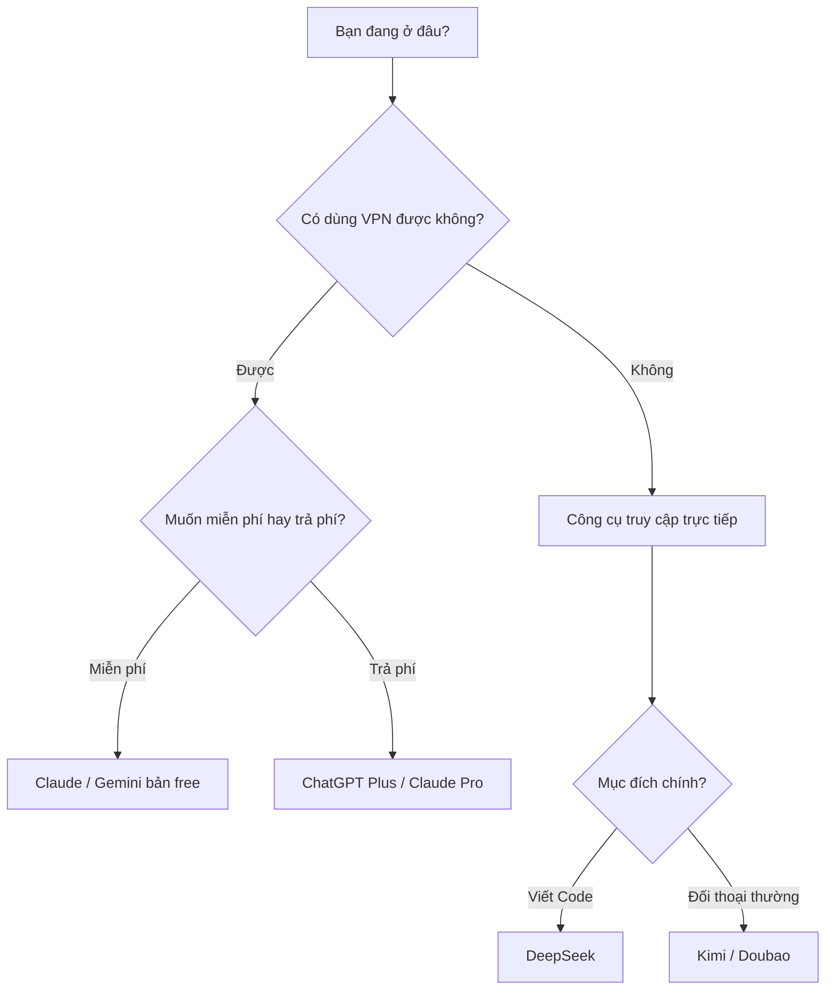

# D.1 So sánh AI Hội thoại

AI Hội thoại là cách lập trình AI đơn giản nhất: trực tiếp đối thoại, bảo AI giúp bạn viết code. Dưới đây là so sánh các công cụ phổ biến.

## Bảng so sánh tổng hợp

| Công cụ      | Công ty   | Hỗ trợ tiếng Việt\* | Hạn mức miễn phí | Năng lực Code | Đối tượng phù hợp               |
| ------------ | --------- | ------------------- | ---------------- | ------------- | ------------------------------- |
| **ChatGPT**  | OpenAI    | Khá                 | Có hạn chế       | Xuất sắc      | Đa dụng                         |
| **Claude**   | Anthropic | Xuất sắc            | Có hạn chế       | Xuất sắc      | Văn bản dài / Nhiệm vụ phức tạp |
| **Gemini**   | Google    | Khá                 | Khá nhiều        | Khá           | Người dùng hệ sinh thái Google  |
| **Kimi**     | Moonshot  | Tốt (gốc Trung)     | Khá nhiều        | Khá           | Người dùng Châu Á               |
| **DeepSeek** | DeepSeek  | Tốt (gốc Trung)     | Miễn phí         | Xuất sắc      | Lựa chọn hiệu năng/giá tốt nhất |
| **Doubao**   | ByteDance | Tốt (gốc Trung)     | Miễn phí         | Khá           | Người mới bắt đầu               |

_\*Lưu ý: Đa số các AI này đều hỗ trợ tiếng Việt ở mức độ nhất định, nhưng mức độ tự nhiên và hiểu văn hóa có thể khác nhau._

## Giải nghĩa từng công cụ

### ChatGPT

**Trang chủ**: chat.openai.com

**Đặc điểm**:

- "Ông tổ" của AI đối thoại, hệ sinh thái phong phú nhất
- Năng lực code của GPT-4 rất mạnh
- Nhiều chức năng mở rộng như Plugins và GPTs

**Hạn chế**:

- Cần VPN để truy cập
- Bản miễn phí bị giới hạn tính năng

**Phù hợp**: Người dùng muốn trải nghiệm năng lực AI trưởng thành nhất

### Claude

**Trang chủ**: claude.ai

**Đặc điểm**:

- Cửa sổ ngữ cảnh siêu dài (xử lý được lượng code rất lớn)
- Khả năng suy luận mạnh, hợp với nhiệm vụ phức tạp
- Khả năng hiểu ngôn ngữ rất tốt
- Ít bị "ảo giác" hơn

**Hạn chế**:

- Cần VPN để truy cập
- Bản miễn phí giới hạn số lần đối thoại

**Phù hợp**: Người dùng xử lý code dài, logic phức tạp

### Gemini

**Trang chủ**: gemini.google.com

**Đặc điểm**:

- Sản phẩm của Google, tích hợp tốt với dịch vụ Google
- Năng lực đa phương thức mạnh (hiểu được hình ảnh)
- Hạn mức miễn phí khá nhiều

**Hạn chế**:

- Cần VPN để truy cập (tùy khu vực)
- Năng lực code hơi kém hơn GPT-4 và Claude một chút

**Phù hợp**: Người dùng hệ sinh thái Google

### Kimi

**Trang chủ**: kimi.moonshot.cn

**Đặc điểm**:

- Truy cập trực tiếp (không cần VPN ở TQ, quốc tế ổn định)
- Hỗ trợ ngữ cảnh siêu dài
- Khả năng đọc file và trang web tốt

**Hạn chế**:

- Năng lực code tương đối yếu hơn các ông lớn
- Có giới hạn số lần sử dụng

**Phù hợp**: Lựa chọn nhập môn cho người dùng trong khu vực cấm ChatGPT

### DeepSeek

**Trang chủ**: chat.deepseek.com

**Đặc điểm**:

- Truy cập trực tiếp
- Năng lực code cực mạnh (DeepSeek Coder)
- Sử dụng miễn phí
- Hiệu năng trên giá thành cực cao

**Hạn chế**:

- Độ nhận diện thương hiệu chưa cao bằng ChatGPT
- Hệ sinh thái chưa phong phú bằng

**Phù hợp**: Người dùng muốn công cụ chất lượng cao miễn phí, cực lực đề cử

### Doubao (Đậu Bao)

**Trang chủ**: www.doubao.com

**Đặc điểm**:

- Sản phẩm của ByteDance (công ty mẹ TikTok)
- Truy cập trực tiếp
- Giao diện thân thiện, dễ làm quen
- Miễn phí sử dụng

**Hạn chế**:

- Năng lực code bình thường
- Hợp với đối thoại hàng ngày hơn

**Phù hợp**: Người mới bắt đầu hoàn toàn từ con số 0

## Gợi ý lựa chọn

## Đề xuất nhanh

| Tình huống của bạn                        | Công cụ đề xuất                |
| ----------------------------------------- | ------------------------------ |
| Người dùng Việt Nam, muốn viết code       | DeepSeek / Claude (nếu có VPN) |
| Người dùng Việt Nam, nhập môn trải nghiệm | Kimi / Doubao / Copilot        |
| Có VPN, muốn mạnh nhất                    | Claude / ChatGPT               |
| Có VPN, muốn dùng miễn phí                | Gemini / DeepSeek              |

::: tip Lời khuyên
Đừng đắn đo chọn cái nào, **dùng trước đã** là quan trọng nhất. Đợi bạn quen rồi, đổi công cụ tùy theo nhu cầu sau cũng chưa muộn.
:::
