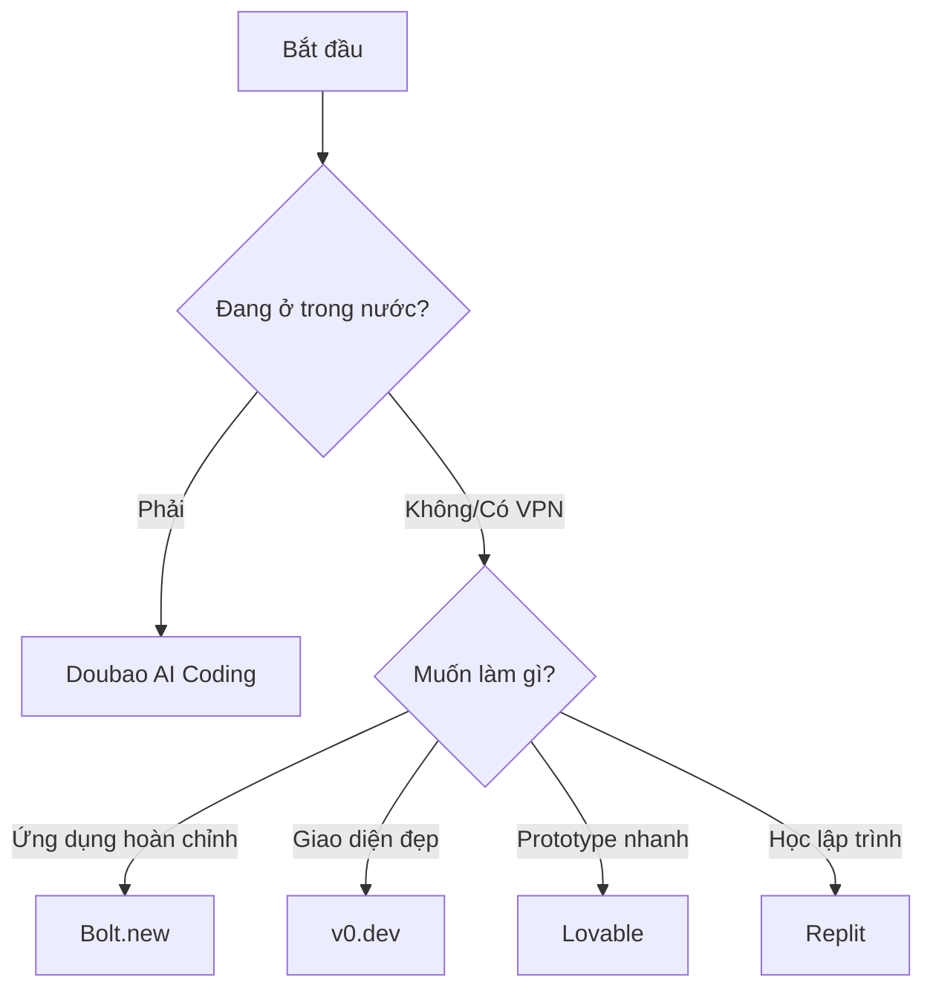

# D.3 So sánh IDE AI chuyên dụng

IDE AI chuyên dụng được thiết kế cho "người không biết code". Bạn mô tả trên web xem mình muốn gì, AI sẽ trực tiếp tạo ra cho bạn. Đây là cách thân thiện nhất với người mới bắt đầu từ con số 0.

## Bảng so sánh tổng hợp

| Công cụ              | Đặc điểm                | Giá             | Ưu thế                                | Phù hợp                                     |
| -------------------- | ----------------------- | --------------- | ------------------------------------- | ------------------------------------------- |
| **Bolt.new**         | Sinh ứng dụng Fullstack | Có bản miễn phí | Chức năng toàn diện nhất              | Muốn làm ứng dụng hoàn chỉnh                |
| **Doubao AI Coding** | Sinh code + Xem trước   | Miễn phí        | Truy cập nội địa mượt mà              | Lựa chọn hàng đầu cho người dùng trong nước |
| **v0.dev**           | Sinh UI component       | Có bản miễn phí | Giao diện thiết kế đẹp                | Muốn làm giao diện đẹp                      |
| **Lovable**          | Prototype sản phẩm      | Có bản miễn phí | Dễ làm quen                           | Xác minh nhanh ý tưởng                      |
| **Replit Agent**     | IDE Online + AI         | Có bản miễn phí | Trải nghiệm một điểm đến (All-in-one) | Người mới muốn học lập trình                |

## Giải nghĩa từng công cụ

### Bolt.new

**Trang chủ**: bolt.new

**Là gì**: Nền tảng phát triển Fullstack AI do StackBlitz ra mắt, có thể dùng ngôn ngữ tự nhiên làm ra ứng dụng hoàn chỉnh.

**Chức năng cốt lõi**:

- Mô tả nhu cầu, sinh dự án hoàn chỉnh
- Hỗ trợ Frontend + Backend + Database
- Xem trước hiệu quả theo thời gian thực
- Triển khai một nút bấm

**Giá**:

- Bản miễn phí: Có giới hạn sử dụng
- Bản trả phí: Từ $20/tháng

**Ưu điểm**:

- Có thể làm ra những thứ phức tạp nhất
- Chất lượng code sinh ra cao
- Có thể tiếp tục tinh chỉnh, sửa đổi

**Nhược điểm**:

- Hạn mức miễn phí khá ít
- Truy cập trong nước khá chậm, cần VPN
- Nhu cầu phức tạp đôi khi cần điều chỉnh nhiều vòng

**Phù hợp**: Người dùng muốn làm ứng dụng hoàn chỉnh (người dùng nước ngoài hoặc có điều kiện VPN)

### Doubao AI Coding (Đậu Bao AI Lập Trình)

**Trang chủ**: [doubao.com/chat/coding](https://www.doubao.com/chat/coding)

**Là gì**: Trợ lý lập trình AI do ByteDance ra mắt, hỗ trợ sinh code và xem trước theo thời gian thực, là lựa chọn lý tưởng cho người dùng trong nước.

**Chức năng cốt lõi**:

- Mô tả nhu cầu bằng ngôn ngữ tự nhiên, sinh code
- Xem trước HTML/CSS/JavaScript theo thời gian thực
- Giải thích, sửa chữa và tối ưu code
- Hỗ trợ tải lên file code hoặc import dự án GitHub

**Giá**:

- Sử dụng miễn phí

**Ưu điểm**:

- Truy cập trong nước mượt mà, không cần VPN
- Giao diện tối giản, dễ làm quen
- Hỗ trợ tương tác tiếng Việt/Trung, hiểu chính xác hơn
- Miễn phí không giới hạn

**Nhược điểm**:

- Chức năng hơi đơn giản hơn so với Bolt.new
- Chức năng triển khai không hoàn thiện bằng Bolt.new

**Phù hợp**: Người dùng trong nước, người mới bắt đầu muốn trải nghiệm nhanh lập trình AI

### v0.dev

**Trang chủ**: v0.dev

**Là gì**: Công cụ sinh UI AI do Vercel ra mắt, chuyên chú vào làm giao diện đẹp.

**Chức năng cốt lõi**:

- Mô tả nhu cầu, sinh UI component
- Dựa trên React + Tailwind CSS
- Có thể copy code trực tiếp
- Hỗ trợ sửa đổi tinh chỉnh

**Giá**:

- Bản miễn phí: Giới hạn số lần mỗi tháng
- Pro: $20/tháng

**Ưu điểm**:

- Cảm giác thiết kế UI cực tốt
- Component sinh ra có thể dùng luôn
- Kết nối liền mạch với triển khai Vercel

**Nhược điểm**:

- Chỉ làm được UI, không làm được logic backend
- Cần hiểu React mới tận dụng được tối đa

**Phù hợp**: Người dùng muốn nhanh chóng làm ra giao diện đẹp

### Lovable

**Trang chủ**: lovable.dev

**Là gì**: Công cụ AI chuyên giúp bạn nhanh chóng làm ra prototype sản phẩm.

**Chức năng cốt lõi**:

- Sinh ứng dụng bằng ngôn ngữ tự nhiên
- Giao diện trực quan đơn giản
- Hỗ trợ xem trước thời gian thực
- Có thể triển khai chia sẻ

**Giá**:

- Bản miễn phí dùng được
- Bản trả phí nhiều tính năng hơn

**Ưu điểm**:

- Dễ làm quen nhất
- Rất hợp để xác minh ý tưởng
- Giao diện thân thiện

**Nhược điểm**:

- Chức năng tương đối đơn giản
- Ứng dụng phức tạp có thể không kham nổi

**Phù hợp**: Người dùng muốn xác minh nhanh ý tưởng

### Replit Agent

**Trang chủ**: replit.com

**Là gì**: Replit là IDE trực tuyến, Agent là trợ lý AI của nó, có thể giúp bạn làm ra ứng dụng từ con số 0.

**Chức năng cốt lõi**:

- Viết và chạy code trực tuyến
- AI giúp bạn sinh code
- Hỗ trợ nhiều ngôn ngữ lập trình
- Có thể triển khai trực tiếp

**Giá**:

- Bản miễn phí: Chức năng cơ bản
- Replit Core: $20/tháng

**Ưu điểm**:

- Trải nghiệm một điểm đến (Viết code + Chạy + Triển khai)
- Nơi tốt để học lập trình
- Cộng đồng sôi nổi, có nhiều template

**Nhược điểm**:

- Năng lực AI không bằng các công cụ AI chuyên dụng
- Bản miễn phí có giới hạn tài nguyên

**Phù hợp**: Người dùng muốn vừa học lập trình vừa dùng AI

## Gợi ý lựa chọn

| Tình huống                                 | Công cụ đề xuất  |
| ------------------------------------------ | ---------------- |
| Người dùng trong nước, muốn làm quen nhanh | Doubao AI Coding |
| Làm một ứng dụng nhỏ hoàn chỉnh            | Bolt.new         |
| Làm giao diện web đẹp                      | v0.dev           |
| Xác minh nhanh một ý tưởng                 | Lovable          |
| Vừa học lập trình vừa làm đồ               | Replit           |

## Đề xuất của giáo trình này

**Người dùng trong nước đề xuất bắt đầu từ Doubao AI Coding**, truy cập mượt mà, miễn phí, hỗ trợ xem trước thời gian thực.

**Người dùng nước ngoài hoặc có điều kiện VPN đề xuất Bolt.new**, chức năng toàn diện nhất.

Lý do lựa chọn:

1. Chức năng toàn diện, có thể làm ra thứ "hữu dụng"
2. Không cần bất kỳ kiến thức lập trình nào
3. Giao diện trực quan, dễ làm quen
4. Chất lượng code sinh ra khá ổn, sau này muốn học code cũng có thể tham khảo

::: tip Ghi nhớ
Công cụ chỉ là công cụ. Quan trọng là bạn muốn làm gì, giải quyết vấn đề gì. Chọn một cái thuận tay, dùng trước đã!
:::
