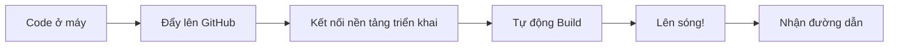

# D.4 So sánh Nền tảng Triển khai

Những thứ làm xong cần đưa lên mạng để người khác truy cập được, đó gọi là "Triển khai". Dưới đây là so sánh các nền tảng triển khai miễn phí phổ biến.

## Bảng so sánh tổng hợp

| Nền tảng             | Hạn mức miễn phí | Độ khó     | Phù hợp              | Đặc sắc                                     |
| -------------------- | ---------------- | ---------- | -------------------- | ------------------------------------------- |
| **Vercel**           | Hào phóng        | Đơn giản   | Frontend / Fullstack | Phổ biến nhất, kết hợp hoàn hảo với Next.js |
| **Netlify**          | Hào phóng        | Đơn giản   | Web tĩnh             | Tính năng phong phú, tính năng Form tốt     |
| **GitHub Pages**     | Miễn phí         | Đơn giản   | Web tĩnh             | Hoàn toàn miễn phí, gắn liền với GitHub     |
| **Railway**          | Có giới hạn      | Trung bình | Dịch vụ Backend      | Phù hợp ứng dụng có Backend                 |
| **Cloudflare Pages** | Hào phóng        | Đơn giản   | Web tĩnh             | CDN toàn cầu, tốc độ nhanh                  |

## Giải nghĩa từng nền tảng

### Vercel

**Trang chủ**: vercel.com

**Giới thiệu**: Nền tảng triển khai Frontend phổ biến nhất, nền tảng triển khai chính thức của Next.js.

**Hạn mức miễn phí**:

- Web tĩnh không giới hạn
- 100GB băng thông mỗi tháng
- Hàm Serverless có giới hạn

**Ưu điểm**:

- Triển khai siêu đơn giản (Kết nối GitHub xong tự động triển khai)
- Tính năng xem trước rất tốt (Mỗi PR đều có link xem trước)
- Kết hợp hoàn hảo với Next.js
- CDN toàn cầu, truy cập nhanh

**Nhược điểm**:

- Hàm Serverless có giới hạn thời gian thực thi
- Truy cập trong nước có thể không ổn định

**Phù hợp**: Dự án Frontend, dự án Next.js

### Netlify

**Trang chủ**: netlify.com

**Giới thiệu**: Nền tảng triển khai web tĩnh giàu tính năng.

**Hạn mức miễn phí**:

- 100GB băng thông mỗi tháng
- 300 phút build mỗi tháng
- 100 lượt gửi biểu mẫu/tháng

**Ưu điểm**:

- Tính năng phong phú (Form, xác thực, hàm)
- Giao diện thân thiện
- Hệ sinh thái plugin tốt

**Nhược điểm**:

- Bản miễn phí có giới hạn tính năng
- Truy cập trong nước có thể không ổn định

**Phù hợp**: Web tĩnh, blog, trang tài liệu

### GitHub Pages

**Trang chủ**: pages.github.com

**Giới thiệu**: Dịch vụ lưu trữ web tĩnh miễn phí do GitHub cung cấp.

**Hạn mức miễn phí**:

- Hoàn toàn miễn phí
- 1GB lưu trữ mỗi kho
- 100GB băng thông mỗi tháng

**Ưu điểm**:

- Hoàn toàn miễn phí
- Gắn liền trực tiếp với kho GitHub
- Ổn định tin cậy

**Nhược điểm**:

- Chỉ triển khai được web tĩnh
- Không có hàm Serverless
- Tính năng build hạn chế

**Phù hợp**: Blog cá nhân, tài liệu dự án, web tĩnh đơn giản

### Railway

**Trang chủ**: railway.app

**Giới thiệu**: Thích hợp triển khai ứng dụng có dịch vụ Backend.

**Hạn mức miễn phí**:

- $5 tín dụng miễn phí mỗi tháng
- Dùng hết phải trả tiền

**Ưu điểm**:

- Hỗ trợ dịch vụ Backend (Node.js, Python, v.v.)
- Hỗ trợ cơ sở dữ liệu
- Triển khai đơn giản

**Nhược điểm**:

- Hạn mức miễn phí khá ít
- Dùng hết là phải trả tiền

**Phù hợp**: Ứng dụng hoàn chỉnh cần Backend

### Cloudflare Pages

**Trang chủ**: pages.cloudflare.com

**Giới thiệu**: Dịch vụ lưu trữ web tĩnh do Cloudflare ra mắt.

**Hạn mức miễn phí**:

- Không giới hạn request
- Không giới hạn băng thông
- 500 lần build mỗi tháng

**Ưu điểm**:

- Hạn mức miễn phí cực kỳ hào phóng
- CDN toàn cầu, tốc độ cực nhanh
- Tích hợp tốt với các dịch vụ khác của Cloudflare

**Nhược điểm**:

- Tính năng tương đối đơn giản
- Đường cong học tập hơi dốc

**Phù hợp**: Web tĩnh yêu cầu tốc độ truy cập

## Gợi ý lựa chọn

| Tình huống của bạn                | Nền tảng đề xuất                               |
| --------------------------------- | ---------------------------------------------- |
| Lần đầu triển khai, muốn đơn giản | Vercel                                         |
| Dùng Next.js                      | Vercel                                         |
| Web tĩnh thuần túy                | GitHub Pages / Netlify                         |
| Có nhu cầu Backend                | Railway                                        |
| Cần tốc độ cao                    | Cloudflare Pages                               |
| Truy cập trong nước ổn định       | Cân nhắc Cloud (Vercel/Netlify có thể bị chặn) |

## Khái quát quy trình triển khai

Quy trình cơ bản:

1. Đẩy code lên GitHub
2. Kết nối kho GitHub tại nền tảng triển khai
3. Nền tảng tự động phát hiện, build, triển khai
4. Nhận được một đường dẫn truy cập được

::: tip Lời khuyên cho người mới
Lần đầu triển khai? Chọn **Vercel**. Thao tác đơn giản, tài liệu đầy đủ, cộng đồng sôi nổi. Gặp vấn đề dễ tìm câu trả lời.
:::
